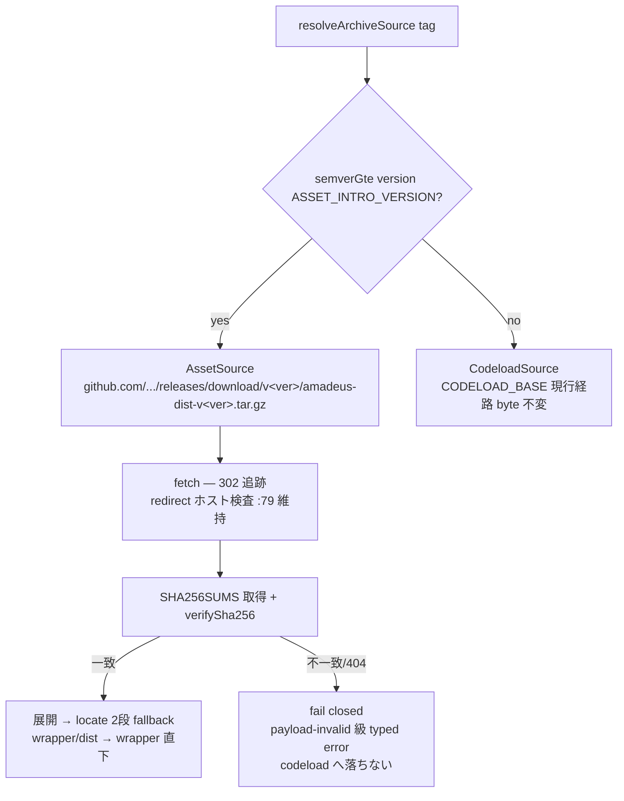

# Business Logic Model — u2-installer-asset

上流入力(consumes 全数): unit-of-work(u2 境界・規模 550・u1→u2 統合点)、requirements(FR-2.1〜2.5 = G7 裁定)、components(C2)、component-methods(C2 契約 — 本書が詳細化)、services(asset 配信境界の実測 302 → release-assets.githubusercontent.com と fail-closed 契約表)、unit-of-work-story-map(Slice 1 — 本 Unit の完成が walking skeleton の縦切り)。

測定 ref: file:line は observed `63e69d922`。

## 取得経路の分岐フロー

テキストフォールバック: バージョン境界の純粋関数分岐(`>= ASSET_INTRO_VERSION` → asset 必須、`<` → codeload 直行)→ asset 経路は取得(redirect fail-closed 維持)→ checksum 検証 → 展開 → `ExtractedPayload.locate` の2段 fallback(`wrapper/dist/<harness>` 現行 :38,:57 → 無ければ `wrapper/<harness>`)。欠落(404)・checksum 不一致は typed error で fail closed。

- `ASSET_INTRO_VERSION` は resolved-version-factory.ts 内の単一定数(本移行を含む最初のリリースの semver を実装時に確定)。ADR-003 コメント(:4)を二経路契約(ADR-A1)へ書き換え
- `ALLOWED_HOSTS`(http.ts:5)へ `github.com` / `release-assets.githubusercontent.com` を追加(ADR-A4 — 実装時に自リポの実 asset で再実測して確定する条項込み)
- checksum の役割 = 転送破損検出(改竄耐性は HTTPS + host allowlist — ADR-A9)。SHA256SUMS は asset と同 Release から取得
- 旧版経路(codeload)は byte 不変(CODELOAD_BASE :5・URL 組立 :14 に触れない)

## E2E 受け入れ(Slice 1 = walking skeleton)

u1 の draft release 実物に対し `@amadeus-dlc/setup install --harness claude`(代表1ハーネス)が asset 経路+checksum 検証で実インストール成功すること。fixture(ADR-A2 契約から機械生成した tar)での単体開発 → 実 asset での E2E の2層(unit-of-work の u1→u2 統合点)。

## 異常系

| 異常 | 挙動 |
|---|---|
| 新版 asset 404 | fail closed(typed error — 「旧版だから」と区別された明示メッセージ) |
| checksum 不一致 | fail closed。展開しない |
| redirect 先が allowlist 外 | fail closed(既存 :79 挙動維持) |
| SHA256SUMS 自体の欠落 | fail closed(検証をスキップして展開しない) |
| 旧版指定 | codeload 直行(既存挙動 byte 不変) |

## Review — Iteration 1

- **Verdict:** READY
- **Reviewer:** amadeus-architecture-reviewer-agent
- **Date:** 2026-08-02T19:26:13Z
- **Iteration:** 1
- **Scope decision:** none

ADR-A1/A2/A4/A9・C2・FR-2 と精密整合、全引用実在一致、無申告逸脱なし。Minor 3件(FR-2.5 trace 行欠落・story-map 装飾参照・kind-gate 情報共有)のうち前2件は conductor 是正済み

### Findings

- Minor: FR-2.5 の trace 行を対応表へ追記 — 是正済み
- Minor: domain-entities の Slice 1 実参照を不変条件5として追加 — 是正済み
- Minor(情報共有): frontend-components の kind-gate 扱いは construction 進入前に conductor が1手確認
