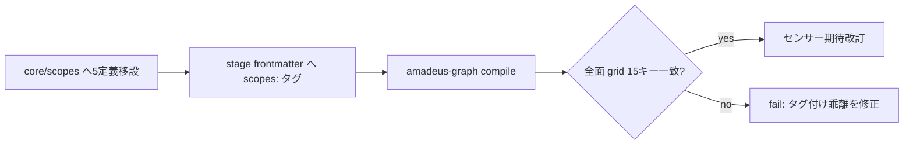

# Business Logic Model — u3-scope-promotion

上流入力(consumes 全数): unit-of-work(u3 境界・規模 210)、requirements(FR-0)、components(C6)、component-methods(C6 契約)、services(外部境界なしの確認 — 本 Unit はリポ内完結)、unit-of-work-story-map(Slice 2 の前提整備 — 本 Unit の出荷判定は FR-0 受け入れ)。

測定 ref: file:line は observed `63e69d922`。

## 昇格の機序(正規経路)

scope-grid.json は**手書き台帳ではなく compile 生成物**(scripts/package.ts:148 `COMPILED_DATA` — stage frontmatter の `scopes:` リストと scope 定義ファイルから `amadeus-graph.ts compile` が導出)。したがって昇格は文書化済みの正規経路(orchestrator SKILL.md「Adding a scope」)に従う:

1. **scope 定義の正本追加**: `.claude/scopes/` の現行5ファイル(`amadeus-self-{feature,fix,refactor,document}.md` + `amadeus-installer-distribution.md`)を `packages/framework/core/scopes/` へ移設(stock 10種と同居 → 15種)。内容の採用源は現行 `.claude` 面(#2041 で5面同期済みの最新断面)— 移行 PR で採用源との byte diff を実証
2. **stage frontmatter のタグ付け**: 各 stage の `scopes:` リストへ self-* / installer-distribution を、現行 root grid の EXECUTE セル(15キー grid の実測値)と一致するように追加
3. **recompile**: `amadeus-graph.ts compile` → 全 dist 面の scope-grid.json が15キーで一致(RA Q1 裁定 = 全 dogfood 面へ対称投影)
4. **センサー追随**: `packages/framework/core/sensors/amadeus-self-scope-consistency.md` の期待を「全面 = 正本投影の完全一致」へ改訂(root-only 生存前提を撤去)

テキストフォールバック(フロー): 正本移設 → stage タグ付け → recompile → grid 全面一致検証 → センサー期待改訂 → 面間 diff ゼロ実証。

## 移行時の整合検証

- タグ付けの正しさは「compile 後の grid = 現行 root grid(15キー)の deep-equal」で機械判定(既存 `scopeGridInSync` は composed scope の extras 保持用に不変 — 本 Unit は正本側を変えるだけで比較器に触れない)
- `mergeScopeGrid`(promote-self.ts:146-162)の extras 生存機構は per-user composed scope 用に維持(廃止しない — 第3カテゴリ不可侵)

## 異常系

| 異常 | 挙動 |
|---|---|
| タグ付け漏れ(grid セル不一致) | compile 後 deep-equal テストが赤(loud) |
| 未知 sensor / scope 参照 | compile が loud reject(既存挙動) |
| センサー期待の旧前提残存 | self-scope-consistency が偽赤 → 期待改訂を同一 PR で実施 |

## Review — Iteration 1

- **Verdict:** READY
- **Reviewer:** amadeus-architecture-reviewer-agent
- **Date:** 2026-08-02T18:34:10Z
- **Iteration:** 1
- **Scope decision:** none

grid=compile 生成物の機序理解を実コードで裏付け、上流 C6 の正当な精密化と判定。RA Q1 転記・落ちる実証・per-user 不可侵も正確。Minor 2件(unit-of-work の22ファイル表現・精密化申告の一文)は conductor が是正済み

### Findings

- Minor: unit-of-work.md の『22ファイル』表現をroot面コピー総数として明確化 — 是正済み
- Minor: BR-U3-2 に上流精密化の申告一文を追加 — 是正済み
