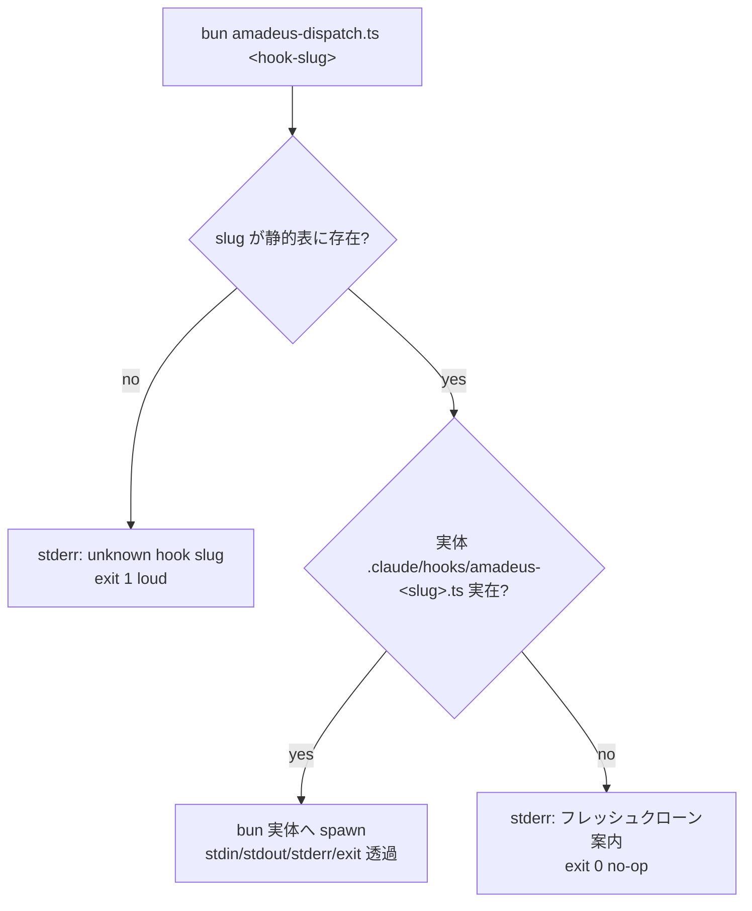

# Business Logic Model — u4-hook-dispatcher

上流入力(consumes 全数): unit-of-work(u4 境界・規模 200)、requirements(FR-3.2 = G1 裁定)、components(C3)、component-methods(C3 契約 — 本書が詳細化)、services(外部境界なし — 本 Unit はローカル完結)、unit-of-work-story-map(Slice 2 の bootstrap 整備 — フレッシュクローン体験の改善)。

測定 ref: file:line は observed `63e69d922`。

## 処理フロー: amadeus-dispatch.ts

テキストフォールバック: slug 検証(未知は loud exit 1)→ 実体実在確認 → 実在なら stdin/exit 透過で実体へ委譲、不在なら stderr へ「フレッシュクローンです。`bun run build` を実行してください」を出して exit 0(no-op — ハーネスのフックエラー連鎖を作らない)。

- **薄さの契約**: dispatcher は「slug → 実体パス」の静的表と不在案内のみ。ロジック・分岐・状態を持たない(ADR-A5 — 可逆性の担保)
- **透過性**: stdin(hook JSON)は無加工で実体へ渡し、実体の stdout/stderr/exit code をそのまま返す(bun-spawn-env-snapshot 規範に従い `env: process.env` を明示)
- 正本配置: `packages/framework/harness/claude/hooks/amadeus-dispatch.ts`(投影で `.claude/hooks/` へ)。**root の `.claude/hooks/amadeus-dispatch.ts` は allowlist 追跡**(u6 の正本 allowlist に深さ2エントリとして登録)

## settings.json の書換(追跡正本の直接改修)

`.claude/settings.json`(preserved — promote-self.ts:103 — のため生成器でなく追跡正本そのものを改修)の11参照(:57-:154)を次の形へ:

- 旧: `bun "${CLAUDE_PROJECT_DIR:-.}/.claude/hooks/amadeus-mint-presence.ts"`
- 新: `bun "${CLAUDE_PROJECT_DIR:-.}/.claude/hooks/amadeus-dispatch.ts" mint-presence`

mint-presence の2箇所(UserPromptSubmit :57 / PostToolUse :112)は同一 slug で問題ない(実体が同一のため — dispatcher はイベント文脈を持たず透過)。statusline(:48)は `$HOME` スクリプト経由の別機構で本 Unit の対象外。

## 異常系

| 異常 | 挙動 |
|---|---|
| 未知 slug | stderr + exit 1(設定ミスを無音化しない — loud) |
| 実体不在(build 前) | stderr 案内 + exit 0(no-op。全イベントで同一文言) |
| 実体が非0 exit | そのまま透過(既存のフック失敗挙動を変えない) |

## Review — Iteration 1

- **Verdict:** NOT-READY
- **Reviewer:** amadeus-architecture-reviewer-agent
- **Date:** 2026-08-02T18:43:37Z
- **Iteration:** 1
- **Scope decision:** none

BR-U4-7 の静的表導出契約が settings.json 未参照2実体の扱いを無申告で欠落(Major)。NFR-3 trace の意味論不一致(Minor)

### Findings

- Major: 未参照2実体(log-subagent-start / plugin-compose)の対象外宣言がなくディレクトリ列挙導出と矛盾余地
- Minor: BR-U4-3/4 の NFR-3 直接トレースが本文4分類と不一致

## Review — Iteration 2

- **Verdict:** READY
- **Reviewer:** amadeus-architecture-reviewer-agent
- **Date:** 2026-08-02T18:43:37Z
- **Iteration:** 2
- **Scope decision:** none

両是正の着地を実読確認(導出源の settings.json 限定+未参照2実体の N/A 明示、trace 出典性質の明確化)。11参照→10 slug の勘定が3ファイルで一貫、退行なし

### Findings

- 閉包確認: Major/Minor とも解消。静的表への未参照実体の混入なしを grep 確認
