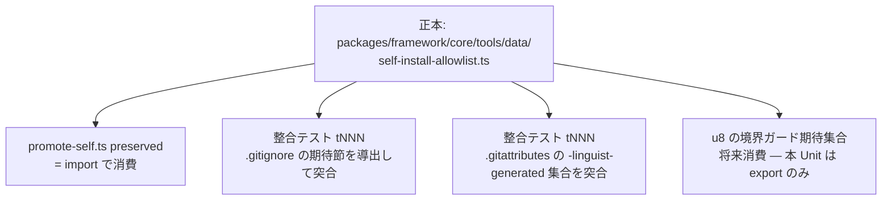

# Business Logic Model — u6-allowlist-canonical

上流入力(consumes 全数): unit-of-work(u6 境界・規模 300)、requirements(FR-5.2/5.3 = G8 裁定)、components(C5)、component-methods(C5 契約 — 本書が詳細化)、services(外部境界なし)、unit-of-work-story-map(Slice 2 — u8 切替の前提)。

測定 ref: file:line は observed `63e69d922`。

## 正本データ構造と導出フロー

テキストフォールバック: 正本1箇所(tracked / preservedRuntime / perUserPatterns の3区分)→ preserved は import、.gitignore / .gitattributes は手書き維持で整合テストが正本導出の期待値と突合(G8 — build は追跡ファイルを書かない)。

- **3区分モデル(reviewer iteration 1 Critical の是正 — preserved 10エントリの実測非対称を反映)**:
  - **tracked**: 追跡するプロジェクト固有設定 **5件**(`.claude/CLAUDE.md`、`.claude/settings.json`、`.codex/config.toml`、`.cursor/hooks.json`、`.opencode/opencode.json` — `git ls-files` 実測で全件 tracked=1)+ u4 dispatcher(`.claude/hooks/amadeus-dispatch.ts` — 深さ2)
  - **preservedRuntime**: promote 時に保存するが**未追跡**の per-user パス**5件** — `.claude/settings.local.json`(ignore :2)、`.claude/worktrees/`(:42)、`.codex/hooks.json`(:11 — per-clone runtime、正典は .example。**`.gitattributes` の可視化例外に残る唯一の未追跡エントリ = 歴史的例外として gitattributesExpectation で明示扱い**)、`.codex/agmsg-delivery-mode`(:5)、`.codex/local/`(**現行 .gitignore 未登録・非 ignore — `git check-ignore --no-index` exit 1 の実測。u8 で ignore 規則の新設が必要という申し送り**)。preserved(promote 保存)と tracked(git 追跡)は別概念で、この区分がその差集合(iteration 2 Critical/Major の是正 — conductor 再実測 2026-08-02)
  - **perUserPatterns**: 第3カテゴリ regex 群 — 既存 `COMPOSED_SCOPE_RE`(:124)/ `SCOPE_GRID_RE`(:125)/ `PLUGIN_ENGINE_STATE_RE`(:178)/ `STAGE_GRAPH_RE`(:179)の定義を正本へ移して promote-self からは import(byte 不変)
  - promote-self 互換ビュー: `preserved(a) = tracked のパス集合 ∪ preservedRuntime`(= 現行10エントリ(5+5)+dispatcher — promote-self.ts:101-114 の実配列と機械照合済み)
- 配置注記: 正本は core/tools/data のためリポ外(dist)へも投影されるが、内容は path パターンのみで repo-only トークン(scripts/ 等)を含まない(t258 境界契約に抵触しない — c1-1569 規範の事前確認)

## 整合テストの検査面(2面)

1. **`.gitignore` 面(u8 で導入 — 本 Unit は導出関数まで)**: 正本から「未追跡化面の ignore パターン+allowlist の否定パターン(深さ1限定+dispatcher の階層再包含)」を導出する `gitignoreExpectation` 純関数と、その**単体テスト(期待パターン集合の固定)**を本 Unit で実装する。**実 `.gitignore` との突合テストは u8 の切替 PR で導入する** — u8 前の現行 `.gitignore` には該当節が存在せず、部分突合は恒常 PASS の vacuous test になるため作らない(reviewer iteration 1 Major の是正 — 検証劇場の回避。C7 の「切替は追跡変更と同一 PR」と同じ判断だが、機序は『検査対象構造の不在』であり意図的相違として明記)
2. **`.gitattributes` 面(本 Unit で導入・即時有効)**: `-linguist-generated` の可視化例外集合 = 正本 tracked 区分 ∪ {`.codex/hooks.json`}(歴史的例外 — 未追跡だが可視化例外に既在。維持か撤去かは u8 の棚卸しへ申し送り)、を突合(u8 非依存)

## 異常系

| 異常 | 挙動 |
|---|---|
| 正本と .gitattributes の乖離 | 整合テスト赤(loud) |
| 正本と preserved の乖離 | 構造的に不可能(import 一元化 — 二重定義の削除) |
| 深さ2以上のエントリ追加(再包含パターン漏れ) | 整合テストが .gitignore 否定パターンの実効性を `git check-ignore` で実測して赤(scratch-script-discipline の symlink 追補と同族の check-ignore 実測) |

## Review — Iteration 1

- **Verdict:** NOT-READY
- **Reviewer:** amadeus-architecture-reviewer-agent
- **Date:** 2026-08-02T19:09:53Z
- **Iteration:** 1
- **Scope decision:** none

tracked/perUser 2区分が preserved 10エントリの実測非対称(gitignored 4件)を未列挙(Critical)。.gitignore 面の部分検査が vacuous になりうる(Major)。u4 交差未申告(Minor)

### Findings

- Critical: preserved 中の per-user 4件の帰属不定 — 区分モデルの再設計要
- Major: u8 前の .gitignore 部分突合が恒常 PASS の検証劇場リスク
- Minor: u4 との交差有無の未申告

## Review — Iteration 2

- **Verdict:** NOT-READY
- **Reviewer:** amadeus-architecture-reviewer-agent
- **Date:** 2026-08-02T19:09:53Z
- **Iteration:** 2
- **Scope decision:** none

3区分モデルは妥当だが preservedRuntime の実測根拠に事実誤り(.codex/local/ の ignore 引用が虚偽 — Critical)と .codex/hooks.json の tracked 分類矛盾(Major)が残余。予算 2/2 消費 — 残余はゲートで開示のこと

### Findings

- Critical: .codex/local/ は .gitignore 未登録(check-ignore exit 1)— 引用 :11 は .codex/hooks.json
- Major: .codex/hooks.json は gitignored・未追跡で tracked 区分と矛盾 — u8 申し送り要
