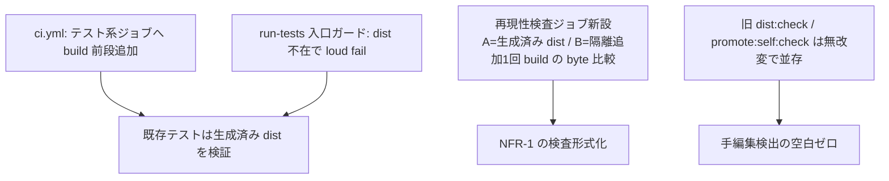

# Business Logic Model — u7-ci-stage1

上流入力(consumes 全数): unit-of-work(u7 境界・規模 250 = C7 段階1分)、requirements(FR-4.1 + NFR-1 + FR-3.1 の単一コマンド面)、components(C7)、component-methods(C7 段階1契約 — 本書が詳細化)、services(外部境界一覧 — 本 Unit の3変更+build script がいずれも外部サービスに触れないことの negative 確認)、unit-of-work-story-map(Slice 2)。

測定 ref: file:line は observed `63e69d922`。

## 段階1の3変更(u8 の段階2とは分離 — 原子切替対象を含まない)

テキストフォールバック: (1) ci.yml のテスト系ジョブ(tests / coverage 系)の前段へ build ステップを追加 (2) run-tests 入口に dist 不在の loud fail ガード — 実装位置は `tests/run-tests.ts`(requirements FR-4.1 の表記 `tests/run-tests.sh` は :16 で run-tests.ts へ exec する薄ラッパーであり、.ts 側に置けば .sh 経由・直接呼びの両経路をカバーする — 意図的相違として申告) (3) 再現性検査ジョブを新設(生成済み dist と隔離 temp dir の追加1回 build を byte 比較 — u1 FD の手順5と同一の比較形)。旧 check 3種(ci.yml:243-244 / :246-247 / :254-255)は**無改変で並存**(段階2 = u8 で原子切替)。

- **build コマンドの所有(reviewer iteration 1 Major の是正 — 所有者不在の解消)**: 単一コマンド `bun run build`(package.json script = `bun run dist && bun run promote:self` の合成)は**本 Unit(u7)が新設する**。FR-3.1 の「単一コマンド生成」面の実装所有を u7 へ確定(u5 FD は script 新設を扱っておらず、CI で build を呼ぶ当事者 = u7 が所有するのが最小変更。unit-of-work.md の受け入れ対応行へ申告付きで反映済み)。u5 が担う FR-3.1 面は「build が追跡ファイルを書き換えない冪等性」(composeRootAgents 廃止)で分担が排他
- **入口ガードの発火条件**: `dist/` ディレクトリ不在または空。文言は u4 dispatcher と同系(「run `bun run build` first」)で、案内先コマンドを1箇所の定数に
- **再現性検査ジョブ**: paths フィルタは full 変更時のみ発火(detect-ci-changes の full 条件を流用 — drift フィルタは触らない。フィルタ改訂は段階2)

## 異常系

| 異常 | 挙動 |
|---|---|
| dist 不在で run-tests 起動 | 入口ガードが loud fail + build 案内(exit 1) |
| 再現性比較の byte 差 | ジョブ赤 + 差分ファイル一覧(NFR-1) |
| build 前段の失敗 | 後続テストジョブは実行されない(needs 連鎖で fail-fast) |

## Review — Iteration 1

- **Verdict:** NOT-READY
- **Reviewer:** amadeus-architecture-reviewer-agent
- **Date:** 2026-08-02T19:19:58Z
- **Iteration:** 1
- **Scope decision:** none

build script(bun run build)の所有者が上流未確立(Major)。services consumes が装飾トークン(Major)。run-tests.sh/.ts の無申告相違(Minor)

### Findings

- Major: bun run build の新設所有者が u5 FD にも component-methods にも不在
- Major: services 参照が3ファイルとも参照実体を欠く
- Minor: 編集面 .ts と要件表記 .sh の相違が無申告

## Review — Iteration 2

- **Verdict:** READY
- **Reviewer:** amadeus-architecture-reviewer-agent
- **Date:** 2026-08-02T19:19:58Z
- **Iteration:** 2
- **Scope decision:** none

3是正の verbatim 反映と分担排他性(u5/u4 整合)・negative 確認の事実一致を実測確認、新規指摘ゼロ

### Findings

- 閉包確認: build script 所有を u7 へ確定(unit-of-work 対応行も申告付き更新)、services は negative 確認の実参照化、.sh/.ts 相違は意図的相違申告済み
