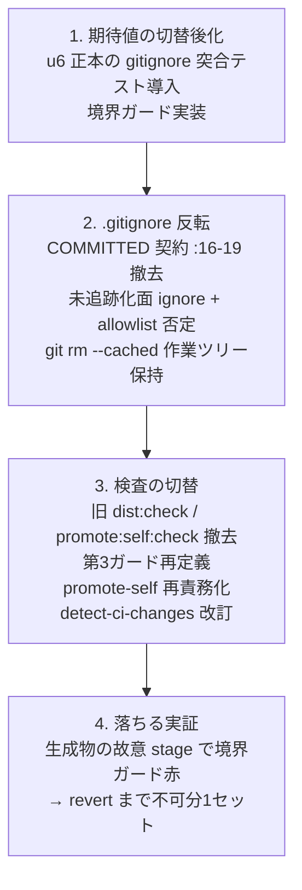

# Business Logic Model — u8-source-only-switch

上流入力(consumes 全数): unit-of-work(u8 = 統合 Unit・規模 650 の内訳)、requirements(FR-4.2/4.3/4.5 + FR-5 + NFR-2/3)、components(C7 段階2 + C8 + C9 前半)、component-methods(C7 段階2 / C8 契約 — 本書が詳細化)、services(境界ガードが外部サービスに触れないことの negative 確認)、unit-of-work-story-map(Slice 3 — 本 Unit が中核価値の観測点)。

測定 ref: file:line は observed `63e69d922`。

## 原子切替の実行順序(単一 PR 内 — risk-and-sequencing の4手順の詳細化)

テキストフォールバック: (1) 切替後状態を検査する側(u6 の .gitignore 実ファイル突合テスト・境界ガード)を先に実装 →(2)`.gitignore` 反転+`git rm --cached`(dist/** と self-install 面 − allowlist。作業ツリーのファイルは削除しない)→(3)旧 check 撤去・第3ガード再定義・C8 再責務化・detect-ci-changes 改訂 →(4)落ちる実証(falling-proof-injection-one-set — 赤実測 → revert push まで不可分)。

## 各変更の機序

- **`.gitignore` 反転**: COMMITTED 契約(:16-19)を source-only 契約コメントへ書換え。未追跡化面の ignore パターン+allowlist 否定パターンは u6 正本の `gitignoreExpectation` 導出と一致させ、u6 で実装済みの突合テストを本 PR で有効化。`.codex/local/` の ignore 規則を新設(u6 FD の申し送り)。`.codex/hooks.json` の歴史的例外(gitattributes)は**維持**を既定として棚卸し確定(判断基準は BR-U8-9)
- **境界ガード(FR-4.5)**: `git ls-files` の出力 ∩ 生成対象パターン(dist/** + 未追跡化面 − allowlist。u1 FD が申告した plugins 同梱範囲と同一の期待集合)= 0 を検査する CI ステップ。落ちる実証は手順4
- **旧 check 撤去(FR-4.2 — reviewer iteration 1 Major の是正: 撤去のみ、再定義しない)**: ci.yml :243-244 / :246-247 の2ステップと npm script `dist:check` / `promote:self:check`、および `package.ts` の committed 比較 check モード(checkHarness :698 系)を**撤去する**。後継は u7 で着地済みの再現性検査ジョブ(canonical 比較形 A=生成済み dist / B=隔離追加1回 build — **u7 実装を不変のまま維持、寄せ替え・verb 再定義を行わない**)と C8 のローカル鮮度検査。FR-4.2 / C7 段階2 の宣言(置換 = 撤去+既着地後継)と過不足なく一致させる
- **第3ガード再定義(FR-4.3、OQ-4 の確定)**: `amadeus-graph.ts compile --check` を「正本 stage 定義からの compile 検証」へ。**グラフ不変量の集合(本 FD で確定)**: (i) compile が exit 0(全 stage frontmatter が parse 可能) (ii) 未知 sensor id の loud reject(既存挙動の維持を assert) (iii) 全 scope の grid が全ハーネス面で deep-equal(u3 の15キー対称) (iv) bolt_dag 用 edge block の parse 契約が維持(parseBoltDag の ok パス) (v) コミット済み graph との比較は行わない(比較対象消滅 — 自己参照比較の禁止)
- **C8 再責務化(FR-5.4)**: promote-self `--check` = 「ローカル self-install 面が最新 build と一致するか」(鮮度検査)。apply は従来どおり生成、carve-out(u6 正本へ移設済みの perUserPatterns)不変。composeRootAgents は u5 で撤去済み
- **detect-ci-changes 改訂(FR-4.4)**: drift フィルタ(:18-24)の dist/* 死にパターン整理、`.kiro/*` ルート面不在の既存不整合是正、`.kiro-ide` 点検

## 異常系

| 異常 | 挙動 |
|---|---|
| 生成物が誤って stage/追跡 | 境界ガード赤(loud — CI ブロック) |
| .gitignore と u6 正本の乖離 | u6 突合テスト赤 |
| compile 不変量違反(未知 sensor 等) | 第3ガード赤 |
| ローカル self-install 陳腐化 | C8 鮮度検査が検出(ローカル開発向け・CI では build 直後のため常に新鮮) |

## Review — Iteration 1

- **Verdict:** NOT-READY
- **Reviewer:** amadeus-architecture-reviewer-agent
- **Date:** 2026-08-02T19:36:14Z
- **Iteration:** 1
- **Scope decision:** none

package.ts --check の verb 再定義が u7 canonical 比較形と矛盾し未宣言スコープ(Major)。.codex/hooks.json 歴史的例外の判断基準不在(Minor)

### Findings

- Major: verb 再定義+u7 ジョブ寄せ替えが u7 の『第三の build を作らない』設計根拠と衝突、FR-4.2/C7段階2 に未宣言
- Minor: 歴史的例外の維持/撤去基準が BR に不在

## Review — Iteration 2

- **Verdict:** READY
- **Reviewer:** amadeus-architecture-reviewer-agent
- **Date:** 2026-08-02T19:36:14Z
- **Iteration:** 2
- **Scope decision:** none

撤去のみへの改訂と BR-U8-9 新設の着地を確認。u7/u8 分担(新設並存/旧撤去)と FR-4.2 の置換意図に整合、checkHarness 撤去と buildTree 流用の非衝突も実測。新規指摘なし

### Findings

- 閉包確認: Major/Minor とも是正着地、退行なし
- PLAUSIBLE(非ブロッキング): u6 gitattributesExpectation の明示引数化は scope 外につき上位記述経由の整合確認
