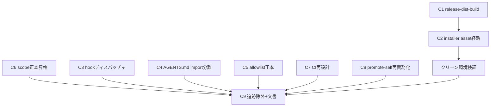

# Component Dependency — 依存関係

上流入力(consumes 全数): requirements(移行順序 0→6 の制約 — 依存の根拠)、architecture(installer 破壊の機序 = 順序依存の一次根拠)、component-inventory(既存資産への依存端点)。stories / team-practices は不存在(SKIP)。

## 依存グラフ

テキストフォールバック(Mermaid 不可時):

- C1 → C2 → クリーン環境検証 → C9(asset 経路の縦列 = walking skeleton は C1+C2 の最小縦切り)
- C6 → C9(正本昇格は追跡除外の前提 — 省略すると self-* scope 恒久喪失)
- C3 / C4 / C5 / C7 / C8 → C9(bootstrap・allowlist・CI・promote の各再設計は追跡除外の前提)
- C1/C2 系と C3〜C8 系は相互独立(並行化候補)。C9(追跡除外)だけが全部の合流点

## 移行順序との対応

| 移行順序(requirements Constraints) | コンポーネント |
|---|---|
| 0 正本昇格 | C6 |
| 1 asset 形式・checksum | C1 |
| 2 installer 移行 | C2 |
| 3 CI・bootstrap | C3, C4, C7 段階1(build 前段・入口ガード・再現性検査の追加。旧 check は並存)(+C5 は 5 の前提として同帯) |
| 4 クリーン環境検証 | (検証活動 — C2 の受け入れ) |
| 5 追跡除外 | C9 前半 + C7 段階2(旧 check 撤去・第3ガード再定義・境界ガード有効化 — 追跡除外と同一 PR で原子切替)+ C8 |
| 6 ガード・文書・ノルム | C9 後半 |

## 逆依存の禁止(安全性の要)

- C9(追跡除外)を C1/C2 より先に実施すると、現行 installer が codeload アーカイブ内 dist/ を見つけられず決定的に壊れる(payload-factory.ts:44 — architecture.md の患部機序)。依存グラフはこの禁止をエッジ方向で表現している
- C6 を C9 より後に回すと恒久喪失(requirements Constraints)
