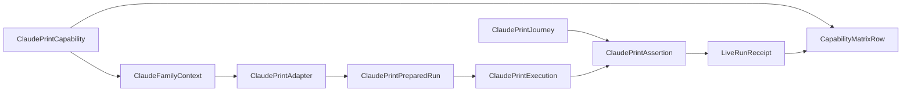

# Domain Entities — claude-print-live

入力参照: `unit-of-work`、`unit-of-work-story-map`、`requirements`、`components`、`component-methods`、`services`。

## Adapter Entities

### ClaudePrintCapability

adapter ID、`claude` binary、minimum version `2.1.220`、measured version、required help flags、`AMADEUS_CLAUDE_PRINT_LIVE`、`dist/claude`、`.claude/settings.json`、base env allow-list、native/API-key auth binding、anchor schemaを持つC7 entry。

### ClaudeFamilyContext

project settings builder、child-env policy、version evidence、structured-result normalizerを束ねる。transport command/session/abort modelは保持しない。

### ClaudePrintAdapter

C3 `LiveAdapter`実装。preflight、project settings生成、credential lease/injection、headless spawn、normalize、cleanupを所有する。

### ClaudePrintPreparedRun

scratch-relative cwd、argv shape、env key集合、project settings digest、resource IDsを持つ。raw secret、source path、user settingsを持たない。

## Journey Entities

### ClaudePrintJourney

literal prompt、closed JSON schema、90秒deadline、exit 0、`is_error=false`、`num_turns>=1`、structured output const anchorを持つC6 specification。

### ClaudePrintExecution

exit code、timedOut、structured result shape、sanitized stdout/stderr digest、detected versionを持つ。

### ClaudePrintAssertion

anchorごとのpass/failと原文を破壊しないsanitized diagnosticを持つ。

## Relationships

テキスト代替: Claude print capabilityとClaude family seamからadapterがprepared runを作り、headless executionをjourney anchorsで検査する。durable receiptとcapabilityからmatrix rowを導出する。

## States and Ownership

- Adapter: `declared → gated → preflighted → prepared → executed → cleaned → recorded`。
- Journey: `defined → running → asserted → passed | failed | timed-out`。
- C5 owns command/settings/credential injection; C6 owns prompt/anchors; C4 owns generic scratch、timeout、cleanup orchestration、ledger。
