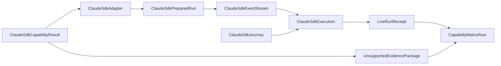

# Domain Entities — claude-sdk-live

入力参照: `unit-of-work`、`unit-of-work-story-map`、`requirements`、`components`、`component-methods`、`services`。

## Capability Entities

### ClaudeSdkCapabilityResult

`SupportedSdkCapability | UnsupportedSdkCapability`のunion。supportedはversion、structured event kinds、abort、setting source、auth modeを持つ。unsupportedはprobe evidenceとmissing capabilityを持つ。

### ClaudeSdkAdapter

C3 adapter。existing SDK driver invocation、event normalization、abort、partial result capture、credential cleanupを所有する。

### ClaudeSdkPreparedRun

scratch-relative cwd、SDK option shape、env key集合、AbortSignal identity、resource IDsを持つ。raw secret/source pathを持たない。

## Execution Entities

### ClaudeSdkEventStream

tool result、state transition、audit event、partial result、final result、errorをordinal付きで保持するsanitized stream。

### ClaudeSdkExecution

terminal kind、timedOut、abort requested/observed、partial result count、final result shape、detected versionを持つ。

### ClaudeSdkWorkerLease

child PID、run generation、90秒deadline、abort/grace/TERM/KILL/reap deadlines、livenessを持つ。SDK client/session/streamの唯一ownerであり、generation close後のeventを拒否する。

### ClaudeSdkJourney

literal `echo ok` prompt、exactly-one terminal result、success subtype、`is_error=false`、positive turns、permission denial 0、nonempty output evidence、event順序を持つC6 specification。

### UnsupportedEvidencePackage

measured version、probe/reproduction、blocker、recommended seam、acceptance criteria、Issue linkを持つ。全fieldが揃わないpackageはclosure不可。

## Relationships

テキスト代替: capability probeはsupportedならSDK adapterとevent streamを実行してlive receiptへ、unsupportedなら完全なevidence packageへ分岐する。どちらもcapability matrixの非空closureへ接続する。

## States and Ownership

- Capability: `unmeasured → measuring → supported | unsupported-evidenced`。
- Execution: `prepared → streaming → completed | aborting → normalized → cleaned`。
- C5 owns SDK options/event/abort; C6 owns journey anchors; C4 owns scratch、deadline、cleanup orchestration、ledger。
