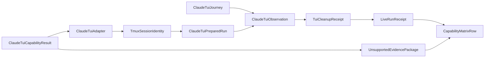

# Domain Entities — claude-tui-live

入力参照: `unit-of-work`、`unit-of-work-story-map`、`requirements`、`components`、`component-methods`、`services`。

## Adapter Entities

### ClaudeTuiCapabilityResult

supported/unsupported union。Claude/tmux versions、private socket、project settings、auth、send/capture/terminate capabilityまたは不足evidenceを持つ。

### ClaudeTuiAdapter

C3 adapter。private tmux server/session、Claude TUI command、input delivery、pane capture、terminate、cleanupを所有する。

### TmuxSessionIdentity

run IDから生成したprivate socket path、session name、window/pane targetを持つ。既存server addressを受理しない。

### ClaudeTuiPreparedRun

scratch cwd、argv/env key shape、project settings digest、`TmuxSessionIdentity`、resource IDsを持つ。

## Journey Entities

### ClaudeTuiJourney

prompt sequence、readiness condition、tool/state/audit/file anchors、deadlineを持つ。

### ClaudeTuiObservation

readiness、input count、sanitized pane digest、terminal code、timeout、process/session livenessを持つ。

### TuiCleanupReceipt

pane capture、session kill、server exit、process reap、credential/scratch cleanupの個別結果を集約する。

### UnsupportedEvidencePackage

canonical blocker code（binary/version/dist/auth/capabilityのみ）、measured versions、designated live environment、reproduction、blocker、recommended seam、acceptance criteria、Issue linkを持つ。CI/opt-in skipからは生成しない。

## Relationships

テキスト代替: capability成立時はClaude TUI adapterがprivate tmux identityとprepared runを作り、journey observation後にcleanupしてreceiptへ至る。不成立時はevidence packageへ分岐し、両方がmatrix rowへ接続する。

## States and Ownership

- Session: `allocated → server-started → ready → active → terminating → reaped`。
- C5 owns tmux/Claude/settings/env; C6 owns prompts/anchors; C4 owns generic scratch、deadline、cleanup orchestration、ledger。
