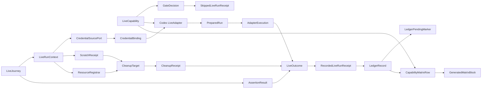

# Domain Entities — codex-live-walking-skeleton

入力参照: `unit-of-work`、`unit-of-work-story-map`、`requirements`、`components`、`component-methods`、`services`。EntityはBun test process内のimmutable dataと短命resource handleであり、database persistence modelではない。

## Contract Entities

### LiveCapability

| Field | Meaning | Constraint |
|---|---|---|
| `id` | adapter identity | U01では`codex-exec`、registry内unique |
| `harness` | harness identity | `codex` |
| `transport` | execution transport | `exec` |
| `optInKey` | dedicated opt-in | strict `"1"` only |
| `minimumVersion` | supported lower bound | Codex 0.139.0以上 |
| `measuredVersion` | last measured substrate | secretを含まない |
| `status` | supported/unsupported/unverified | closed vocabulary |
| `anchorKind` | deterministic assertion kind | exit/schema/file/state |
| `followUpIssue` | unsupported acceptance | supported Codexでは空 |
| `environment` | allow/sensitive/source declarations | raw credential値を持たない |

### GateDecision

`allow`またはtyped `skip`のdiscriminated union。skipはcanonical `LiveCode`とsanitized diagnosticを持つ。pure policy outputでありfilesystem/process handleを持たない。

### PreflightFinding / PreflightResult

binary、version、dist、auth、capabilityの各read-only observationを保持する。`PreflightResult`は全findingと固定優先順位で選んだprimary codeを分離し、複数不成立を失わない。

### LiveJourney

| Field | Meaning |
|---|---|
| `id` | Codex minimal journey identity |
| `prompt` | 短いdeterministic task。ledgerには保存しない |
| `timeoutMs` | explicit journey deadline |
| `retryPolicy` | default max attempts 1（retry 0回） |
| `anchors` | exit/schema/file/state assertions |

C6が所有するspecificationであり、credential探索、scratch allocation、spawn lifecycleを持たない。

## Lifecycle Entities

### LiveRunContext

repository root、Git SHA、target dist、clock、scratch allocator、abort source、debug retention policy、ledger path、host-injected `CredentialSourcePort`を依存として受け取る。ambient global state、raw secret、source auth pathを暗黙参照しない。

### CredentialSourcePort

`canLease(declaration)`と`lease(declaration)`を提供するhost-side port。`canLease`はsecretを返さずavailabilityだけをpreflightへ返す。`lease`はC5 prepareだけが呼び、許可されたchild keyへ射影可能な短命`CredentialBinding`を返す。source file/path、設定、hooksはAPIへ露出しない。

### CredentialBinding

adapter宣言で許可されたin-memory/env secret handleとchild key名を結び付ける短命値。C5が`CredentialSourcePort.lease`から生成し、C5がchild allow-listへ注入する。raw valueはserialize、compare、logできず、source auth file/path、設定、hooksへのreferenceを持たない。C5はleaseを`ResourceRegistrar`へ登録し、C4はrun終了時にsnapshotをC5 cleanupへ渡して破棄を保証する。

### ScratchReceipt

scratch root、temporary home/project、作成済みresource ID、credential-bearing path分類を持つ。source credential pathは含めない。状態は`allocating` → `ready` → `cleaned`または`cleanup-failed`。

### CleanupResource / ResourceRegistrar / CleanupTarget

`CleanupResource`はresource ID、kind、sanitized locator、credential-bearing flag、cleanup action identity、`planned | created | released` stateを持つ。C4はscratch allocation前に`ResourceRegistrar`を生成し、allocatorとC5へ渡す。registrarは`registerPlanned`、`markCreated`、`markReleased`、immutable `snapshot`を提供する。各ownerは副作用前後に同期methodを呼び、allocator/prepareがthrow/`Result.err`でもC4はsnapshotを取得できる。`CleanupTarget`はscratch、optional prepared run、snapshotを束ね、planned resourceは存在確認後、created resourceは必ずcleanupする。

### PreparedRun

scratch内cwd、executable、argument vector、allow-listed child env、registered resource IDs、expected process identityを持つ。source auth/configやambient envのreferenceを持たない。

### AdapterExecution

transport固有結果をexit、timedOut、aborted、sanitized output metadata、structured payloadへ正規化した値。assertion verdictは持たず、C6との責務を分離する。

### AssertionResult

`passed`または`failed`と、anchorごとのsanitized evidenceを持つ。prose全文ではなく構造化anchorの結果だけを保持する。

### CleanupReceipt

attempted resources、deleted credential resources、retained debug resources、failures、leak findingsを持つ。cleanupとleak scanは独立結果として格納する。

## Outcome and Evidence Entities

### LiveOutcome

| Status | Allowed codes |
|---|---|
| `success` | `PASS:SUCCESS` |
| `skip` | `SKIP:CI_FORBIDDEN`、`OPT_IN_REQUIRED`、`BINARY_MISSING`、`VERSION_UNSUPPORTED`、`DIST_MISSING`、`AUTH_UNAVAILABLE`、`CAPABILITY_UNSUPPORTED` |
| `timeout` | `TIMEOUT:JOURNEY_TIMEOUT` |
| `failure` | `FAIL:EXECUTION_FAILED`、`FAIL:ASSERTION_FAILED` |

diagnosticと`SanitizedEvidence[]`を持つ。cleanup/leak override時は元outcomeをsecondaryとして保持する。

### SanitizedEvidence

evidence kind、digestまたはbounded sanitized value、source categoryを持つ。prompt/stdout/stderr全文、credential、absolute home/source pathは禁止する。

### LiveRunReceipt

次のdiscriminated unionである。

- `SkippedLiveRunReceipt`: `kind: "skipped"`、adapter ID、評価時刻、skip outcome、sanitized diagnostic。scratch/execute/ledgerがないため`receiptId`、Git SHA、cleanup、durabilityを持たない。
- `RecordedLiveRunReceipt`: `kind: "recorded"`。実行開始後の結果をC8へ永続化する。

| Field group | Content |
|---|---|
| Identity | recorded schema version、deterministic `receiptId`、journey ID、adapter ID |
| Provenance | UTC timestamp、40桁Git SHA、measured version |
| Result | status、canonical code、sanitized diagnostic/evidence |
| Lifecycle | attempt count、timeout、cleanup receipt |
| Durability | `file-and-directory`または`file-only` |

recorded receiptはimmutableで、ledger appendのidempotency keyになる。skip receiptはC8が受け付けない。

### LiveRunError

- `contract-invalid`: invalid registry、journey、result、receipt、ledger input。
- `ledger-write-failed`: 完成済みsanitized recorded receiptと`LedgerError`を保持し、同一IDで明示回復できる。

external execution failureは`LiveOutcome`に入り、contract/ledger integrity failureはouter errorに入る。

## Ledger Entities

### LedgerRecord

`RecordedLiveRunReceipt`のJSONL serialization。schema/versionとfield orderをcanonicalにし、1 recordを1行で表す。既存行はbyte-preservingに保持する。skip receiptはledger recordにならない。

### LedgerPendingMarker

receipt IDとowner tokenだけを持つ非秘密sidecar。`file-and-directory` modeでdata rename前にdirectoryへdurable化し、rename後directory fsyncが未完了のrecordをreaderがgreenとして採用することを防ぐ。parser/projectorはmatching pending markerがあるrecordを拒否する。

### LedgerOwnerToken

PIDとprocess start epochの組。lock stamp、release、manual recoveryのidentityに用い、raw host/user secretを含まない。

### LedgerLockStatus

`free`、`owned-alive`、`owned-dead`、`owned-unknown`、`unstamped-fresh`、`unstamped-stale`のclosed state。自動回収可能なのは`owned-dead`と`unstamped-stale`だけである。

### LedgerError

malformed input、unknown adapter、ID conflict、lock timeout、owner mismatch、write、fsync、rename、revalidation、durability unknownを区別する。すべてfail-closedである。

## Projection Entities

### CapabilityMatrixRow

adapter ID、harness、transport、opt-in key、CI deny policy、設定/認証隔離summary、deterministic anchor kinds、support state、minimum/measured version、last green SHA/time、follow-up Issueを持つ。registryとpendingのないlatest validated recorded receiptから導出し、Markdownから逆生成しない。

### GeneratedMatrixBlock

stable start/end markerとadapter ID順のrow集合。current document内のblockとexpected blockのbyte差を`MatrixDrift`として返す。

### MatrixError

registry/ledger invalid、pending durability、projection failure、generated block missing/drift、document update failureを区別する。S2のrender/update/checkが返し、C4 `LiveRunError`へ混入しない。

### RunbookContract

必須section、registry adapter ID、command、opt-in key、GHA prohibition、ledger receipt確認、distribution-change triggerの集合。docsを実行入力にせず、doc contract testの期待値として使う。

## Relationships

テキスト代替: capabilityはgate、Codex adapter、許可されたcredential bindingを構成する。denyは非永続skip receiptで終わる。allow時はjourneyとrun contextがscratchとresource registrarを開始し、execution、assertion、cleanupからrecorded receiptを生成する。pending markerのないvalidated ledger recordとregistryからS2がmatrixを導出する。

## State Transitions

### Live Run

`created` → `skipped` または `scratch-allocating` → `prepared` → `executing` → `asserting` → `cleaning` → `recorded-receipt-ready` → `persisting` → `persisted`。

- `scratch-allocating`以降の全failureは`cleaning`を経由する。
- gate/preflight denyは`SkippedLiveRunReceipt`を返す`skipped`終端で、ledgerへ遷移しない。
- `recorded-receipt-ready`からledger failure時は`persistence-failed`となり、`persisted`へ偽装しない。
- 同一receiptのrecoveryは`persistence-failed` → `persisted`または`already-present`へ遷移できる。
- matching pending markerがある間は`persisted`ではなく、recoveryがdirectory fsyncとmarker除去を完了してから終端する。

### Ledger Lock

`free` → `owned` → `released`。owner消失時は`owned-dead` → `reaping` → `free`、stamp前停止時はgrace経過後に`unstamped-stale` → `reaping` → `free`。live/unknown ownerまたはtoken mismatchから`reaping`へ遷移しない。

## Ownership Boundaries

| Entity group | Owner |
|---|---|
| Capability/outcome/evidence vocabulary | C1 |
| Gate decision、env declaration、leak finding | C2 |
| Adapter port、credential source/lease、prepared/execution/cleanup types | C3 |
| Run context、generic scratch/git/dist、resource registrar、state machine、classification、receipt | C4 |
| Codex credential acquisition/injection、argument/env binding、prepare/execute/cleanup | C5 Codex adapter |
| Prompt、timeout、anchor、assertion | C6 Codex journey |
| Static capability rows | C7 |
| Ledger record/lock/error | C8 |
| Matrix row/block/drift | C9 |
