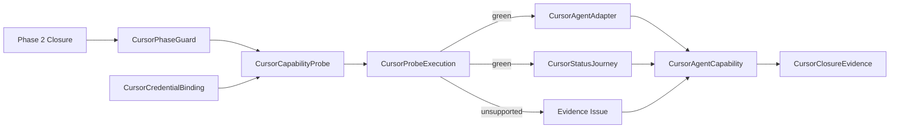

# Domain Entities — cursor-live-closure

入力参照: `unit-of-work`、`unit-of-work-story-map`、`requirements`、`components`、`component-methods`、`services`。

## Probe Entities

### CursorPhaseGuard

U10所有のC4呼出前guard。gate許可後だけU06〜U09のPhase 2 closureを検証する。

### CursorCapabilityProbe

IDE/agent version、required help flags、dist、isolated auth、safe live command、anchor resultsを測定する再実行可能なC5候補。probe中は`candidate`で、green後だけadapterとなる。

### CursorCredentialBinding

native isolated sessionまたはleased `CURSOR_API_KEY`のclosed union。kindとcleanup resource IDだけを公開し、value/source pathを公開しない。

### CursorProbeExecution

sanitized argv shape、env key集合、exit/timedOut、hook-receipt anchor booleans、version/help digest、termination receiptを持つ。raw stdout/stderr、account、credentialを持たない。

### CursorStatusHookReceipt

schema version、128-bit run nonce、event `afterShellExecution`、command ID `cursor-status-utility`、exact status utility command SHA-256を持つscratch-only atomic receipt。実行前不存在とnonce/hash一致を要する。

### CursorCapabilityFailureEvidence

取得済みIDE/agent version、help digest、specific missing capability、stable capability codeまたは再現可能なprobe、全Issue必須fieldsを持つ。environment-unavailable/transient failureから生成できない。

## Conditional Adapter Entities

### CursorAgentCapability

adapter ID `cursor-agent-print`、IDE/agent versions、opt-in、required flags、auth kind、anchors、supported/unsupported、follow-up Issue URLを持つC7 entry。

### CursorAgentAdapter

probe green時だけmaterializeするC3 `LiveAdapter`。project setup、credential injection、safe print spawn、normalization、cleanupを所有する。

### CursorStatusJourney

literal status prompt、120秒deadline、exit/output/state/leak anchorsを持つC6 specification。probe green時だけregistryへ接続する。

### CursorProcessOwnerReceipt

run nonce、PID/start identity/PGID、runner PGIDとの差分、signal前再検証結果を持つprocess-local resource。

### CursorClosureEvidence

C7 supported+C8 green receipt+C5/C6、またはcomplete `CursorCapabilityFailureEvidence`付きC7 unsupported+Issue+receipt presence rule+probe packageをC9が投影したclosed union。

## Relationships

テキスト代替: Phase 2 closure後、安全なCursor Agent probeを実行する。greenならadapter/journeyを作り、otherwiseはstubを作らずprobe packageとIssueへ閉じる。どちらもtyped registryとmatrixへ投影する。

## States and Ownership

- Probe: `declared → gated → phase-verified → preflighted → executing → measured → supported | unsupported → recorded`。
- Adapterは`measured-supported`からだけ生成可能。unsupportedからの遷移は禁止。
- C5 candidate owns Cursor command/auth/process、C6 candidate owns prompt/anchors、C4 owns generic scratch/ledger、C2 owns gate/env/leak policy、C7/C9 owns closure projection。
