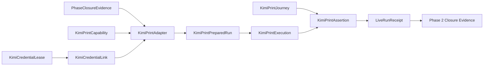

# Domain Entities — kimi-print-live

入力参照: `unit-of-work`、`unit-of-work-story-map`、`requirements`、`components`、`component-methods`、`services`。

## Adapter Entities

### KimiPrintCapability

adapter ID `kimi-print`、binary、minimum version `0.29.0`、measured version `0.31.1`、required help flags、`AMADEUS_KIMI_PRINT_LIVE`、`dist/kimi`、config policy、credential binding、anchor kindsを持つC7 entry。

### KimiCredentialLease

`CredentialSourcePort.lease`が返すprocess-local opaque handle。`credentials`/`oauth` entry種別とcleanup resource IDだけを公開し、source pathやcredential bytesを公開・直列化しない。

### KimiCredentialLink

scratch `KIMI_CODE_HOME`配下の短命symlink。`planned → created → removed → verified-absent`を持ち、`ResourceRegistrar`が全遷移を追跡する。debug保持対象外。

### KimiPrintAdapter

C3 `LiveAdapter`実装。preflight、scratch config生成、credential lease/link、headless spawn、text result normalization、cleanupを所有する。

### KimiModelId

optional exact prefix `kimi-code/`を除去後、`^[A-Za-z0-9][A-Za-z0-9._-]{0,63}$`を満たすbranded string。不正値は`contract-invalid/invalid-model-id`でfail-closedにし、raw入力をconfigへ渡さない。

### KimiConfigDocument

検証済み`KimiModelId`、固定provider `managed:kimi-code`、固定base URL、固定OAuth storage keyから成るstructured document。serializerだけがTOMLを生成し、任意fragmentやraw env文字列を受け取らない。

### KimiPrintPreparedRun

scratch-relative cwd、argv shape、env key集合、config digest、registered resource IDsを持つ。raw secret、source path、lease locatorを持たない。

## Journey Entities

### KimiPrintJourney

literal status prompt、180秒deadline、exit/output/state anchors、retry 0を持つC6 specification。

### KimiPrintExecution

exit code、timedOut、stdout/stderrのsanitized digest、detected version、termination receiptを持つ。

### PhaseClosureEvidence

phase ID、required adapter IDs、registry projection digest、ledger closure digest、matrix digest、各adapterのgreen receiptまたは受入条件付きIssue evidenceを持つ。U06はPhase 1 evidenceをread-only入力として検証する。

## Relationships

テキスト代替: Phase 1 closureとKimi capabilityを前提にadapterが短命credential link付きprepared runを作る。executionをjourney anchorsで判定し、durable receiptをPhase 2 closureへ渡す。

## States and Ownership

- Adapter: `declared → phase-verified → gated → preflighted → prepared → executed → cleaned → recorded`。
- Credential link: `planned → created → removed → verified-absent`。全終端経路で`verified-absent`必須。
- Journey: `defined → running → asserted → passed | failed | timed-out`。
- C5 owns Kimi command/config/credential injection、C6 owns prompt/anchors、C4 owns generic scratch/timeout/cleanup/ledger、C2 owns leak rejection。
