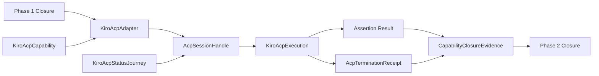

# Domain Entities — kiro-acp-live

入力参照: `unit-of-work`、`unit-of-work-story-map`、`requirements`、`components`、`component-methods`、`services`。

## Adapter Entities

### KiroAcpCapability

adapter ID `kiro-acp`、binary、minimum/measured version、required ACP flags、opt-in、dist、isolated auth probe、anchor kinds、supported/unsupported status、follow-up Issue URLを持つC7 entry。

### KiroAcpAdapter

C3 `LiveAdapter`実装。isolated preflight、ACP child ownership、JSON-RPC normalization、cancel/termination/reap、sanitized traceを所有する。

### KiroAcpPhaseGuard

U07所有のrunLiveJourney呼出前guard。Phase 1 registry/ledger/matrix closureをread-onlyで照合し、成功時だけ既存C4 APIを呼ぶ。不成立は`contract-invalid/phase-prerequisite-unmet`を返す。

### KiroAcpPreparedRun

scratch-relative cwd、exact argv、allowed env key集合、registered process resource IDを持つ。credential、source path、raw env、session IDを永続fieldに持たない。

### AcpSessionHandle

child process、process-local session ID、pending request IDs、teardown flagを持つ非直列化handle。`spawned → initialized → session-open → prompting → cancelling? → terminating → reaped`を遷移する。

## Journey Entities

### KiroAcpStatusJourney

literal prompt、initialize/session-new/prompt request shapes、各deadline、`end_turn`/permission/state anchorsを持つC6 specification。

### KiroAcpExecution

stop reason、tool-call count、permission request count、state presence、sanitized event digest、termination receiptを持つ。assistant proseとraw tool outputをsuccess判定に使わない。

### OffbandStatusEvidence

prompt直前のlatch不存在、初期counter `c0`、実行後read-only latchの`flag="status"`、`source="read-only-flag"`、`turn=c0+1`、実行後counter `c0+1`を持つ。preseeded latchやzero-tool `end_turn`だけでは生成できず、現在のpromptでKiro hookがstatus utilityをoff-band実行した正の証拠となる。

### AcpTerminationReceipt

cancel sent、stdin closed、TERM/KILL attempts、exit observed、reaped、late events ignoredを持つ。`reaped=true`だけがcleanup成功である。

### CapabilityClosureEvidence

green receiptまたはsanitized capability measurement付きIssue linkを表すclosed union。未確定skipや「要調査」を許さない。

## Relationships

テキスト代替: Phase 1 closureとKiro ACP capabilityからadapterがisolated ACP sessionを起動し、status journeyを実行する。executionとterminationを検証し、green receiptまたは根拠付きIssue evidenceだけをPhase 2 closureへ渡す。

## Ownership and States

- Adapter allow: `declared → gated → phase-verified → preflighted → prepared → executing → cleaned → recorded`。deny: `declared → gated-deny → terminal skip`で、Phase guardは呼ばない。
- ACP session: 全経路で`reaped`終端必須。process/session handleはC5外へ出さない。
- C5 owns ACP protocol/process/auth isolation、C6 owns prompt/anchors、C4 owns generic scratch/ledger、C2 owns gate/env/leak policy。
