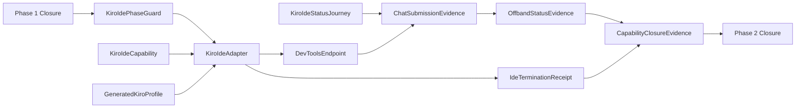

# Domain Entities — kiro-ide-live

入力参照: `unit-of-work`、`unit-of-work-story-map`、`requirements`、`components`、`component-methods`、`services`。

## Adapter Entities

### KiroIdeCapability

adapter ID `kiro-ide`、platform、app path、minimum/measured bundle version、dist、profile/CDP/chat/auth capability、opt-in、anchor kinds、follow-up Issue URLを持つC7 entry。

### KiroIdePhaseGuard

U09所有のC4呼出前guard。gate許可後だけPhase 1 closureをread-only検証し、不成立は`contract-invalid`を返す。

### KiroIdeAdapter

C3 `LiveAdapter`実装。generated profile、Electron launch、raw CDP、nested chat control、machine-auth capability、terminationを所有する。

### GeneratedKiroProfile

scratch path、`User/settings.json`、`User/globalStorage/state.vscdb`、exact SQLite schema/3 rows、exact settings object、canonical SHA-256 digestを持つ。source profile/credentialを持たず、debug保持不可。

### DevToolsEndpoint

fresh `DevToolsActivePort`から解決したloopback port、websocket path、creation boundary、target digestを持つ。absolute profile pathやraw endpoint payloadをledgerへ出さない。

### KiroIdeHandle

Electron leader PID、isolated process group ID、workspace/profile resource IDs、CDP sockets、termination stateを持つprocess-local非直列化handle。

## Journey Entities

### KiroIdeStatusJourney

literal prompt、chat readiness/read-back/submit contract、fresh latch/counter/state anchors、240秒budgetを持つC6 specification。

### ChatSubmissionEvidence

editor発見、typed text digest、read-back一致、editor clear、submit timestampを持つ。prompt本文や画面内容を永続化しない。

### OffbandStatusEvidence

prompt前latch不存在、初期counter `c0`、実行後`flag=status`/`source=read-only-flag`/`turn=c0+1`、counter一致を持つ。

### IdeTerminationReceipt

CDP sockets closed、group TERM/KILL attempts、leader exit observed、group probe `ESRCH`、remaining process count 0、profile deleted、workspace dispositionを持つ。

### CapabilityClosureEvidence

C7 `supported + C8 receipt`またはC7 `unsupported + Issue URL + C8 receipt absent`のclosed unionをC9が投影した結果。pending/unknownを許さない。

## Relationships

テキスト代替: Phase 1 guard通過後、generated profileでKiro IDEを起動し、ephemeral loopback CDPからchatへstatusを送る。fresh off-band evidenceと完全terminationが得られた場合だけgreen、そうでなければ根拠付きIssueをPhase 2 closureへ渡す。

## States and Ownership

- Adapter allow: `declared → gated → phase-verified → preflighted → profiled → launched → cdp-ready → chat-ready → executed → terminated → recorded`。
- deny: `declared → gated-deny → terminal skip`。Phase guardは呼ばない。
- Processは全経路で`reaped`、profileは全経路で`deleted`が終端条件。
- C5 owns GUI/CDP/profile/auth/termination、C6 owns prompt/anchors、C4 owns generic scratch/ledger、C2 owns gate/env/leak policy。
