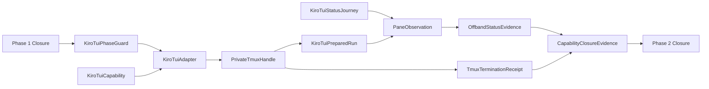

# Domain Entities — kiro-tui-live

入力参照: `unit-of-work`、`unit-of-work-story-map`、`requirements`、`components`、`component-methods`、`services`。

## Adapter Entities

### KiroTuiCapability

adapter ID `kiro-tui`、tmux/CLI minimum・measured version、required flags、opt-in、dist、isolated auth/readiness、anchor kinds、supported状態、follow-up Issue URLを持つC7 entry。

### KiroTuiPhaseGuard

U08所有のC4呼出前guard。gate許可後だけPhase 1 closureをread-only検証する。

### KiroTuiAdapter

C3 `LiveAdapter`実装。private tmux server/session、isolated env、PTY input/capture、child exit、cleanupを所有する。

### PrivateTmuxHandle

run nonce、closed-grammar socket label、session name、pane ID、server PID/PGID、pane leader PID/start identity/PGID、runner PGID、scratch cwd、registered resource IDsを持つprocess-local handle。default server identityを持たず、process identityを直列化しない。

### ProcessGroupOwnerReceipt

planned resource ID、run nonce、private socket/session/pane、PID start identity、PGID、runner/server PGIDとの差分検証、captured timestampを持つ。signal直前の再検証結果が完全一致した場合だけgroup signal capabilityを付与する。

### KiroTuiPreparedRun

200x50 pane、exact child argv、allowed env keys、private handleを持つ。source env/profile、raw credentialsを持たない。

## Journey Entities

### KiroTuiStatusJourney

literal status prompt、readiness/status deadlines、pane substring、fresh latch/counter/state anchorsを持つC6 specification。

### PaneObservation

pattern ID、matched boolean、stable duration、elapsed time、sanitized digestを持つ。pane bytes、ANSI、assistant proseを永続化しない。

### OffbandStatusEvidence

prompt前latch不存在、初期counter `c0`、実行後status latch/turn `c0+1`、counter一致、state/intents不存在を持つ。

### TmuxTerminationReceipt

owner revalidated、group signal allowed/refused、pane group TERM/KILL、group `ESRCH`、owner PID fallback、session/server kill、socket/server PID absent、scratch HOME deleted、workspace dispositionを持つ。

### CapabilityClosureEvidence

C7 supported+C8 success receipt、start前C7 unsupported+Issue+C8 receipt absent、またはstart後C7 unsupported+Issue+C8 non-green receiptをC9が投影したclosed union。

## Relationships

テキスト代替: Phase 1 guard後、isolated private tmuxでKiro TUIを起動し、literal statusを送る。paneとfresh disk evidenceを検証し、完全teardown後のgreen receiptまたは根拠付きIssueだけをPhase 2 closureへ渡す。

## States and Ownership

- Adapter allow: `declared → gated → phase-verified → preflighted → prepared → ready → executed → cleaned → recorded`。
- deny: `declared → gated-deny → terminal skip`。Phase guardは呼ばない。
- tmux: `planned → server-started → session-started → killed → server-stopped → verified-absent`。
- C5 owns tmux/TUI/auth/cleanup、C6 owns prompt/anchors、C4 owns generic scratch/ledger、C2 owns gate/env/leak policy。
