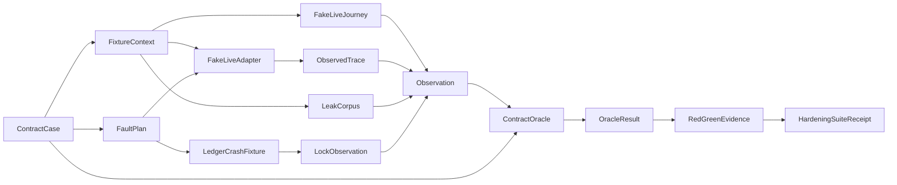

# Domain Entities — live-e2e-common-hardening

入力参照: `unit-of-work`、`unit-of-work-story-map`、`requirements`、`components`、`component-methods`、`services`。

## Test Case Entities

### ContractCase

case ID、requirement IDs、seed、baseline/mutant種別、単一`FaultPoint`、`ExpectedTerminal`、期待trace、禁止artifact集合を持つimmutable定義。複合faultは明示的なdiagnostic-aggregation caseだけが保持できる。

### ExpectedTerminal

`{ kind: "live-code"; code: LiveCode } | { kind: "run-error"; errorKind: "cleanup-barrier-failed" | "ledger-write-failed" } | { kind: "contract-error"; errorKind: string }`のclosed union。policy/lifecycleの期待結果とcleanup/ledger/contract errorを型で混同しない。`cleanup-barrier-failed`はC8 append 0回、`ledger-write-failed`はbarrier成功後のreceiptを伴うが`closure-committed`未到達である。

### FaultPoint / FaultPlan

`policy-bypass | scratch-partial | prepare-throw | execute-failure | timeout | assertion | cleanup | leak | ledger-write | ledger-fsync | ledger-rename | ledger-revalidate | process-crash | matrix-drift`のclosed集合。`FaultPlan`は発火回数と発火条件を持ち、未宣言faultを拒否する。

### FixtureContext

fresh root、fake clock、abort controller、fake process factory、credential source、scratch allocator、ledger path、registry fixture、canary corpus、restoration stackを束ねる。実home、実credential、実CLIへのreferenceを持たない。

### FakeLiveAdapter

U01 `LiveAdapter`を実装し、preflight/prepare/execute/cleanupのscripted resultとcall traceを返すtransport非依存adapter。具体harnessのflagやpromptを持たない。

### FakeLiveJourney

決定的なexit/schema/file/state anchorを宣言し、scripted `AdapterExecution`からassertion resultを生成する。自然言語完全一致を使わない。

## Observation Entities

### BoundaryCall

boundary名、ordinal、sanitized arguments shape、start/end virtual time、result kindを持つ。raw env value、secret、source path内容は保持しない。

### ObservedTrace

policy、probe、lease、scratch、prepare、spawn、abort、reap、assert、cleanup、leak scan、ledger、projectionの`BoundaryCall`列。call countとhappens-beforeを検証できる。

### ArtifactSnapshot

fixture rootのrelative path、file kind、mode、sanitized digest、ledger row count、lock owner metadataを持つ。絶対home pathとraw file contentはevidenceへ昇格しない。

### Observation

`LiveRunReceipt | LiveRunError`、`ObservedTrace`、`ArtifactSnapshot`、child env key集合、diagnostic key集合を束ねる。

### ContractOracle / OracleResult

caseのexpected code、trace、forbidden artifact、durability invariantとObservationを比較する純粋判定。`OracleResult`は`pass`またはstable assertion ID付きの`violations`であり、free-form secret-bearing messageを持たない。

## Safety Entities

### Canary / LeakCorpus

canary ID、分類`ambient-env | sensitive-env | source-pointer | credential-binding | benign`、非秘密token、expected visibilityを持つ。`LeakCorpus`はchild env、scratch、diagnostic、receipt、ledger、matrixのscan ruleを生成する。

### RestorationStack / FixtureCleanupReceipt

module substitution、env、child process、temp rootをLIFOで復元する。各actionのattempt/resultを集約し、一件のfailureで残りを省略しない。

## Ledger Fault Entities

### CrashCheckpoint

`lock-stamped | before-write | after-file-fsync | after-rename | after-directory-fsync | before-final-revalidation`のclosed集合。lock/final bytesはon-disk観測、I/O operation境界はtest-side IPC barrierで観測し、wall-clock sleepから位置を推測しない。

### LedgerCrashFixture

child worker、checkpoint observer、IPC barrier、kill controller、fresh recovery worker、bounded deadlineを束ねる。public ledger functionだけをworkerへ渡し、production sourceへfault flagを渡さない。

### ScopedIoSubstitution

child test process内でwrite/fsync/rename/revalidationの指定ordinal前後にIPC barrierを通知し、必要なら指定operationだけを失敗させる復元可能なsubstitution。serial caseだけで使用し、production exportやruntime branchを追加しない。

### LockObservation

owner PID/start epoch、stamp状態、mtime class、CAS recovery結果をsanitizedに保持する。live/unknown/dead/unstampedの判定証拠を区別する。

## Evidence Entities

### RedGreenEvidence

case ID、seed、requirement IDs、baseline status、mutant status、failed assertion IDsを持つ。baselineがgreenかつmutantが期待assertionでredの場合だけ`proven`になる。

### HardeningSuiteReceipt

suite schema、Git SHA、case count、proven guard IDs、failed case IDs、durationを持つoffline evidence。live adapter ID、model output、credentialを含まず、C8 live run ledgerへ追記しない。

## Relationships

テキスト代替: ContractCaseとFaultPlanがfresh FixtureContext上のfake adapter/journeyを駆動する。trace、leak corpus、ledger crash/lock observationをObservationへ集約し、ContractOracleが期待契約と比較する。baseline greenと注入redの結果をRedGreenEvidenceへ固定し、offline HardeningSuiteReceiptへ集約する。

## Lifecycle States

### ContractCase

`defined → validated → fixture-ready → exercised → observed → adjudicated → restored`。どのfailureでも`restored`を試行し、復元失敗をsuite failureへ含める。

### LedgerCrashFixture

`spawned → checkpoint-observed → killed → state-captured → recovery-started → recovered | rejected → restored`。checkpoint timeoutではkill位置を推測せずcase failureにする。

### RedGreenEvidence

`pending → baseline-green → mutant-red → proven`。baseline red、mutant green、別assertionでの偶発redはいずれも`invalid`である。

## Ownership Map

| Entity | Owner |
|---|---|
| ContractCase、FaultPlan、FixtureContext、fake adapter/journey | U02 test kit |
| Observation、ContractOracle、leak corpus | U02 test kit |
| LedgerCrashFixture、ScopedIoSubstitution、LockObservation | U02 test kit |
| RedGreenEvidence、HardeningSuiteReceipt | U02 test kit |
| LiveCode、LiveAdapter、runner、ledger、matrix production entities | U01 read-only dependency |
