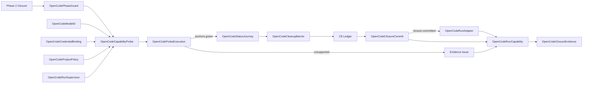

# Domain Entities — opencode-live-closure

入力参照: `unit-of-work`、`unit-of-work-story-map`、`requirements`、`components`、`component-methods`、`services`。

## Probe Entities

### OpenCodePhaseGuard

U11所有のC4呼出前guard。gate許可後だけU06〜U09のPhase 2 closureを検証する。

### OpenCodeCapabilityProbe

CLI version、required help flags、dist command/plugin、isolated auth/model、safe live command、anchor resultsを測定する再実行可能なC5候補。probe中は`candidate`で、green後だけadapterとなる。

### OpenCodeModelId

検証済み`provider/model`の非秘密値。各segmentのclosed grammar、provider credential declaration、sanitized argv projectionを持ち、任意config/env keyを生成できない。

### OpenCodeCredentialBinding

U11 C5所有`OpenCodeCredentialPort.lease`が返すprovider固有in-memory/env secret handle。child key kindとcleanup resource IDだけを公開し、value/source auth file/pathを公開・直列化しない。

### OpenCodeCredentialPort

`canLease`、`lease`、`destroy`を持つU11 C5内部port。provider→child key表は`openai → OPENAI_API_KEY`、`anthropic → ANTHROPIC_API_KEY`、`opencode → OPENCODE_API_KEY`のclosed unionである。lease不能は`AUTH_UNAVAILABLE`、未登録providerは`contract-invalid/invalid-model-id`、destroy失敗はcleanup failureへ写像する。source auth file/pathをAPIへ露出しない。

### OpenCodeProjectPolicy

scratch `.opencode/opencode.json`のtyped表現。global deny、exact engine/status utility bash allow、share disabled、autoupdate false、document digestを持つ。raw JSON fragmentを受け付けない。

### OpenCodeProbeExecution

sanitized argv shape、env key集合、exit/timedOut、JSON/session/plugin-receipt anchor booleans、version/help/config/plugin digest、termination receiptを持つ。raw stdout/stderr、account、credential、session/call IDを持たない。

### OpenCodeToolReceipt

schema version、128-bit run nonce、event `tool.execute.after`、session ID SHA-256、ordered call ID SHA-256、command IDs/hashes、canonical plugin SHA-256を持つscratch-only atomic receipt。実行前不存在とnonce/session/plugin/call/command/order一致を要する。

### OpenCodeCapabilityFailureEvidence

取得済みCLI version、help/config/plugin digest、specific missing capability、stable capability codeまたは再現可能なprobe、全Issue必須fieldsを持つ。binary/dist/auth不足またはtransient failureから生成できない。

## Conditional Adapter Entities

### OpenCodeRunCapability

adapter ID `opencode-run-command`、CLI version、opt-in、model/provider kind、required flags、auth kind、plugin/JSON anchors、supported/unsupported、follow-up Issue URLを持つC7 entry。

### OpenCodeRunAdapter

probe greenかつ`closure-committed`後だけmaterializeするC3 `LiveAdapter`。project setup、model/credential projection、safe headless spawn、JSON normalization、cleanupを所有する。

### OpenCodeStatusJourney

custom command `amadeus`、literal argument `--status`、120秒deadline、JSON/session/tool receipt/state/leak anchorsを持つC6 specification。probe green時だけregistryへ接続する。

### OpenCodeProcessOwnerReceipt

run nonce、supervisor PID/start identity/PGID、OpenCode child PID/start identity、runner/server PGIDとの差分、signal前再検証、supervisor reap、group ESRCH、credential-bearing descendant残存数を持つprocess-local resource。

### OpenCodeRunSupervisor

credentialを持たないrun-owned process-group leader。owner nonce付きcontrol channelとone-shot credential FDを持ち、検証後にだけOpenCode childを同じgroupへspawnする。credential bufferをzeroizeし、OpenCode leaderが先に終了してもgroup member残存0まで生存する。状態は`created → owner-verified → child-started → draining → descendants-zero → reaped`、異常時は`control-lost → terminating → descendants-zero → reaped | fatal-cleanup`である。

### OpenCodeCleanupBarrier

C5所有のcleanup gate。`descendants-zero → processes-reaped → scan-before-delete → scratch-deleted → post-delete-absent → credential-destroyed → matcher-zeroized → closed`の順序を持つ。C4はsecretを受け取らずopaque matcher handleを呼び出してscan receiptを返す。`closed`はsanitized receipt生成とC8 appendだけを許可し、途中失敗はC8未記録の`LiveRunError.cleanup-barrier-failed`へ遷移する。

### OpenCodeClosureCommit

`executed/asserted → cleanup-barrier-closed → ledger-appended | already-present → closure-committed`の終端状態を持つC4/C8境界。`closure-committed`だけがPASS返却、C7 supported更新、C5/C6 materialization、C9 projectionを解放する。ledger failureはsanitized receiptを伴うhard errorであり、greenやmaterializationへ遷移しない。

### OpenCodeClosureEvidence

C7 supported+C8 green receipt+C5/C6、またはcomplete `OpenCodeCapabilityFailureEvidence`付きC7 unsupported+Issue+receipt presence rule+probe packageをC9が投影したclosed union。

## Relationships

テキスト代替: Phase 2 closure後、安全なOpenCode headless probeとjourney assertionを実行する。cleanup barrierを閉じてC8 appendまたはalready-presentとなった後だけclosureをcommitし、green adapterをmaterializeする。実測済みunsupportedならstubを作らずprobe packageとIssueへ閉じる。いずれもclosure commitまたは完全なunsupported evidence後だけtyped registryとmatrixへ投影する。

## States and Ownership

- Probe: `declared → gated → phase-verified → preflighted → executing → measured → asserted → cleanup-barrier-closed → ledger-appended | already-present → closure-committed`。unsupported evidence branchは`measured → unsupported-evidence-complete → closure-committed`とする。
- Adapterはgreen branchの`closure-committed`からだけ生成可能。unsupportedからの遷移は禁止。
- C5 candidate owns OpenCode command/model/auth/plugin/supervisor process group、C6 candidate owns custom command args/anchors、C4 owns generic scratch/ledger、C2 owns gate/env/leak policy、C7/C9 owns closure projection。
