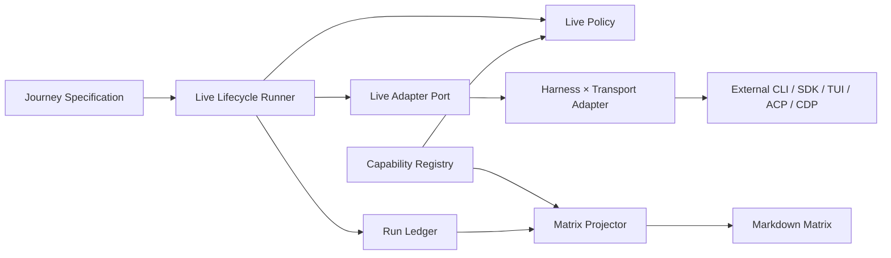

# Components — ハーネス横断 live E2E

入力参照: `requirements`、`architecture`、`component-inventory`、`team-practices`。`stories`は本scopeで生成されていないため、FR-1〜FR-11をcomponent traceの正本とする。

## Component Model

### C1. Live Contract

目的: 全adapterが共有する型付き語彙を単一定義する。

所有責務:

- `LiveAdapterId`、`HarnessId`、`TransportId`、`LiveOutcome`、`LiveCode`。
- `AMADEUS_LIVE_E2E` prefixとrequirements FR-2のcode集合。
- capability宣言、preflight結果、sanitized evidence、cleanup receiptの型。

非所有責務: process起動、filesystem、認証探索、journey固有assertion。

配置候補: `tests/harness/live-e2e/contract.ts`。

### C2. Live Policy

目的: process起動前の純粋・決定的な安全判定を行う。

所有責務:

- `GITHUB_ACTIONS=true`を最優先するhard deny。
- adapter別専用opt-in変数の値が厳密に`"1"`かを判定。
- 複数preflight不成立時のprimary code優先順位。
- child environmentのallow-list構築とsensitive key/source path漏洩検査。

非所有責務: binary/version/authの実probe、credential注入、spawn。

配置候補: `tests/harness/live-e2e/policy.ts`。

### C3. Live Adapter Port

目的: harness×transport差を共通lifecycleから隔離するportを定義する。

所有責務:

- capability、opt-in、binary/version、sensitive key、source path、anchor宣言。
- `preflight`、`prepare`、`execute`、`cleanup`のport。
- transport出力から共通`AdapterExecution`への正規化境界。

非所有責務: 共通gate precedence、共通result codeの再定義、journey期待値。

配置候補: `tests/harness/live-e2e/adapter.ts`。

### C4. Live Lifecycle Runner

目的: 1 journeyのgate→preflight→scratch→execute→assert→cleanup→receiptを一方向に編成する。

所有責務:

- common policyをprobeより前に実行。
- scratch project/temporary homeの生成と対象dist配置。
- explicit timeout、AbortSignal、retry上限、直列実行。
- scratch確保後はprepare途中、execute/assertの例外・timeout・abortを含め、`finally`相当の境界でcleanupと漏洩検査を必ず両方試行する。
- debug保持時もcredential materialを強制削除する。cleanup/leak failureは`LiveOutcome`へ変換せず、C8を呼ばない`LiveRunError.cleanup-barrier-failed`として元のtimeout/assertion/successより優先する。
- cleanup barrier成功後にだけfinal `LiveRunReceipt`を生成し、C8 append成功または同一receiptのalready-present後にだけclosure committedへ遷移する。台帳永続化失敗は`LiveRunError.ledger-write-failed`としてPASS、supported更新、materialization、projectionを禁止する。

非所有責務: transport command、auth方式、モデル出力の自然言語一致。

配置候補: `tests/harness/live-e2e/lifecycle.ts`。

### C5. Harness × Transport Adapters

目的: 外部substrate差を薄いadapterへ閉じ込める。

| Adapter ID | 既存/新規 | 所有transport |
|---|---|---|
| `codex-exec` | 既存helperから移行 | `codex exec` |
| `claude-print` | 新規 | `claude -p --setting-sources project` |
| `claude-sdk` | 既存driverをwrap | Agent SDK |
| `claude-tui` | 既存driverをwrap | tmux TUI。runner自動opt-in廃止 |
| `kimi-print` | 既存driverをwrap | `kimi -p` |
| `kiro-acp` | 既存driverをwrap | Kiro ACP |
| `kiro-tui` | 既存driverをwrap | Kiro tmux TUI |
| `kiro-ide` | 既存driverをwrap | Kiro IDE/CDP |
| `cursor-*` | capability成立時だけ追加 | 実測で成立した非対話transport |
| `opencode-*` | capability成立時だけ追加 | 実測で成立した非対話transport |

adapterは既存driverを一括書換えせず、縦スライスごとにportへ接続する。成立前のCursor/OpenCode adapter stubは作らない。

### C6. Journey Specifications

目的: promptと決定的アンカーをadapter実装から分離する。

所有責務: 1〜数prompt、exit/schema/file/state anchor、assertion、journey timeout。  
非所有責務: credential探索、scratch、spawn lifecycle。

既存`tests/e2e/*.serial.test.ts`のjourneyを維持し、共通runnerへ接続する。

### C7. Capability Registry

目的: 静的capability matrixの機械可読正本を提供する。

所有責務: adapter ID、harness、transport、opt-in変数、minimum/measured version、対応状態、anchor種別、follow-up Issue link。  
非所有責務: 実行履歴、credential値、scratch path。

配置候補: `tests/harness/live-e2e/registry.ts`。`satisfies readonly LiveCapability[]`で重複IDと型driftをtestする。

### C8. Run Ledger

目的: live実行のappend-only evidenceをversion control下へ残す。

所有責務: schema version、冪等なreceipt ID、timestamp、Git SHA、adapter ID、detected version、outcome/code、sanitized anchor digest、byte-preserving atomic追記。  
非所有責務: prompt全文、stdout/stderr全文、credential、absolute home path。

配置候補: `tests/harness/live-e2e/runs.jsonl`。破損行、未知adapter、非単調schema、同一IDの内容衝突をfail-closedで拒否する。追記はowner-stamped mkdir lock下で既存byte列を検証し、sibling tempへの全量write・fsync・atomic renameを経て公開するため、final ledgerへ部分行を露出しない。lockは通常例外と`process.exit`でowner一致を確認して解放し、SIGKILL等の残存lockは既存`amadeus-lib.ts`と同じowner PID/start epoch・unstamped grace・reap mutex・CAS rename/revalidate契約で安全に回収する。

### C9. Matrix Projector

目的: C7+C8から保守者向けMarkdown matrixを決定的に導出する。

所有責務: 最終live green SHA、最終実行日時、unsupported/follow-up状態のprojection、drift check。  
非所有責務: capabilityや履歴の直接編集。

配置候補: `tests/harness/live-e2e/project-matrix.ts`。出力は`docs/harness-engineering/live-e2e.md`内のgenerated blockとする。

## Public Boundaries

テキスト代替: JourneyはLifecycle Runnerだけを呼ぶ。RunnerはPolicyを先に評価し、許可時だけAdapter portを介して外部substrateを起動する。最終receiptはRun Ledgerへ追記され、Capability RegistryとLedgerからMatrix ProjectorがMarkdownを生成する。依存方向は一方向で循環しない。

## Ownership Rules

1. 共通code、gate precedence、env漏洩判定はC1/C2だけが定義する。
2. credentialの取得・注入方式はC5、material/pointerの残留禁止はC2/C4が所有する。
3. debug保持はworkspace/logだけを対象とし、credential materialは常に削除する。
4. static capabilityはC7、run factはC8、表示はC9に分離する。
5. AWS resource、network service、database、daemonは追加しない。

## Review — Iteration 1

- **Verdict:** NOT-READY
- **Reviewer:** amadeus-architecture-reviewer-agent
- **Date:** 2026-08-03T11:27:05Z
- **Iteration:** 1
- **Scope decision:** none

参照IDと依存関係に循環はないが、実装順序、例外時クリーンアップ、台帳永続化失敗の契約にブロッカーがある。

### Findings

- BLOCKER | component-dependency.md の実装順序は C4 を C7/C8 より先に配置しているが、同じ成果物の依存行列では C4→C7/C8 であり、明示的に矛盾している。さらに C6 が実装順序から欠落している。C1/C2/C3/C7/C8→C4、C4および対象C5→C6のように、全コンポーネントを含むトポロジカルな順序へ修正する必要がある。
- BLOCKER | runLiveJourney は正常系の直列順序と「cleanup/leak failure overrides success」を定義している一方、prepare途中または execute/assert の例外・異常終了時にも cleanup と leak 検査を必ず実行する制御契約が明示されていない。資格情報や作業領域を残し得るため、FR5と安全性NFRを満たせない。各段階の失敗について finally 相当の実行範囲、cleanup対象、優先結果コードを定義する必要がある。
- BLOCKER | receipt生成後の C8 ledger append が失敗した場合の結果契約が、closed LiveCode、例外、再試行、または全体失敗のいずれにも割り当てられていない。実行成功だけが返り、FR11で要求される証跡が永続化されない状態を許し得る。append失敗と部分JSONL書込みをfail-closedで扱い、呼出元へ返す終端結果と回復方法を定義する必要がある。

## Review — Iteration 2

- **Verdict:** NOT-READY
- **Reviewer:** amadeus-architecture-reviewer-agent
- **Date:** 2026-08-03T11:34:14Z
- **Iteration:** 2
- **Scope decision:** none

第1反復の3件は解消され、参照不整合と依存循環も認められない。ただし、C8のmkdirロックが異常終了で残存した場合の回復契約がなく、再試行と証跡記録を恒久的に阻害し得る。

### Findings

- BLOCKER | C8のatomic append契約は「mkdir lock取得→処理→unlock」だけを定めており、lock取得直後のprocess kill、または検証・write・fsync・rename・final再検証の例外によってlock directoryが残存した場合のowner識別、取得timeout、stale判定、安全な解除、手動回復手順を定めていない。lock取得直後にprocessを終了させれば、以後のappendと同一receiptId recoveryが進められない状態を再現でき、FR6のretryとFR11の証跡記録を満たせない。通常例外ではunlockをfinally相当で保証し、process消失時には誤解除を防ぐowner tokenを伴うstale-lock回復契約を追加する必要がある。
- FOLLOW-UP | parent directory fsyncを「可能なら」とする場合、未対応platformで成功応答後にrenameのdurabilityが保証されないことをreceiptまたは診断へ明示し、対応可否の検出方法と保証レベルをcompatibility contractとして定義するとよい。

## Human Adjudication

- **Date:** 2026-08-03T11:56:05Z
- **Decision:** reviewer上限到達後の選択肢1「契約を修正し、人間裁定で解消扱いとして続行」
- **Resolution:** C8は既存`amadeus-lib.ts`のowner-stamped mkdir lock、owner一致release、exit safety net、dead/unstamped stale判定、reap mutex、CAS rename後のowner再検証を再利用する。通常例外、process kill、取得timeout、手動回復、parent directory fsync capabilityをclosed contractへ追加したため、Iteration 2のBLOCKERは人間裁定により解消扱いとする。Iteration 2のReview記録自体は改変しない。
