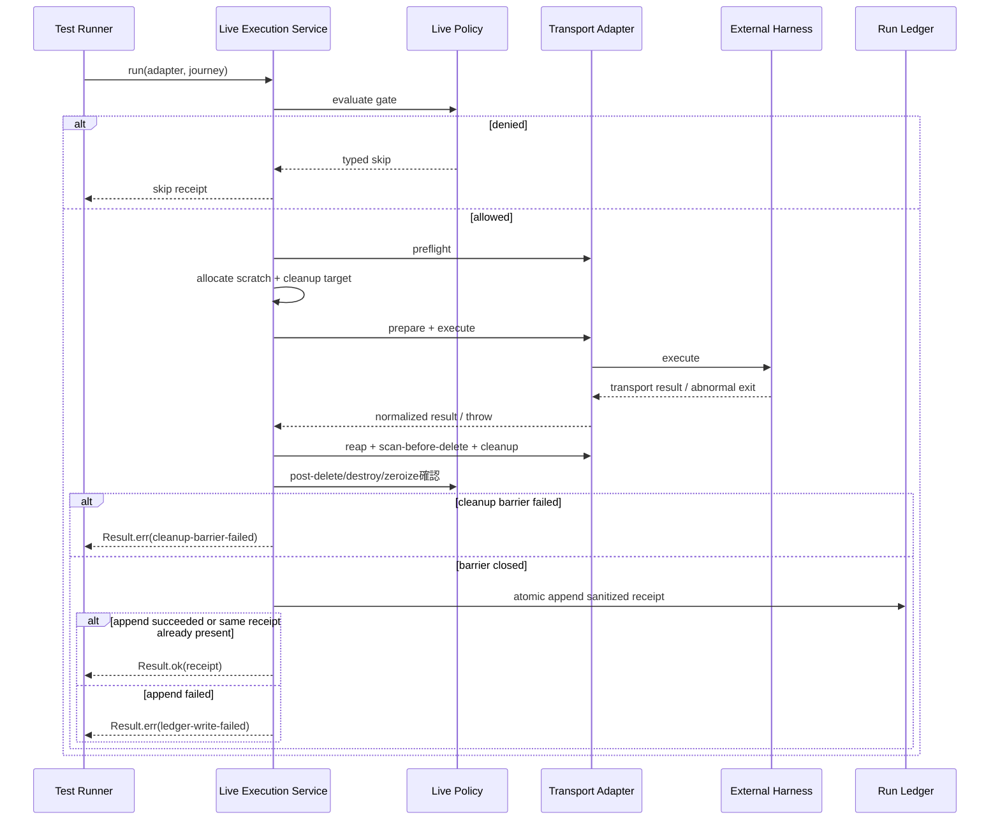

# Services — ハーネス横断 live E2E

入力参照: `requirements`、`architecture`、`component-inventory`、`team-practices`。`stories`は未生成。本設計はBun test process内の短命serviceであり、network serviceやAWS resourceを追加しない。

## Service Definitions

### S1. Live Execution Service

形態: Bun process内のorchestrator関数。  
責務: C2〜C6を編成し、1 adapter×1 journeyを最後まで実行する。  
lifecycle: test開始時に生成、journey終了時に破棄。daemon/stateful singletonなし。  
scaling: 明示的に直列。並列scale-outは要件違反。

### S2. Capability Projection Service

形態: 短命Bun CLI/check。  
責務: C7 registryとC8 ledgerを読み、C9でMarkdown blockを生成またはdrift検査する。  
lifecycle: 開発者の記録更新時、CIのdeterministic check時に起動して終了。  
scaling: repository-size固定の単一process。queue/cache/database不要。

### S3. Adapter Integration Harness

形態: Bun integration test fixture。  
責務: fake executable、fake dist、isolated envをLiveAdapterへ渡し、引数・cwd・env・cleanup・result分類を観測する。  
lifecycle: test caseごとにtemp dirを作成・破棄。  
外部I/O: fake subprocessのみ。実認証や課金modelを使用しない。

## Orchestration Pattern

choreographyではなくS1による明示orchestrationを採用する。cleanup、timeout、secret leak検査、ledger receiptの順序が安全不変量であり、event-drivenな分散協調は不要だからである。

テキスト代替: runnerはS1を呼び、S1が最初にpolicyを評価する。denyなら外部probeなしでskipを返す。許可時はscratch確保後のprepare/execute/assertをtry範囲に置き、途中失敗でもfinally相当でreap、scan-before-delete、scratch削除、post-delete不存在、credential destroy、matcher zeroizeを順に実行する。cleanup barrier失敗はC8未記録のtyped hard errorとする。barrier成功後だけsanitized receiptをatomicにledgerへ追記し、append成功後だけPASSとmaterializationを解放する。

## Communication Contracts

| From | To | Pattern | Contract |
|---|---|---|---|
| test runner | S1 | in-process async call | `Result<LiveRunReceipt, LiveRunError>` |
| S1 | C2 | sync pure call | `GateDecision` / violations |
| S1 | C5 | async port | `PreflightResult` / `PreparedRun` / `AdapterExecution` |
| C5 | external harness | subprocess/SDK/tmux/ACP/CDP | adapter固有、共通層へ漏らさない |
| S1 | C8 | serialized atomic append | `Result<appended/already-present, LedgerError>` |
| S2 | C7/C8 | read-only local file | registry+ledger |
| S2 | docs | deterministic write/check | generated Markdown block |

## AWS / Infrastructure Assessment

- 新しいAWS service、IAM role、VPC、database、queue、object storeを追加しない。
- Kiro/Claude等が既存machine/AWS credentialsを使う場合も、その取得方式はadapter外へ公開せず、値をledger/evidenceへ記録しない。
- FinOps上のcontrolは「明示opt-in」「短いprompt」「直列」「retry既定0」「normal GHA hard deny」で実現する。
- infrastructure-designで新資源を設計する根拠はない。

## Failure and Recovery

S1は各journeyを独立failure domainとする。1 adapterのfailureで他adapterを自動retryまたは並行起動しない。debug保持時はworkspace/logだけを残し、credential materialは必ず削除する。scratch確保開始後はprepare途中、execute/assertのthrow、timeout、abortを問わずcleanup barrierを実行する。barrier failureはprimary `LiveRunError.cleanup-barrier-failed`、先行outcomeをsecondary診断とし、C8 append、PASS、supported更新、materializationを禁止する。

C8はowner-stamped mkdir lock内で既存ledgerを全検証し、既存byte列+新規1行をsibling tempへwrite/fsyncしてatomic renameする。通常throwは`finally`、`process.exit`はowner一致safety netで解放する。SIGKILL残存はdead PIDまたはgrace超過unstamped lockだけを、reap mutex下のCAS renameとowner再検証で回収する。live/unknown owner、token mismatch、取得timeoutはfail-closedにし、sanitized owner tokenを指定する手動回復だけを許す。

部分行やmalformed既存行を見つけた場合は更新しない。ledger append失敗は`LiveRunError.ledger-write-failed`としてtest runnerをhard failureにし、journeyがgreenでも完了成功を返さない。呼出元はerror内のsanitized receiptを保持し、同一`receiptId`で明示再記録する。rename後の応答喪失は同一ID・同一内容を`already-present`として回復し、異内容ならconflictとして停止する。parent directory fsyncはcapability probeし、receiptへ`file-and-directory`または`file-only`を記録する。不明な保証レベルは成功扱いにしない。
