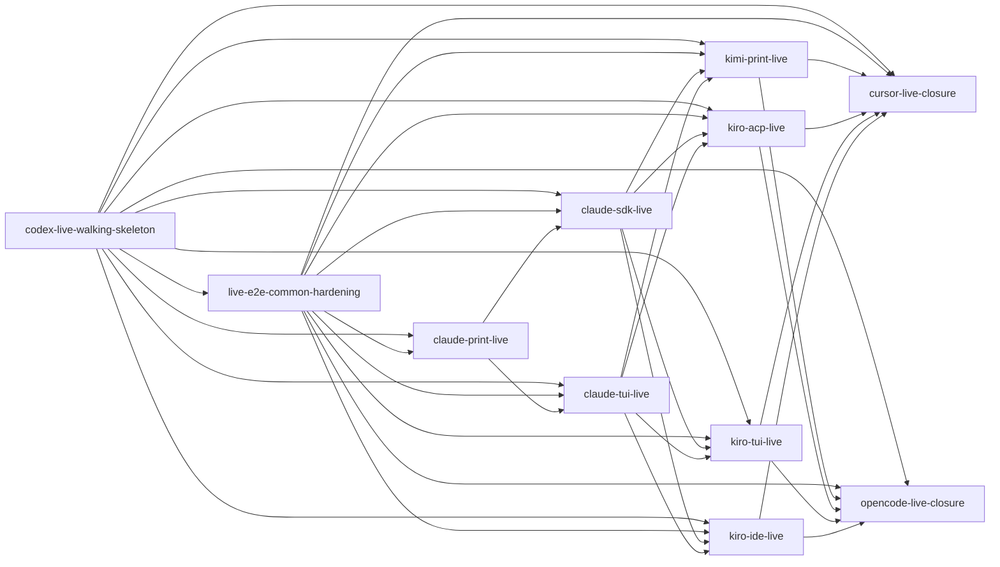

# Unit of Work Dependency — ハーネス横断 live E2E

入力参照: `components`、`component-methods`、`services`、`component-dependency`、`decisions`、`requirements`。`stories`は未生成であり、DAG edgeはApplication Design C1〜C9とFR-1〜FR-11から導出する。

## Machine-readable DAG

`depends_on`は直接依存だけを表す。これはtopologyの正本であり、推奨実装順序やcritical pathを表さない。

```yaml
units:
  - name: codex-live-walking-skeleton
    kind: library
    depends_on: []
  - name: live-e2e-common-hardening
    kind: library
    depends_on: [codex-live-walking-skeleton]
  - name: claude-print-live
    kind: library
    depends_on: [codex-live-walking-skeleton, live-e2e-common-hardening]
  - name: claude-sdk-live
    kind: library
    depends_on: [codex-live-walking-skeleton, live-e2e-common-hardening, claude-print-live]
  - name: claude-tui-live
    kind: library
    depends_on: [codex-live-walking-skeleton, live-e2e-common-hardening, claude-print-live]
  - name: kimi-print-live
    kind: library
    depends_on: [codex-live-walking-skeleton, live-e2e-common-hardening, claude-sdk-live, claude-tui-live]
  - name: kiro-acp-live
    kind: library
    depends_on: [codex-live-walking-skeleton, live-e2e-common-hardening, claude-sdk-live, claude-tui-live]
  - name: kiro-tui-live
    kind: library
    depends_on: [codex-live-walking-skeleton, live-e2e-common-hardening, claude-sdk-live, claude-tui-live]
  - name: kiro-ide-live
    kind: library
    depends_on: [codex-live-walking-skeleton, live-e2e-common-hardening, claude-sdk-live, claude-tui-live]
  - name: cursor-live-closure
    kind: library
    depends_on: [codex-live-walking-skeleton, live-e2e-common-hardening, kimi-print-live, kiro-acp-live, kiro-tui-live, kiro-ide-live]
  - name: opencode-live-closure
    kind: library
    depends_on: [codex-live-walking-skeleton, live-e2e-common-hardening, kimi-print-live, kiro-acp-live, kiro-tui-live, kiro-ide-live]
```

## Dependency Graph



<!-- Text fallback: live-e2e-common-hardeningと全transport Unitがcodex-live-walking-skeletonのproduction APIを利用し、全transport Unitはcommon-hardeningのtest kitも利用する。Claude SDK/TUIはclaude-print-liveのfamily seamを利用する。Phase 2のKimi/Kiro UnitsはClaude SDK/TUIのPhase 1完了証跡を待ち、Phase 3のCursor/OpenCode UnitsはKimi/Kiro全UnitのPhase 2完了証跡を待つ。 -->

## Edge Rationale

| Dependent | Dependency | Integration point | 理由 |
|---|---|---|---|
| U02 | U01 | public contract、policy、lifecycle、cleanup barrier、ledger commit、projector | hardening suiteはproduction kernelをblack-box/white-boxで検証するが再定義しない |
| U03〜U11 | U01 | policy、adapter port、runner、cleanup barrier、receipt、ledger commit、matrix | transportはproduction kernelを直接importし、対応C5/C6だけを所有する |
| U03〜U11 | U02 | reusable fake adapter/journey、negative/failure-injection test kit | 全adapterで同じFR-1/4/5/6/10 contractを直接検証する |
| U04/U05 | U03 | Claude project settings/auth/config declaration | Claude family内の同一config seamを重複させない |
| U06〜U09 | U04/U05 | Phase 1 capability matrix、`closure-committed` ledger evidence、未成立時Issue evidence | Issue #1717のPhase 2をPhase 1の全transport判定確定後に開始する |
| U10/U11 | U06〜U09 | Phase 2 capability matrix、`closure-committed` ledger evidence、未成立時Issue evidence | Issue #1717のPhase 3をPhase 2の全transport判定確定後に開始する |

U03〜U11はU01のproduction APIとU02のtest kitをそれぞれ直接importするため、YAMLに両edgeを明示する。U04/U05はさらにU03のClaude family seamを直接importする。Phase間edgeはコードimportを捏造せず、registry・ledger・matrix・Issue evidenceという実在する完了成果物の消費を表す。

## Parallel Development Opportunities

- U01、U02、U03はwalking skeleton、共通hardening、Claude printを順に閉じる。
- U04とU05はともにU03へ依存するが、相互edgeはなくPhase 1内で並行可能である。
- U06〜U09はU04/U05のPhase 1完了証跡に依存し、Phase 2内では相互edgeがないため最大4 Unitを並行可能である。
- U10/U11はU06〜U09のPhase 2完了証跡に依存し、Phase 3内では相互に並行可能である。
- 有効なtopological batchは `U01` → `U02` → `U03` → `U04/U05` → `U06/U07/U08/U09` → `U10/U11` となる。

## Shared Resources and Containment

| Resource | Owner | Consumers | Contention rule |
|---|---|---|---|
| `LiveCode` / policy / adapter port / lifecycle | U01 | U02〜U11 | public contractの単一正本。後続Unitの再定義禁止 |
| capability registry / run ledger / matrix projector | U01 | U02〜U11 | typed正本、owner-stamped atomic append、projection手編集禁止 |
| adversarial fixture/test kit | U02 | U03〜U11 | `tests/harness/live-e2e/testing/`限定。production file/API変更とconcrete process起動を禁止 |
| Claude family config seam | U03 | U04/U05 | project-only settingsとauth/config declarationを単一化 |
| Phase 1 closure evidence | U04/U05 | U06〜U09 | U04/U05双方がcleanup barrierとledger commitを経た`closure-committed`、または未成立Issue evidenceとして確定する前はPhase 2を開始しない |
| Phase 2 closure evidence | U06〜U09 | U10/U11 | 4 transportすべてが同じ終端契約で確定する前はPhase 3を開始しない |
| external credential | 各transport Unit | 対象external harnessのみ | 共通evidence/ledgerへ非流出 |

## DAG Validation

- 11 Unitをexactly once宣言し、全Unitにcanonical `kind: library`がある。
- 全`depends_on`は宣言済みUnitを参照し、self-edgeはない。
- rootはU01だけで、全edgeは `U01 → U02 → U03 → Phase 1 closure → Phase 2 closure → Phase 3` の前向き方向に限定される。
- Phase 1証跡edgeはU04/U05からU06〜U09へ、Phase 2証跡edgeはU06〜U09からU10/U11へ向かい、back edgeがないためcycle-freeである。
- U01単独でproduction kernelとCodex liveのend-to-end境界を持つため、Stage 2.8は1 Unit / 1 Bolt / 1 PRのwalking skeletonを計画できる。
- topological batchは6層となり、Issue #1717のPhase 1→2→3をengineが機械的に保持できる。
