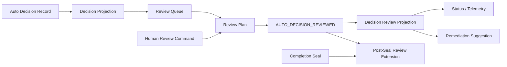

# Domain Entities — autonomy-review-observability

## 上流入力とmodel境界

本modelは`units-generation/unit-of-work.md`、`units-generation/unit-of-work-story-map.md`、`requirements-analysis/requirements.md`、`application-design/components.md`、`application-design/component-methods.md`、`application-design/services.md`のU4契約を具体化する。U3 `AutoDecisionRecord`とcanonical Intent auditを正本とし、別review store、PR、runner、harness固有projectionを正本にしない。

## Aggregate map

テキスト代替: U3 decisionをIntent内read modelへ投影し、eligible unreviewed decisionだけをqueueにする。real human review commandがreview eventを計画し、active auditまたはcompleted post-seal extensionへappendする。review projectionからstatus、telemetry、非実行remediation提案を作る。

## Entity catalog

| Entity / Value Object | Kind | Identity | Owner | Persistence |
|---|---|---|---|---|
| `DecisionProjection` | Read Model | Intent UUID + decision ID | M05 / M07 | canonical audit projection |
| `DecisionQuery` | Value Object | query fingerprint | M05 | transient / cursor |
| `DecisionCursor` | Value Object | query + immutable read snapshot + last occurrence | M05 | client token |
| `DecisionDetail` | Value Object | Intent + decision | M05 | derived |
| `DecisionReviewCommand` | Command | command occurrence | M06 | human turn reference |
| `HumanReviewAuthorizationReceipt` | Value Object | source turn + command binding | M06 / M07 | source audit reference |
| `AutoDecisionSubjectPayloadV1` | Value Object | decision + provenance / actor registry | M04 / M05 / M06 | `AUTO_DECIDED.subject_v1` |
| `AutoDecisionCommitAuthorization` | Value Object | mode revisionまたはgrant exercise | M04 / M05 / M06 | transient validation input |
| `AutoDecisionPrincipalAuthorizationReceipt` | Value Object | decision + canonical principal provenance | M04 | audit-revalidated receipt |
| `CanonicalAutonomyProvenanceSnapshot` | Value Object | Intent UUID + audit revision | M04 / M07 | atomic audit / revision read |
| `CanonicalAutonomyProvenanceReader` | Domain Port | Intent UUID | M04、M07 adapter | canonical audit + lock / projection revision snapshot |
| `DecisionActorRegistryReader` | Domain Port | registry entry ID | M05、M07 adapter | canonical Event Registry read |
| `DecisionReviewPlan` | Value Object | review ID | M06 / M07 | audit plan |
| `DecisionReviewProjection` | Entity | Intent + decision | M05 / M07 | canonical audit projection |
| `PostSealReviewExtension` | Entity | extension ID | M07 | completed audit extension |
| `RemediationSuggestion` | Value Object | review ID + kind | M06 | derived / event safe metadata |
| `ReviewStatusProjection` | Read Model | Intent UUID + audit revision | M07 | derived status |
| `ReviewHarnessContractFixture` | Value Object | fixture ID | M09 | contract test input |

## DecisionProjection

| Attribute | Invariant |
|---|---|
| `intentUuid / decisionId` | decision IDはtarget partition内で解決 |
| `interactionIdentity` | question / gate + occurrence + graph revision |
| `question` | redacted text / safe digest |
| `options` | canonical ID + safe label + selected flag |
| `principal / actor` | safe nullable reference + redaction status |
| `decisionSource / safeBasisDigest` | upstream decider enum + nullable redacted basis digest |
| `grantId` | full decisionだけnon-null |
| `evidence` | safe identity / digest / redaction status |
| `degradedCapability` | recommendation degradation、通常null |
| `reviewState` | `not-applicable / unreviewed / accepted / flagged` |
| `review` | terminal review ref、未確認はnull |

`not-applicable`はmode-semi、grant-gate、confirmed-policy、norm、historyに限定する。`unreviewed`はsolo-election / agent-recommendationだけである。accepted / flaggedから別stateへ遷移しない。

## DecisionQueryとDecisionCursor

`DecisionQuery`はexplicit Intent UUID、`active / completed / either` lifecycle、optional review state、page sizeを持つ。`queryFingerprint`はcanonical filterから決定する。

query fingerprintはIntent UUID、lifecycle、review state、page sizeだけを`amadeus.decision-query.v1`でencodeし、page位置を含めない。`DecisionCursor`はその不変query fingerprint、同一read snapshotから得たtarget audit revision、nullable review extension head、canonical decision / review event-set digest、last occurrence、last decision ID、`amadeus.decision-cursor.v1` digestを持つ。別Intent / filterでの再利用、unknown field、改ざんを拒否する。

public `listAutoDecisions`は`DecisionPage(items, nextCursor, queryFingerprint)`を返す。page sizeはbounded positive integerであり、cursorがない最初のpageとcursor付き継続pageを同じquery fingerprintとsnapshot 3値へ束縛する。継続時にauthoritative snapshotが変わっていれば`CONFLICT(cursorSnapshot)`で拒否し、最初のpageから再取得させる。

## DecisionDetail

detailはlist projectionに加え、canonical option set、selected option、evidence references、degraded capability reason、graph revision、audit event identity、review receiptを返す。raw provider prompt / tool payload / credentialは型に持たず、redacted textまたはsafe digestだけを持つ。

public `getAutoDecision`はprotected `AutoDecisionRecord`そのものではなく`DecisionDetail`を返す。queue判定は上流`AutoDecisionRecord.decider`のclosed enumとreview stateを使い、display labelやfree-form `basis`から推測しない。`confirmed-policy / norm-history`はnot-applicable、`solo-election / agent-recommendation`だけがunreviewedになり得る。

## HumanReviewAuthorizationReceipt

| Attribute | Invariant |
|---|---|
| `sourceIntentUuid` | review時にactiveなIntent |
| `sourceHumanTurnEventId / sourceAuditRevision` | source canonical auditのreal turn commit receiptと一致 |
| `principalId` | source turn principal |
| `reviewActorId` | principalIdとexactly同一 |
| `commandOccurrenceId / commandBindingDigest` | target Intent / decision / choice / flag classification / safe note digestを含むhuman command |
| `targetIntentUuid / decisionId / choice` | review commandとexact match |

active targetではsource=targetである。completed targetではsourceは現在のactive Intentであり、targetのcompletion sealへ`HUMAN_TURN`を追記しない。receiptはsource auditから再検証可能なstable referenceで、permission token / bearer credentialではない。

authorization inputはcommand binding、source human-turn ID / event IDだけを持つ。real `HUMAN_TURN`のreserved `review_command_v1` fieldはsource / target / decision / choice / occurrence / flag classification / safe note digest / turn / binding digestのclosed v1 payloadを持つ。M07-owned canonical readerがsource Intentのactive projection、audit、commit receiptsをstoreから直接取得し、event payload、principal、commit receipt内event identity、source audit revisionをexact matchする。caller提供のaudit / receipt / lifecycleを受けず、`appendDecisionReview`時にもcanonical sourceを再検証する。

## DecisionReviewCommandとPlan

| Attribute | Invariant |
|---|---|
| `intentUuid` | explicit target、逆引き禁止 |
| `decisionId` | target audit内に存在 |
| `choice` | `accept / flag` |
| `humanAuthorization.commandOccurrenceId` | human turnと同じreview command |
| `humanAuthorization` | validated `HumanReviewAuthorizationReceipt` |
| `humanAuthorization.flagClassification` | `contract-defect / specification-change / unspecified / null`、human turnへ束縛 |
| `humanAuthorization.safeNoteDigest` | optional、human turnへ束縛、raw note非保存 |

review ID、review event IDはそれぞれ`amadeus.decision-review.v1`、`amadeus.decision-review-event.v1`の型tag・長さ接頭辞付きcanonical tupleから作る。planはtarget lifecycle、expected revision / completion seal、closed `AutoDecisionReviewedPayloadV1`、remediation suggestionを持つ。caller提供の`isEligible` booleanを受けず、M05 / M07 projectionから内部検証する。

## DecisionReviewProjection

| Attribute | Invariant |
|---|---|
| `decisionId / reviewId` | owning Intent内でunique |
| `choice / state` | accept→accepted、flag→flagged |
| `principalId / reviewActorId` | 同じreal human principal、別field |
| `sourceIntentUuid / sourceHumanTurnEventId` | canonical human provenance reference |
| `reviewEventId / transactionId` | append receiptと一致 |
| `lifecycleAtReview` | active / completed |
| `reviewedAtAuditPosition` | display用、identityには不使用 |
| `remediation` | acceptはnull、flagはproposal |

同じreview ID / event identityのreplayは同じprojectionを返す。別choiceのeventを同じdecisionへ適用すると`ContractError(code=CONFLICT,locus=reviewState)`でfail-closedする。

review actorはreal human principalと同一である。M04-owned `AutoDecisionPrincipalAuthorizer`はM07 adapter実装の`CanonicalAutonomyProvenanceReader` portからcanonical multi-shard audit、authoritative lock revision、state projection revisionを同一snapshotで読み、semiではmode event、fullではgrant issuance / exerciseからprincipal provenanceを解決したclosed receiptを発行・再検証する。event件数やshard sequenceをrevisionへ代用しない。M06 / callerはprincipal refやprovenance eventを入力できない。receiptはsnapshotのaudit / projection revisionとcanonical digestを持ち、M06がaudit revisionを`AuditTransaction.expectedRevision`へそのまま設定する。M07 append lock内CASと一致しなければtransaction全体を拒否する。

新規decision producerの唯一の入口`AutoDecisionCommitPlanner.plan`はdecision / M04 receipt / `AutoDecisionSubjectInput`を同時に受ける。M05はM04 public verifierでreceiptをcanonical auditへ再検証し、M05-owned `DecisionActorRegistryReader` portでM06 execution actorのcanonical rowを読む。callerはregistry entry IDだけを渡し、principal / actor ref / kindを注入できない。plannerは完全な`AuditEventPlan`を返し、決定的event identityと同じeventの必須`subject_v1` fieldにreceipt digest / source revisionを含める。subject無しoverloadはなく、入力欠落・kind / decision不一致は`PROVENANCE_REQUIRED`でplanを返さない。field導入前のeventだけは各ref=null / status=withheldとする。free-form basis、grant ID、未登録harness identityから主体を推測しない。

## PostSealReviewExtension

| Attribute | Invariant |
|---|---|
| `intentUuid` | completed target |
| `completionSealDigest` | original seal exact match |
| `previousExtensionId` | nullまたはcurrent head |
| `reviewEventId` | exactly `AUTO_DECISION_REVIEWED` |
| `reviewPayloadDigest / auditTransactionId` | event payload / receiptとexact match |
| `extensionId` | payload digestを含む`amadeus.review-extension.v1` canonical tuple digest |
| `extensionRevision` | dense、review extension内だけ |

extensionはschemaVersion、target Intent、completion seal、nullable previous head、review event ID、review payload digest、audit transaction ID、dense revision、extension IDのclosed schemaであり、completion seal / lifecycle / artifact digestの一部を置換しない。canonical readはsealed historyを検証後、payload bytesを再hashし、event / transaction / extension tupleを再計算して別chainとして検証・合成する。unknown field / event、payload改変、gap、fork、seal mismatchを拒否する。

## RemediationSuggestion

closed unionは次のとおりである。

- `self-fix-proposal`: existing contract / requirement defect。実行commandなし。
- `self-feature-proposal`: specification addition / change。実行commandなし。
- `self-fix-with-feature-alternative`: classification unspecified。両方の選択条件を表示し、実行しない。

全variantはsource review ID、target Intent、decision ID、reason code、安全な説明を持つ。new Intent ID、scope grant、automatic commandを持たない。

## ReviewStatusProjection

| Attribute | Invariant |
|---|---|
| `intentUuid / lifecycle` | explicit target |
| `autonomyMode` | none / semi / full |
| `workflowExecutionState` | active=running/suspended、completed=null |
| `grant` | legal U3 projection、completed=null |
| `decisionPolicyCount` | non-negative |
| `decision / unreviewed / accepted / flagged counts` | reducerで導出 |
| `suspendedReason / stopReason / resumeCondition` | U3 resultと一致 |
| `legacyDiagnostic` | optional、authorizationには不使用 |

human / machineは同じprojectionから生成する。formattingやlocaleをcanonical identityへ含めない。

projector inputはlifecycle、U3 `AutonomyProjection`、workflow result、current grant scope、decision policy count、decision / review counts、review extension head、legacy diagnosticを必須にする。current grant scopeはM07がgrant issuance eventから再生した`SafeGrantScopeSummary`であり、`AutonomyProjection.currentGrant.scopeFingerprint`とexact matchしなければ`ILLEGAL_STATE`とする。none / semi / completedでは両方null、fullでは両方non-nullを要求する。出力はdecision total / unreviewed / accepted / flagged、policy count、suspended / stop reasonを欠落させない。

## ReviewHarnessContractFixture

fixtureはfixture ID、contract revision、exact 5 harness tuple、canonical-value-v1 golden vectors、source / target canonical audit、authorization / list / detail / review / statusのsuccess / exact `ContractError` cases、session / process / compaction / clone reload checkpointsを持つ。reload observationはsource / target revision、extension head、queue、terminal review receiptsを返す。active / completed、cross-Intent reject、missing / synthetic human reject、terminal conflict、永続化を同じCore oracleで検証する。adapterはharness IDとentrypoint / reload呼出しだけを担当し、expected値やreducerをharness別に持たない。

## Audit event projection

| Event fact | Projection effect |
|---|---|
| `AUTO_DECIDED` | decision historyとeligible queueを生成 |
| `AUTO_DECISION_REVIEWED(accept)` | unreviewed→accepted、queue count減算 |
| `AUTO_DECISION_REVIEWED(flag)` | unreviewed→flagged、queue count減算、proposal表示 |
| completion seal | completed lifecycleとoriginal sealを固定 |
| post-seal review extension | reviewだけをvalidated chainへ追加 |

`AUTO_DECISION_REVIEWED.payload_v1`はaudit transaction IDとreceipt projection revisionを持つ。replay reducerはcanonical event identityとpayloadから`DecisionReviewReceipt`全fieldを再構築し、session / process / compaction / clone後もsame-choiceへ同じreceiptを返す。transaction情報をprocess-local cacheへ依存させない。

M05 reducerはdecision / review stateを所有し、M07はcanonical read / append / seal validation / status assemblyを所有する。M06はcommand / UX orchestrationを所有し、state reducerやseal例外を実装しない。

## Event Registry / OTel projection

registry entryはevent name、Intent / decision / review / transaction IDs、choice、review principal / actor、decision principal / actor / source / safe basis digest、source Intent / human turn reference、nullable grant、lifecycle-at-review、remediation kindを持つ。OTel attributesは`amadeus.intent.id`、`amadeus.decision.id`、`amadeus.review.id`、choice / lifecycle / decision source enum、optional basis digest、pseudonymous review/decision subject references、optional grant ID / note digest、redaction status、audit transaction / trace / span IDに限定する。redaction失敗時はcorrelation ID / enumと`withheld`だけを残す。

## Verification invariants

- explicit targetなしにlist / detail / reviewを構築できない。
- cross-Intent decision IDが別Intentの存在やdetailを漏らさない。
- not-applicable decisionがqueue / review対象にならない。
- synthetic human、duplicate conflicting review、unknown eventがstateを変えない。
- completed target reviewがactive source Intentのreal human turn receiptを検証し、target sealへHUMAN_TURNを追加しない。
- completed review後もcompletion seal、artifact digest、workflow / grant terminal stateが同一である。
- same review replayが同じreceipt / projection / extension headを返す。
- flagがrollback、Intent reopen、new Intent creationを生成しない。
- 5 harnessが同じfixtureからbyte-equivalentなmachine status / review receiptを返す。
