# Domain Entities — five-harness-intent-completion

## 上流入力と境界

本モデルは`units-generation/unit-of-work.md`、`units-generation/unit-of-work-story-map.md`、`requirements-analysis/requirements.md`、`application-design/components.md`、`application-design/component-methods.md`、`application-design/services.md`を正本とする。M08がauthorization / registry / receipt / completion evidence、M09がraw live observation、M06がterminal orchestration、M04がgrant / workflow transition、M07がcanonical append / projectionを所有する。

```mermaid
flowchart LR
    R["Validated Harness Registry"] --> C["Required Completion Cohort"]
    C --> A["Committed Live Authorization"]
    A --> L["Raw Intent Live Receipt"]
    L --> V["Validated Intent Live Receipt"]
    V --> E["Intent Completion Evidence"]
    E --> T["Terminal Commit Plan"]
    T --> X["Terminal Commit Receipt"]
    X --> D["Completed Intent + Review Extension"]
```



<!-- Text fallback: validated registryから現行cohortを解決し、committed authorization付きlive receiptを検証する。全cohort receiptからcompletion evidenceを作り、atomic terminal transactionのreceipt確認後だけIntentをcompletedへ投影する。 -->

## Entity catalog

| Entity / Value Object | Kind | Identity | Owner | Persistence |
|---|---|---|---|---|
| `RequiredCompletionCohort` | Value Object | cohort digest | M08 | registry-derived |
| `LiveScenarioRevision` | Value Object | implementation + package + registry + scenario | M08 / M09 | receipt |
| `CommittedIntentLiveExecutionAuthorization` | Entity | authorization ID | M08 / M07 | full-revision protected event + commit receipt |
| `RawIntentLiveReceipt` | Value Object | receipt ID | M09 | validation input |
| `CanonicalLiveAuthorizationSnapshot` | Read Model | Intent + authorization + audit revision | M07 | canonical snapshot |
| `ValidatedIntentLiveReceipt` | Value Object | validation digest | M08 | completion evidence input |
| `CommittedValidatedIntentLiveReceipt` | Entity | validation event ID | M08 / M07 | protected validation event + commit receipt |
| `IntentCompletionEvidence` | Entity | evidence ID | M08 | canonical audit |
| `CompletionEvidenceValidatedEventPlan` | Value Object | evidence event ID | M08 / M07 | terminal transaction first event |
| `IntentCompletionCheck` | Value Object | Intent + cohort + revision | M08 | transient / event plan |
| `TerminalCommitPlan` | Value Object | transaction ID | M06 | append command |
| `TerminalCommitReceipt` | Entity | evidence + transaction | M06 / M07 | canonical completion projection |

## RequiredCompletionCohort

| Attribute | Invariant |
|---|---|
| `schemaVersion / cohortId` | closed v1 / `intent-autonomy-live` |
| `harnessIds` | registry-derived、sorted、unique、non-empty |
| `registryDigest` | validated 7-row registryと一致 |
| `cohortDigest` | schema / ID / registry / membersへ束縛 |

GA instanceのmemberはClaude Code、Codex、Cursor、OpenCode、Kimi Codeの5件である。harness ID型はregistry生成`HarnessDescriptor["id"]`を参照し、型とalgorithmはregistry member配列を処理するため、future harness名をCore分岐や手書きunionへ追加しない。Kiro / Kiro IDEはregistry rowを持つがcapability falseのため非memberである。

## LiveScenarioRevision

`implementationRevision`、`packageDigest`、`registryDigest`、`scenarioDigest`をすべて持つ。いずれか一つでも異なるreceiptを同じcompletionへ混在させない。Git branch名、worktree path、timestampはrevision identityに含めない。

## CommittedIntentLiveExecutionAuthorization

authorizationはIntent、harness、cohort、implementation / package / registry / scenario revision、environment、issuer principal、trace / span、attestation digest、authorization payload digest、event identity、commit receiptを持つ。U1 portのbase revisionをU5 serviceがvalidated registry / cohort / scenarioへ拡張し、closed `LIVE_SMOKE_AUTHORIZED.payload_v1`へ保存する。commit receiptがevent identityを含まなければuncommittedであり、M09 inputへ昇格しない。

credential / token / raw environment valueはentity attributeに存在しない。`environmentId`と`attestationDigest`はsafe stable referenceである。

## RawIntentLiveReceipt

| Attribute | Invariant |
|---|---|
| `receiptId` | authorization / revision / observation digestから決定 |
| `harnessId` | cohort member |
| `authorization*` | committed authorizationとexact match |
| `revision` | requested live scenarioとexact match |
| `environment / trace / span / attestation` | authorizationとexact match |
| `outcome` | passed / skipped / failed |
| `observation` | passed時だけnon-null |

`LiveObservation`はJudge invocation IDとelection decision IDを持つ。loud degradation時はsafe reasonを必須、elected時はreason=nullとする。raw receiptはM09の観測結果であり、それだけではcompletion evidenceにならない。

## CanonicalLiveAuthorizationSnapshot

M07 adapterが同一snapshotでcanonical audit、authoritative audit revision、state projection revision、committed authorizationを返す。caller提供audit、event count、最大shard sequenceからrevisionを作らない。M08 validatorはこのsnapshotだけをcanonical sourceとして使用する。

## ValidatedIntentLiveReceipt

raw receiptの全fieldに加え`outcome=passed`、non-null observation、observation proof digest、validation digestを持つ。validation digestはfull-revision authorization event、commit transaction、canonical Judge / decision observations、source audit revisionへ束縛する。

同じraw receiptとcanonical snapshotは同じvalidation event planを返す。authorizationやauditが変化した場合は再検証し、古いvalidation digestをbearer tokenとして信用しない。

## CommittedValidatedIntentLiveReceipt

M08 validatorはclosed `LIVE_SMOKE_RECEIPT_VALIDATED.payload_v1` eventを計画し、M07 commit receiptがそのevent identityを含む場合だけcommitted validationへ昇格する。payloadはharness / receipt / authorization、完全revision、validation / observation proof digest、Judge invocation、election decision / outcome、authorization source revisionを持つ。

completion evaluatorはvalidation object配列を信用せず、validation event IDsからM07 adapterの同一snapshot readでcommitted validation集合を再構築する。

## IntentCompletionEvidence

| Attribute | Invariant |
|---|---|
| `intentUuid` | 全receiptと同じtarget |
| `cohort / revision` | 全receiptとexact match |
| `receiptIds / authorizationIds` | cohort順、件数=member数、unique |
| `validationEventIdentities / validationDigests` | committed validationとexact match |
| `observationProofDigests` | Judge / election proofを全member分束縛 |
| `sourceAuditRevisions` | 各validation snapshotのauthoritative revision |
| `evidenceId / evidenceDigest` | 全closed fieldへcanonical binding |

evidenceは全memberが揃った場合だけ存在する。1〜4件、skip、duplicate、別revisionを補完・推測しない。

## CompletionEvidenceValidatedEventPlan

event typeはexactly `LIVE_COMPLETION_EVIDENCE_VALIDATED`、fieldsはexactly one `payload_v1`である。payloadはevidence / Intent / cohort、完全revision、cohort順のharness / receipt / authorization / validation event / validation digest / observation proof / source revision、evidence digest、evaluator snapshot revisionをclosed field順で持つ。

payload digestはschema-separated canonical value digest、event identityはIntent / evidence / cohort / source revision / payload digestのcanonical tupleである。M07はterminal lock内でvalidation eventsからpayload、evidence digest、event identityを再計算し、unknown / missing field、配列長・順序不一致、stale revisionを拒否する。

## TerminalCommitPlan

planはM07 `AuditTransaction`、順序付きevent、completion evidence、expected event identitiesを持つ。full modeだけgrant-completed eventを含む。workflow-null eventと`WORKFLOW_COMPLETED`は全modeで必須である。

expected audit / state projection revisionはcompletion evaluatorがcommitted validation eventsを読んだauthoritative snapshotから得て、caller入力を受けない。transaction IDはIntent、completion evidence ID / digest、cohort digest、順序付きevent identities、expected audit revision、source state projection revisionの`amadeus.intent-terminal-transaction.v1` tupleから決定する。expected post-commit state projection revisionはsource + 1であり、event件数へ依存しない。M07 lock内でtransaction IDとCASを再検証し、失敗すればplan全体をcommitしない。

## TerminalCommitReceipt

commit receiptが再計算したtransaction IDと全expected event identitiesを含み、projection revisionがplanのexpected post-commit revisionに一致した場合だけ作る。resultは`outcome=completed`に限定する。同一transaction replayは同じreceiptを返しrevisionを再度進めない。

terminal receiptから次を再構築できる。

- completion evidence / cohort / revision
- grant completedまたはgrant null
- workflow execution state=null
- completion seal / result identity
- committed event集合

completed後のU4 review extensionは別hash chainであり、このreceiptを変更しない。

## Lifecycle

```text
registry-validated
  -> authorization-planned
  -> authorization-committed
  -> live-observed
  -> receipt-validated
  -> cohort-incomplete | cohort-complete
  -> terminal-planned
  -> terminal-committed
  -> completed
```

各矢印はtyped resultまたはcanonical audit eventである。skip / failure / mismatchは前のvalid stateを変更しない。runtime scratch消失後もaudit replayで同じstateへ戻る。

## Harness・persistence boundary

5harness adapterはauthorization port、native invocation、observation extractionだけを実装する。cohort resolver、validator、completion evidence、terminal state machineは共有M08 / M06実装である。Harness ID unionはregistry authoring sourceからpackage生成時に再生成し、手書きCore unionを増やさない。

session / process / compaction / clone reload fixtureは、authorization、validated receipt、completion evidence、terminal receipt、U4 review extension headのcanonical-value digestを比較する。live一時workspaceは再生正本ではない。

## 要件追跡

| Entity group | Requirement / AC |
|---|---|
| cohort / revision | FR-HAR-001、005〜007、2067-AC22、26 |
| authorization / raw receipt | FR-HAR-003、2067-AC23〜24 |
| validated receipt / evidence | FR-HAR-002〜004、2067-AC22〜25 |
| terminal plan / receipt | FR-GRT-009、FR-STP-007、NFR-DET-002、NFR-REL-003 |
| privacy / review extension | NFR-PRV-001〜002、FR-OBS-004 |

## 非目標

- PR / merge entity、runner / supervisor lifecycle、credential entity。
- Kiro / Kiro IDE live receipt、harness固有completion state machine。
