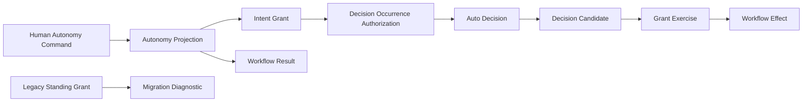
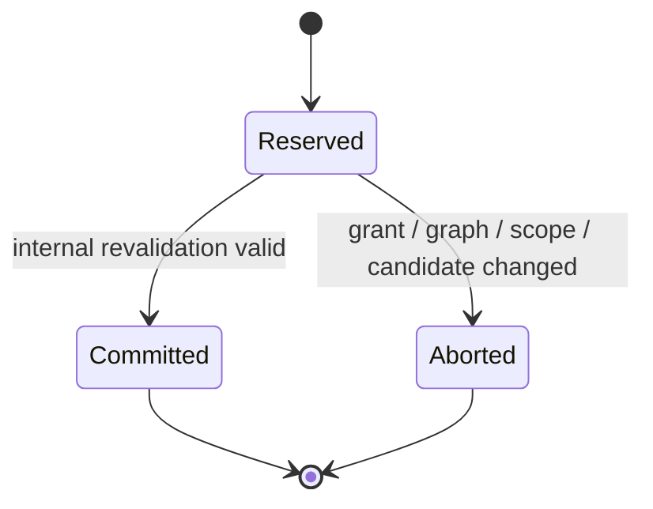

# Domain Entities — intent-autonomy-runtime

## 上流入力とmodel境界

本modelは`units-generation/unit-of-work.md`、`units-generation/unit-of-work-story-map.md`、`requirements-analysis/requirements.md`、`application-design/components.md`、`application-design/component-methods.md`、`application-design/services.md`のU3契約を具体化する。正本はIntent auditであり、per-clone state、PR、runner、harness固有state storeを認可根拠にしない。

## Aggregate map

テキスト代替: real human commandがautonomy projectionとIntent grantを原子的に変更する。full grantがquestion occurrenceを認可し、auto decisionがselected optionを決め、candidate reservation / revalidation後にgrant exerciseとworkflow effectをcommitする。legacy standing grantはdiagnosticにだけ投影する。

## Entity catalog

| Entity / Value Object | Kind | Identity | Owner | Persistence |
|---|---|---|---|---|
| `AutonomyProjection` | Aggregate Root | Intent UUID | M04 | canonical audit projection |
| `ModeProvenance` | Closed Union | provenance kind + source identity | M04 | mode event / deterministic replay |
| `GrantScopeDescriptor` | Value Object | scope fingerprint | M04 | grant event |
| `DecisionPolicy` | Entity | policy ID | M04 / M05 | grant event |
| `IntentGrant` | Entity | grant ID | M04 | canonical audit |
| `InteractionOccurrence` | Value Object | occurrence ID | M06 | gate / question event |
| `DecisionAuthorization` | Closed Union | occurrence + authorization basis | M04 / M06 | transient / reservation |
| `AutoDecisionRecord` | Entity | decision ID | M05 | canonical audit |
| `DecisionCandidate` | Entity | candidate ID | M04 | exercise reservation |
| `GrantExercise` | Entity | exercise ID | M04 | canonical audit projection |
| `WorkflowResult` | Value Object | invocation result identity | M00 / M06 | output / audit reference |
| `InvocationFailureRecord` | Value Object | transaction ID + invocation ID | M06 / M07 | canonical audit |
| `ResumeCondition` | Value Object | reason + stable condition identity | M06 | park / unpark event |
| `LegacyStandingGrantRecord` | Historical Entity | legacy grant ID | M04 | existing audit only |
| `MigrationDiagnostic` | Value Object | legacy record + diagnostic digest | M04 / M07 | derived status |

## AutonomyProjection aggregate

### Attributes

| Attribute | Type | Invariant |
|---|---|---|
| `intentUuid` | StableId | owning Intent |
| `mode` | `none / semi / full` | unknownはnone fail-closed |
| `modeProvenance` | `ModeProvenance` | human commandまたはfail-closed初期化の出所 |
| `workflowExecutionState` | `running / suspended / null` | completedだけnull |
| `currentGrant` | `IntentGrant \| null` | none/semi=null、full=active |
| `terminalGrantHistory` | grant refs | revoked / completedだけ |
| `legacyStandingGrantIds` | StableId[] | diagnostic専用 |
| `projectionRevision` | non-negative integer | reservation / transition concurrency |

### Legal state

- none / semi + null grant + running / suspended
- full + active grant + running / suspended
- completed Intent + workflow null + current grant null

それ以外はparse / transition / replayのすべてで`ILLEGAL_STATE`とする。revoked / completed grantはcurrentへ戻さない。`human-command` provenanceだけが`semi / full`を構築でき、`system-default / legacy-fail-closed` provenanceは`none`だけを構築できる。

## ModeProvenanceとHumanAutonomyCommand

`ModeProvenance`は次のclosed unionである。

- `human-command`: principal ID、human turn ID、target Intent UUID、command occurrence ID、before / after mode、confirmed display digestを持つ。
- `system-default`: target Intent UUID、`DEFAULT_MODE_V1` source identity、after=`none`を持つ。principal / human turn / command occurrenceを持たない。
- `legacy-fail-closed`: target Intent UUID、sorted legacy event identitiesのdigest、after=`none`を持つ。principal / human turn / command occurrenceを持たない。

初回replayはmode eventがなければ`system-default`を決定的に導出する。legacy mode / standing grantだけが存在する場合は`legacy-fail-closed`を決定的に導出する。どちらもmode遷移、authorization、synthetic `HUMAN_TURN`ではなく、`none`を説明するread-model provenanceである。

`HumanAutonomyCommand`は次のclosed unionである。

- `set-mode(none | semi)`
- `issue-full(scope, normalizedPolicies, confirmedDigest)`
- `replace-full(scope, normalizedPolicies, confirmedDigest)`
- `revoke-full(target=none | semi)`

human引数は別連携で後付けせず、commandと同じtransition validationで`VerifiedHumanTurn`を要求する。

## GrantScopeDescriptor

| Attribute | Invariant |
|---|---|
| `intentUuid` | exact owning Intent |
| `scopeId / scopeFingerprint` | active self-* scopeと一致 |
| `normFingerprint` | issuance時のapplicable norm set |
| `allowedInteractionKinds` | stage gate / phase gate / Walking Skeleton / questionの明示集合 |
| `permissionBoundaryFingerprint` | host / tool policyを参照するが拡張しない |
| `prohibitedEffects` | new permission / irreversible / scope-out / waiver |

scope descriptorはPR / merge / GitHub stateを持たない。

## DecisionPolicy

| Attribute | Invariant |
|---|---|
| `policyId` | grant + selector + normalized rule digestから決定 |
| `sourceTextDigest` | userの自然言語sourceの改ざん検出用 |
| `selector` | stable question / stage / option selector |
| `normalizedOptionRule` | option IDへ一意に写像できる場合だけapplicable |
| `scopeFingerprint` | owning grant scopeと一致 |
| `confirmedByHumanTurnId` | issuanceのVerifiedHumanTurn |

non-applicable / ambiguous / stale policyはgrant exerciseせず次のdecision sourceへfall throughする。

## IntentGrant

| Attribute | Invariant |
|---|---|
| `grantId` | Intent + occurrence + human turn + scope + policy digestから決定 |
| `state` | `active / revoked / completed` |
| `principalId / humanTurnId` | real issuance provenance |
| `scope` | immutable `GrantScopeDescriptor` |
| `policies` | confirmed ordered policy set |
| `policySetDigest` | canonical selector / rule / scope collection |
| `issuanceDigest` | displayed scope / policies / principalと一致 |

TTL、remaining uses、secret、credentialをattributeに持たない。

## InteractionOccurrenceとDecisionAuthorization

`InteractionOccurrence`はIntent、`gate | question`、stage / phase / Bolt、Walking Skeleton flag、question / gate ID、option IDs / fingerprint、graph revision、effect descriptorsを持つ。各`DecisionOptionEffect`はCore-owned registryで解決できるeffect ID、payload schema / fingerprint、`workflow-reversible / new-permission / irreversible / scope-out / norm-waiver / quality-waiver`分類、required scope fingerprint、applicable norm fingerprintを持つ。

`DecisionAuthorization`は次のclosed unionである。

- `semi-mode-gate`: phase-internal stage gate、mode provenance、projection revision、approve effect。grant IDなし。
- `full-grant`: active grant ID、scope fingerprint、occurrence、option set、projection revision。
- `human-required`: reason、interaction、resume condition。auto effectなし。

semi-mode variantはphase boundary / question / Walking Skeletonを構築できない。full variantはgrant scope外のoccurrenceを構築できない。

## AutoDecisionRecord

| Attribute | Invariant |
|---|---|
| `decisionId` | Intent + question / gate + occurrence + graph revision |
| `question / options / selectedOptionId` | canonical occurrenceと一致 |
| `decider` | `deterministic-engine / solo-election / agent-recommendation` |
| `basisKind` | `mode-semi / grant-gate / confirmed-policy / norm / history / solo-election / agent-recommendation` |
| `basisFingerprint` | source evidenceのcanonical digest |
| `principalId` | mode / grantを認可した人間 |
| `actorId` | effectを実行するharness / engine actor |
| `grantId` | fullだけnon-null |
| `degradedCapability` | election不可時のreason、通常null |
| `reviewState` | mode-semi/grant-gate/policy/norm/history=`not-applicable`、election/recommendation=`unreviewed` |

confirmed policy / norm / historyのdeciderは`deterministic-engine`であり、basisKindで出所を表す。`mode-semi / grant-gate`はgate承認専用で、question review queueへ投影しない。

## DecisionCandidateとGrantExercise

`DecisionCandidate`はIntent、grant、question / occurrence、selected option、graph revision、scope、effect ID / payload fingerprint / classification / registry revision、current applicable norm fingerprintを持つ。`candidateId`はこのcanonical tupleから決定する。Coreの`EffectAuthorizationValidator`はregistry解決、payload schema、required scope、禁止分類、current applicable normを検証し、adapterやpolicyに判定を委ねない。

`GrantExercise`は次のstateを取る。

テキスト代替: full candidate全体を予約し、current projectionへ内部再検証する。validだけがexercise / decision / effectをcommitし、invalidはabortする。

reservationはcandidate全体、candidate digest、grant ID、projection revision、graph revision、effect registry revision、current applicable norm fingerprintを保存する。boolean `authorized`をattributeに持たない。

## WorkflowResultとResumeCondition

### Legal result table

| Outcome | Reason | Workflow | Retryable | Condition |
|---|---|---|---:|---|
| completed | null | null | false | null |
| parked | AWAITING_HUMAN | suspended | true | pending human / capability |
| parked | REPAIR_STALLED | suspended | true | pending any-of evidence / human |
| parked | NORM_CONFLICT | suspended | true | pending norm change |
| parked | USER_PARKED | suspended | true | pending human unpark |
| failed | null | running | false | null |

parked resultのgrantはprojectionと同じであり、fullはactive、none/semiはnull。`retryable=true`はcondition status=satisfied後だけrunnerが再開できることを表す。

`ResumeCondition`はreasonに応じたstable identity、`pending | satisfied`、nullable evidence fingerprint、必要なhuman / verifier / capability provenanceを持つ。reasonとcondition kindの不一致は`ILLEGAL_STATE`である。

`failed`の`WorkflowResult`は`failureRef`を必須とする。参照先`InvocationFailureRecord`はtransaction ID、invocation ID、canonical failure class、sanitized evidence fingerprint、before projection digest、after projection digest、`retryable=false`を持ち、before / after digestは同一でなければならない。同じinvocation / evidenceのreplayは同じfailure receiptを返す。

## LegacyStandingGrantRecordとMigrationDiagnostic

legacy recordはexisting event identity、legacy grant ID、source scope、observed stateをread-onlyで持つ。`MigrationDiagnostic`は`legacy-non-authoritative`、reason、target Intent、recommended human actionを返す。legacy recordから`ModeProvenance`、`IntentGrant`、synthetic human turnを作らない。

## Audit event projection

| Event fact | Projection effect |
|---|---|
| human mode set | mode / provenanceを原子更新 |
| grant issued / replaced / revoked | current / terminal historyを更新 |
| mode-based auto decision | semi gate decisionを記録 |
| `INTENT_GRANT_EXERCISE_RESERVED` | full candidateを復元可能に保存 |
| `INTENT_GRANT_EXERCISED` / `INTENT_GRANT_EXERCISE_ABORTED` | committed / abortedへ終端化 |
| `AUTO_DECIDED` | question / selected / decider / basis / grant / evidenceを記録 |
| workflow parked / unparked | workflow state / reason / conditionを更新 |
| `INVOCATION_FAILED` | failure evidenceと不変before / after projection digestを同一transaction identityへ記録 |
| legacy event observed | diagnostic read modelだけ更新 |

M07だけがcanonical eventをappendし、M04 / M05 / M06はimmutable projectionと`AuditEventPlan[]`を返す。

## Relationship and ownership rules

- M04はmode / grant / exercise authorizationを所有し、option選択を行わない。
- M05はdecision chain / decision recordを所有し、grant validityやevent appendを行わない。
- M06はinteraction、M04、M05、existing effect、M07の順序付けを所有する。
- M06はterminal failure時にstate-changing planを破棄し、`INVOCATION_FAILED`だけの`AuditEventPlan`とfailed resultを同じtransaction IDで生成する。
- M02 / M03はmode / grantをimportせず、Monitor / quality planだけを返す。
- M07はaudit / projection / statusを所有し、認可や裁定を行わない。
- harness adapterはcapability / native invocationを提供し、M04 / M05をforkしない。

## Data retention and privacy

- grant / decisionはIntent audit retentionを継承し、per-clone scratch単独で認可しない。
- natural-language policyは必要なnormalized ruleとsource digestを保存し、secret / credentialを含めない。
- statusはprincipal / decider / actor / basisをsafe stable ID / labelで表示し、raw provider promptを表示しない。
- completed decision review用のread modelはU4が別途定義する。

## Verification invariants

- unknown mode、full+null grant、none/semi+active grantはprojectionを生成できない。
- human commandのないmode / grant遷移が不可能である。
- event未指定 / legacy-only replayがsynthetic humanなしに`none`と決定的provenanceを生成する。
- grant replacementがold / newの中間状態を露出しない。
- semi gateはgrant exerciseを作らず、full auto effectはgrant exerciseなしにcommitしない。
- replay / resumeが同じcandidate / decision / effect identityとprojection digestを返す。
- forbidden effect、registry drift、scope / norm driftがeffectをcommitせず、terminal failureが不変projectionと同じfailure receiptを返す。
- park / Request Changes / quality failureがactive grantを終了させない。
- legacy eventがnew authorizationへ変換されない。
- 5 harnessが同じfixtureからbyte-equivalentなresult / audit planを返す。
