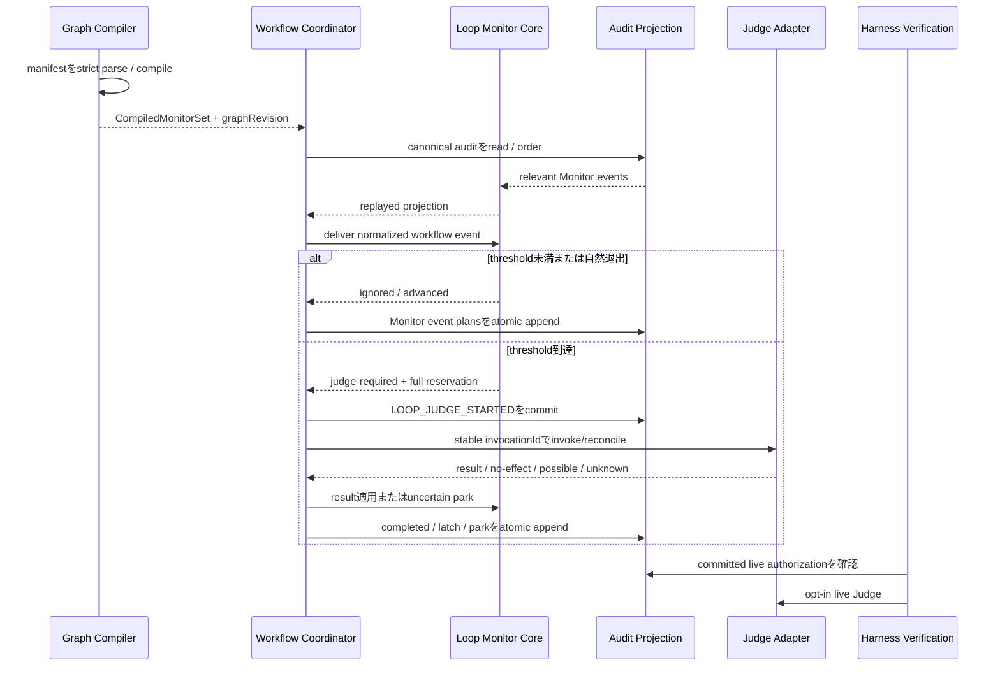

# Business Logic Model — loop-monitor-runtime

## 上流入力と設計範囲

本設計は`units-generation/unit-of-work.md`、`units-generation/unit-of-work-story-map.md`、`requirements-analysis/requirements.md`、`application-design/components.md`、`application-design/component-methods.md`、`application-design/services.md`を正本とする。対象はU1 `loop-monitor-runtime`と#2095のFR-LMC-001〜012、2095-AC01〜14である。

実装範囲はM01のcompile、M02のpure Monitor reducer、M06のproduction orchestration、M07のaudit / replay / status、M08のgeneric live authorization、M09のcontract / opt-in live verificationである。Quality obligation、autonomy grant、PR、外部runner / supervisor、常駐processは扱わない。

## End-to-end処理モデル

テキスト代替: manifestを決定論的にcompileし、auditからMonitor projectionを再生する。workflow eventごとにpure reducerを進め、threshold到達時だけJudgeを予約する。予約を永続化してからstable IDで外部Adapterを呼び、結果または不確定effectをcanonical eventへ反映する。live smokeは認可eventのcommit後にだけ実行する。

## 1. Manifest compile

### 入力正規化

1. workflow-level manifestと信頼検証・source正規化済みPlugin contributionを読み取る。
2. `monitorId`、`cycleEventIds`、`ignoreEventIds`、`threshold`、`routes`をstrict parseする。unknown fieldを黙って捨てない。
3. event / route IDを表示文ではなくcanonical stable IDとして解決する。
4. monitorごとにcycle、ignore、routeの重複を検査し、全monitor IDの一意性を検査する。
5. cycle eventとrouteがcompiled workflow graphで解決でき、route dispositionが`continue | latch`のどちらかであることを確認する。
6. canonical control viewから`graphRevision`を計算し、各`CompiledMonitor`へ束縛する。
7. 1件でも不正なら部分的なMonitor setやstale runtime graphを返さず、typed `ContractError`でfail-closedする。

### Compile不変条件

- cycleは空でなく、同一eventを重複して持たない。
- `threshold`は有限の正整数である。
- `ignoreEventIds ∩ cycleEventIds = ∅`である。
- routesは非空で、route IDはmonitor内で一意である。
- graph revisionは順序・改行・表示文ではなくcanonical contentから計算する。

### U1で確定するpublic contract refinement

`component-methods.md`の概念契約を、U1では次の実装可能なinput / outputへ具体化する。Code Generationは上流の最小signatureをそのまま実装せず、本節の追加fieldをowner moduleの型へ反映する。

| Contract | U1で追加する必須内容 | Owner |
|---|---|---|
| `CompiledMonitor` | `transitionTable`、正の有限数`runtimeLimits.maxPendingDeliveries`。どちらもcanonical graph revisionに含む | M01 |
| `MonitorDelivery` | `event: MonitorEvent`、parsed `EvidenceSnapshot`、`JudgeRouteConstraint | null`、`deliveryId`、nullable `predecessorDeliveryId`、`JudgeTraceContext` | M06が構築、M02が消費 |
| `advanceMonitor` | positional引数ではなく`MonitorDelivery`を受け、transition / evidence / traceを外部lookupせずpureに判定する | M02 |
| `JudgePort.dispatch` | committed reservation permitと完全なrequestを受け、`JudgeDispatchOutcome`を返す | S01 adapter |
| `JudgePort.reconcile` | invocation IDとtrace contextを受け、closed `JudgeReconciliation`を返す | S01 adapter |
| `MonitorDeliveryCommit` | content-addressed identityとcausal predecessorを、full immutable payloadとともにccanonical auditとMonitor replay indexへ同一transactionでcommitする | M07 |
| `MonitorReplayIndex` | per-cloneのMonitor関連event partitionとcontent-addressed identity lookupを持つ耐久二次index | M07 |
| `PendingMonitorDeliveries` | predecessor未到着のfull payloadをboundedに保持する | M02 projection |

`transitionTable`はM01が`GraphStageSource.transitions`とcycle definitionを同じcompile transactionで解決して生成する。各state / event pairは必ず1分類を持ち、missing entryは`invalid`である。`runtimeLimits.maxPendingDeliveries`はCore共通のcompile policyから決め、harness adapterで差し替えない。M02はworkflow graphをimportせず、これらのcompiled valueだけで自然退出と不正transitionを区別する。

## 2. Canonical event delivery

M06は全audit eventをM02へ渡さない。runtime graphで解決済みのworkflow control eventだけを`MonitorEvent`へ正規化し、次を束縛する。

- `intentUuid`
- `monitorId`
- `stageInstanceId`またはBolt identity
- `graphRevision`
- upstream deliveryのstable `deliveryId`
- canonical `eventId`
- `monitor scope + upstreamEventIdentity + payloadFingerprint`から決まるcontent-addressed `deliveryId`
- 同じMonitor scopeの直前にcommit済みのdeliveryを指すnullable `predecessorDeliveryId`
- 正規化済み`EvidenceSnapshot`とそのfingerprint
- reservation時に固定する`JudgeTraceContext`

同じ`deliveryId`の再送はprojectionを変えず、元のcommit receiptまたはno-opを返す。同じidentityでpayloadが異なる場合は`CONFLICT`とする。別Intent、別graph revision、別stage instanceのeventは同じepochへ混入させない。audit noise、tool call、ファイル更新、status表示はMonitorEventへ正規化しないため、cycle historyをresetもadvanceもしない。

`EvidenceSnapshot`は`providerId`、Intent / Monitor / stage / graph revision、canonical summary digest、redaction / schema versionを持つparsed valueである。M06はactive normalized contributionが宣言したproviderからsnapshotを得て、scope一致を検証してからM02へ渡す。M02がevidence providerを呼ぶことはない。

## 3. Cycle照合アルゴリズム

### Projection表現

`matchedPrefix`は`0..cycle.length`を取る。`cycle.length`は「cycle末尾まで一致したが、同じcycleへの再進入はまだ観測していない」状態を表すsentinelである。これにより末尾一致だけではJudgeを発火せず、自然退出を観測できる。

### Event適用

1. latchが存在し、入力evidence fingerprintが同じなら新しいevent処理やJudge呼出しを行わず、既存の機械可読parked resultを返す。
2. `deliveryId`がM07のidentity indexで既commitと判定された再送はno-opとする。M02はcurrent `chainHeadDeliveryId`へ続くdeliveryだけをreduceする。
3. predecessorが未到着ならfull immutable payloadを`PendingMonitorDeliveries`へ保留し、到着後にcausal orderで適用する。同じpredecessorに異なる2つのdeliveryが続く場合は順序を捏造せず`CONFLICT`でparkする。
4. ignore eventなら`matchedPrefix`、`thresholdCount`、epochを変更せずchain headだけを進める。
5. `matchedPrefix < cycle.length`で期待する次eventと一致すればprefixを1進める。末尾へ到達してもまだthresholdを加算しない。
6. 末尾一致後、次eventがcycle先頭なら同一cycleへの再進入が確定する。`thresholdCount`を1増やし、prefixを1へ戻す。
7. 末尾一致後、compiled graph上の合法な自然退出eventへ進んだ場合はepochを閉じ、prefix / thresholdを0にした新epochを開始する。新epochは直前epochの`chainHeadDeliveryId`を引き継ぎ、Judgeは発火しない。
8. 照合途中のeventがcycle先頭でもある場合はprefixを1へ戻す。それ以外の合法なworkflow transitionは現在epochを閉じて新epochを開始する。
9. unknown event、graph revision mismatch、不正なtransitionは成功扱いせずtyped errorとする。

### Threshold判定

同一cycleへの再進入で増加した`thresholdCount`が`threshold`未満なら`advanced`を返す。到達時は非nullの`JudgeRouteConstraint`を要求し、constraintのroutesがmanifest routesの非空subsetであることを確認してからJudgeを予約する。pending Judgeがある間は新しい予約を作らない。

この設計により、T-1、T、自然退出、overlap、ignore、audit noiseの境界が決定論的になる。

## 4. Judge reservationとcanonical exactly-once

### Identity

`judgeInvocationId`は次のcanonical tupleから決定する。

`intentUuid + monitorId + epochId + triggerDeliveryId + graphRevision + evidenceFingerprint + constraintFingerprint`

時刻、audit行番号、自然言語instruction本文、再試行回数をidentityへ含めない。同じtupleは必ず同じIDとrequestを生成する。

### Reservation-first flow

1. M02はallowed routes、instruction ID、evidence fingerprintを含む完全な`JudgeRequest`と`JudgeReservation`を返す。
2. M06は`LOOP_JUDGE_STARTED`をM07 transactionでcommitし、commit receiptを得るまでJudge adapterを呼ばない。
3. 同一invocationにcanonical `LOOP_JUDGE_COMPLETED`があれば保存済みresultを再利用する。
4. 初回dispatchではstable invocation IDをprovider idempotency keyとして渡す。
5. provider resultを得たら、result receiptをcanonical result-observed eventとして保存してからroute適用する。
6. M02はresult invocation IDとpending reservationの一致、selected routeの閉集合所属、basis fingerprintの形式を検査する。
7. `continue` routeは`LOOP_JUDGE_COMPLETED`とrouted projection、`latch` routeはさらに`LOOP_LATCH_SET`を返す。M06が必要なworkflow park eventと同一transactionへ集約する。

### Crash後の外部effect reconciliation

Amadeusが保証するexactly-onceはcanonical invocation、canonical result、canonical Eventへの適用である。provider側の物理的exactly-onceは主張しない。

pending reservationがありcompletionがないresumeでは、adapterへ同じinvocation IDのeffect照会を行う。

| Reconciliation | 動作 |
|---|---|
| `completed(result)` | 返されたresult receiptを検証・保存し、同じreservationへ一度だけ適用する |
| `no-effect-confirmed` | 同じinvocation IDで1回だけ再dispatchできる |
| `effect-possible` | 再dispatchせず`AWAITING_HUMAN`へparkする |
| `unknown` | 再dispatchせず`AWAITING_HUMAN`へparkする |

`effect-possible / unknown`を自動retryへ変換しない。adapterが`judgeReplay=invoke-once`を広告するには、少なくとも`completed`と`no-effect-confirmed`を真に判別できなければならない。判別不能なadapterはloud degradationとして`unknown`を返す。

### Callable Judge port

| Operation | Input | Closed output |
|---|---|---|
| `dispatch` | `CommittedJudgeDispatchPermit`、`JudgeRequest`、`JudgeTraceContext` | `completed(JudgeResultReceipt) / accepted(ProviderOperationRef) / rejected(ContractError)` |
| `reconcile` | `invocationId`、nullable `ProviderOperationRef`、`JudgeTraceContext` | `completed(JudgeResultReceipt) / no-effect-confirmed(ObservationReceipt) / effect-possible(ObservationReceipt) / unknown(Diagnostic)` |

`CommittedJudgeDispatchPermit`は`LOOP_JUDGE_STARTED`のcommit receiptがreservation event identityを含む場合だけM06が生成するproof valueである。`accepted`後にprocessが落ちた場合、resumeは必ず`reconcile`を先に呼ぶ。`no-effect-confirmed`にはprovider observation ID、observedAt、attestation digestが必要で、単なるtimeoutや404をno-effectへ変換しない。

### 通常Judgeのtrace契約

`JudgeTraceContext`は`traceId`、`spanId`、nullable parent span、invocation ID、intent UUIDを持つ。M06は既存workflow traceをparentとしてreservation時に1回だけ生成し、request、dispatch permit、provider receipt、`LOOP_JUDGE_STARTED / RESULT_OBSERVED / COMPLETED / LATCH_SET`のすべてへ同じtrace / spanを束縛する。resume時に新しいtrace / spanを生成しない。provider receiptのtrace / span不一致は`CONFLICT`であり、resultを適用しない。

## 5. Latchとresume

Judgeが`disposition=latch`を選ぶと、M02はmonitor / epoch / evidence fingerprint / invocation / selected route / resume conditionを束縛した`MonitorLatch`を生成する。

- 同じfingerprintでの通常起動はJudge、LLM、修復処理を呼ばず、同じreasonとresume conditionを返す。
- `evidence-change`はold / new fingerprintが異なる場合だけ成立する。
- `human-retry`はreal `VerifiedHumanTurn`とcondition identityの一致を要求する。
- condition成立後、M02の`LOOP_LATCH_CLEARED` planとM06の`WORKFLOW_UNPARKED` planをM07の単一transactionでcommitする。
- append失敗時はlatchもworkflow stateも変わらない。

## 6. Audit replayとclone収束

1. M07の`readMonitorReplaySlice`が対象Intent / Monitor scopeの全per-clone `MonitorReplayIndex` partitionから、newest valid checkpoint以降のMonitor delivery / Judge / latch eventだけを読む。
2. 同一event identity / payloadを畳み込み、`predecessorDeliveryId`によるcausal graphを構築する。cloneの物理読込順、wall clock、shard行番号は使わない。
3. genesisまたはcheckpointの`chainHeadDeliveryId`から1本の連鎖として到達できるdeliveryだけを順にreduceする。missing predecessorは`INCOMPLETE`、同じpredecessorの異なるsuccessorは`CONFLICT`であり、Judgeを発火せずparkする。
4. compile済みmonitorとgraph revisionへ一致するeventだけをreducerへ渡す。不整合は黙って落とさずdiagnosticにする。
5. epoch、prefix、threshold、chain head、pending deliveries、pending Judge、observed result、trace context、latchを再構築する。
6. scratch checkpointは性能最適化にだけ使い、削除後は耐久`MonitorReplayIndex`から同じprojectionを再構築する。

event deliveryの通常経路は対象Monitor数とbounded projectionに比例し、cold replayはMonitor関連event数にだけ線形となる。audit noise数はnormal resumeのread setに入らない。

### Causal delivery commitと完全なdedupe

M06はworkflow control eventをM02へ渡す前に、M07の`appendMonitorDelivery(transaction, deliveryPlan)`を呼ぶ。dedupe keyは`monitor scope + upstreamEventIdentity`、`deliveryId`はそのkeyと`payloadFingerprint`から決まり、planは現在観測済みの`chainHeadDeliveryId`をpredecessorに持つ。M07はfull immutable `MonitorDelivery`とdedupe-key lookup entryをcanonical audit eventと同一transaction ID / WALでper-clone `MonitorReplayIndex` partitionへ書く。audit eventとindex entryの両方が揃うまでcommitはvisibleにならず、crash中間transactionはresume時に再適用または破棄される。indexは二次構造であり、canonical audit以外のbusiness truthを作らない。

- 同じdedupe key / payload fingerprintの再送は既存commit receiptを返す。同じdedupe keyの異payload fingerprintは`CONFLICT`でM02へ渡さない。
- per-clone partitionを統合するときはidentity重複だけを畳み込む。同じpredecessorに異なるsuccessorがcommitされた場合、clone順で直列化せずfork `CONFLICT`とし、reducer / Judgeはどちらも適用しない。
- predecessorが未到着のdeliveryはfull payloadごと`PendingMonitorDeliveries`へ保留する。上限は`CompiledMonitor.runtimeLimits.maxPendingDeliveries`であり、超過時は追加reduceを止めて`INCOMPLETE`でparkする。耐久indexのpayloadは捨てない。
- predecessor到着後はchain headから到達可能なdeliveryをcausal orderで再適用する。同じinput setはcloneや到着順にかかわらず同じprojectionまたは同じtyped conflictになる。
- causal chainはIntent / Monitor / stage instance / graph revisionのscopeに属し、epochには所属しない。自然退出でepochが変わっても`chainHeadDeliveryId`を引き継ぐ。

M07のcontent-addressed identity indexがcross-session / cross-cloneの完全なdedupe truthを持つ。M02のbounded projectionは`chainHeadDeliveryId`、bounded pending payload、T+1 historyだけを持ち、古い重複はM07でrejectされるためdelivery総数に比例したID setを保持しない。

`readMonitorReplaySlice({ intentUuid, monitorId, stageInstanceId, graphRevision, afterCheckpointId })`は各shardのMonitor partitionだけを読み、full delivery payload、Judge / latch fact、newest valid checkpointを返す。index欠落・破損時は通常workflowを`INCOMPLETE`でparkし、明示的なrepair / doctorがcanonical audit全体を一度走査してindexを再生成する。このmaintenance scanはnormal cold resumeには含めない。

## 7. Plugin contribution SPI

U1のnormalized internal contributionは次の閉じたschemaを持つ。

| Descriptor | Identity / fields | Validation owner |
|---|---|---|
| `MonitorContribution` | plugin ID、content digest、Monitor manifests | M01 |
| `EvidenceProviderDescriptor` | provider ID、schema version、output schema digest、redaction policy ID | M01 parse、M06 runtime scope check |
| `JudgeInstructionDescriptor` | instruction ID、content digest、evidence schema digest | M01 |
| `RouteRuleDescriptor` | rule ID、monitor ID、route ID、instruction ID、disposition | M01 |

plugin content digestとdescriptor全体をcanonical contribution digestへ含める。duplicate ID、dangling provider / instruction / route reference、schema mismatch、unknown dispositionはcompile全体をfail-closedする。M02はproviderやinstruction本文をimportせず、compiled stable ID / digestだけを受ける。初期first-party adapterがこの内部schemaを生成し、#2065の外部manifest形式はscope外である。

各`MonitorManifest`は`evidenceProviderId`と`judgeInstructionId`を必須fieldとして持つ。M01はそれぞれを同じnormalized contributionの`EvidenceProviderDescriptor` / `JudgeInstructionDescriptor`へexact lookupし、解決済みdescriptorを`CompiledMonitor`へ埋め込む。1 Monitorにつきproviderはexactly oneであり、複数候補からM06が選ぶことはない。route ruleもmonitor / instruction / routeのtupleへ束縛し、別Monitorのproviderやinstructionを流用しない。

## 8. Generic live authorizationと5harness検証

U1は後続U2〜U5が再利用する`LiveAuthorizationPort`をproduction配線まで閉じる。

1. native descriptorが`liveAuthorization=credential-attested`であることをpreflightする。
2. portはcredential自体でなく、issuer、environment、revision、trace、attestationのsafe metadataだけを返す。
3. M08はmetadataとregistry / Intent / revisionを検証し、`LIVE_SMOKE_AUTHORIZED` planを生成する。
4. M07 commit receiptがauthorization event identityを含む場合だけ`CommittedLiveExecutionAuthorization`へ昇格する。
5. M09はcommitted authorizationなしにJudge liveを開始しない。
6. raw receiptはauthorization / environment / trace / attestation / revisionへexact matchし、`passed + judgeObserved`の場合だけU1の暫定live successとする。

U1のhard gateは5harness共通contractである。liveは利用可能な環境で暫定実測し、Intent terminal evidenceとしてはU5が最終revisionで再収集する。

## 9. Package / promote drift contract

M09は次の`DistributionDriftReceipt`を生成する。

| Field | Meaning |
|---|---|
| `implementationRevision` | 検証対象source revision |
| `packageDigest` | canonical package output digest |
| `registryDigest` | harness descriptor registry digest |
| `projectionDigest` | 7 package face、6 host directory、5 self-install faceのcanonical projection digest |
| `checks` | graph compile、package check、promote-self checkのcommand ID / exit code / output digest |
| `passed` | 全check成功かつtracked generated projectionに差分なしの場合だけtrue |

source of truthは`packages/framework/core/`とsingle harness registryである。検証commandは`bun .codex/tools/amadeus-graph.ts compile`のcheck相当、`bun scripts/package.ts --check`、`bun run promote:self:check`とし、generated `dist/`やroot suffixを手編集しない。AC14はrevision-bound receiptの`passed=true`でだけ合格とする。

## 10. Verification scenarios

| Scenario | Oracle |
|---|---|
| invalid manifest | partial graphなし、typed compile error |
| T-1→T | T-1でJudgeなし、同一cycle再進入T回目で1 reservation |
| natural exit | tail一致後にcycle外へ遷移してJudge 0回 |
| ignore / audit noise | prefix / thresholdを変更しない |
| duplicate delivery | projection不変、Judge追加なし |
| old duplicate outside T+1 | M07 identity indexでno-op、M02のID set増加なし |
| same delivery from two clones | identity / payload重複を1件へ畳み込み、Judge追加なし |
| two successors for one predecessor | clone順で直列化せず`CONFLICT`、reducer / Judge適用なし |
| successor before predecessor | full payloadをbounded保留し、predecessor到着後にcausal orderで適用 |
| missing predecessor / pending overflow | payloadを捨てず`INCOMPLETE`でpark |
| natural exit across epoch | 新epochが同じcausal chain headを引き継ぐ |
| cold resume with audit noise | MonitorReplayIndexの関連rowだけを読み、noise数でread set / Judge countが増えない |
| crash after reservation | 同じrequest / invocation IDをreplay |
| provider completed reconciliation | resultを再利用、外部再dispatchなし |
| provider no-effect | 同じIDで再dispatch可能 |
| provider possible / unknown | 再dispatchなし、parked result |
| trace mismatch | result適用拒否、canonical traceを維持 |
| undeclared route | result適用拒否、projection不変 |
| same latch fingerprint | Judge / LLM 0回、同じparked result |
| evidence change / human retry | latch clearとunparkがatomic |
| cross-session / clone | canonical projectionとJudge countが一致 |
| 5harness contract | 同一fixture / expected resultが全対象で一致 |
| opt-in live | committed authorizationありの場合だけJudge observed receipt |
| Plugin contribution | dangling / duplicate provider・instruction・routeをcompile拒否 |
| package / promote drift | revision-bound 3 checksとprojection digestが一致 |

## Historical Reviewer Finding — Cycle 1 / Iteration 1

- **Verdict:** NOT-READY
- **Reviewer:** amadeus-architecture-reviewer-agent
- **Date:** 2026-08-03T12:02:39Z
- **Iteration:** 1
- **Scope decision:** none

Judgeのcrash/replay、Monitorの自然退出判定、evidence binding、重複抑止に上流Application Designと両立しない契約欠落があり、#2095の主要AC/NFRを推測なしでは実装できない。

### Findings

- BLOCKER | cycle外イベントが合法な自然退出か不正遷移かを解決済みworkflow transition factsで判定する一方、上流CompiledMonitorとadvanceMonitorにその入力がなく、FR-LMC-003 / 2095-AC03を実装できない。
- BLOCKER | current evidence fingerprintをlatch短絡、Judge identity、reservation、resumeへ必須とする一方、MonitorEvent / JudgeRouteConstraint / advanceMonitorに入力経路がなく、FR-LMC-008〜010 / 2095-AC06〜08を実装できない。
- BLOCKER | provider effect reconciliationのclosed unionを規定する一方、JudgePortはinvokeOnceしかなく、callable reconciliation APIがないためFR-LMC-008 / NFR-DET-002 / 2095-AC06を満たせない。
- BLOCKER | ProcessedDeliveriesのbounded window外重複をaudit走査で検出するとNFR-PERF-001に違反し、走査しなければ古いdeliveryを二重適用するため、完全でboundedなdedupe契約がない。
- BLOCKER | 通常JudgeのtraceId / spanIdの生成元、属性、検証不変条件がなく、FR-LMC-009のcanonical replay契約を満たせない。
- BLOCKER | 2095-AC09のevidence provider / Judge instruction / route rule正規化SPIとAC14のpackage / promote drift guardについてschema、identity、owner、failure、verification receiptがなく合否判定できない。

## Historical Reviewer Finding — Cycle 1 / Iteration 2

- **Verdict:** NOT-READY
- **Reviewer:** amadeus-architecture-reviewer-agent
- **Date:** 2026-08-03T12:08:51Z
- **Iteration:** 2
- **Scope decision:** none

transition table、callable reconciliation、通常Judge trace、drift receiptは閉じた。一方、bounded dedupeとevidence provider bindingに再現可能な欠陥が残り、2095-AC04/09およびNFRを満たせない。

### Findings

- BLOCKER | DeliveryCursorSetがcanonical audit shardのsequenceを連続番号として扱う一方、M06はworkflow control eventだけをM02へ渡すため、audit noiseのsequenceが欠番となりgapが永続する。Monitor対象だけのdense sequenceまたはirrelevant sequenceの安全なtombstone契約がなく、FR-LMC-004 / 2095-AC04 / NFR-PERF-001〜002に違反する。
- BLOCKER | EvidenceSnapshotをMonitorDeliveryへ追加したが、MonitorManifestやnormalized contributionにMonitorからevidence providerへの必須で一意な参照がなく、複数provider時にM06がproviderを決定できない。FR-LMC-011 / NFR-DET-001 / 2095-AC09を実装できない。

## Review — Iteration 1

- **Verdict:** NOT-READY
- **Reviewer:** amadeus-architecture-reviewer-agent
- **Date:** 2026-08-03T12:17:51Z
- **Iteration:** 1
- **Scope decision:** none

transition、evidence binding、callable reconciliation、通常Judge trace、Plugin SPI、drift receiptは整合し、provider bindingも閉じた。一方、M07 dense sequenceはclone並行予約、out-of-order適用、epoch境界、cold replay性能を同時に満たせない。

### Findings

- BLOCKER | cloneごとのaudit shardへ独立appendする構成でdense monitorSequenceを直列化するcross-clone coordinatorまたは決定論的merge規則がなく、異なるeventが同じN+1をcommitし恒久CONFLICTになる。
- BLOCKER | highWatermarkより先のeventをgapsへ追加する規則にpayload保留とcanonical順の再適用契約がなく、即時reduceでも保留でもprojectionを一意に再構築できない。
- BLOCKER | reservation sequence scopeはIntent / Monitor / stage instance / graph revisionだがDeliveryCursorSetはMonitor / epoch単位で、自然退出後のhigh watermark引継ぎ / 初期化規則がない。
- BLOCKER | incremental identity index欠落時のread契約が全CanonicalAuditEventだけで、Monitor専用の永続index / partition queryがなく、cold resumeがaudit noiseにも比例してNFR-PERF-002を満たせない。
