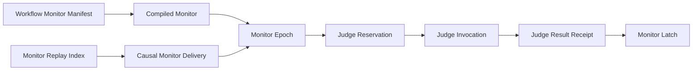
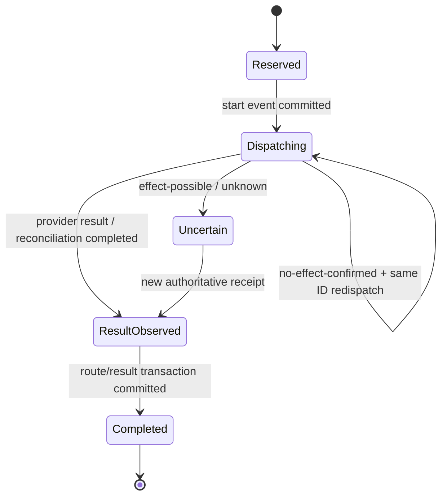

# Domain Entities — loop-monitor-runtime

## 上流入力とmodel境界

本modelは`units-generation/unit-of-work.md`、`units-generation/unit-of-work-story-map.md`、`requirements-analysis/requirements.md`、`application-design/components.md`、`application-design/component-methods.md`、`application-design/services.md`のU1契約を具体化する。永続正本は既存Intent auditであり、新database、新service、新harness固有state storeは作らない。

## Aggregate map

テキスト代替: manifestからcompiled monitorが生成され、Monitor replay indexからcausal delivery chainを復元してmonitor epochへ適用する。thresholdでJudge reservation / invocation / resultが生成され、latch routeならMonitor Latchになる。

## Entity catalog

| Entity / Value Object | Kind | Identity | Owner | Persistence |
|---|---|---|---|---|
| `MonitorManifest` | Value Object | canonical content digest | M01 schema | source manifest / contribution |
| `CompiledMonitor` | Value Object | `monitorId + graphRevision` | M01 | runtime graph、再生成可能 |
| `MonitorEpoch` | Aggregate Root | `epochId` | M02 | canonical audit projection |
| `CausalMonitorDelivery` | Entity | monitor scope + upstream identity + payload fingerprint | M07 | canonical audit + replay index |
| `MonitorReplayIndex` | Durable Secondary Index | monitor scope / clone shard | M07 | transaction-bound per-clone partition |
| `PendingMonitorDeliveries` | First-Class Collection | monitor scope | M02 | bounded audit projection |
| `MonitorCheckpoint` | Value Object | monitor scope + projection digest | M07 | canonical fact + optional scratch cache |
| `JudgeReservation` | Entity | `invocationId` | M02 | `LOOP_JUDGE_STARTED` |
| `JudgeInvocation` | Entity | `invocationId` | M06 / S01 seam | audit projection + provider receipt |
| `JudgeEffectReconciliation` | Value Object | invocation + observation digest | S01 adapter contract | audit diagnostic / result plan |
| `JudgeResultReceipt` | Entity | `invocationId + resultDigest` | M06 / M07 | canonical audit |
| `JudgeTraceContext` | Value Object | `traceId + spanId` | M06 | reservation / result audit |
| `MonitorLatch` | Entity | monitor + epoch + fingerprint | M02 | canonical audit projection |
| `ResumeCondition` | Value Object | `kind + identity + fingerprint` | M00/M02 | latch / workflow event |
| `DistributionDriftReceipt` | Entity | revision + projection digest | M09 | verification artifact |

## MonitorManifest

### Attributes

| Attribute | Type | Invariant |
|---|---|---|
| `monitorId` | StableId | workflow内で一意、表示文非依存 |
| `cycleEventIds` | non-empty ordered collection | known、一意 |
| `ignoreEventIds` | ordered set | known、cycleとdisjoint |
| `threshold` | positive integer | finite、1以上 |
| `routes` | non-empty ordered collection | route ID一意、disposition必須 |
| `evidenceProviderId` | StableId | 同一contributionのdescriptorをexactly one参照 |
| `judgeInstructionId` | StableId | 同一contributionのinstructionを参照 |

Manifestはauthoring DTOではなくstrict parserを通ったdomain valueである。外部Plugin形式は直接保持せず、正規化済み内部modelだけを受ける。

## CompiledMonitor

`CompiledMonitor`はvalid manifestへcanonical `graphRevision`、解決済み`TransitionDispositionTable`、Core共通compile policyの正の有限数`runtimeLimits.maxPendingDeliveries`を付与したimmutable valueである。tableは各prefix / event pairを`expected / reentry / natural-exit / ignore / invalid`へ全域分類する。tableとruntime limitはgraph revisionへ含め、harness adapterから差し替えない。自然退出判定は自由な文字列比較やM02からのgraph lookupではなく、このcompiled tableだけを使う。

同じ`monitorId`でもgraph revisionが異なれば別定義であり、既存epochを自動移行しない。新revisionでの通常起動は明示的な新epochを作り、旧eventはaudit historyとして保持する。

## MonitorEpoch aggregate

### Attributes

| Attribute | Type | Meaning |
|---|---|---|
| `epochId` | StableId | Intent / monitor / stage instance / graph revision / epoch startから決定 |
| `monitorId` | StableId | owning compiled monitor |
| `intentUuid` | StableId | cross-Intent混入防止 |
| `stageInstanceId` | StableId | stage / Bolt instance境界 |
| `graphRevision` | Sha256Digest | definition binding |
| `matchedPrefix` | integer `0..cycle.length` | `cycle.length`はtail一致・reentry待ちsentinel |
| `thresholdCount` | non-negative integer | 同一cycleへの確定reentry回数 |
| `chainHeadDeliveryId` | nullable StableId | Monitor scopeのcausal chain head、epoch跨ぎで引継ぎ |
| `pendingDeliveries` | `PendingMonitorDeliveries` | predecessor未到着のfull payload、bounded |
| `pendingJudge` | nullable `JudgeReservation` | 1 epochにつき同時に最大1件 |
| `observedResult` | nullable `JudgeResultReceipt` | pending invocationと一致 |
| `latch` | nullable `MonitorLatch` | active stop state |

### Commands

- `observe(event)` — ignore / advance / tail / reentry / natural-exitを決定する。
- `reserveJudge(constraint, evidence)` — threshold到達かつpendingなしの場合だけ予約する。
- `observeJudgeResult(receipt)` — invocation / route / fingerprintを照合する。
- `applyJudgeResult()` — continueまたはlatch dispositionを適用する。
- `clearLatch(condition)` — satisfied conditionへ一致する場合だけ解除planを返す。

外部callerはattributesを取得して独自判断せず、aggregate commandが`ContractResult<MonitorEffect>`を返す。

## CausalMonitorDelivery

| Attribute | Invariant |
|---|---|
| `monitorScope` | Intent / Monitor / stage instance / graph revisionへ束縛 |
| `upstreamEventIdentity` | canonical workflow event identity |
| `payloadFingerprint` | event / evidence / constraint / traceのfull immutable payloadと一致 |
| `dedupeKey` | scope + upstream identityから決定 |
| `deliveryId` | dedupe key + payload fingerprintから決定 |
| `predecessorDeliveryId` | scope genesisだけnull、それ以外は直前観測済みchain head |
| `commitReceipt` | canonical eventとMonitor replay index entryの同一transaction commitを証明 |

同一dedupe key / 同一payload fingerprintは既存commitを返し、同一dedupe key / 異payload fingerprintは`CONFLICT`である。M02はcommit済みdeliveryだけを受ける。causal chainはMonitor scopeに属するため、自然退出でepochを作り直してもpredecessorをresetしない。

## PendingMonitorDeliveries collection

`PendingMonitorDeliveries`はpredecessor未到着のdeliveryをIDだけでなくfull immutable payloadごと保持する。上限は`CompiledMonitor.runtimeLimits.maxPendingDeliveries`で固定する。predecessor到着時はcurrent chain headから到達できる連鎖をcausal orderで返す。同じpredecessorの異なるsuccessorは`CONFLICT`、missing predecessorや上限超過は`INCOMPLETE`であり、どちらもreducer / Judgeへ適用しない。投影の上限超過時もfull payloadは耐久indexに残る。

## MonitorReplayIndexとcheckpoint

`MonitorReplayIndex`はM07が所有するper-clone耐久二次indexである。canonical audit eventと同一transaction ID / WALでMonitor deliveryのfull payload、content-addressed identity lookup、Judge / latch fact、checkpoint pointerを書き、片方だけのcommitはvisibleにしない。各clone partitionは`readMonitorReplaySlice`でscope queryでき、normal cold resumeはaudit noiseを読まない。indexはcanonical auditから再生成可能であり、欠落・破損時はworkflowを`INCOMPLETE`にしてexplicit doctor / repairが全auditをmaintenance scanする。

`MonitorCheckpoint`はmonitor scope、`chainHeadDeliveryId`、current epoch identity、projection digest、per-clone partition cursorを持つ。scratch copyは削除可能で、耐久indexから同じprojectionを再構築できる。checkpointのepoch identityが変わってもcausal chain headは連続する。

## JudgeReservation

### Attributes

| Attribute | Invariant |
|---|---|
| `invocationId` | canonical tupleから決定、再生成可能 |
| `triggerDeliveryId` | current epochの既処理delivery |
| `monitorId / epochId` | owning aggregateと一致 |
| `evidenceFingerprint` | evidence本文でなくdigest |
| `allowedRoutes` | manifest routesの非空subset |
| `instructionId` | stable ID、自然言語本文非依存 |
| `constraintFingerprint` | allowed routesとinstructionを束縛 |
| `graphRevision` | owning compiled monitorと一致 |
| `evidenceFingerprint` | parsed EvidenceSnapshotと一致 |
| `traceId / spanId` | reservation時に固定、resumeで変更しない |

`JudgeReservation`はrequest全体を保存し、resume時に外部から不足fieldを補完しない。

## JudgeInvocation lifecycle

テキスト代替: 永続予約後にdispatchする。provider resultを観測すればroute適用へ進む。no-effectが確認された場合だけ同じIDで再dispatchし、possible / unknownはUncertainとしてparkする。authoritative receiptが得られるまで新IDを発行しない。

### Reconciliation union

| Variant | Required data | Allowed next action |
|---|---|---|
| `completed` | verified `JudgeResultReceipt` | route適用 |
| `no-effect-confirmed` | provider observation identity / basis | same ID redispatch |
| `effect-possible` | provider observation identity / basis | park only |
| `unknown` | capability / failure diagnostic | park only |

boolean `safeToRetry`は禁止する。閉じたunionをparseし、unknown variantはfail-closedする。

### Callable port ownership

S01 `JudgePort`は`dispatch(committedPermit, request, trace)`と`reconcile(invocationId, operationRef, trace)`を公開する。M06だけがportを呼び、M02はportをimportしない。dispatch permitはJudge start eventのcommit receiptを証明する。reconcileの`no-effect-confirmed`はprovider observation receiptを持つparsed variantだけを許す。

## EvidenceSnapshotとPlugin descriptor

`EvidenceSnapshot`はprovider ID、schema version、Intent / Monitor / stage / graph revision、redaction policy ID、canonical summary digestを持つimmutable valueである。raw promptや未redact evidenceを持たない。

正規化済みPlugin contributionは次を所有する。

- `EvidenceProviderDescriptor`: provider ID、output schema digest、schema version、redaction policy ID。
- `JudgeInstructionDescriptor`: instruction ID、content digest、evidence schema digest。
- `RouteRuleDescriptor`: rule ID、monitor / route / instruction ID、disposition。

M01はdangling reference、duplicate ID、schema mismatchをcompile時に拒否する。M06はprovider outputをdescriptorへparseし、scope一致を証明した`EvidenceSnapshot`だけをMonitor deliveryへ含める。

`MonitorManifest.evidenceProviderId`がprovider選択の唯一の正本である。M01はexactly oneのdescriptorへ解決して`CompiledMonitor`へ埋め込み、M06はそのresolved descriptorだけを呼ぶ。runtime priority、登録順、harness別defaultでproviderを選ばない。

## JudgeResultReceipt

`JudgeResultReceipt`は`invocationId`、selected route、basis fingerprint、provider receipt identity、observation digestを持つ。pending reservationとの一致を証明したparsed valueだけがM02へ渡る。

通常Judgeのreceiptはさらに`traceId / spanId`を持ち、reservationの`JudgeTraceContext`とexact matchしなければならない。

1 invocationに異なるresult digestが複数観測された場合は`CONFLICT`でparkし、後着を上書きしない。同一digestの再観測はno-opとする。

## MonitorLatch

### Attributes

- monitor / epoch identity
- evidence fingerprint
- Judge invocation / selected route
- generic disposition=`latch`
- typed `ResumeCondition`

M02は`repair-stalled`等のdomain意味を知らない。M06 / consuming Pluginがroute IDをworkflow reasonへ写像する。Latchはsame fingerprint short-circuitを所有し、workflow status文面やgrant状態を所有しない。

## Audit event projection

| Event fact | Projection effect |
|---|---|
| cycle observation | prefix / tail / reentry / thresholdを更新 |
| `LOOP_JUDGE_STARTED` | full reservationをpendingへ設定 |
| Judge dispatch observation | invocation lifecycleを更新 |
| Judge result observed | verified receiptをpendingへ関連付け |
| `LOOP_JUDGE_COMPLETED` | pendingを完了しselected routeを記録 |
| `LOOP_LATCH_SET` | active latchを設定 |
| `LOOP_LATCH_CLEARED` | matching latchを解除 |

正確なevent名はEvent Registryで既存taxonomyとの衝突を検証して確定する。必要なfactとidentityはこの表から減らさない。

## DistributionDriftReceipt

`DistributionDriftReceipt`はimplementation revision、package digest、registry digest、7 package face / 6 host directory / 5 self-install faceのprojection digest、graph / package / promote各checkのcommand ID・exit code・output digestを持つ。

- 全check exit code 0かつgenerated projection差分なしの場合だけ`passed=true`。
- receipt fieldはsingle registryから導出し、harness一覧を別々に手書きしない。
- generated treeの手編集や一部faceだけの成功をpassにしない。
- AC14のoracleはrevision-bound receiptであり、PRやGitHub状態を入力にしない。

## Relationship and ownership rules

- M01はmanifest / compiled valuesを所有し、runtime behaviorを所有しない。
- M02はMonitorEpoch、JudgeReservation、MonitorLatchのpure transitionを所有する。
- M06はS01 adapter invocationと各domain planの順序付けを所有するが、Monitor attributesを直接変更しない。
- M07はevent append / read / transaction receiptを所有し、Monitor判断をしない。
- harness adapterはdomain entityをforkせず、portのinput / closed output unionだけを実装する。

## Data retention and privacy

- canonical auditは既存Intent retention / access controlを継承する。
- evidence、provider response、attestationの本文を保存せず、必要なsafe metadataとdigestだけを保存する。
- scratch projectionはgitignored per-clone runtimeへ置き、削除可能にする。
- status / replayはcredential、raw prompt、未redact provider payloadを表示しない。

## Verification invariants

- malformed valueはdomain entityを生成できない。
- commandはthrowでpartial mutationせず、`ContractResult`とimmutable next projection / event plansを返す。
- audit replayとincremental reduceが同じprojection digestになる。
- 同じdelivery / transaction / invocation / result receiptの再送がstateを二重更新しない。
- provider effect uncertaintyから自動retry permissionを導出しない。
- 5harness adapterが同じfixtureからbyte-equivalentなcanonical resultを返す。
