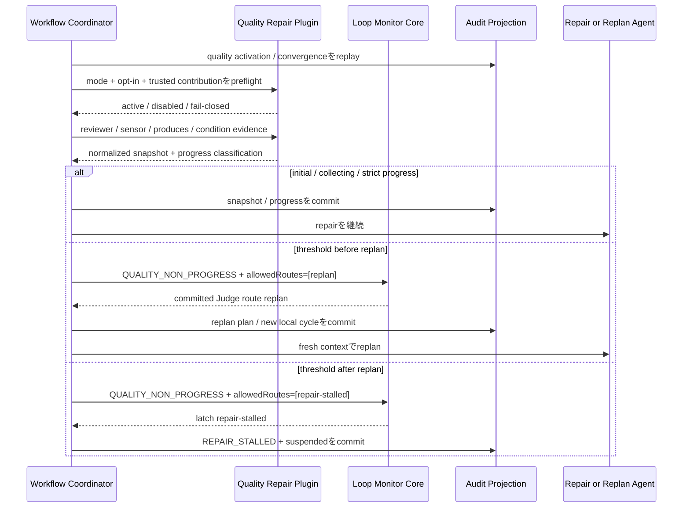

# Business Logic Model — quality-repair-runtime

## 上流入力と設計範囲

本設計は`units-generation/unit-of-work.md`、`units-generation/unit-of-work-story-map.md`、`requirements-analysis/requirements.md`、`application-design/components.md`、`application-design/component-methods.md`、`application-design/services.md`を正本とする。対象はU2 `quality-repair-runtime`と#2096のFR-QRP-001〜013、2096-AC01〜18である。

実装範囲はM03のfirst-party contribution、M01のcompile、M06のactivation / evidence / repair handoff、M07のaudit / status / replay、M08 / M09の5 harness contract / opt-in live拡張である。M02のgeneric cycle algorithmをforkせず、gate / question認可、Intent grant、PR、外部runner / supervisor、新stageは扱わない。

### U2で確定するpublic contract refinement

`component-methods.md`の概念型は方向性の契約であるが、U2の実装に必要なobservation、descriptor、epoch / resume identityが不足している。Code Generationは次のrefinementをowner moduleのpublic型へ反映し、上流のID配列だけのcall shapeをそのまま実装しない。

| Contract | U2の必須refinement | Owner |
|---|---|---|
| `QualityEvidenceInput` | nullable `previousSnapshot`とclosed `QualityObservation[]`を持つ`QualityEvidenceBatchInput`へ置換 | M03 |
| `QualityObservation` | validated reviewer、blocking-aware sensor、required output、verification / completionのterminal status・verifier receiptを表すclosed union | M03 / M06 collector |
| `QualityObligation` | `sourceCategory`と`failureKind`の二軸にし、`evidence-incomplete`をwire上表現 | M03 |
| `NormalizedContribution` | evidence provider / Judge instruction / route rule / required outputをIDでなくtyped descriptor collectionにする | M01 / S03 |
| `QualityEpochIdentity` | `qualityScopeId + epochStartEventIdentity`に統一し、genesis / resumeの発行・初期化を定義 | M03 / M07 |
| `ResumeCondition` | 単一predicateに加え、non-empty `any-of` alternativesを持つcomposite variantを追加 | M00 / M06 |

`normalizeQualityEvidence(batch)`は`previousSnapshot`を明示的に受け、snapshotとdeltaを1回で返す。上流のquality epoch式にある「最初のobligation fingerprint」はepoch start eventのpayloadに保存する根拠であり、ID本体の入力にはしない。initial `epochStartEventIdentity = H(qualityScopeId + "genesis")`とし、`QUALITY_EPOCH_STARTED`のcommitで初めてactive epochにする。これにより、初期とlatch解除後のepochを同一式で一意に生成する。

## End-to-end処理モデル

テキスト代替: stage開始前にmode別activationをfail-closedで確定する。quality-check完了ごとに構造化evidenceを正規化し、T未満またはstrict progressではrepairを継続する。初回thresholdはreplan、replan後のnon-progress thresholdはrepair-stalledだけをgeneric Monitorへ許し、再開可能にlatchする。

## 1. Plugin activationとcompile

### Activation順序

1. M07がIntent auditから`QualityPluginProjection`を再生し、`none`のopt-in / outと実在人間provenanceを復元する。
2. M06がcurrent autonomy modeとprojectionから`QualityPluginSetting`を導出する。
3. `none + opted-out`は`disabled`、`none + VerifiedHumanTurn opt-in`は`active`、`semi / full`は`mode-required active`とする。headless起動をopt-inに変換しない。
4. activeな場合はM03 first-party sourceをS03でnormalized contributionへ変換し、trust、content digest、schema、ID一意性を検証する。
5. M01がMonitor、`EvidenceProviderDescriptor`、`JudgeInstructionDescriptor`、`repair / replan / repair-stalled`の`RouteRuleDescriptor`、optional `RequiredOutputDescriptor[]`を同一graph revisionへcompileする。
6. `semi / full`でsource欠落、未信頼、parse不能、dangling referenceがあればstage workの副作用前に`ACTIVATION_FAILED`とする。stale graphへfallbackしない。

`none`のopt-inはQuality Repairだけを有効化し、gate / questionの裁定権、host permission、grantを追加しない。initial first-party contributionの`required_outputs[]`は空であり、#2096にないartifactを必須化しない。

## 2. Quality evidence正規化

### Closed input sources

quality obligationは次の4 sourceに限定する。

| Source | Blocking判定 | Stable obligation ID |
|---|---|---|
| reviewer | validated `BLOCKER` / `NOT-READY`だけ | reviewer invocation contract + finding identity |
| sensor | stage / graphでblocking指定されたfailed / incompleteだけ | sensor ID + stage + output identity |
| produces | directiveの必須output欠落・不正 | stage instance + output ID |
| verification / completion | 宣言済みcondition不成立 | condition ID + stage / Bolt instance |

advisory sensorをblockingへ暗黙昇格しない。一方、blocking sensorのnon-zero、signal、exception、missing terminal receiptをpassにしない。人間の`Request Changes`は別event familyであり、quality snapshotへ取り込まない。

### Canonical snapshot

M03はraw proseを比較せず、次の手順で`QualityEvidenceSnapshot`を作る。

1. `QualityEvidenceBatchInput`のIntent UUID、Monitor ID、stage / Bolt instance、graph revisionとnullable previous snapshotのscope一致を検証する。
2. `QualityObservation` source別parserが必須field、verifier identity、terminal status、receiptをstrict parseする。
3. reviewerはvalidated verdict / findings、sensorは`blocking` + `passed | failed | incomplete`、produceは`required` + `present | missing | invalid`、conditionは`verification | completion` + `satisfied | unsatisfied | incomplete`を観測値として受ける。
4. obligationをstable IDでsort / dedupeし、`sourceCategory`、`failureKind`、artifact identity、verifier identity、canonical failure fingerprintへ束縛する。
5. inputの`previousSnapshot`とID集合を比較し、`resolved / added / retained`を決める。previous=nullならresolved / retainedは空、addedはcurrent全件である。
6. `snapshotFingerprint = H(scope + sorted obligation IDs + per-obligation canonical fingerprint)`を生成する。
7. tag / provider identityまでparseできるobservationの必須field不足は、同じ`sourceCategory`と`failureKind=evidence-incomplete`のstable obligationへfail-closedで正規化する。batch自体のscope / provider identityもparseできない場合は`ContractError(INCOMPLETE)`とし、架空のobligationを創作しない。

timestamp、audit行数、session ID、編集回数、メッセージ文面、replan文面はprogress fingerprintに含めない。

## 3. Bounded progress判定

`QualityConvergenceProjection`は同一quality epochの直近`T + 1`個snapshot、`consecutiveNonProgress`、`replanSinceLastProgress`を持つ。Tはcompiled Monitorの正の整数である。

### Strict progress

`U(n) ⊂ U(n-1)`かつ`added = ∅`の場合だけstrict progressである。`consecutiveNonProgress=0`、`replanSinceLastProgress=false`とし、比較窓から過去snapshotは消さない。件数が同じ、1件解決+1件追加、fingerprintだけ変化はnon-progressである。

### Classification

| Kind | 条件 | Effect |
|---|---|---|
| `initial` | 比較対象がない | snapshot保存、deterministic `repair` |
| `collecting` | strict progressでなく、連続non-progress < T | count増加、deterministic `repair` |
| `strict-progress` | 真部分集かつaddedなし | count / replan flag reset、`repair` |
| `threshold` | 連続non-progress = T | pattern分類、singleton Judge constraint |

threshold patternは次の優先順で一意に分類する。regression cycleは最新fingerprintがT+1窓内の過去値と一致し、中間に別値を持つ場合。fixed pointは同snapshot fingerprintがT回連続する場合。churnはstrict progressなしでfingerprintが変化し、obligation集合が単調縮小しない場合。その他の同率・不足・判定不能は`undetermined` non-progressとする。

`replanSinceLastProgress=false`でT到達したらrequired routeは`replan`、`true`のまま再度T到達したら`repair-stalled`である。plan digestの変化やdistinct plan数をstrict progressにしない。Quality Repair全体の固定retry capは設けず、strict progressのたびにnon-progress countをresetする。

## 4. Generic Monitorへの配送

`planQualityDelivery`はsnapshot、progress、next projection、`MonitorEvent`、nullable `JudgeRouteConstraint`、audit plansを1回で返す。M06はeventとconstraintを分離・差し替えせずM02へ渡す。

- `initial / collecting`: `QUALITY_NON_PROGRESS`、constraint=null。T-1でJudgeを呼ばずrepair継続。
- `strict-progress`: compiled transition table上の自然退出`QUALITY_STRICT_PROGRESS`、constraint=null。
- 初回threshold: `QUALITY_NON_PROGRESS`、`allowedRoutes=[replan]`。
- replan後threshold: `QUALITY_NON_PROGRESS`、`allowedRoutes=[repair-stalled]`。

Monitor manifest自体は3 routeを宣言するが、threshold Judgeがsingleton constraint以外を返した場合は`UNKNOWN_ROUTE / CONFLICT`でprojection不変とする。M02はrouteの品質意味を知らず、M03が`repair`、`replan`、`repair-stalled`の意味とconstraintを所有する。

## 5. Replanと新しい局所review cycle

`replan`のJudge resultがcanonical commitされた後だけ、M06は別contextまたは別agentに修復方針を生成させる。実行順序は次のとおりである。

1. M03がquality epoch、trigger snapshot、Judge invocation、normalized constraintへ束縛した`ReplanReservation`を作る。
2. M07がreservationをcommitしてからreplan agentを呼ぶ。
3. plan本文ではなくcanonical plan digest、agent/context identity、basis snapshot、scopeを`QUALITY_REPLAN_RECORDED`へ保存する。
4. `replanSinceLastProgress=true`とし、`reviewCycleId = H(qualityEpochId + judgeInvocationId + replanFingerprint + cycleIndex)`で新cycleを発行する。`previousReviewCycleId`はlinkage専用でidentityに含めない。
5. 新cycleのlocal reviewer iterationは1へ戻すが、quality epoch、T+1 history、replan flagはresetしない。

`reviewer_max_iterations`、Stop、swarm budgetは各局所loopのみを閉じる。上限時の未解消BLOCKERをvalidated handoffとしてQuality evidenceへ渡し、局所上限を無視して同cycleのiteration 3を作らない。

## 6. Repair-stalled、status、resume

`repair-stalled`はM02の`latch` dispositionでgeneric `MonitorLatch`を作り、M06が`parked / REPAIR_STALLED`、Intent-level `workflow_execution_state=suspended`と合成する。U2はgrantを更新しない。後続U3が`full`ならactive grantを保持し、`none / semi`ならgrant=nullを保持する。

status / resultは次を表示できる。

- quality epoch、pattern、threshold、consecutive non-progress
- unresolved obligation IDs、evidence fingerprint、replan basis
- `REPAIR_STALLED`、workflow suspended、mode別のgrant説明
- `any-of[evidence-change, human-retry]`の構造化resume condition

同じlatch fingerprintの通常起動はPlugin、Judge、LLM、repairを呼ばず同じparked resultを返す。`RepairStalledResumeCondition`は異なるstable identityを持つ`evidence-change`と`human-retry`のちょうど2個を`any-of`で保持する。evidence changeは`U(new) ⊂ U(latched)`または同一obligation verifierの新しい成功証拠に限る。human retryは対象alternative identityへ一致するreal `VerifiedHumanTurn`に限る。どちらか1個だけがsatisfiedになればcompositeがsatisfiedになり、他方を同じkindとして偽装しない。

resume transactionでM07は`epochStartEventIdentity = H(oldQualityEpochId + satisfiedAlternativeIdentity + resumeEvidenceReceipt)`を含む`QUALITY_EPOCH_STARTED`を作る。new `qualityEpochId = H(qualityScopeId + epochStartEventIdentity)`とし、window=[]、count=0、replan flag=false、review cycle=null、latch=nullで新projectionを開始する。`LOOP_LATCH_CLEARED`、`QUALITY_EPOCH_STARTED`、`WORKFLOW_UNPARKED`を同一transactionでcommitした後だけ処理を再開する。最初のpost-resume snapshotは`initial`とし、解除前T+1 windowを再利用しない。

## 7. Audit、replay、harness検証

M07はactivation、opt-in / out、snapshot、progress、replan reservation / result、local review cycle handoff、stalled latch、resumeをcanonical eventとしてappendする。replayは同一event identityを畳み込み、Intent / Monitor / stage / graph revisionの不一致、malformed snapshot、未宣言routeを成功扱いしない。T+1 projection、replan flag、review cycle、latchはcross-session / cloneで同じdigestに収束する。

5 harnessは共通fixtureで次を同一判定する。Claude Code、Codex、Cursor、OpenCode、Kimi Codeのharness adapterはquality algorithmを持たず、U1のgeneric Monitor / live authorization portへ接続する。live smokeはcredential-attested authorizationのcommit後にproduction reviewer / sensor evidence、T threshold、Judge replan / stalledを実測し、raw receiptをrevision / harness / trace / Judge observationへ束縛する。将来harnessはregistry row、native adapter、共通fixture、live scenarioの追加で閉じる。

## 8. Verification scenarios

| Scenario | Oracle |
|---|---|
| `semi / full`でPlugin欠落・破損 | stage副作用前にfail-closed |
| `none`新規Intent | Plugin disabled、gate / questionは従来どおり |
| `none`人間opt-in | provenanceをaudit再生し、qualityだけactive |
| reviewer spelling variance | wire `NOT-READY`の同一obligation / fingerprint |
| advisory sensor failure | quality obligationに追加しない |
| blocking sensor exception / incomplete | passにせず`evidence-incomplete`またはfailure |
| missing required produce | stable output obligation |
| human Request Changes | quality snapshot / non-progress count不変 |
| T-1 | Judge 0回、repair継続 |
| first T | singleton `[replan]`、`repair-stalled`拒否 |
| strict progress after replan | count / replan flag reset、repair継続 |
| second T without progress | singleton `[repair-stalled]`、workflow suspended |
| plan digestだけ変化 | progressに数えない |
| same stalled fingerprint restart | Judge / LLM / repair 0回、同じresult |
| real evidence change | latch clear + quality resume + unparkがatomic |
| local reviewer cap | 新cycle iteration=1、quality history継続 |
| cross-session / clone replay | projection digest / route / Judge count一致 |
| 5 harness contract / live | 同一fixtureおよびauthorization-bound receipt |

## 要件・AC追跡

| 設計群 | 要件 / AC |
|---|---|
| activation / contribution | FR-QRP-001〜003、12、2096-AC01〜05 |
| evidence normalization | FR-QRP-004〜008、13、2096-AC06〜08 |
| progress / route | FR-QRP-009〜011、2096-AC09〜10 |
| stall / resume / status | FR-LMC-010、FR-STP-003〜006、2096-AC11〜15 |
| harness / replay | FR-HAR-001〜007、NFR-DET / REL / PERF、2096-AC16〜18 |

## 非目標

- generic Loop Monitor algorithm、physical provider exactly-once、autonomy grant / decisionの実装。
- 新stage、外部Plugin manifest形式、新規artifactの必須化。
- PR review / merge / convergence、外部runner / scheduler、常駐supervisor、時間・費用budget。
- 人間の`Request Changes`をquality failureに変換すること。

## Historical Reviewer Finding — Cycle 1 / Iteration 1

- **Verdict:** NOT-READY
- **Reviewer:** amadeus-architecture-reviewer-agent
- **Date:** 2026-08-03T12:41:54Z
- **Iteration:** 1
- **Scope decision:** none

5件の実装阻害を確認した。具体的な循環依存の証拠はないが、evidence正規化、Plugin contribution、epoch再開、resume条件の契約が閉じていない。

### Findings

- BLOCKER | FR-QRP-004〜007および2096-AC06の入力契約が実装不能である。component-methods.mdのQualityEvidenceInputはrequiredProduces、verificationIds、completionIdsをID列としてしか受けず、存在・欠落・不正・terminal status・verifier receiptを表現できない。またnormalizeQualityEvidenceは前snapshotまたはprojectionを受けないのにresolved / added / maintained deltaを返す。business-logic-model.mdとdomain-entities.mdが要求するmissing-output、unmet-condition、evidence-incomplete obligationおよび集合差を、このcall shapeから決定できない。
- BLOCKER | QualityObligationの同名契約が不整合である。component-methods.mdのcategoryはreviewer / sensor / produce / verification / completionだが、domain-entities.mdはreviewer-blocker / sensor-failure / sensor-incomplete / missing-output / unmet-condition / evidence-incompleteを要求する。必須のevidence-incompleteを上流TypeScript型で表現できず、両者を結ぶwire mappingも定義されていない。
- BLOCKER | FR-QRP-001およびFR-QRP-012をNormalizedContributionで表現できない。component-methods.mdの型にはJudgeInstructionがなく、requiredOutputsもStableId[]だけである一方、functional designはJudge instructionのcompileと、required outputごとのstable ID・stage selector・verifierを必須とする。必要なfieldまたは別契約がないため、参照のexact resolveとvalidationを実装できない。
- BLOCKER | qualityEpochIdの決定規則が相互矛盾している。component-methods.mdはIntent / Monitor / stage / graph revisionのtuple、services.mdはIntent / stage / graph revision / 最初のobligation fingerprint、domain-entities.mdはscope / epoch-start identityから導出するとしている。さらにrequirements.mdはlatch解除後に新しい比較epochを開始するよう要求するが、resume時に新IDを発行するか、window・count・replan flagをどう初期化するかが定義されていない。同じauditから異なるidentityが生成されるか、解除前履歴を再利用して即座に再停止する。
- BLOCKER | REPAIR_STALLEDはevidence変化または人間retryのどちらでも再開できる必要があるが、component-methods.mdのResumeConditionとdomain-entities.mdのQualityResumeConditionはいずれも単一kindのclosed unionで、RepairStalledLatchも条件を1件しか保持しない。anyOf表現やhuman-retryをevidence-change条件へ適用する評価規則がないため、両方の合法な再開経路をresult envelopeとrunner向けstatusへ同時に表現できない。

## Historical Reviewer Finding — Cycle 1 / Iteration 2

- **Verdict:** NOT-READY
- **Reviewer:** amadeus-architecture-reviewer-agent
- **Date:** 2026-08-03T12:48:38Z
- **Iteration:** 2
- **Scope decision:** none

Iteration 1の5件はfunctional designの明示的なpublic contract refinementで解消された。一方、reviewCycleIdの決定規則に未解消の矛盾があり、決定論的replayを一意に実装できない。

### Findings

- BLOCKER | reviewCycleIdの決定規則がdomain-entities.mdとservices.mdで一致しない。domain-entities.mdは`quality epoch + previous cycle + replan ID + cycle index`、services.mdは`quality epoch + 直前Judge invocation + replan fingerprint + cycle index`から決定するとしている。ReplanReservationのreplan IDはtrigger snapshotとJudge invocationから導出される一方、replan fingerprintはRepairPlanReceiptのplan digestに対応するため、両式は同値ではない。同じcanonical auditから異なるreviewCycleIdが生成され得て、NFR-DET-001〜003、局所reviewer handoff、cross-session / clone replayを一意に実装できない。
- FOLLOW-UP | functional designはQualityEvidenceInput、NormalizedContribution、QualityEpochIdentity、ResumeConditionを置換する明確なrefinementを定義したが、consumed application-design/component-methods.mdの公開TypeScript shape自体は旧契約のままである。実装時の二重正本を避けるため、次のapplication-design更新機会でrefined contractへ同期すること。

## Review — Iteration 1

- **Verdict:** READY
- **Reviewer:** amadeus-architecture-reviewer-agent
- **Date:** 2026-08-03T12:50:49Z
- **Iteration:** 1
- **Scope decision:** none

前回のreviewCycleId矛盾は全3成果物で同一式へ統一され、cycleIndexとpreviousReviewCycleIdの扱いも明確になった。宣言されたpass-list内に未解消BLOCKERや具体的な循環依存はない。

### Findings

- FOLLOW-UP | functional designがQualityEvidenceInput、NormalizedContribution、QualityEpochIdentity、ResumeConditionのpublic contract refinementを明確に定義している一方、consumed application-design/component-methods.mdのTypeScript shapeは旧契約のままである。実装時の二重正本を避けるため、次のapplication-design更新機会でrefined contractへ同期すること。
