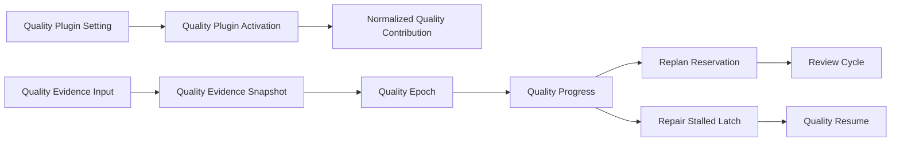

# Domain Entities — quality-repair-runtime

## 上流入力とmodel境界

本modelは`units-generation/unit-of-work.md`、`units-generation/unit-of-work-story-map.md`、`requirements-analysis/requirements.md`、`application-design/components.md`、`application-design/component-methods.md`、`application-design/services.md`のU2契約を具体化する。永続正本は既存Intent auditであり、新database、新service、harness固有state store、常駐processは作らない。

## Aggregate map

テキスト代替: modeとopt-in projectionからPlugin activationを確定し、正規化contributionをcompileする。quality evidenceをsnapshotへ変換してquality epochのT+1投影でprogressを判定する。thresholdでreplan reservationと新review cycle、再thresholdでstalled latch、evidence変化または人間retryでresumeを生成する。

## Entity catalog

| Entity / Value Object | Kind | Identity | Owner | Persistence |
|---|---|---|---|---|
| `QualityPluginProjection` | Aggregate Root | Intent UUID | M03 | canonical opt-in audit projection |
| `QualityPluginSetting` | Value Object | mode + opt-in revision | M03 / M06 | derived |
| `QualityPluginActivation` | Closed Result | setting + contribution digest | M03 | preflight receipt / diagnostic |
| `NormalizedQualityContribution` | Value Object | plugin ID + content digest | M03 / M01 | runtime graph、再生成可能 |
| `QualityObservation` | Closed Value Union | source + verifier + observation receipt | M03 / M06 | normalization input |
| `QualityEvidenceBatchInput` | Value Object | provider + scope + observation batch | M03 | transient input |
| `QualityObligation` | Entity | stable obligation ID | M03 | snapshot / audit fact |
| `QualityEvidenceSnapshot` | Entity | scope + snapshot fingerprint | M03 | canonical audit |
| `QualityEpoch` | Aggregate Root | `qualityEpochId` | M03 | canonical audit projection |
| `QualitySnapshotWindow` | First-Class Collection | quality epoch | M03 | bounded T+1 projection |
| `QualityProgress` | Value Object | snapshot transition | M03 | audit fact |
| `QualityDeliveryPlan` | Value Object | delivery ID | M03 / M06 | atomic plan |
| `ReplanReservation` | Entity | `replanId` | M03 / M06 | canonical audit |
| `RepairPlanReceipt` | Entity | replan ID + plan digest | M06 / M07 | canonical audit |
| `ReviewCycle` | Entity | `reviewCycleId` | M06 | canonical audit projection |
| `RepairStalledLatch` | Entity View | Monitor latch + quality evidence | M03 / M06 | canonical audit projection |
| `RepairStalledResumeCondition` | Composite Value Object | `any-of` + alternative identities | M03 / M06 | latch / audit fact |

## QualityPluginProjection aggregate

### Attributes

| Attribute | Type | Invariant |
|---|---|---|
| `intentUuid` | StableId | owning Intent |
| `noneModeOptedIn` | boolean | opt-in / out eventの最新canonical projection |
| `provenanceTurnId` | StableId \| null | opted-inならreal human turn |
| `projectionRevision` | non-negative integer | compare-and-append用 |

`planNoneModeQualitySetting(enabled, human)`だけが`none`のopt-in / out planを作る。modeが`semi / full`の場合、このprojection値にかかわらず`mode-required`でactiveとする。`none`のopt-in provenanceをgate / question認可に流用しない。

## QualityPluginSettingとActivation

`QualityPluginSetting`は次の閉じたunionである。

- `{ mode: "none", optedIn: false, provenance: null }`
- `{ mode: "none", optedIn: true, provenance: VerifiedHumanTurn }`
- `{ mode: "semi" | "full", optedIn: true, provenance: "mode-required" }`

`QualityPluginActivation`は`active(contribution) / disabled(none-default-off) / error(ContractError)`である。`semi / full`のmissing / untrusted / malformed contributionは`disabled`ではなく`error`である。active contributionはMonitor、`EvidenceProviderDescriptor`、`JudgeInstructionDescriptor`、3件の`RouteRuleDescriptor`、空のinitial `RequiredOutputDescriptor[]`を持つ。

### Contribution descriptor

| Descriptor | Required fields |
|---|---|
| `EvidenceProviderDescriptor` | provider ID、schema version、output schema digest、redaction policy ID |
| `JudgeInstructionDescriptor` | instruction ID、content digest、evidence schema digest |
| `RouteRuleDescriptor` | rule ID、monitor ID、route ID、instruction ID、`continue | latch` disposition |
| `RequiredOutputDescriptor` | output ID、stage selector、verifier ID、verification condition ID |

`NormalizedContribution`はこれらをdescriptor collectionとして持ち、Monitorのprovider / instruction参照、routeのinstruction / disposition、required outputのselector / verifierをcompile時にexact resolveする。`StableId[]`だけの旧概念shapeはU2 Code Generationで置き換える。

## QualityObservationとbatch input

`QualityObservation`は次のclosed unionである。

| Variant | Required facts |
|---|---|
| `reviewer` | invocation ID、validation receipt、`READY | NOT-READY`、canonical BLOCKER identities |
| `sensor` | sensor ID、blocking boolean、`passed | failed | incomplete`、output ID、terminal receipt |
| `produce` | output ID、required boolean、`present | missing | invalid`、verifier ID、nullable receipt |
| `condition` | `verification | completion`、condition ID、`satisfied | unsatisfied | incomplete`、verifier ID、nullable receipt |

`QualityEvidenceBatchInput`はprovider ID、Intent / Monitor / stage / graph revision、nullable `previousSnapshot`、non-empty observationsを持つ。previous snapshotは同じscope / current quality epochへ一致しなければならない。`normalizeQualityEvidence`はこのbatchからcurrent snapshotとdeltaを同時に生成し、required output / conditionの成否をIDの存在だけから推測しない。

## QualityObligation

| Attribute | Invariant |
|---|---|
| `obligationId` | source contractから決まるstable ID |
| `sourceCategory` | `reviewer / sensor / produce / verification / completion / provider` |
| `failureKind` | `blocker / failed / incomplete / missing / invalid / unmet / evidence-incomplete` |
| `stageInstanceId / boltId` | quality epoch scopeと一致 |
| `artifactId` | nullable stable output / artifact identity |
| `verifierId` | validated reviewer / sensor / output / condition owner |
| `failureFingerprint` | raw proseではないcanonical digest |
| `status` | `unresolved / resolved` |

advisory sensor、human `Request Changes`、raw messageはentityを生成しない。tag / providerを識別できるobservationの必須field不足はそのsource category + `evidence-incomplete`とし、batch scopeもproviderも識別不能ならparsed entityを作らず`ContractError(INCOMPLETE)`を返す。

## QualityEvidenceSnapshot

### Attributes

| Attribute | Type | Meaning |
|---|---|---|
| `intentUuid / monitorId` | StableId | cross-domain scope |
| `stageInstanceId / boltId` | StableId | quality-check owner |
| `graphRevision` | Digest | definition binding |
| `qualityScopeId` | StableId | Intent + Monitor + stage instance + graph revisionから決定 |
| `epochStartEventIdentity` | StableId | initialは`H(qualityScopeId + "genesis")`、以後はcommitted resume event identity |
| `qualityEpochId` | StableId | quality scope + epoch start event identityから決定 |
| `unresolved` | ordered set of `QualityObligation` | obligation IDでsort / dedupe |
| `resolvedIds / addedIds / retainedIds` | ordered StableId sets | 直前snapshotとの集合差 |
| `snapshotFingerprint` | Digest | scope + IDs + canonical failure fingerprints |
| `verifierSuccessReceipts` | safe receipt digests | evidence-change判定用 |

timestamp、session、audit行、編集数、文面、plan digestはidentity / progressに含めない。

## QualityEpoch aggregate

| Attribute | Type | Invariant |
|---|---|---|
| `qualityScopeId` | StableId | Intent / Monitor / stage instance / graph revisionから決定 |
| `qualityEpochId` | StableId | quality scope + `epochStartEventIdentity`から決定 |
| `epochStartEventIdentity` | StableId | initialは`H(qualityScopeId + "genesis")`、以後はresume transaction内のstart event |
| `threshold` | positive integer | compiled Monitorと一致 |
| `window` | `QualitySnapshotWindow` | 最大T+1 |
| `consecutiveNonProgress` | integer `0..T` | strict progressで0 |
| `replanSinceLastProgress` | boolean | strict progressでfalse、committed replanでtrue |
| `currentReviewCycleId` | StableId \| null | latest local cycle |
| `stalledLatch` | nullable `RepairStalledLatch` | same fingerprint short-circuit |

### Commands

- `observe(snapshot)` — initial / collecting / strict-progress / thresholdとnext projectionを返す。
- `recordReplan(receipt)` — replan flagとnew review cycle planを返す。
- `recordStalled(monitorLatch)` — quality evidenceをgeneric latchへ紐付ける。
- `evaluateResume(candidate)` — evidence-change / human-retryのclosed resultを返す。

commandはpartial mutationせず、immutable next aggregateと`AuditEventPlan[]`を返す。

## QualitySnapshotWindow collection

`QualitySnapshotWindow`はsnapshotの順序とT+1 upper boundを一箇所で所有する。

- latestとpreviousのU集合からstrict progressを判定する。
- latest fingerprintの過去再出現からregression cycleを検出する。
- T連続の同fingerprintからfixed pointを検出する。
- strict progressなし、fingerprint変化あり、Uが単調縮小しないT窓をchurnとする。
- 同率 / 不足は`undetermined`であり、成功へfallbackしない。

## QualityProgress union

| Variant | Required data | Next action |
|---|---|---|
| `initial` | snapshot、threshold | deterministic repair |
| `collecting` | count `< T`、snapshot | deterministic repair |
| `strict-progress` | resolved / added sets | count / replan reset、repair |
| `threshold` | count `= T`、pattern、required route | singleton Judge constraint |

`threshold.requiredRoute`は`replanSinceLastProgress=false`なら`replan`、trueなら`repair-stalled`である。`repair`はT未満 / strict progressの決定論的処理であり、thresholdの別候補としてJudgeへ渡さない。

## QualityDeliveryPlan

`QualityDeliveryPlan`はsnapshot normalization後にM03が1回で生成するdeep valueである。

- next `QualityEpoch`
- `QualityProgress`
- M02へ渡す`MonitorEvent`
- nullable `JudgeRouteConstraint`
- snapshot / progress / handoffの`AuditEventPlan[]`

M06はeventとconstraintを切り離したり再計算したりしない。initial / collectingは`QUALITY_NON_PROGRESS + null`、strict progressは`QUALITY_STRICT_PROGRESS + null`、thresholdは`QUALITY_NON_PROGRESS + singleton constraint`である。

## ReplanReservationとReviewCycle

### ReplanReservation

| Attribute | Invariant |
|---|---|
| `replanId` | quality epoch + trigger snapshot + Judge invocationから決定 |
| `intentUuid / scope` | current Intent / stage / Boltと一致 |
| `triggerSnapshotFingerprint` | threshold snapshotと一致 |
| `judgeInvocationId` | committed `replan` result |
| `contextPolicy` | fresh contextまたはagent identity policy |
| `commitReceipt` | replan呼出し前に必須 |

`RepairPlanReceipt`は`replanId`、normalized plan digest、agent / context identity、basis、scopeを持つ。plan文面の差をprogressに数えない。

### ReviewCycle

| Attribute | Invariant |
|---|---|
| `reviewCycleId` | quality epoch + 直前Judge invocation + replan fingerprint + cycle indexから決定 |
| `previousReviewCycleId` | initialだけnull。audit linkage専用でidentity入力に含めない |
| `iteration` | `1..reviewer_max_iterations` |
| `unresolvedBlockers` | validated reviewer handoff snapshot |
| `replanFingerprint` | RepairPlanReceiptと一致 |

新cycleはiterationを1へ戻すが、quality epochのhistory / replan flagをresetしない。`cycleIndex`はquality epoch内で0から単調増加し、同じcanonical auditから同じ値を再生する。`replanId`はreservation / receiptの照合に使うが、`reviewCycleId`のidentity入力には含めない。

## RepairStalledLatchとQualityResumeCondition

`RepairStalledLatch`はM02のgeneric `MonitorLatch`をquality projectionから見たentity viewである。Monitor / quality epoch、stalled snapshot fingerprint、pattern、Judge invocation、replan basis、selected route、resume conditionを持つ。M03はgrant stateをattributeに持たない。

`QualityResumePredicate`は次のclosed unionである。

- `evidence-change`: latched Uの真部分集または同一obligationの新成功receiptを要求。
- `human-retry`: condition identityと一致するreal `VerifiedHumanTurn`を要求。

`RepairStalledResumeCondition`は`kind=any-of`とちょうど2個の上記predicateを持つ。どちらか1個の充足でcompositeは`satisfied`になるが、evidenceとhumanのprovenance validatorは共有しない。condition充足、Monitor latch clear、new `QUALITY_EPOCH_STARTED`、workflow unparkは同一M07 transactionでcommitする。new epochは`H(qualityScopeId + epochStartEventIdentity)`で発行し、window、count、replan flag、review cycle、latchを初期値へ戻す。

## Audit event projection

| Event fact | Projection effect |
|---|---|
| `QUALITY_REPAIR_OPTED_IN / OUT` | none-mode projectionとhuman provenanceを更新 |
| activation verified / failed | stage preflight receipt / diagnostic |
| quality snapshot observed | T+1 windowへsnapshot追加 |
| quality progress classified | count / pattern / route requirementを更新 |
| replan reserved / recorded | replan flagとplan receiptを更新 |
| review cycle opened / handed off | local cycle identity / unresolved BLOCKERを更新 |
| `REPAIR_STALLED` / latch set | stalled viewとsuspendedを記録 |
| latch clear / quality resume / unpark | condition充足後に原子的再開 |

正確なevent名はEvent Registryで既存taxonomyとの衝突を検証して確定する。この表のfact / identity / replay effectは減らさない。

## Relationship and ownership rules

- M03はactivation、obligation正規化、quality epoch、progress、route意味論を所有する。
- M02はquality entityをimportせず、generic Monitor event / constraint / latchだけを所有する。
- M06はevidence collector、M03、M02、replan agent、M07の順序付けを所有し、domain attributesを直接更新しない。
- M07はevent append / replay / statusを所有し、quality判定や認可を行わない。
- M08 / M09は5 harness descriptor / contract / live receiptを所有し、quality algorithmをforkしない。
- harness adapterは共通wire valueだけを入出力し、QualityEpochを複製しない。

## Data retention and privacy

- canonical auditは既存Intent retention / access controlを継承する。
- raw reviewer prose、raw prompt、credential、secretを保存せず、stable ID、safe metadata、digestだけを保存する。
- bounded scratch projectionはgitignored per-clone runtimeへ置き、削除後もauditから再構築可能にする。
- statusはunresolved obligation IDとsafe diagnosticを表示し、未編集provider payloadを表示しない。

## Verification invariants

- malformed valueはdomain entityを生成できない。
- audit replayとincremental reduceが同じquality projection digestになる。
- 同じsnapshot / replan / review cycle / resume transactionの再送がstateを二重更新しない。
- T-1、初回T、strict progress後、replan後Tがそれぞれrepair / replan / repair / repair-stalledに決定する。
- human Request Changes、advisory sensor、audit noiseがquality count / fingerprintを変えない。
- same stalled fingerprintがJudge / LLM / repairを再実行しない。
- 5 harness adapterが同じfixtureからbyte-equivalentなcanonical resultを返す。
