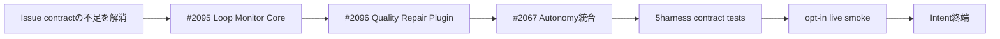

# Scope Definition — Intent-scoped Autonomy

## 上流入力

- 正本入力はIntent Captureの`intent-statement.md`と、[#2067](https://github.com/amadeus-dlc/amadeus/issues/2067)、[#2095](https://github.com/amadeus-dlc/amadeus/issues/2095)、[#2096](https://github.com/amadeus-dlc/amadeus/issues/2096)の本文である。
- `feasibility-assessment`は本IntentでFeasibility stageをskipしているため存在しない。
- `constraint-register`も未作成である。制約はIssue本文の不変条件・対象外・非目標から抽出し、本書で境界として固定する。

## 目的と最小価値

人間がIntentに束縛した認可の範囲で、AI-DLCが品質不備を健全化しながらIntent終端まで進めることを最小価値とする。非生産的な修復だけを監査可能・再開可能に停止し、外部runner、GitHub、PR、mergeをCoreの完了条件にしない。

最小価値は3成果の連鎖が揃って初めて成立する。

1. #2095: harness-neutralなLoop Monitor Core
2. #2096: Core上で動くfirst-party Quality Repair Loop Plugin
3. #2067: `none` / `semi` / `full`、grant、自動裁定、停止・再開、確認UXの統合

## In Scope

### A. 宣言的Loop Monitor Core（#2095）

- workflow-level manifest、fail-closedなschema検証、runtime graph投影
- cycle照合、threshold、ignore event、閉じたJudge route
- Intent / monitor / stage instance・Bolt / graph revisionに束縛したaudit-backed永続化
- crash / resume冪等性、同一fingerprintの停止短絡、明示retryまたはevidence変化による解除
- 正規化済み内部Plugin contribution SPI
- harness-neutralなresult / diagnostic contract

### B. Quality Repair Loop Plugin（#2096）

- reviewer、sensor、必須produces、verification / completion conditionの品質evidence正規化
- fixed point、churn、regression cycleの判定
- `repair` / `replan` / `repair-stalled`だけを返す閉じた方針
- `semi` / `full`での自動有効化、`none`での任意有効化、欠落・破損時preflight fail-closed
- `parked / REPAIR_STALLED`、grant保持、一時停止、同一fingerprint短絡、再開

### C. Intent-scoped Autonomy（#2067）

- `none` / `semi` / `full`の3モードと既定`none`
- Intent UUIDに束縛した非消費・TTLなしgrantと、実在する人間だけによる変更
- 事前裁定方針の自然言語入力、正規化、確認、二相行使
- 質問解決順序、Gate自動承認、Walking Skeletonへの同一規則適用
- `GRANT_EXERCISED`、`AUTO_DECIDED`、`AUTO_DECISION_REVIEWED`とEvent Registry / OTel射影
- active / completed Intentの自動裁定確認surface
- result envelope、human / machine-readable status、停止・再開contract

### D. 現行5harnessの検証

- Claude Code、Codex、Cursor、OpenCode、Kimi Codeで同一Core contract tests
- 5harnessのopt-in live smokeと、solo electionまたはloud degradationの実測
- [#1717](https://github.com/amadeus-dlc/amadeus/issues/1717)のうち、上記5harnessに必要な共通live E2E policy / adapter capability
- 新しいharnessがCore forkなしにadapter追加で同じcontractへ接続できる境界

## Out of Scope

- 外部runner / scheduler、常駐supervisor、外部プロセスの再起動実装
- GitHub / PR review / merge / convergenceの待機・制御
- 新しいhost / cloud / tool permissionの付与
- norm、安全性、品質基準のwaiver自動承認
- 完了済みIntentの自動rollback、`self-fix` / `self-feature` Intentの自動作成
- 外部Plugin manifest形式（#2065）の確定
- 新しいAI-DLC stage、scope-grid行、stage runnerの追加
- 時間・費用budgetの一般化
- Kiroを含む#1717全体の完了
- 任意のLLMによるworkflow graphの自由な書き換え

## Issue Contractの抜け漏れ・矛盾

Intent Captureの9件を維持し、Scope分析で4件を追加した。ここでは解決案を確定せず、Requirements Analysis / Application Designの承認対象とする。

| ID | 不足・矛盾 | 影響 |
|---|---|---|
| GAP-01 | grantの認可ライフサイクルと実行可否が単一`state`へ混在 | `active`かつ`suspended`を表現できない |
| GAP-02 | 権限昇格、不可逆操作、scope外、waiver停止に対応するreason codeがない | result envelopeが停止contractを閉包しない |
| GAP-03 | #2096のgrant suspension/statusと#2067統合の責務が重なる | Plugin SPIとautonomy統合のownerが曖昧 |
| GAP-04 | advisory sensorのうち何を修復obligationにするか未定義 | 全sensorを誤ってblocking化する恐れ |
| GAP-05 | 既存`reviewer_max_iterations`と固定retry上限なしの接続が未定義 | 現行review loopからPluginへの移管点が不明 |
| GAP-06 | `replan`自体が同一evidenceで反復する上位ループが未定義 | `repair-stalled`へ収束しない可能性 |
| GAP-07 | Pluginがstage completionへ追加する必須出力のschema・owner・適用stageがない | completion conditionを実装できない |
| GAP-08 | 過去の人間裁定の適用範囲、失効、優先順位、競合処理がない | 一意導出を安全に判定できない |
| GAP-09 | result envelopeの`retryable`が各outcome / reasonで何を意味するか未定義 | runnerが再開可否を決定できない |
| GAP-10 | `none`でPluginを任意有効化する設定面と監査contractがない | opt-inを実装・検証できない |
| GAP-11 | #1717の「現行5harnessに必要な部分」を判定する完了境界がない | Kiroを除く部分完了を客観判定できない |
| GAP-12 | `semi`が#2067のgrant modelを使うか、mode確認だけで認可が成立するか未記載 | phase内自動承認のprovenanceが不明 |
| GAP-13 | 現行の`Construction Autonomy Mode = unset / autonomous / gated`とWalking Skeleton常時gate契約が、新しい`none / semi / full`と衝突 | 移行、単一正本、既存Intent互換を定義する必要 |

## 優先順位と変更管理

- MoSCoWでは、3件のIssueの受け入れ条件とGAP-01〜13のcontract解消をすべてMust-haveとする。
- Nice-to-have / Could-haveは設けない。Issueにない追加機能を混ぜないためである。
- 数値根拠がないためWSJF / RICEの架空点数は作らない。優先順位はIssueが明示した依存関係を使う。
- 新しい要求が見つかった場合、Issueの抜け・矛盾なら本Intentで裁定し、それ以外の仕様追加はscope changeとしてユーザー確認へ戻す。

## Value Stream

テキスト表現: contract解消 → #2095 → #2096 → #2067統合 → 5harness contract tests → opt-in live smoke → Intent終端。

## 完了境界

- #2095、#2096、#2067の受け入れ条件がすべて検証済みである
- GAP-01〜13が承認済みcontractへ解消され、requirements・design・testsへ追跡できる
- 現行5harnessで決定論的contract testsとopt-in live smokeを実測する
- package / promote drift guardが通る
- 対象外機能をCore completion conditionへ持ち込んでいない
