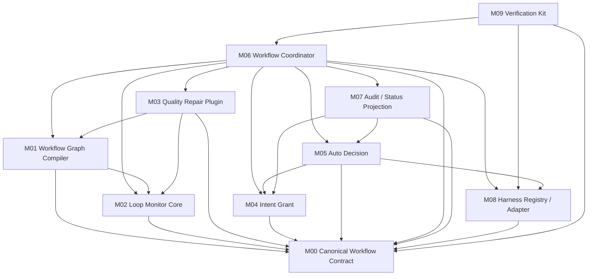

# モジュール依存関係

## 上流入力

依存関係は`requirements-analysis/requirements.md`のCore / Plugin / Autonomy分離、`codekb/amadeus/architecture.md`の現行orchestrator / audit / runtime graph、`codekb/amadeus/component-inventory.md`のpackage / setup / self-install所有面を前提とする。

## 依存DAG

テキスト代替: CLI composition rootがHarness Adapterでnative factsを正規化してからCoordinatorを呼び、Harness module自体はCoordinatorをimportしない。CoordinatorはCompiler、Monitor、Quality Plugin、Grant、Decision、Auditを順序付け、Intent完了時はHarness Registryの検証済みCompletion Evidenceを要求する。CompilerとQuality PluginはMonitorの公開interfaceへ依存し、DecisionはGrantとHarness capabilityを読む。各domainはM00のaudit予定valueを返し、CoordinatorだけがM07へ渡す。MonitorからQuality / Grant / Harnessへの逆依存は禁止する。

## 依存マトリクス

行が列へ依存する。

| Module | importを許可するowner | 禁止する逆依存 |
|---|---|---|
| M00 Contract | なし | M00がdomain behaviorをimportすること |
| M01 Compiler | M00、M02のMonitor schema、S03 contribution contract | M03 implementation、M06、M07 |
| M02 Monitor | M00 | M01、M03〜M09 |
| M03 Quality Plugin | M00、M01 contribution contract、M02 public interface | M04〜M09 |
| M04 Intent Grant | M00 | M05〜M09 |
| M05 Auto Decision | M00、M04 public interface、M08 capability value | M06、M07、M09 |
| M06 Coordinator | M00〜M05、M07、M08 | M09 production import |
| M07 Audit / Status | M00、M04のAutonomy projection型、M05のDecision record型 | domain reducer / plannerの呼出し、M01〜M03、M06、M08、M09 |
| M08 Harness | M00 | M01〜M07、M09 |
| M09 Verification | M00〜M08のpublic interface | production moduleからM09へのimport |

M00はcross-module wire contractだけを所有する。domain型はowner moduleからexportする。M07がM04 / M05のreadonly projection型をimportする方向は一方通行であり、M01〜M06はM07型をimportせずM00の`AuditEventPlan`を返すため循環しない。図ではM09から全公開interfaceへのtest-only edgeを可読性のため省略する。type-only importを循環依存の免罪符にはしない。

## データフロー

### F01 Graph compile

`core stage graph + trusted Plugin composition → M01 normalize / validate route disposition → compiled monitors + canonical graph revision → runtime-graph scratch + M07 compile event`

Plugin source bytesや絶対pathはgraph revisionへ直接含めず、正規化後のcontrol viewとcontent digestを含める。

### F02 Quality repair

`audit → M03 activation + T / T+1 convergence replay → evidence snapshot → M03 initial / collecting / strict / threshold classification → MonitorEvent + null/singleton constraint → M02 threshold enforcement → constrained pending Judge → S01 invokeOnce → M03 route apply → M06 result`

`semi / full`ではPluginが欠落・未信頼・破損ならstage開始前に失敗する。`none`では既定offであり、auditから再生した人間provenance付きopt-inの場合だけactive contributionへ含める。M03はT未満でconstraintを作らず、初回Tで`[replan]`、replan後Tで`[repair-stalled]`だけを渡す。M02はconstraintをmanifest subsetとして検証し、Judgeは他routeを返せない。

### F03 Grant-backed decision

`human grant command → M04 transition plan → M06 aggregate → M07 atomic append → mode/full projection → M04 authorize occurrence / option set → M05 resolve selected option → M06 selected option effect / scope → M04 candidate + reserve plan → M07 reservation append → replay / revalidate → M04 commit-or-abort plan → M05 AUTO_DECIDED plan → M06 aggregate exercise + decision + existing effect event → M07 atomic append`

mode / grant / human provenanceのappendに失敗した場合、いずれも有効化しない。reservationはcandidate全体・digest・projection revisionを保存し、crash後はM04が復元candidateを現在grantへ再検証する。callerの`revalidated` booleanは受け付けない。commit、decision、existing effect eventは同じtransactionに入る。

### F04 Stop / resume

`route / safety boundary → M06 WorkflowResult + WORKFLOW_PARKED → M07 suspended projection → external observation / human retry → M06 evaluateResumeCondition → reason=REPAIR_STALLEDならM02 planMonitorResume、それ以外はmonitorResume=null → M06 planWorkflowResume → M07 atomic append → running`

resume condition identity、human provenance、evidence / norm fingerprint差分を検証し、条件未充足なら何もappendしない。Monitor停止だけが`LOOP_LATCH_CLEARED + WORKFLOW_UNPARKED`、非Monitor停止は`WORKFLOW_UNPARKED`だけをappendする。`failed` resultはF04へ入らず、park eventもlatchも作らない。

### F05 Harness projection

`M08 registry → credential-attested S02 authorization → protected authorization event commit → M09 opt-in live run → authorization / environment / trace / attestation-bound receipt → M08 provenance + observations + 5harness validation → M06 + M04 atomic completion transition`

KiroとKiro IDEは同じ`.kiro` host directoryへ写像するが、2つのpackage faceとして保持する。今回のautonomy/live flagsはfalseのままにする。

## 共有資源

| Resource | 単一owner | 読取者 | 書込規則 |
|---|---|---|---|
| Intent audit shards | M07 | M02〜M06、M09 | domain event planをM06がtransactionへ集約し、M07だけがlock内append。protected eventは専用commandのみ |
| `amadeus-state.md` | M07 projection / existing state transaction | M06、status | auditと同じtransaction identityで更新し、単独正本にしない |
| runtime graph | M01 | M02、M03、M05、M06 | canonical compileから再生成。手編集禁止 |
| plugin composition record | 既存composition module | M01、M03 | trust grant / digest検証後だけ読取 |
| harness registry | M08 | setup、package、promote、runtime、M09 | 7 descriptorの単一authoring source。派生unionは生成またはdrift検証 |
| live authorization / raw receipts | M08 authorization validator / M09 runner | M07、M08 completion validator | protected authorization event commit後だけlive実行。receiptはenvironment / trace / attestationへ束縛し、secretは保存しない |
| validated completion evidence | M08 | M06、M07 | registry digestと必須5harness receiptを検証後だけcanonical appendし、M06 completedの必須入力にする |

## 循環依存禁止

- M02 → M03は禁止。品質PluginがMonitorを使う一方向だけとする。
- M04 / M05 → M06は禁止。認可moduleはdirectiveやstage routingを知らない。
- M07 → M06のruntime呼出しは禁止。Projectionはpure read / append interfaceだけを提供する。
- M01〜M06 → M07のdomain型importは禁止。domainはM00のevent planを返し、M06だけがM07のappend interfaceを呼ぶ。
- harness adapter → M06 / 個別domain moduleのimportは禁止。CLI composition rootがM08の正規化結果をM06へ渡し、harness-neutral resultをnative表示へ投影する。
- setup / package / promoteが独自harness unionを正本化することを禁止する。

## 実装依存順

| Bolt候補 | Issue | 先行依存 | 独立検証 |
|---|---|---|---|
| B1 Loop Monitor Core + graph revision | #2095 | なし | schema / cycle / replay unit、runtime integration |
| B2 Quality Repair Plugin | #2096 | B1 | obligation / progress / replan contract、Plugin composition、repair integration |
| B3 Intent Grant + Auto Decision | #2067 | B1、B2 | migration、state transition、two-phase decision、status / replay |
| B4 Harness registry / contract projection | #2095〜#2067横断 | B1〜B3の公開contract | 7/6/5 registry drift、5harness byte-equivalent contract |
| B5 Live completion receipts | #2095〜#2067横断 | B4 | 5harness opt-in live、skip非pass、revision binding |

この順序はIssueの依存順を維持しつつ、各Boltを別々にテスト可能にする。PR単位やmerge順はCore設計に含めない。
