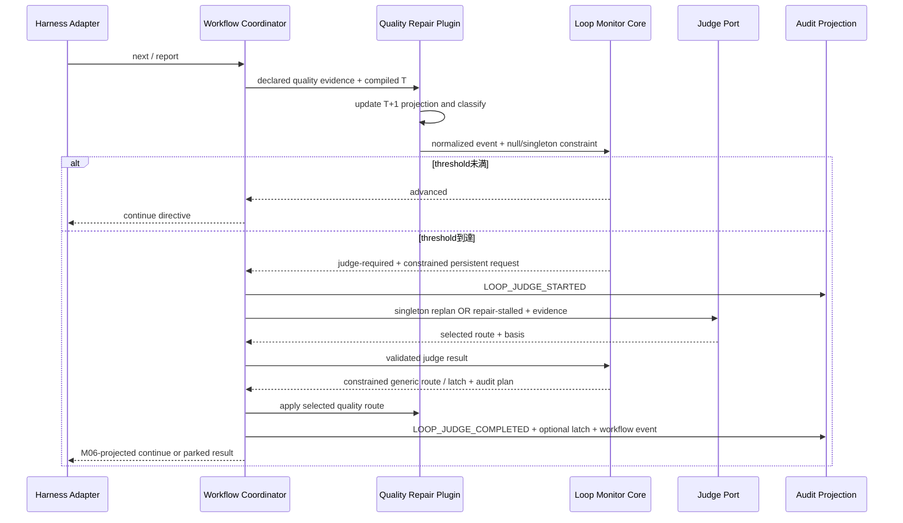
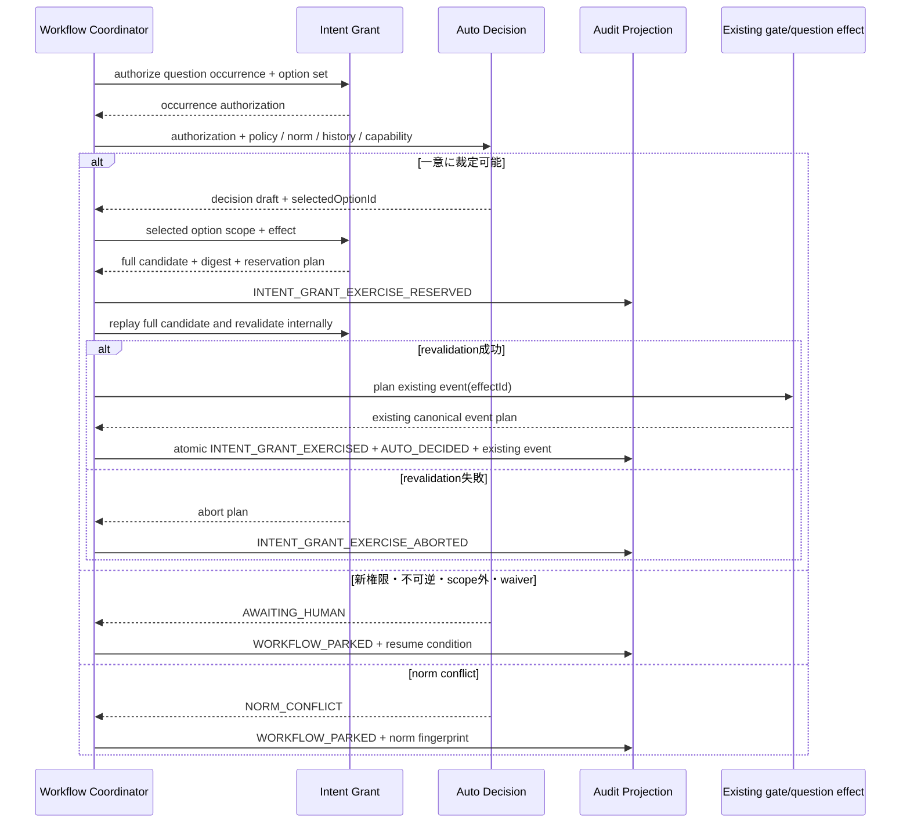
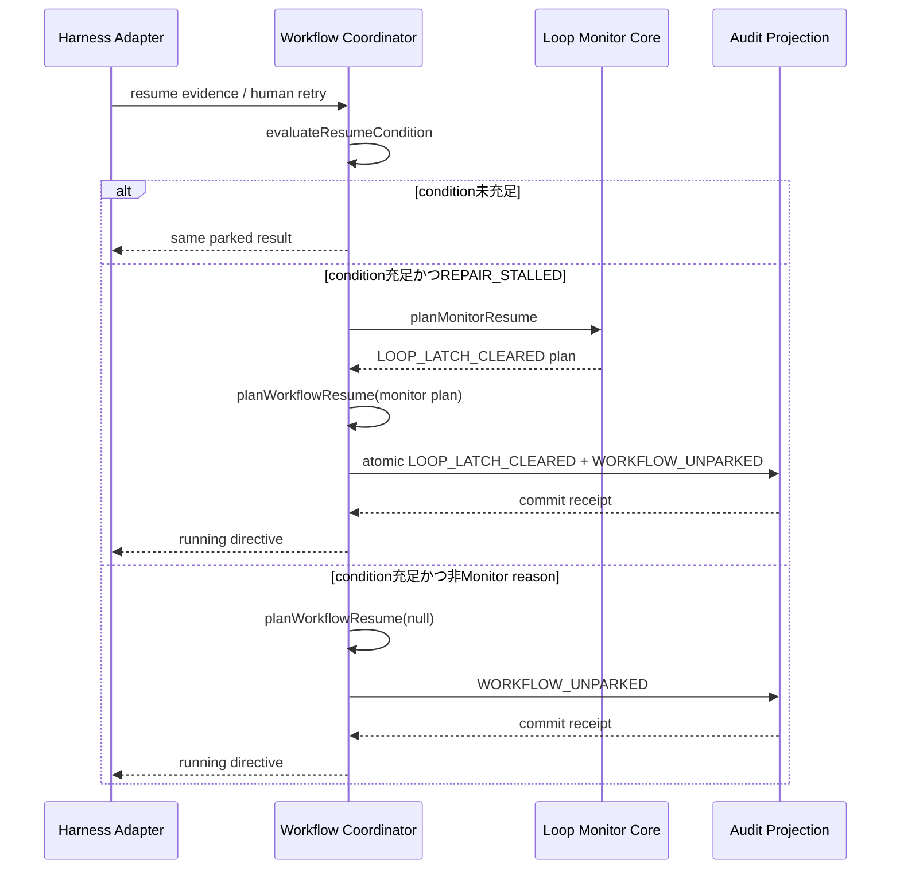

# サービス設計

## 上流入力とサービス形態

`requirements-analysis/requirements.md`は外部runner / scheduler、常駐supervisor、harness固有polling loopを対象外とする。`codekb/amadeus/architecture.md`と`codekb/amadeus/component-inventory.md`が示す現行構造も、Bunで起動して結果を返す短命CLIである。

したがって新しいdeployable serviceは作らない。本書の「サービス」は1回のCLI invocation内で協調するin-process application serviceを指す。

## サービス一覧

| Service | Lifecycle | 主モジュール | 入力 | 出力 |
|---|---|---|---|---|
| Graph Compile Service | graph compile時 | M01 | core graph、信頼済みPlugin composition | compiled graph、Monitor set、graph revision |
| Workflow Execution Service | `next / report / resume`ごと | M06 | Intent projection、directive、native capability | directiveまたはWorkflowResult |
| Loop Evaluation Service | normalized event deliveryごと | M02 | compiled Monitor、bounded projection、event | no-op / judge request / latch result |
| Quality Repair Service | blocking evidence変化時 | M03 | reviewer / sensor / artifact evidence | repair / replan / repair-stalled plan |
| Autonomy Authorization Service | gate / question候補ごと | M04、M05 | mode、grant、policy、norm、history、capability | human待ちまたはreserved decision |
| Projection Service | audit append / status時 | M07 | canonical audit | state、status、review queue、OTel projection |
| Harness Adaptation / Completion Service | invocation開始時 / Intent完了前 | M08 | native facts、registry、live receipts | normalized runtime adapter、CompletionEvidence |
| Verification Service | test / live opt-in時 | M09 | fixtureまたはlive run | revision-bound receipt |

## 1 invocationのライフサイクル

1. M08がnative harness factsを正規化する。capability不明は明示的`unavailable`にする。
2. M07が対象Intentのaudit shardを読み、grant、workflow、Monitor、Quality Plugin opt-in、review queueを各owner reducerで再生する。
3. M03がautonomy modeと再生済み人間opt-in provenanceからQuality Plugin activationを解決する。`semi / full`の欠落・未信頼・破損は開始前fail-closed、`none`は既定offとする。
4. M01がcore graphと、M03が選択したactive contributionだけを検証し、graph revisionを確定する。
5. M06が現在stageの局所obligationを評価する。
6. 品質eventならM03がevidenceと`T + 1` projectionを更新し、strict progress / T未満 / thresholdを決定する。M02へMonitorEventとnullまたはsingleton Judge constraintを同時に渡す。
7. T未満は通常directiveを返す。threshold到達時はM03が初回`[replan]`、replan後`[repair-stalled]`だけを許可し、M02がrequest全体をpending Judgeとしてauditへ予約してS01 `invokeOnce`を呼ぶ。
8. Judge routeを閉集合で検証し、M06が全domainのaudit予定eventを集約してM07へ一transactionでappendする。
9. `repair / replan`はworkflowを継続する。`repair-stalled`は`parked / REPAIR_STALLED`を返す。
10. gate / questionならM04がfull grantとoption集合を読み取り専用認可し、M05が回答を選ぶ。M06は選ばれたoption専用effectからM04 candidateを生成・検証・永続予約する。
11. Intent完了候補ではM08が同一revision / registryの5harness成功receiptを検証し、M06は検証済みCompletionEvidenceがある場合だけcompletedを返す。
12. terminal invocationはM06がharness-neutral WorkflowResultを返す。外部runnerの再起動はCore外である。

## 品質修復シーケンス

テキスト代替: Quality PluginがTを持つbounded projectionをauditから再生する。初回とT未満はJudgeなし、初回thresholdはreplan singleton、replan後にstrict progressなしで再度Tならrepair-stalled singletonをM02へ渡す。pending Judgeはconstraintを含む完全なrequestを再生する。M02はroute IDの品質意味論を知らず、渡されたmanifest subsetだけを強制する。

## 自動裁定シーケンス

テキスト代替: M04がfull grantとquestion occurrence / option集合を先に読み取り認可し、M05が回答を選ぶ。選択後にだけM04がselected option、scope、effectへ束縛したcandidateを生成する。reservationはcandidate全体・digest・projection revisionを永続化し、crash後もcaller booleanではなく復元candidateを現在grantへ内部再検証する。

## Park / resumeシーケンス

テキスト代替: Coordinatorがresume condition identity、fingerprint差分、人間retry provenanceを検証する。`REPAIR_STALLED`だけがMonitor latch解除を要求し、M07がlatch解除とworkflow unparkを同一transactionでappendする。`AWAITING_HUMAN / NORM_CONFLICT / USER_PARKED`はMonitorなしで`WORKFLOW_UNPARKED`だけをappendする。

## Intent完了シーケンス

`S02 credential-attested authorization → M08 LIVE_SMOKE_AUTHORIZED plan → M07 commit → M09 live smoke → authorization-bound raw receipt → M08 validateLiveReceipt(provenance + Judge + election/degradation) → 5harness集合評価 → CompletionEvaluation → M06 atomic completion transition`

M09はprotected authorization eventのcommit receiptなしにlive runを開始しない。receiptはauthorization、environment、trace、attestationへ束縛し、M08はcanonical authorization eventとexact matchを検証する。secret / credential値は保存しない。5件が揃えばM06はgrant completed、workflow null、completionを同一transactionへ集約する。credentialなし・未認可・観測不足はskip / incompleteであり完了証拠にならない。

## 失敗と回復

| Failure | Service response | Workflow state | 再実行条件 |
|---|---|---|---|
| malformed graph / contribution | compileをfail-closed | 変更なし | 定義修正後に通常起動 |
| `semi / full`でQuality Plugin欠落・未信頼・破損 | activation preflightをfail-closed | 変更なし | composition修復後に通常起動 |
| sensor non-zero / signal / exception | quality incomplete / failure | 通常はrunning、loop収束時はsuspended | Plugin routeに従う |
| Judge crash | pending request全体をauditから再生 | running | S01へ同じinvocation identityで`invokeOnce` |
| grant reservation後・commit前のcrash | auditからfull candidate / digest / revisionを再生してM04が内部再検証 | running | 同じexercise identityでcommit / abort |
| grant commit transaction中のcrash | exercise / decision / existing eventが全件commitまたは全件未commit | running | reservationから同じtransaction identityで再開 |
| 同一latch fingerprint | Judge / LLMを呼ばず同じparked result | suspended | evidence変化または人間retry |
| norm conflict | `parked / NORM_CONFLICT` | suspended | norm fingerprint変化 |
| host / tool権限不足 | `parked / AWAITING_HUMAN` | suspended | provenance付き人間操作 |
| CLI内部failure | `failed` result | runningのまま | 人間による既存の通常起動。runner自動retryは禁止 |
| live credential / authorizationなし | 理由付きskip receipt、protected authorization eventなし | workflowは継続可能 | credential-attested認可済み環境の5成功receipt。未収集ならAWAITING_HUMAN |

## Reviewer cycle handoff

局所reviewer上限は維持する。未解消BLOCKERをM03へ渡した後の新しい局所review cycleは次で識別する。

- `qualityEpochId`: Intent UUID、stage instance、graph revision、最初のobligation fingerprintから決定
- `reviewCycleId`: quality epoch、直前Judge invocation、replan fingerprint、cycle indexから決定
- `previousReviewCycleId`: 初回はnull、以後は直前cycle
- `iteration`: 各局所cycleで1から`reviewer_max_iterations`まで

新cycleはiterationを1へ戻すが、M02 / M03のquality epochとnon-progress履歴は戻さない。audit fixtureはcycle 1上限 → Plugin handoff → replan → cycle 2 → strict progress / repair-stalledの両方を検証する。

## 通信・容量・スケーリング

- service間通信は同一process内のtyped return valueとappend-only audit eventであり、HTTP / gRPC / queueを追加しない。
- event delivery時は対象Monitorと`T + 1`のbounded projectionだけを更新する。
- cold resumeだけが対象Intentの関連audit eventを線形走査する。
- 別cloneのaudit shard merge順はcanonical orderingで正規化し、無関係eventでJudge回数を増やさない。
- 外部runnerはWorkflowResultだけに依存し、Coreの内部moduleやaudit fileをpollしない。

## Status / decision query

Projection Serviceはactive / completed Intentを同じread modelで扱い、`listAutoDecisions`と`getAutoDecision`を提供する。一覧・詳細にはquestion、options、selected answer、decider、basis、grant identity、evidence fingerprint、capability degradation、review stateを含める。completed Intentの変更は、明示されたtarget Intent UUIDのsealed shardにdecisionが存在し、source Intent UUIDのcanonical auditに人間turnが実在する場合の、turn reference付き`accept / flag`専用追記だけを許可する。
