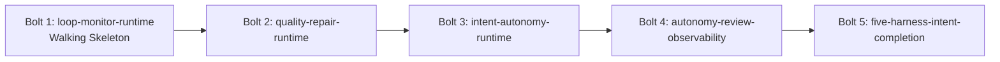

# Delivery Plan — Bolt Plan

## 上流入力

本計画は`requirements-analysis/requirements.md`、`application-design/components.md`、`units-generation/unit-of-work.md`、`units-generation/unit-of-work-dependency.md`、`units-generation/unit-of-work-story-map.md`を正本とする。`stories.md`はUser Stories stage、`mockups`はRefined Mockups stage、`team-practices`はTeam Formation / Practices Discovery stageがSKIPのため存在せず、要件シナリオと適用済みlayered rulesをfallbackとして使う。

## 計画原則

- 1 Unitを1 Boltとして扱い、5 BoltをU1→U2→U3→U4→U5の順で直列実行する。
- U1をWalking Skeletonとする。manifest authoringからproduction engine、audit/status/replay、現行5harnessのcontractと利用可能なopt-in liveまでを最小end-to-endで実証する。
- 順序は架空のWSJF値を使わず、#2095→#2096→#2067のblocker解消とrisk-firstで決める。
- 中間BoltとU5はいずれも決定論的contractをhard gateとする。credential-attested環境が利用可能ならbehavior固有liveをopt-inで実測し、最終implementation revision / package digestへ束縛した適合性証拠として残すが、live receiptをCore Intent終端のhard gateにはしない。
- PR作成・review・mergeはAI-DLC CoreのBolt完了条件ではない。外部runner / supervisor、Kiro live、#2065の外部Plugin形式も本計画へ含めない。

## Bolt依存とcritical path

テキスト代替: Bolt 1からBolt 5までを番号順に直列実行する。この一本の列がcritical pathであり、安全に並行化できるBolt pairはない。

## Bolt 1 — loop-monitor-runtime

- **Unit:** U1 `loop-monitor-runtime`
- **Issue:** #2095
- **Walking Skeleton:** Yes
- **相対規模:** L、2,200〜3,400行
- **Definition of Done:** manifest schemaとcompileがfail-closedで成立し、cycle / ignore / threshold / natural exit、canonical graph revision、bounded history、Judge route / latch / replay、同一fingerprint短絡、evidence付きresumeをproduction M06/M07 pathで検証する。Claude Code、Codex、Cursor、OpenCode、Kimi Codeで同じcontractが通り、利用可能ならopt-in Judge liveを暫定実測する。
- **Confidence hypothesis:** Coreがgeneric Monitorとlive authorization seamを所有し、各harnessはnative capability adapterだけで同一挙動を提供できる。
- **Expected demo:** synthetic workflowをthreshold前後で走らせ、自然終了・非生産loop停止・crash replay・latch短絡をstatus/replayで示し、5harness contract結果を並べる。

## Bolt 2 — quality-repair-runtime

- **Unit:** U2 `quality-repair-runtime`
- **Issue:** #2096
- **Walking Skeleton:** No
- **相対規模:** L、1,500〜2,400行
- **Definition of Done:** first-party Plugin activation / preflight、blocking evidence正規化、T/T+1 projection、initial / collecting / strict / threshold、fixed-point / churn / regressionを実装する。初回thresholdではreplanし、その後も不健全なら`REPAIR_STALLED`へ停止する。Request Changesを自動裁定へ変換せず、cross-session replayと5harness contractを通し、利用可能ならquality behavior liveを暫定実測する。
- **Confidence hypothesis:** #2095のgeneric Monitorをforkせずに、品質不備を健全化してから次stageへ進むbounded repair loopをPlugin contributionとして実現できる。
- **Expected demo:** T-1非発火、初回T replan、replan後T stalled、evidence追加後resume、Request Changes非変換を同一fixture系列で示す。

## Bolt 3 — intent-autonomy-runtime

- **Unit:** U3 `intent-autonomy-runtime`
- **Issue:** #2067のCore autonomy behavior
- **Walking Skeleton:** No
- **相対規模:** XL、3,000〜4,800行
- **Definition of Done:** `none / semi / full`、Intent-scoped grant、human-provenance付き原子遷移、legacy standing grant fail-closed diagnostic、policy→norm/history→election→recommendationの裁定階層、deterministic decision ID、reserve / replay / revalidate、`GRANT_EXERCISED + AUTO_DECIDED + effect`の原子性を実装する。`NORM_CONFLICT`、`AWAITING_HUMAN`、`REPAIR_STALLED`と通常起動resumeを5harness共通contractで検証する。
- **Confidence hypothesis:** `full`はreal humanが事前承認したIntent grantの範囲だけでHUMAN_TURN境界を自動裁定し、品質不備を修復しながらIntent終端直前まで安全に進める。
- **Expected demo:** mode別matrix、Walking Skeleton gate、team child Intent、crash boundary、grant active + workflow suspended、通常起動resumeをproduction pathで示す。

## Bolt 4 — autonomy-review-observability

- **Unit:** U4 `autonomy-review-observability`
- **Issue:** #2067のreview / status / telemetry behavior
- **Walking Skeleton:** No
- **相対規模:** M、900〜1,500行
- **Definition of Done:** active / completed Intentの自動裁定list / detail、unreviewed queue、real human turnによるaccept / flag、completed recordへの`AUTO_DECISION_REVIEWED`限定append、seal維持、status projection、Event Registry / OTel登録を検証する。flagはrollbackやIntent自動作成を行わず、self-fix / self-featureの候補を提示する。
- **Confidence hypothesis:** 完全自律の進行を妨げず、後から個々の裁定を人間が追跡・評価でき、completed Intentの不変条件も維持できる。
- **Expected demo:** active / completed fixtureを横断するlist / detail、cross-Intent decision ID拒否、accept / flag、seal維持、redacted status / telemetryを示す。

## Bolt 5 — five-harness-intent-completion

- **Unit:** U5 `five-harness-intent-completion`
- **Issue:** #2067のlive evidenceとCore完了境界の分離
- **Walking Skeleton:** No
- **相対規模:** L、1,700〜2,700行
- **Definition of Done:** Claude Code、Codex、Cursor、OpenCode、Kimi Codeへ同じcontract suiteと実際にnative commandを起動するopt-in live seamを用意する。live receiptの欠損、skip、revision / digest mismatch、偽authorizationを適合性証拠としては拒否する一方、通常のCore completion pathはlive receiptなしで`grant=completed`、`workflow=null`、`WORKFLOW_COMPLETED`へ到達できることを検証する。session / process / compaction / clone後もcompleted reviewを継続できる。
- **Confidence hypothesis:** 現行5harnessのnative faceが共通Core contractを実環境で満たし、`full`が人間の中間応答なしにIntentの最後まで到達できる。
- **Expected demo:** 5harnessのnative live command起動とreceipt検証、credential不在時の明示skip、live未実行でも成立するCore terminal transaction、completed reviewを独立に示す。

## 横断Definition of Done

- 5 Boltすべてが対応UnitのUSR / FR / NFR / Issue AC primary sliceを満たす。
- Core algorithmをharness別に複製せず、5harnessがsingle registry、共通contract、共通live authorization経路を使う。
- 決定論的test、typecheck、lint、package / promote drift checkを各Boltで通す。
- live receiptは取得時のrevisionへ束縛した適合性証拠とし、別revisionへ流用しない。
- credential不足はskip-as-passにしないが、Core Intentを`AWAITING_HUMAN`へparkする理由にも使わない。
