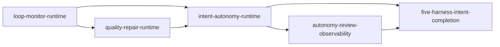

# Unit of Work 依存DAG — Vertical Redo

## 上流入力とedge semantics

本DAGは`application-design/components.md`、`component-methods.md`、`services.md`、`component-dependency.md`、`decisions.md`と`requirements-analysis/requirements.md`から、end-to-end behavior間の前提だけを抽出する。

M00〜M09のmodule import DAGとUnit DAGは別物である。各vertical Unitは複数owner moduleへ変更を加えるが、moduleの依存方向やownerは変えない。Unit edgeは「consumer behaviorがprovider behaviorの公開contractを必要とする」ことだけを表し、実装順、critical path、Bolt groupingを選ばない。

## Machine-readable edges

```yaml
units:
  - name: loop-monitor-runtime
    depends_on: []
  - name: quality-repair-runtime
    depends_on: [loop-monitor-runtime]
  - name: intent-autonomy-runtime
    depends_on: [loop-monitor-runtime, quality-repair-runtime]
  - name: autonomy-review-observability
    depends_on: [intent-autonomy-runtime]
  - name: five-harness-intent-completion
    depends_on: [intent-autonomy-runtime, autonomy-review-observability]
```

## Prose DAG



テキスト代替: U1を前提にU2、U1/U2を前提にU3、U3を前提にU4、U3/U4を前提にU5が成立する非循環DAGである。

## Direct edgeの根拠

| Consumer Unit | Provider Unit | Integration point | 根拠 |
|---|---|---|---|
| quality-repair-runtime | loop-monitor-runtime | normalized contribution、MonitorEvent、Judge route/latch/replay | #2096は#2095のgeneric Monitorを使う |
| intent-autonomy-runtime | loop-monitor-runtime | stop/resume、stable identity、result envelope | #2067は非生産loopを安全停止する |
| intent-autonomy-runtime | quality-repair-runtime | mode別activation、quality convergence | `semi/full`は不備を健全化して進む |
| autonomy-review-observability | intent-autonomy-runtime | decision/grant projection、review queue | review/status対象のcanonical decisionが必要 |
| five-harness-intent-completion | intent-autonomy-runtime | grant completion、workflow terminal、5harness contract | full autonomy behaviorが完了判定の対象になる |
| five-harness-intent-completion | autonomy-review-observability | completed Intent read/review/status contract | completion後もreview限定appendとstatus sealを維持する |

## Module ownerとの接続

| Unit | 変更するowner module | production wiring | harness/verification |
|---|---|---|---|
| loop-monitor-runtime | M00、M01、M02、M06、M07、M08、M09 | M06 event delivery→M07 append | 5harness Monitor contract/Judge live |
| quality-repair-runtime | M01、M03、M06、M07、M08、M09 | M06 activation/evidence/route→M07 append | 5harness Quality contract/live/replay |
| intent-autonomy-runtime | M04、M05、M06、M07、M08、M09 | gate/question/grant/park/resume atomic path | 5harness mode/grant/decision contract |
| autonomy-review-observability | M05、M06、M07、M09 | read/review/status/Event Registry/OTel | active/completed snapshots and provenance |
| five-harness-intent-completion | M04、M06、M07、M08、M09 | authorization→receipt→atomic terminal | 5 native live scenarios and persistence |

同じmoduleを複数Unitが変更してもownerは分割しない。後続Unitは既存owner APIを使用し、新interfaceが必要ならそのUnit内でprovider implementation、production consumer、testを同時に追加する。架空のextension registryやmodule逆importを作らない。

## Integration contractと共有resource

| Resource | 正規owner | Unitでの利用規則 |
|---|---|---|
| wire values / graph revision | M00 / M01 | U1で成立し、U2〜U5は意味を変更せず利用する |
| canonical audit / state | M07 | 全Unitのdomain planはM06がtransactionへ集約し、M07だけがappendする |
| Monitor / Plugin | M02 / M03 | U2以降はpublic interfaceだけを使いalgorithmをforkしない |
| grant / decision | M04 / M05 | U3で成立し、U4/U5はprojection/terminal contractを利用する |
| generic live authorization | M08 / U1 | U1でauthorization port/protected event/commit bindingを実配線し、U2〜U5は同じ経路を再利用する |
| harness registry / receipt validation | M08 | 各Unitはそのbehaviorのflag/adapter/配線/testを同時に追加し、U5は5harness集合/terminal validationだけを拡張する |
| contract/live runner | M09 | production stateを変更せず、M00〜M08の公開interfaceを検証する |

## 並行開発可能性

5 Unit間にdependency-free pairは宣言しない。同じowner moduleを複数verticalが変更するため、DAG上のtransitive independenceだけで安全な並行編集とはみなさない。Delivery PlanningがBolt sequenceとworktree conflictを評価する。

## DAG検証条件

- 5 Unitをexactly once宣言し、unknown/self/duplicate/cycleを拒否する。
- YAMLとMermaid/proseのdirect edge集合を一致させる。
- U3のU2依存は#2067→#2096、U2のU1依存は#2096→#2095のIssue依存を保つ。
- M05/M06→M08などのmodule importをUnit edgeへ誤変換せず、各vertical内部の既存owner wiringとして扱う。
