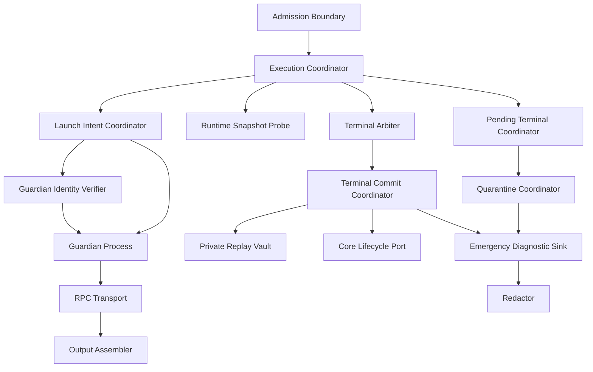

# Pi Child Execution Driver — Logical Components

## 目的と設計境界

本component mapは `business-logic-model` の一child attempt配送、pending-terminal回復、guardian process containment、RPC解析、terminal commitを実装単位へ分ける。エンジン条件により `security-requirements` と `tech-stack-decisions` は非適用で、cloud/infrastructure componentは追加しない。すべてBun/TypeScriptの同一package内module、短命guardian/Pi process、既存core lifecycle portである。

## Component inventory

| Component | Responsibility | State ownership | Failure domain |
|---|---|---|---|
| `PiChildAdmissionBoundary` | raw requestをadmission unionへparse | なし | 1 request、process 0 |
| `PiChildExecutionCoordinator` | sequenceを所有しportsを束ねる | invocation-local | 1 child attempt |
| `PiPendingTerminalCoordinator` | stale scan、1-page claim、current reconcile | lease/attempt metadataはcore | bounded batch + current key |
| `PiQuarantineCoordinator` | index snapshot、per-key fence、poison/clear | machine-local durable index | 1 poisoned key、visibility failure時はinvocation |
| `PiRuntimeSnapshotProbe` | executable/version/platform/profileを一観測化 | immutable snapshot | new permit 1件 |
| `PiLaunchIntentCoordinator` | nonce/intent/acceptance/GO順序 | launch factsはcore | 1 launch |
| `PiGuardianProcess` | awaiting-go、ephemeral identity、authenticated control、Pi group spawn/proxy/reap | private key + OS process group | 1 child process tree |
| `PiGuardianIdentityVerifier` | accepted public keyとのchallenge-response、peer UID、signed extinction検証 | fresh challengeだけ | 1 guardian channel |
| `PiRpcTransport` | JSONL command/response/event I/O | pending correlation map | 1 RPC session |
| `PiAssistantOutputAssembler` | assistant text blocksをfinal outputへ構成 | bounded in-memory buffer | 1 child output |
| `PiTerminalArbiter` | first semantic cause、cleanup/audit override | invocation-local latch | 1 result |
| `PiTerminalCommitCoordinator` | settling→pending→terminal、reconcile/replay | lifecycle + private vault | 1 delivery key |
| `PiPrivateReplayVault` | raw resultのAEAD保存/復元/retention | machine-local encrypted files | 1 record、key loss時replayのみ |
| `PiChildAcknowledgmentService` | opaque handleのack/purge | core retention metadata | 1 replay payload |
| `PiChildRedactor` | diagnostic/audit free-formのbounded redaction | なし | 1 emitted record |
| `PiEmergencyDiagnosticSink` | canonical write不能時のfailure visibility | bounded machine-local record | diagnosticsのみ、success authorityなし |

## Dependency direction



テキスト表現: public admissionはexecution coordinatorだけを呼ぶ。coordinatorは回復/quarantineを先に処理し、new permitだけをruntime probeとlaunchへ渡す。guardian配下のRPC observableからterminal arbiterがcandidateを決め、commit coordinatorがcore lifecycleとprivate vaultへ確定する。emergency diagnosticはredactorを通るが、canonical lifecycleへ逆依存せずsuccess authorityを持たない。

### Allowed dependency rules

1. native Pi knowledgeは`PiRuntimeSnapshotProbe`、`PiGuardianProcess`、`PiRpcTransport`に閉じる。
2. core pool/dependency/retry policyをdriver componentへ複製しない。
3. lifecycle storeはportとして注入し、filesystem vault/quarantine implementationをcore domainへ逆流させない。
4. `PiChildRedactor`はdiagnostic sinkから呼べるpure componentとし、redaction failure時にraw bytesを返さない。
5. guardianはcore stateを直接読まず、nonce付きinitial pipeとaccepted public keyに束縛されたauthenticated control protocolだけを話す。driver/recoveryはpersisted PID/PGIDへ直接signalしない。
6. vaultはterminal factを決めず、commit coordinatorが渡したcanonical resultを暗号化するだけ。

## Execution sequence

### New delivery

```text
Admission
  → stale/pending scan
  → quarantine snapshot + current-key fence
  → reserve
  → [new only] runtime snapshot
  → launch intent
  → guardian awaiting-go + ephemeral public key
  → PID/PGID/public-key process acceptance commit
  → GO
  → RPC handshake/prompt/events
  → terminal arbiter
  → authenticated guardian command
  → signed group shutdown/extinction、またはkill-armed + original handle reap + ESRCH
  → encrypted replay payload + terminal prepare
  → terminal commit
  → durable result + acknowledgment handle
```

new以外のterminal replay / in-progress / conflict / quarantinedはprobe/guardian/RPC componentへ到達しない。

### Pending terminal recovery

```text
Pending coordinator claims bounded page with lease
  → commit prepared fact
  → success: terminal + replay available
  → failure: attempt/ticket update
  → update failure: per-key fence + poison quarantine
  → quarantine failure: visibility-failed, current spawn blocked
```

claim時のcore lockはsnapshot/lease取得後に解放する。batch pathはleaseを持ったままfenceを待つ可能性をなくすため、lifecycle write failure後のpoison処理はlogical leaseの解放/非待機失敗処理を確定してからfenceへ入る。current-key pathはfence内で`wait:false` CASだけを実行し、leaseを待たない。

## Failure domains と blast radius

| Failure | Isolated blast radius | Propagation rule |
|---|---|---|
| Admission parse | current raw request | core/audit/processへ進めない |
| Runtime probe | current new permit | existing replay/reconcileは継続可能 |
| Guardian/RPC | authenticated current process group | typed terminalへ収束、identity不明ならsignalせずquarantine |
| Output overflow | current result | truncated success禁止 |
| Terminal commit | current delivery key | pending+vault保持、duplicate respawn禁止 |
| One poison pending record | one key after quarantine | bounded batchは他recordへ進む |
| Quarantine visibility failure | current invocation | reserve/probe/spawn禁止 |
| Private vault key loss | affected replay payload set | original result捏造/respawn禁止、doctor remediation |
| Emergency diagnostic failure | current invocation | visibility-failed、success禁止 |

shared lifecycle store、quarantine index、master replay keyは複数deliveryへ影響するshared resourceである。したがってread/visibility/key failureは「一件だけ無視」せずfail-closedし、doctorが修復対象を示す。

## State ownership

### Invocation-local

- validated request / runtime snapshot
- pending command correlation
- output buffer
- first-cause latch、cleanup/audit override
- AbortSignal/deadline、guardian control channel

process終了とともに破棄し、restart回復へ依存させない。

### Core durable lifecycle

- delivery key/fingerprint/reservation
- launch intent、accepted PID/PGID、session identity
- settling、pending terminal、terminal audit fact
- lease、reconcile ticket/attempt、ack/retention metadata

driverはcore portのclosed unionだけを消費し、store formatを推測しない。

### Machine-local durable

- guardian manifest（run中のみ）
- guardian control socket（run中のみ）とaccepted ephemeral public key（core lifecycle fact）
- quarantine index/fence
- encrypted private replay payload/master key
- bounded emergency diagnostic

全pathはrepository外またはgitignore済みruntime rootへ置き、generated distributionやintent artifactへ混入させない。

## Resource bounds

このdriver instanceは常に1 childだけを所有する。1〜4の総concurrency、queue、dependency、retry admissionは既存core poolが所有する。

| Resource | Bound owner | Exhaustion behavior |
|---|---|---|
| Pending reconciliation | `reconciliationBatchLimit` 1 page/invocation | 続きは次invocation、同run paginationなし |
| Stale scan | `staleScanLimit` | 検出結果をstructured batchへ、failureでspawn禁止 |
| RPC record/output | selected profile/policy capacity | typed protocol/capacity failure |
| stderr diagnostic | bounded redacted tail | truncation flag、raw overflow破棄 |
| Shutdown | authenticated guardian graceful/TERM/KILL/reap deadlines | identity、extinctionまたはkill-armed+original-handle+ESRCH未確認なら追加signalせずreap failure |
| Quarantine fence | bounded acquisition | visibility-failed、blocking retryなし |

無制限cache、thread pool、connection pool、network queueは導入しない。

## Security control placement

| Control | Owning component | Independent verifier |
|---|---|---|
| branded request / canonical key | Admission Boundary | contract/property test |
| exact binary snapshot | Runtime Snapshot Probe | version/file identity fixture |
| launch-before-GO audit / birth identity | Launch Coordinator + Guardian Identity Verifier | crash-window、PID/PGID reuse real process test |
| strict JSONL profile | RPC Transport | captured 0.83 fixture + invalid frames |
| output selection/capacity | Output Assembler | multi-message/tool/thinking fixtures |
| secret-free persistence | Redactor + Commit Coordinator | canary corpus scan |
| encrypted replay | Private Replay Vault | real filesystem tamper/restart test |
| process tree extinction | Guardian | descendant timeout/cancel test |
| quarantine ordering | Pending + Quarantine Coordinators | cross-process concurrency property |

## Operational integration

- doctorはruntime probe selector、quarantine visibility、replay vault availability、stale/pending countsをread-onlyに診断するが、clear/purge/trust承認を自動実行しない。
- statusはworkflow stateのみを読み、driver processを起動しない。
- emergency diagnosticはremediationとopaque key digestを返し、task/persona/output/pathを表示しない。
- stale/quarantine/replay cleanupは明示commandまたはcore retention policyで行い、driver成功経路のbest-effort cleanupにしない。

## Verification boundaries

Unit testは各componentのclosed unionとpure parser/redactorを検証する。integration testはreal filesystem、production lifecycle port、guardian/process group、Pi RPC captured fixtureを接続する。cross-unit support/reviewer/swarm live journeyはconformance Unit所有であり、本Unitは共通driver componentと実行可能inventoryを提供する。

成功条件はcomponentの存在ではなく、次のobservableで判断する。

- invalid request / duplicate / quarantine / replay pathでnative spawn count 0。
- acceptance commit前crashでPi process count 0。
- timeout/cancel後のsigned guardian extinction、またはkill-armed+original handle reap+ESRCHとprocess group member 0。
- guardian消失またはPID/PGID再利用時にunrelated processへのsignal 0。
- terminal commit failure後もpending recordとvault payloadが残り、duplicate respawn 0。
- secret canaryがaudit/diagnostic/manifest/metadataで0。
- concurrent lease/fence traceでdeadlock 0、terminal二重commit 0。
