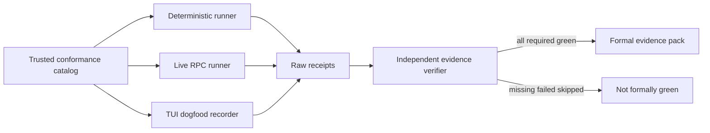

# Pi Conformance Evidence — Business Logic Model

## 目的と上流トレーサビリティ

この Unit は `unit-of-work` が割り当てる cross-unit integration / E2E、RPC live driver、TUI dogfood、formal green evidence を所有する。`unit-of-work-story-map` の SCN-001〜009 と M1〜M10、`requirements` の FR-VAL-001〜002および全 FR / NFR を検証対象にする。`components` の `PiLiveJourneyHarness`、`component-methods` の `runPiLiveJourney`、`services` の短命 Fixture/Live Validation を実装し、新しい常駐 service、database、専用 test runner、provider credential 配布は行わない。

## 全体パイプライン

テキスト表現: verifier と同じ source revision に束縛された適合 catalog から deterministic、live RPC、TUI dogfood の実行計画を導出する。formal runは実行前にsingle-use challengeを取得し、trusted recorderとoperator/CI attestorが起源を証明する。各 runner はattested raw receiptを出し、独立 verifier が起源・全digest・必須証拠を再計算してgreenの場合だけ正式packを構成する。skip、自己申告status、自己署名bundle、文書チェックボックスだけからformal greenは作れない。

## Algorithm 0: Formal run challenge と trust root

content digestは改変を検出するが、偽のplatform/process/audit chainを最初から自己整合して作るproducerを識別しない。formal-eligible runは次の事前protocolを必須とする。

1. `FormalEvidenceTrustPolicy` をtrusted catalogから読み、許可されたchallenge issuer、recorder binary digest、CI OIDC issuer/repository/workflow identity、operator SSH public-key fingerprintを検証する。private keyやtokenをrepositoryへ置かない。
2. trusted recorderはrun開始前にephemeral Ed25519 run keypairを生成し、public key、run kind、expected OS、source commit、candidate/catalog/test-source digest、Pi executable digestをchallenge requestへ入れる。
3. challenge issuerはpolicyとrequestを検証し、256-bit random nonce、run ID、全digest、recorder public key、expected OS、issued/expiry、issuer key IDを含む`PiEvidenceChallenge`へ署名する。challengeはappend-only ledgerへ`issued`として記録する。
4. recorderはissuer signatureを検証したchallengeだけを受理し、同じprocessのplatform syscall、Pi child PID/executable、TTY/RPC event、audit boundaryを直接観測する。raw receiptとchallenge digestをephemeral run keyで署名する。
5. live RPCのformal runは、許可されたCI workload identityがbundle digest、commit、runner OS、workflow/run identityへ発行したartifact attestationを追加する。manual TUIは、policyにあるoperator SSH keyが最終bundle digest、challenge digest、観測OS、interactive checklist completionへ署名する。
6. verifierはissuer signature、recorder signature、CI attestationまたはoperator signature、recorder binary digest、identity claims、expiry、source/digest一致を検証してからchallengeをatomicに`consumed`へ遷移させる。unknown/self-signed key、別repository/workflow、expired/reused challenge、OS/commit/digest差分はnon-accepted。
7. development runはchallenge/attestationなしでも実行できるが、result型を`UnattestedDevelopmentRun`としformal assemblerへ渡せない。

CI attestationは既存CI pipelineへ追加するjob/stepで発行し、新しい常駐serviceや専用test runnerを導入しない。manual TUIのoperator署名はhuman assertionを起源認証するtrust rootであり、hardware platform attestationを装うものではない。その限界とsigner fingerprintをevidenceへ残す。

## Algorithm 1: Trusted catalog の解決

1. 実行中 verifier に埋め込まれた `ConformanceContractVersion` と expected catalog digest を読む。
2. `PiConformanceCatalog` を package/build artifact から読み、schema version、source revision、canonical digest を検証する。
3. catalog が参照する各 Unit の exported inventoryを同じ source revision から解決し、owner、test selector、requirements、expected observable の集合を canonical sort する。
4. `requirements` 由来の正準 requirement registryと比較し、M1〜M10、全 FR / NFR、SCN-001〜009について missing / extra / duplicate ownerを計算する。
5. catalog 取得不能、digest mismatch、unknown schema、coverage差分があれば全依存 run を `blocked-by(pi.conformance.catalog)` とし、実行前に non-green で終了する。observed test treeや evidence pack から期待 catalog を再構成しない。

固定件数を合格条件にしない。requirements registry と catalog の ID set 完全一致を合格条件にする。

## Algorithm 2: Deterministic conformance suite

`runDeterministicConformance(plan)` は既存 Bun test infrastructure 上で、各 Unit の test selectorを実際に起動する。別の test frameworkや status-only manifestを作らない。

1. 検証 commit と worktree cleanliness を取得する。sourceに未追跡・未commit変更がある場合、development receiptは作れるが formal-eligibleにはしない。
2. candidate、runtime catalogs、captured fixture、guide contract、test source のdigestを取得する。
3. catalog順に test processを起動し、argv、cwdのrepository-relative表現、start/end、exit、signal、stdout/stderr digest、structured assertionをreceiptへ記録する。
4. 各 testについて、少なくとも一つの production observable（file set/hash、audit event、state pointer、child terminal、doctor check等）が変化または期待値一致したことを要求する。`assert true`やfixture自身が期待eventを生成するテストは拒否する。
5. cross-unit scenarioを次の順序依存ではなく独立 fixtureとして実行する。

| Journey ID | 操作 | 必須 observable |
|---|---|---|
| `pi.setup.fresh-status` | 空 projectへsetup fresh、trust後status | resource catalog一致、engine directive、doctor healthy |
| `pi.package.local-git` | local/git packageを別fixtureへ導入 | normalized path/hash集合がsetupと一致 |
| `pi.gate.no-input` | gateまで進み回答せず終了 | awaiting維持、HUMAN_TURN=0、GATE_APPROVED=0 |
| `pi.rpc.non-human` | RPCで回答相当入力 | HUMAN_TURN=0、GATE_APPROVED=0、advance=0 |
| `pi.child.roles` | support/reviewer/swarm | role/parent-child/terminal chain、pool<=config |
| `pi.install.update-recover` | N→N+1、failure/interruption |管理対象一致、利用者file保持、rollback/recovery |
| `pi.doctor.negative` | capability、0.82.x、Windows fixture | typed failure、state/artifact mutation=0、status/doctor可 |
| `pi.guides.catalog` | 日英guide/porting catalog | typed fact、link、registry双方向一致 |
| `pi.regen.twice` | package/promoteを連続2回 | normalized digest一致、git diff=0 |

6. mutation suiteは registration 1件削除、resource+target manifest entry同時削除、event mapping削除、driver terminalのsuccess丸め、guide fact polarity反転に加え、self-signed challenge、正規署名の別payload再署名、消費済みchallengeの別run replay、darwin/linux claim差替え、wrong CI workload attestationを行い、対応 guardが実際に赤になることを確認する。
7. 全 receiptを `DeterministicRunBundle` としてcontent-addressed保存し、original process outputから再計算可能にする。

## Algorithm 3: Opt-in live RPC journey

`runPiLiveJourney(input, signal)` は `AMADEUS_PI_RPC_LIVE=1` が明示され、Pi binary、provider/auth、supported OSが揃う場合だけ実行する。未充足は理由付き `SkippedLiveRun` であり、formal evidence候補には入らない。formal modeではAlgorithm 0の未消費challenge、challengeに束縛されたrecorder public key、対応するCI workload attestation policyもpreflight必須であり、欠落時は`UnattestedDevelopmentRun`としてのみ開始できる。

### Isolation

1. `mkdtemp` で project root、`PI_CODING_AGENT_DIR`、session dir、evidence scratchを別々に作る。
2. credential valueは既存環境/credential storeからPiへ渡すが、copy、hash、preview、stdout転記をしない。receiptはprovider identifierとcredential source kindだけを持つ。
3. package/setup candidateは検証commitから生成し、そのdigestを固定する。外部 network更新を混ぜない。
4. test harnessは operatorが選んだtrust設定を明示的にPi CLIへ渡すが、Amadeus extension / installer自身がtrustを承認した証拠にはしない。別のfresh-untrusted journeyで自動承認0を確認する。

### RPC protocol

1. exact resolved executableを `--version` で検査し、`>=0.83.0` とsupported OSを確定する。
2. `pi --mode rpc --no-session` をspawnし、line framing、handshake、session identityを検証する。
3. status / doctor / workflow promptを一件ずつ送り、Pi event streamとAmadeus audit shardをrun IDで相関する。
4. gate到達後にRPC inputを送り、canonical HUMAN_TURN=0、GATE_APPROVED=0、stage awaiting、continuation advance=0を検証する。自動 journeyは承認成功を期待しない。
5. support、reviewer、pool=1/2/4 swarmを起動し、親子chain、role、concurrency counter、terminal result、reapを確認する。0/5はspawn前validation failureである。
6. normal shutdownを要求し、deadline超過時はkill/reapする。cancel/timeout/agent failureをgreenへ変換しない。
7. secret / prompt / home path redaction scanをraw stdout/stderr、audit subset、structured receiptへ実施する。scan不能はfailure。

live resultは `LiveSucceeded` / `LiveFailed` / `LiveCancelled` / `SkippedLiveRun` / `UnattestedDevelopmentRun` のdiscriminated unionであり、`SkippedLiveRun` と `UnattestedDevelopmentRun` にformal converterを提供しない。formal `LiveSucceeded` はrecorder run signatureとCI artifact attestationを両方持つ。

## Algorithm 4: TUI dogfood recording

TUI dogfoodはmacOSとLinuxでそれぞれ一回以上必要で、自動RPC journeyと共有しない。

1. clean検証commit、Pi>=0.83.0、provider/auth、supported OS、candidate digest、trusted recorder binary digestをpreflightする。recorder ephemeral public keyとexpected OSを含むissuer-signed single-use challengeを取得し、そのrun IDだけを使用する。
2. 人間が実Pi TUIを起動し、skill discovery、status、doctor、通常workflow、question/gate回答、support、reviewer、pool swarmを操作する。
3. recorder extensionは観測だけを行い、inputを生成しない。`input.source=interactive` のcanonical HUMAN_TURN、GATE_APPROVED、settled後continuation、session/tool/audit chainをrun IDへ結ぶ。
4. 最後に人間がTUI内のevidence commandをinteractive inputとして実行し、表示済みchecklistを承認する。このcommandは直前のinteractive HUMAN_TURNと未使用nonceを要求し、RPC / extension sourceではreceiptを作らない。
5. recorderは自身が直接観測したplatform syscall、Pi PID / executable digest、TTY identity、UI項目、canonical audit subchain、doctor、child results、candidate/environment fingerprintから`TuiDogfoodReceipt`を作り、challengeに束縛されたephemeral run keyで署名する。人間入力本文、prompt、credentialは保存しない。
6. 人間operatorはTUI上の最終表示とchallenge digestを確認し、policy登録済みSSH keyでbundle digest、observed OS、interactive checklist completionを署名する。自己署名keyや未登録keyはdevelopment receiptにしかならない。
7. verifierはchallenge issuer、recorder、operatorの署名chain、recorder binary digest、challenge expiry/消費状態を検証し、macOS receiptとLinux receiptを別environment keyとして要求する。同一run / OS claim差替え / duplicate nonce / 別run replayを拒否する。

TUI sourceはPiの公開 `input.source=interactive` 契約の範囲でhuman provenanceとし、許可済みoperator signatureでその観測を明示的にattestする。recorderの署名済みplatform observationはhardware attestationではないため、その限界をevidence metadataに明記する。ただし起源不明の自己申告receiptより強いtrust boundaryを持ち、署名chain不成立時はformal非適格である。

## Algorithm 5: Formal evidence assembly

`assembleFormalEvidence()` はraw receiptをコピーして成功statusを書く処理ではなく、独立 verifierの合格結果からのみ呼べる。

1. 全 bundleのschema、source commit、clean receipt、candidate/catalog/test-source digest、issuer-signed challenge、recorder signature、CI artifact attestationまたはoperator signatureを照合し、異なるsource revisionや起源不明bundleの混在を拒否する。
2. deterministic receiptについてprocess exitとstructured assertionをraw output/audit/file snapshotから再計算する。
3. live RPCはskipなし、exit=0、Pi>=0.83.0、supported OS、provider identifier、live flag、canonical audit assertions、redaction pass、許可CI workload identityのartifact attestationを要求する。最低1件必要。
4. TUI dogfoodはdarwinとlinuxの双方について、interactive HUMAN_TURN、GATE_APPROVED、continuation、doctor、support/reviewer/swarm、challenge消費、trusted recorder signature、許可operator signatureを要求する。
5. coverage matrixをrequirements registryから再計算し、全 M/SCN/FR/NFRに少なくとも一つの合格receiptを結ぶ。単一receiptが複数要件を満たすことは許すが、evidence IDとobservableを明記する。
6. native Windows negative、0.82.x negative、trust / missing capability negativeを必須とする。
7. bundle manifest、receipt digest、audit subchain digest、coverage edgeをcanonical sortしてevidence root digestを生成する。
8. `FormalPiConformanceEvidence` を書き、別processの `verify-formal-evidence` で再検証する。verifier green receiptが得られた場合だけ正式完了候補とする。

## 再実行・失敗・中断

- 同じrun IDの再利用を拒否する。再実行は新run IDとし、古いfailure/skipを上書きしない。
- process中断時は完成済みreceiptだけを保持し、bundleに`incomplete` markerを置く。incompleteはformal assembly対象外。
- raw receipt欠落、digest mismatch、audit chain断絶、coverage gap、redaction scan failureはfail-closed。
- flaky timeoutを再実行する場合、最初のfailureと再実行receiptの両方を保持し、正式packは採用run IDと採用理由を示す。failureを削除してgreenだけ見せない。
- formal evidenceの有効性は検証commitとcatalog digestに束縛される。sourceが変わればstaleであり再利用しない。
- self-signed challenge/receipt、許可keyでの別payload再署名、別run challenge replay、OSだけを差し替えたbundleは起源検証failureとして保持し、formal inputにしない。

## Review — Iteration 1

- **Verdict:** NOT-READY
- **Reviewer:** amadeus-architecture-reviewer-agent
- **Date:** 2026-08-03T14:31:09Z
- **Iteration:** 1
- **Scope decision:** none

coverageと受理条件は閉じているが、content-addressed receiptだけでは実機・人間操作・OSを自己申告で偽造できる。

### Findings

- BLOCKER | independent verifierはraw receiptから結果を再計算するが、そのraw receipt自体の発行主体・実行起源を認証する契約がない。content address、bundle digest、fresh nonceは改変検出には使えても、任意のproducerがdarwin/linux、interactive HUMAN_TURN、GATE_APPROVED、provider/auth、exit 0を含む自己整合したreceiptとaudit chainを最初から生成することを防げない。そのため実機TUI未実行でもFR-VAL-001/002のformal greenを構成できる。formal受理対象は、verifierが実行前に発行したsingle-use challengeへrunId・source/executable/catalog digestを束縛し、信頼境界外のrunner/recorderが観測したplatform・process・interactive provenanceを署名またはCI artifact attestation付きで返したreceiptに限定する必要がある。手動TUIについてもoperator assertionだけでなく、trusted recorder identity、challenge consumption、darwin/linux別attestationの検証失敗をnon-acceptedにし、自己生成・再署名・別run replayのnegative fixtureを追加する必要がある。

## Review — Iteration 2

- **Verdict:** READY
- **Reviewer:** amadeus-architecture-reviewer-agent
- **Date:** 2026-08-03T14:34:24Z
- **Iteration:** 2
- **Scope decision:** none

issuer challenge、recorder署名、CI/operator attestation、atomic consumptionによりformal evidenceの起源・platform・run再利用が検証可能となり、既知の自己申告経路は閉じている。

### Findings

- None
