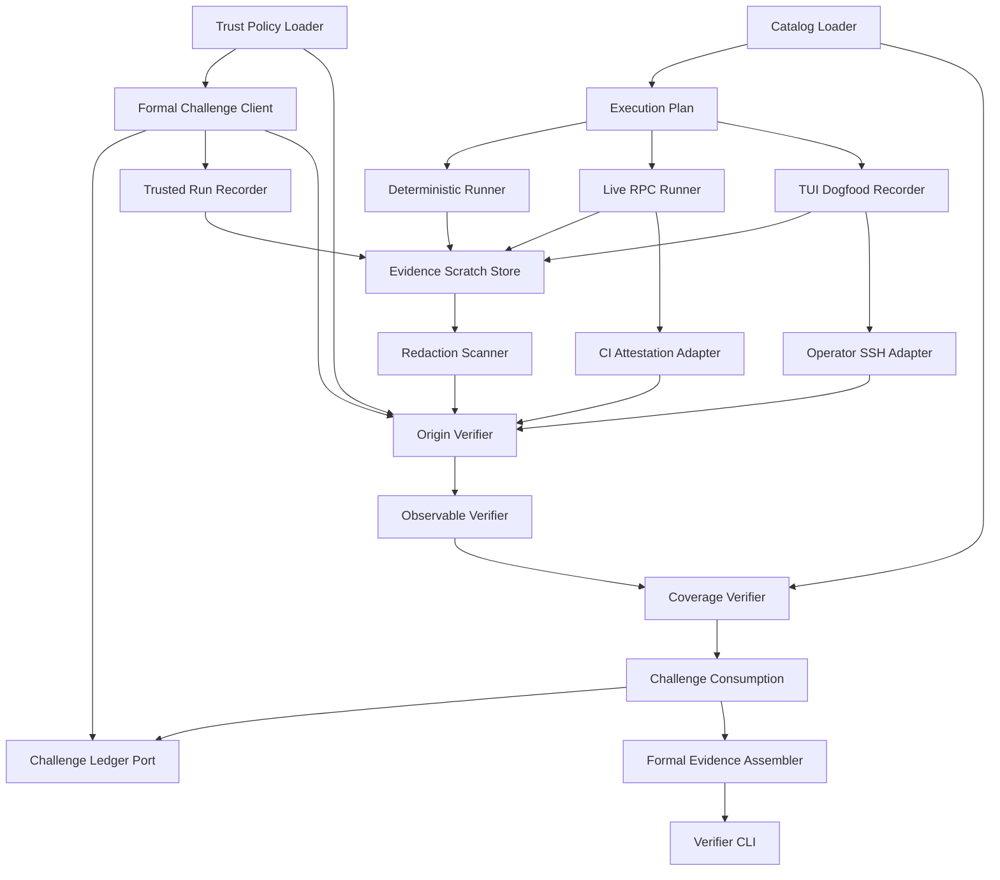

# Pi Conformance Evidence — Logical Components

## 目的と設計境界

本component mapはtrusted catalog、challenge/ledger、deterministic/live/TUI runner、trusted recorder、attestation、raw receipts、independent verification、coverage、formal pack assemblyを実装単位へ分割する。条件付きの `security-requirements` / `tech-stack-decisions` は期待どおり非適用で、既存Bun tests/CIと短命local process/filesystem portだけを使う。

## Component inventory

| Component | Responsibility | State ownership | Failure domain |
|---|---|---|---|
| `PiConformanceCatalogLoader` | module-bound catalog/requirement registry解決 | immutable trusted catalog | whole plan |
| `FormalEvidenceTrustPolicyLoader` | issuer/recorder/CI/operator trust roots | immutable trusted policy | formal eligibility |
| `FormalChallengeClient` | signed challenge request/verify | invocation-local challenge | 1 run |
| `ChallengeLedgerPort` | issued/consumed append-only CAS | issuer-owned durable ledger | issuer identity |
| `TrustedRunRecorder` | ephemeral key、platform/process/event/audit観測署名 | run-local key/observations | 1 run |
| `DeterministicConformanceRunner` | existing Bun selectors/journeys実行 | raw process receipts | deterministic bundle |
| `PiLiveRpcRunner` | opt-in isolated RPC journey | process/session scratch | 1 live run |
| `PiTuiDogfoodRecorder` | non-generating TUI observation/checklist receipt | recorder scratch | 1 OS run |
| `CiArtifactAttestationAdapter` | workload artifact attestation取得/parse | signed attestation bundle | 1 CI run |
| `OperatorSshAttestationAdapter` | namespaced operator signature取得/parse | signed operator assertion | 1 TUI run |
| `EvidenceScratchStore` | owner-only bounded raw artifacts | machine-local temporary files | 1 run bundle |
| `EvidenceRedactionScanner` | secret/prompt/path scanとsafe projection | なし | 1 artifact/bundle |
| `EvidenceOriginVerifier` | challenge/recorder/CI/operator chain検証 | verification-local | 1 bundle |
| `ProductionObservableVerifier` | exit/assertionをraw stateから再計算 | verification-local | 1 journey |
| `ConformanceCoverageVerifier` | requirement registryからcoverage再計算 | verification-local graph | whole evidence set |
| `FormalEvidenceAssembler` | accepted receiptsからcanonical pack生成 | final content-addressed pack | 1 evidence revision |
| `FormalEvidenceVerifierCli` | fresh processでpack再検証 | なし | 1 pack |

## Dependency direction



テキスト表現: trusted catalogからexecution plan、trust policyからchallengeを作る。runner/recorderはraw artifactだけをscratchへ出し、自分のgreenを決めない。scanner通過後、origin verifierが署名chain、observable verifierがproduction state、coverage verifierがrequirement registryを独立検証する。全合格後にchallenge consumption CASを行い、assemblerがpackを作り、別process verifierが再検証する。

### Allowed dependency rules

1. runner/recorderはformal assembler、coverage verdict、challenge consumptionを呼ばない。
2. challenge ledgerはtest/evidence statusを決めず、signed state transitionだけを所有する。
3. content digestはorigin verifierを迂回するsuccess authorityにならない。
4. CI/operator adapterはprivate token/keyを返さずsigned bundleだけを返す。
5. redaction前raw artifactをassembler/reportへ渡さない。
6. coverage verifierはobserved test/evidence setからexpected requirementsを生成しない。
7. assemblerはskip/unattested/incomplete result型を受け取れない。
8. fresh verifier CLIはrunner in-memory stateへ依存しない。
9. no component owns provider credential distribution or trust approval。

## Formal run sequence

```text
trusted catalog/policy
  → clean source/candidate/test/recorder/Pi digest snapshot
  → recorder ephemeral public key
  → issuer-signed single-use challenge + issued ledger receipt
  → deterministic/live/TUI execution and direct recorder observation
  → recorder-signed raw receipt
  → CI artifact or operator SSH attestation
  → bounded artifact import + redaction scan
  → origin signature/identity verification
  → production observable recomputation
  → requirement coverage recomputation
  → challenge consumed CAS
  → canonical evidence pack
  → fresh-process verification
```

development runはchallenge/attestationなしでrunnerまで実行できるが、`UnattestedDevelopmentRun`としてorigin/coverage/formal assembly pathへ型上到達しない。

## State ownership

### Trusted immutable

- conformance catalog/requirement registry digest
- evidence trust policy、issuer/recorder/CI/operator public identities
- source/candidate/test/recorder/Pi executable digests

### Issuer durable

- ledger identity/genesis/head/hash chain
- issued/consumed/rejected challenge records
- signed consumption receipts

private issuer keyはledgerに保存しない。

### Run-local ephemeral

- recorder Ed25519 private key
- process/session/TTY handles
- provider credential reference（value非観測）
- raw observation buffers/deadlines

### Machine-local temporary

- isolated project/PI_CODING_AGENT_DIR/session/evidence scratch
- bounded raw stdout/stderr/audit/file snapshots

owner-onlyで、formal packにはscanner通過したstructured projection/digestだけを移す。

### Final durable evidence

- challenge/issuer/recorder/CI/operator public claims/signatures
- canonical receipt/observable/coverage digests
- adopted/prior run references、failure/skip history references
- evidence root digest、fresh verifier receipt

credential、prompt、home/private path、private keysを含めない。

## Failure domains and blast radius

| Failure | Isolated blast radius | Propagation rule |
|---|---|---|
| Catalog/policy integrity | all formal runs | development-only、formal assembly 0 |
| Challenge issuer/ledger | one issuer/formal admission | unsigned nonce fallback 0 |
| One deterministic selector | journey/bundle | required coverage non-green |
| Live process/provider | live run | deterministic/TUI history保持、formal gap |
| One OS TUI | environment key | other OSで代替せずformal gap |
| Recorder/signature | run | content digestだけで受理0 |
| CI/operator attestation | run kind | unattested developmentのみ |
| Redaction/artifact import | artifact/bundle | raw fallback/persistent pack 0 |
| Challenge consume | final assembly | pack write 0、same nonce reuse 0 |
| Fresh verify | evidence revision | formal green候補0 |

## Resource bounds

| Resource | Bound | Exhaustion behavior |
|---|---|---|
| Challenge | run IDごと1、single-use | duplicate/replay拒否 |
| Test selectors/journeys | trusted catalog finite set | unknown/extra拒否 |
| Child processes | runner policy/pool 1..4 | timeout/cancel/reap、retry自動greenなし |
| stdout/stderr/audit/snapshot | byte/file/count caps | oversize failed receipt |
| Artifact parse | depth/path/count/decompressed bytes caps | import reject |
| Ledger lock | bounded acquisition | formal blocked、steal推測なし |
| Retry history | bounded index + content-addressed files | failureを削除せずcapacity failure |

background daemon、database、remote queue、unbounded retry、専用test frameworkは導入しない。

## Operational integration

- deterministic suiteは既存Bun test selectorを起動し、status manifestだけを信じない。
- live RPCは`AMADEUS_PI_RPC_LIVE=1` opt-inとprovider/auth/supported OSを要求する。未充足skipは日常CIでは有効だがformal非適格。
- TUI dogfoodはmacOS/Linux別challenge/receipt/operator signatureを要求する。
- CI attestationは既存pipeline job/stepへ接続し、新serviceを運用しない。
- failed/skipped/retried receiptを上書きせず、正式packは採用理由を記録する。
- source/catalog/test変更で既存packをstaleとし再利用しない。

## Verification boundaries

Unit testはcanonical signed payload、policy parser、ledger reducer、result-type admission、coverage graph、redactorを検証する。integration testはreal filesystem lock/fsync、concurrent consumption、fake issuer/recorder/CI/SSH signatures、fake process/artifactを接続する。actual Pi live/TUI journeyはこのUnit自身がopt-inで所有する。

成功条件はcomponentの存在ではなく次のobservableで判断する。

- self-signed/wrong identity/field-resigned/replayed/OS-flipped bundleのformal accepted 0。
- concurrent challenge consumption accepted最大1。
- skipped/unattested/incomplete resultからformal pack生成0。
- raw assertion改ざんがproduction observable再計算でfail。
- requirement/catalog/evidence edge同時削除でもcoverage gap。
- process timeout/cancel後child/process group残存0。
- token/prompt/home/private-key/private-backup canaryがpack/report/snapshotで0。
- fresh verifier greenかつ同source/digest時だけformal候補。

このUnitはcross-unit正式evidenceを所有するが、各production Unitのruntime contractやtest inventoryを編集・捏造しない。
