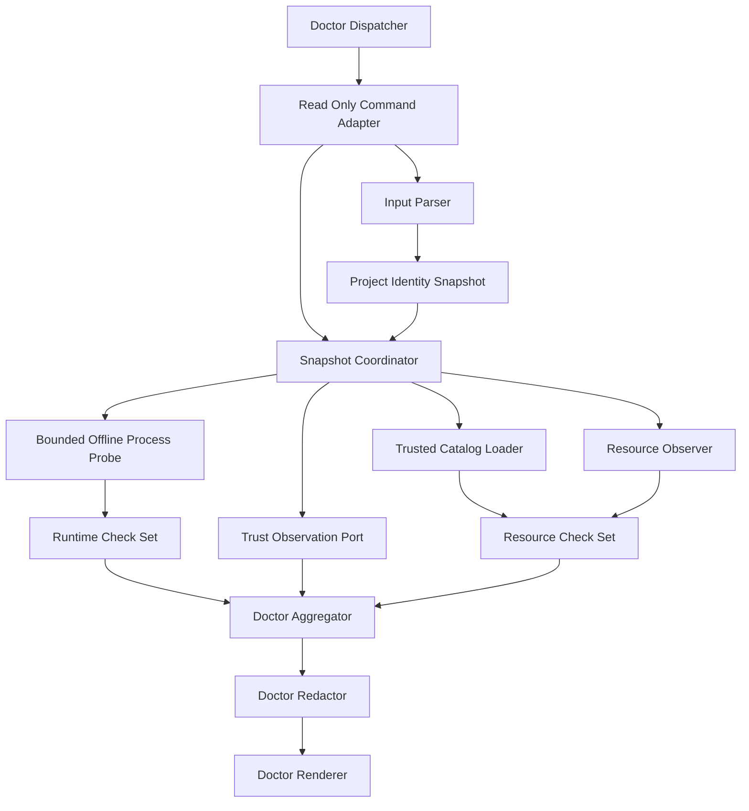

# Pi Doctor Diagnostics — Logical Components

## 目的と設計境界

本component mapはPi doctorのinput parse、immutable snapshot、trusted catalog、runtime/trust/resource/driver check、aggregation、redaction/renderingを実装単位へ分ける。条件付きの `security-requirements` / `tech-stack-decisions` は期待どおり非適用で、すべてBun/TypeScriptの短命read-only module/process portである。

## Component inventory

| Component | Responsibility | State ownership | Failure domain |
|---|---|---|---|
| `PiDoctorInputParser` | project/platform/env/contextをclosed input化 | なし | 1 invocation |
| `ProjectIdentitySnapshot` | canonical root identity固定 | immutable run snapshot | 1 project |
| `TrustedPiDoctorCatalogLoader` | module-bound expected catalog検証 | immutable catalog | resource check set |
| `PiDoctorSnapshotCoordinator` | sourceごと一回観測/immutable化 | invocation-local | 1 doctor run |
| `BoundedOfflineProcessProbe` | Pi/Bun/driver exact process probe | temporary process state | 1 probe |
| `PiRuntimeCheckSet` | executable/version/platform/Bun classify | なし | individual checks |
| `PiTrustObservationPort` | nativeまたはsaved/default read-only observation | immutable trust fact | trust check |
| `PiResourceObserver` | skill/extension/route/driver filesystem metadata | immutable resource facts | 1 resource/route |
| `PiResourceCheckSet` | catalog対比とblocked-by dependency | なし | resource checks |
| `PiDoctorAggregator` | stable order/status/exit/primary failure集約 | invocation-local result | whole report |
| `PiDoctorRedactor` | raw observation/errorをsafe factへ投影 | なし | 1 check result |
| `PiDoctorRenderer` | structured JSON/human output生成 | なし | presentation only |
| `PiDoctorDispatcher` | harness=`pi`のcheck composition | static registry | one harness report |
| `PiReadOnlyCommandAdapter` | extension/core/setup CLI entrypoint接続 | なし | one command route |

## Dependency direction



テキスト表現: dispatcherはPi identityでPi check setだけを選ぶ。adapter/parserがread-only inputを作り、snapshot coordinatorがproject/catalog/process/trust/resourceを一度ずつ観測する。pure check setが独立結果へ分類し、aggregatorがstable order/exitを決める。redactor後のtyped reportだけをrendererへ渡す。renderer/adapterからobserverやmutation portへの逆依存はない。

### Allowed dependency rules

1. doctor componentへwrite/trust approval/install/state/audit mutation portを注入しない。
2. target resource observerはtrusted catalogを生成せず、catalog loaderと独立する。
3. process probeはcheck statusを決めず、bounded raw observationを返す。
4. check setはrenderer/locale/terminalへ依存しない。
5. redactor前のraw exception/outputをaggregator/report/rendererへ渡さない。
6. driver probeはchild execution/model providerへ依存しない。
7. blocked lifecycle health latchからdoctor registration/read pathへ依存しない。
8. Pi dispatcherは他harness check moduleをcomposeしない。

## Execution sequence

```text
closed input parse
  → canonical project identity
  → trusted expected catalog load/verify
  → one-time immutable observations
  → stable-ID pure checks（independent, no short-circuit）
  → primary/blocked-by normalization
  → redaction
  → stable aggregation/status/exit
  → JSON or human rendering
```

catalog failureでもruntime/trust等の独立checkは完走し、resource/package/driver checkだけをblocked-byにする。executable failureでもplatform/Bun/trust/filesystem checkを継続する。同一原因のremediationはprimary failureへ集約する。

## State ownership

### Invocation-local immutable

- project/platform/environment allowlist input
- exact Pi/Bun executable identityとbounded process output parse
- native/saved/default trust fact
- target resource/install/package metadata snapshots
- trusted catalog envelope
- typed check result/report

run終了時に破棄し、workspaceへcacheしない。

### Machine-local temporary

- neutral owner-only process probe cwd
- bounded child process handles/timers

cleanup failureでもproject treeへfallbackせず、次runのexpected catalogやsuccess authorityにしない。

### External read-only sources

- Pi/Bun executable
- global Pi trust/settings
- target project resource tree/install/package manifest
- doctor module-bound expected catalog

doctorはこれらへwriteしない。

## Failure domains and blast radius

| Failure | Isolated blast radius | Propagation rule |
|---|---|---|
| Input/project parse | invocation | filesystem/process probe 0 |
| Catalog integrity | resource/package/driver checks | independent runtime/trust checks継続 |
| One process probe | corresponding check | remaining checks継続、child reap |
| Trust parse | trust check | resourceをloadせずmetadata check継続 |
| One resource read | resource/route subcheck | sibling checks継続 |
| Redaction | affected diagnostic/report unhealthy | raw output fallback 0 |
| Renderer | requested presentation | typed report statusは不変 |
| Dispatcher registry drift | Pi report composition | formal doctor success 0 |

## Resource bounds

| Resource | Bound | Exhaustion behavior |
|---|---|---|
| Process probes | fixed Pi/Bun/optional driver、順次 | check error、parallel forkなし |
| Probe time | 2秒/check | terminate/reap |
| stdout/stderr | fixed byte cap/check | oversize error、tail/raw非表示 |
| Catalog/manifest/trust JSON | byte/depth/entry count cap | parse error |
| Resource reads | expected + observed bounded union | overflow unhealthy、recursive scanなし |
| Diagnostic | fixed fields/path/digest prefix | truncation flag、raw fallbackなし |

network connection、background daemon、model call、unbounded recursive filesystem walk、retry loopは導入しない。

## Operational integration

- extension `amadeus-doctor`、core/setup CLI、test fixtureは同じparser/check/aggregatorを使う。
- direct CLIはuntrusted projectで使えるが、project-local codeをloadしない。
- status/doctorはhealth latch/journal/workflowを修復せず、read-only remediationだけを返す。
- JSON reportのstable check ID/status/observed/expected/remediationをmachine consumerの正本とし、人間labelをparseさせない。
- exit 0はrequired check全pass、fail/unsupported/errorが1件でもあれば1、not-applicableのみは影響なし。

## Verification boundaries

Unit testはclosed parser、check table、blocked-by/primary aggregation、trust reducer、redactor、rendererを検証する。integration testはreal filesystem、fake executable/process tree、bounded neutral cwd、module-bound catalog、Pi-only dispatcherを接続する。

成功条件はcomponentの存在ではなく次のobservableで判断する。

- doctor run前後のproject/settings/trust/state/audit/session filesystem diff 0。
- target resource+manifest同時削除でもresource/package fail。
- missing Piでもplatform/Bun/trust/resource checks完走。
- hang/fork/oversize/malformed processがdeadline内にtyped errorとなりprocess残存0。
- untrusted/unresolvedでprompt/load/approve 0。
- setup/package route片方driftが独立fail。
- secret/home/trust-other-project/private-root canaryがtext/JSON/error/child argv/envで0。
- repeated runのnormalized JSON、check order、exit、filesystem digestが一致。

実Pi setup/package/live journeyはconformance Unitが所有し、本Unitはproduction doctor componentとdeterministic fixture seamを提供する。
