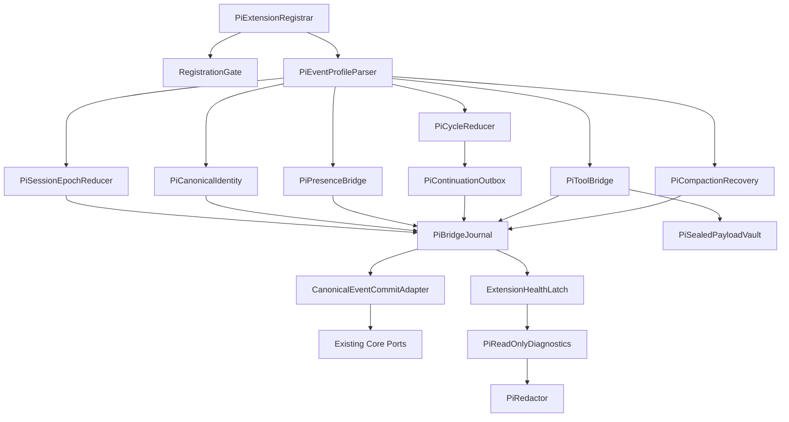

# Pi Lifecycle / Gate Adapter — Logical Components

## 目的と設計境界

本component mapは `business-logic-model` のregistration、mandatory event journal、canonical commit、presence、agent settlement、tool lifecycle、compaction recoveryを実装単位へ分割する。条件付きの `security-requirements` / `tech-stack-decisions` は期待どおり非適用であり、cloud/infrastructure componentは追加しない。すべてBun/TypeScriptの同一Pi extension package内module、既存core port、machine-local runtime storageである。

## Component inventory

| Component | Responsibility | State ownership | Failure domain |
|---|---|---|---|
| `PiExtensionRegistrar` | API/port parseとhandler/command登録 | module-local API registry | 1 extension instance |
| `RegistrationGate` | all-or-nothing activation | module-local closed/open latch | registered handler set |
| `PiEventProfileParser` | 0.83+ discriminator/source/payloadをclosed union化 | なし | 1 native event |
| `PiSessionEpochReducer` | session replacement、epoch、start/shutdown identity | durable journal metadata | 1 session epoch |
| `PiCanonicalIdentity` | event key/fingerprint canonical bytes | なし | 1 event identity |
| `PiBridgeJournal` | write-ahead reserve、replay、receipt/outbox state | machine-local durable metadata | 1 event、visibility failure時はextension |
| `PiSealedPayloadVault` | recovery用raw tool payloadのAEAD保存 | machine-local encrypted files | 1 payload、key loss時はvault全体 |
| `CanonicalEventCommitAdapter` | core `commitOnce` とsubreceipt再開 | commit stateはcore | 1 canonical event |
| `ExtensionHealthLatch` | first mandatory failure、blocked/reconcile | machine-local durable latch | extension workflow-changing surface |
| `PiPresenceBridge` | native source検証とHUMAN_TURN mint | presence receiptはcore | 1 input delivery |
| `PiCycleReducer` | cycle/attempt/settled CAS、continuation turn観測 | durable journal + core turn receipt | 1 agent cycle |
| `PiContinuationOutbox` | same-session appendとturn開始receiptの分離 | durable outbox + Pi session entry | 1 settlement cycle |
| `PiToolBridge` | start/end対応、Pre/PostToolUse fact | pending executionはjournal | 1 tool call |
| `PiCompactionRecovery` | checkpoint、fresh-state mission reinjection | checkpoint/outboxはjournal | 1 compaction attempt |
| `PiReadOnlyDiagnostics` | blocked理由、pending、remediation表示 | なし | diagnosticのみ |
| `PiRedactor` | metadata/audit/diagnosticをbounded safe factへ投影 | なし | 1 emitted record |

## Dependency direction



テキスト表現: registrarはclosed gateの内側へparser付きhandlerを登録する。各native eventはprofile parseとcanonical identityを通り、journal reserve後に所有bridgeへ渡る。すべてのmandatory core副作用はcommit adapterだけを通る。presence/cycle/tool/compactionは互いを直接呼ばず、journal receiptとcore portで連携する。failureはhealth latchへ集約し、diagnosticはredactorを通るが成功authorityを持たない。

### Allowed dependency rules

1. Pi固有type/event/session APIはregistrar、profile parser、outbox、compaction deliveryに閉じる。
2. stage routing、gate decision、sensor applicability、audit semanticsをadapterへ複製しない。
3. journalはcore commit成功を決めず、durable core receiptだけを保存・再開する。
4. vaultはpayload contentを決めず、journal metadataやauditから一方向に分離する。
5. presence bridgeはcycle/outbox/custom messageからhuman provenanceをmintしない。
6. continuation entry appendはturn実行のsuccess authorityではなく、cycle reducerがcoreへcommitしたtoken-bound `CONTINUATION_TURN_OBSERVED` receiptだけがauthorityである。
7. health latchは個別bridgeへ逆依存せず、typed failure/reconciliation receiptだけを受ける。
8. read-only diagnosticsはhandlerを起動、outboxを配送、latchをclear、stateを修復しない。

## Event execution sequence

### Mandatory event

```text
Native callback
  → registration/health check
  → closed profile parse
  → session epoch + canonical identity
  → journal reserve
  → owner bridge reduction
  → core commitOnce
  → durable canonical receipt/subreceipts
  → journal core-committed
  → native typed result
```

duplicateは保存済みreceiptへ短絡し、owner bridgeのcore副作用を再実行しない。conflict/failureはhealthをblockedにし、success resultへ変換しない。

### Session-start reconciliation

```text
session_start reserve
  → current session/epoch binding
  → bounded pending journal scan
  → unfinished core subreceipt resume
  → continuation/mission outbox same-session entry verify
  → continuation turn-observed receipt verify
  → core state validation
  → reconciliation receipt
  → health healthy
  → SESSION_STARTED commit
```

別session outbox、vault tamper、identity conflict、未検証append、またはentry-appendedだがturn-observedでないcontinuationが残る場合はhealthyへ遷移しない。曖昧なcontinuationをsession startから自動再送・自動完了しない。1 invocationでbounded pageだけを処理し、残件があればblocked/pendingを返して同期retry loopを行わない。

### Continuation activation

```text
settled core decision
  → outbox prepared(token, target session)
  → current-session token absence verify
  → sendMessage(triggerTurn:true)
  → active-path custom entry reread
  → entry-appended receipt
  → native agent_start
  → nearest unconsumed token entry + new cycle binding
  → core CONTINUATION_TURN_OBSERVED commitOnce
  → outbox turn-observed
```

appendからturn receiptまでのcrashは `blocked-ambiguous` であり、delivery successではない。manual re-arm coordinatorはprocess generation変更、same-session active path、entry後native cycle/assistant/core receipt 0をproduction probeで証明した場合だけ、旧outboxの `superseded-without-turn` commit後に新tokenを発行する。証明不能ならsignal/append/turnを起こさない。

## State ownership

### Module-local

- Extension API object identity registry
- closed/open registration gate
- current callback-local parsed event / redaction buffer

process restart回復には使わない。

### Machine-local durable

- event reservation/fingerprintとsession epoch/cycle/attempt metadata
- pending tool executionとsealed payload reference
- continuation/mission outbox、entry-appended、blocked-ambiguous state
- compaction checkpoint
- extension health latchとreconciliation receipt
- encrypted raw recovery payload/master key

runtime rootはrepository外またはgitignore済みpathに置き、intent artifact、generated distribution、audit shardへ混入させない。

### Core durable

- canonical event commit、audit/sensor/state-validation subreceipts
- token/entry/cycleに束縛されたcontinuation turn-observed / superseded receipt
- HUMAN_TURNとgate state
- workflow stage/state、continuation directive
- active intent UUIDとmission recovery fact

adapterはcore store formatを推測せず、closed port/result unionだけを消費する。

### Pi native session store

- current session identity
- custom continuation / mission entries
- native event orderingとcompaction entry identity

adapterはPi session storeをcore state正本にせず、delivery tokenのsame-session existence verificationにだけ使う。

## Failure domains and blast radius

| Failure | Isolated blast radius | Propagation rule |
|---|---|---|
| Profile parse | current event | journal/core mutation 0、health blocked |
| Partial registration | one extension instance | gate closed、read-only診断のみ |
| Identity conflict | one key、extension health | workflow-changing event全停止 |
| Journal visibility/write | extension instance | success authorityへfallbackしない |
| Core subreceipt failure | one canonical event | pending保持、完了済みsuboperation再実行0 |
| Vault record tamper | one payload | raw fallback/respawn禁止、health blocked |
| Presence mint failure | one input + extension health | inputを承認扱いしない |
| Outbox mismatch/failure | one cycle/attempt | cross-session配送0、pending保持 |
| Entry append後turn未観測 | one continuation + extension health | 自動完了/再送0、証拠付きmanual recoveryのみ |
| Tool protocol mismatch | one call + extension health | PostToolUse/sensor 0 |
| Compaction checkpoint/reinject | one attempt | cancelまたはblocked、summary fallback 0 |
| Shared health/reconciliation state unreadable | extension surface | read-only remediation以外停止 |

shared journal root、master key、health latchのvisibility failureは複数eventへ影響するため、一件だけ無視せずextension全体をfail-closedにする。

## Resource bounds

| Resource | Bound | Exhaustion behavior |
|---|---|---|
| Handler registration | API instanceごと1 set | duplicate拒否 |
| Pending reconciliation | 1 bounded page/session start | 残件はpending、同期paginationなし |
| Session entry token scan | selected profileのbounded recent entries | verification不能としてblocked |
| Diagnostic/redaction | bounded fields/bytes | truncation flag、raw fallbackなし |
| Tool update | bounded digest/rate | update破棄可、mandatory endは維持 |
| Sealed payload | policy capacity/retention | new workflow-changing event blocked |
| Continuation | settled cycleごとoutbox 1件、activation receipt 1件 | adapter retry loopなし、曖昧時blocked |
| Mission recovery | compaction attemptごとoutbox 1件 | overflowでも追加turn 0 |

thread pool、remote queue、network connection、unbounded in-memory event cacheは追加しない。

## Operational integration

- status/doctorはregistration profile、health first cause、pending counts、vault availability、outbox session mismatchをread-only表示する。
- remediationはopaque event/token digestと安全なrelative identifierだけを示し、prompt/tool payload/home pathを出さない。
- status/doctorはpending replay、latch clear、outbox append、stage advanceを実行しない。
- cleanup/retentionは明示core policyまたはackに従い、failure経路のbest-effort削除でevidenceを失わない。
- unsupported Pi version/platform、missing mandatory event、registration driftはformal parity failureであり、advisory successへ縮退しない。

## Verification boundaries

Unit testはprofile parser、identity serialization、redactor、gate/latch state machine、cycle/tool reducersを検証する。integration testはproduction core commit port、real filesystem journal/vault、captured Pi 0.83 event fixture、real Pi session custom-entry APIを接続する。

成功条件はcomponentの存在ではなく次のobservableで判断する。

- partial registrationでworkflow mutation 0。
- RPC/extension/unknown sourceでHUMAN_TURN/GATE_APPROVED各0、interactive duplicateでHUMAN_TURN 1。
- 全commit crash境界でaudit/sensor/state mutation各高々1。
- duplicate settledでengine continuationとPi turn各高々1。
- append直後/trigger queue直後/agent start直前crashでentryをturn成功扱いせず、自動再送0。token-bound agent start後だけturn-observed 1。
- session replacement時のcross-session custom message 0。
- tool duplicate/`tool_result`併発でもPostToolUse各1。
- compaction duplicateでmission entry高々1、overflow extension triggerTurn 0。
- prompt/image/tool/credential/home-path canaryがaudit、journal metadata、diagnostic、custom detailsで0。

cross-unit live support/reviewer/swarm journeyとformal evidence bundleはconformance Unitが所有し、本Unitはproduction adapterと検証可能なcomponent境界を提供する。
