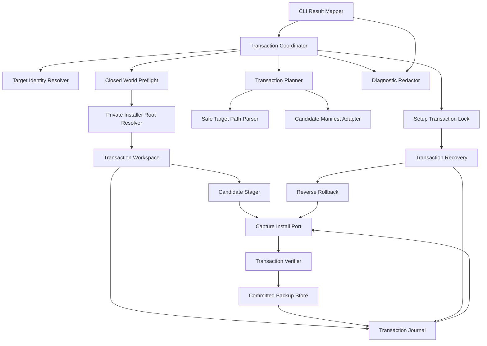

# Setup Transaction Safety — Logical Components

## 目的と設計境界

本component mapはsetup `Plan`をrecoverable filesystem transactionへ変換するadmission、preflight、WAL、capture/install、verification、backup、commit/rollbackを実装単位へ分割する。条件付きの `security-requirements` / `tech-stack-decisions` は期待どおり非適用であり、追加componentはすべてBun/TypeScriptのlocal moduleとfilesystem portである。

## Component inventory

| Component | Responsibility | State ownership | Failure domain |
|---|---|---|---|
| `SetupTransactionCoordinator` | 全sequenceとclosed resultを所有 | invocation-local | 1 transaction |
| `TargetIdentityResolver` | target/parent canonical identity固定 | immutable snapshot | 1 target |
| `SafeTargetPathParser` | relative path、containment、collision検証 | なし | 1 plan |
| `SetupTransactionLock` | cooperative exclusive admission/stale判定 | owner-only lock record | 1 target identity |
| `SetupTransactionRecovery` | mandatory scan、rollback/commit cleanup | journal + observation | 1 unresolved transaction |
| `SetupTransactionPlanner` | upstream Planをclosed action/fingerprintへ正規化 | immutable plan | 1 candidate plan |
| `CandidateManifestAdapter` | manifest bytes/digestをmutation前に準備 | immutable candidate | 1 manifest |
| `ClosedWorldPreflight` | target/source/backup全集合検査 | immutable before snapshot | 1 plan |
| `PrivateInstallerRootResolver` | same-FS working-tree外rootを解決/検証 | immutable private-root lease | 1 target |
| `TransactionWorkspace` | private root内stage/quarantine作成 | machine-local private metadata | 1 transaction |
| `SetupTransactionJournal` | phase/entry WAL、atomic+fsync更新 | durable journal | 1 transaction |
| `CandidateStager` | self-contained staged bytes生成/検証 | stage files | 1 entry |
| `CaptureInstallPort` | atomic capture、hard-link no-clobber install/restore | filesystem inode | 1 entry |
| `TransactionVerifier` | after/preserve/remove/backup/manifest照合 | なし | 1 transaction |
| `CommittedBackupStore` | captured inode promotion/catalog | durable owner-only backup | 1 transaction |
| `ReverseRollback` | reverse ordinal recovery | journal + artifacts | 1 transaction |
| `SetupDiagnosticRedactor` | safe relative diagnostic投影 | なし | 1 result |
| `SetupCliResultMapper` | closed resultをCLI exit/reportへ変換 | なし | CLI invocation |

## Dependency direction



テキスト表現: coordinatorはtarget lock取得後にrecoveryを必ず先行する。cleanな場合だけplanner/manifest/preflightへ進み、private-root resolverが同一filesystemかつworking tree外のstorageを確定してからworkspace/journal/stagerがprepared stateを作る。mutationはjournal intent後にcapture/install portだけを通り、verifier成功後にbackup storeがcaptured inodeとcatalogを永続化する。journalのcommit decisionはbackup完了後だけである。recovery/rollbackも同じmutation portを使い、CLIはclosed resultだけを解釈する。

### Allowed dependency rules

1. setup Planのpayload classificationはplanner adapterへ入力され、本transaction componentが再分類しない。
2. raw filesystem pathは`SafeTargetPath`へparse後だけworkspace/mutation/backup portへ渡す。
3. transaction/quarantine/backup pathは`PrivateInstallerRootResolver`のsame-device・working-tree外・owner-only receipt後だけ作成できる。Git ignoreだけを安全根拠にしない。
4. journalはactual filesystemを成功authorityにせず、recoveryは両者を必ず突合する。
5. mutation portはoverwrite APIを公開せず、capture renameとinstall/restore no-clobberだけを公開する。
6. verifierはcommit decisionを書かず、backup store完了receiptをcoordinatorへ返すだけである。
7. backup storeはretention/GCを呼ばず、transaction cleanupはcommitted backup rootへ到達しない。
8. CLI mapperはmanifest writeやentry retryを独自実行しない。
9. diagnostic redactorはraw payload/private-root pathを返さず、failure時もraw fallbackしない。

## New transaction sequence

```text
target identity
  → exclusive setup lock
  → mandatory recovery
  → plan + candidate manifest prepare
  → closed-world preflight
  → same-FS working-tree外private root receipt
  → transaction workspace + preparing journal
  → candidate stage and verify
  → prepared journal
  → per entry: capture-intent → capture → verify → install-no-clobber → fsync
  → manifest as final entry
  → whole-plan verification
  → captured inode backup promotion
  → committed backup catalog fsync
  → commit-decided fsync
  → committed cleanup
  → lock release
```

各mutation直前にlock nonce/identityを再検証する。途中failureはcommit decision前ならreverse rollback、decision後ならcommit cleanup recoveryへ収束する。

## Recovery sequence

```text
exclusive lock
  → strict transaction-root inventory
  → closed journal parse
  → actual target/stage/quarantine/backup observation
  → phase × observation classifier
  → rollback | commit-cleanup | clean | blocked
  → per-action fsync receipt
  → terminal journal state
  → safe metadata cleanup
```

複数transaction、unknown content、unknown digest、occupied restore、missing committed backupはblockedであり、new planへ進まない。同じrecoveryを再実行してもcapture/installを重複させない。

## State ownership

### Invocation-local immutable

- target identity snapshot
- normalized action plan/fingerprint
- candidate manifest bytes/digest
- closed-world before snapshot
- current operation ordinal/result

restart回復には使わない。

### Same-filesystem machine-local private metadata

- owner-only lock record
- transaction journal/entry states
- staged candidate files
- captured quarantine inodeとrollback artifacts
- committed backup files/catalog

これらはtargetと同一filesystemだがcanonical working tree / package root外に置き、atomic rename/hard-link semanticsを確保する。Git tracked/untracked/archive、generated distribution、package input、doctor/status artifact list、Amadeus intent artifactへpath/contentを混入させない。

### Target project durable state

- managed/user-preserved files
- install manifest
- explicit user-visible `.bk`

project stateとtransaction metadataを一つのdatabase transactionと仮定せず、WAL順序とfilesystem observationで回復する。

## Failure domains and blast radius

| Failure | Isolated blast radius | Propagation rule |
|---|---|---|
| Target/path parse | current invocation | filesystem mutation 0 |
| Lock busy/uncertain | target identity | transaction admission 0 |
| Recovery ambiguity | target setup surface | new install/upgrade/uninstall全停止 |
| Candidate/manifest prepare | candidate plan | target/journal mutation 0 |
| Preflight conflict | candidate plan | payload/manifest/stage/journal mutation 0 |
| Safe private root unavailable | target setup surface | capture/stage/journal mutation 0 |
| Stage/journal failure | transaction | target payload未変更、cleanupまたはrecovery-required |
| Capture/install conflict | one entry + transaction | reverse rollback、unknown bytes保持 |
| Restore occupied | one entry + target setup surface | artifact保持、automatic overwrite 0 |
| Verify/backup failure | transaction | commit decision 0、rollback/recovery |
| Commit cleanup failure | transaction metadata | after state保持、新transaction停止 |
| Shared installer root unreadable | target setup surface | automatic scan/delete 0 |

## Resource bounds

| Resource | Bound | Exhaustion behavior |
|---|---|---|
| Active transaction | target identityごと1 | busy |
| Unfinished journal | targetごと0または1 | 複数はblocked |
| Plan entries | configured finite maximum | preflight refusal |
| Stage/quarantine/backup bytes | candidate + captured originals | capacity failure、commit前rollback |
| Journal record | bounded per entry metadata | oversized/malformed拒否 |
| Recovery pass | one bounded transaction inventory | unknown/overflowでblocked、paginationなし |
| Diagnostic | bounded entry count/path length | truncation flag、raw fallbackなし |

worker pool、background daemon、remote lock、network retry、unbounded orphan scanは導入しない。

## Durability ordering

| Durable fact | Must precede | Purpose |
|---|---|---|
| preparing journal + parent fsync | stage mutation | orphan ownership確定 |
| staged entry receipt | prepared phase | self-contained recovery |
| capture-intent fsync | target capture | crash後のambiguity縮小 |
| target/quarantine directory fsync | entry applied state | rename/link durability |
| all after-state verification | backup promotion | invalid candidate commit防止 |
| backup file/catalog fsync | commit-decided | original inode永続保持 |
| commit-decided fsync | cleanup | rollback/commit分岐の唯一点 |
| committed/rolled-back fsync | journal removal | replay収束 |

## Operational integration

- install/upgrade/uninstallはcoordinatorのclosed resultをそのままCLI exit/reportへ写像する。
- status/doctorはlock、unfinished journal、backup catalog、blocked artifactをread-only診断し、自動stale steal、rollback、purgeを行わない。
- remediationはtransaction ID、target-relative path、failure code、safe next commandだけを示し、payload/backup本文、absolute path、credentialを出さない。
- committed backup purgeは本Unitの自動cleanup対象外であり、容量警告はread-onlyにする。

## Verification boundaries

Unit testはpath/plan/journal closed parser、phase reducer、observation classifier、redactor、CLI result mappingを検証する。integration/property testはreal filesystem、two-process lock、atomic rename/hard-link、open-FD writer、failure-injected fsync portを接続する。

成功条件はcomponentの存在ではなく次のobservableで判断する。

- conflictでmanaged/user/manifest/journal/stage bytes diff 0。
- concurrent setup admission最大1、journal最大1。
- commit decision前の全crash pointでbeforeへ、decision後はafterへ収束する。
- path replacement/expected-absent createでforeign bytes overwrite/delete 0。
- open-FD write後のbytesがtarget/committed backup/recovery artifactのいずれかに残る。
- recovery 1〜3回でfilesystem digest/identity集合が不変。
- corrupt journal/unknown orphan/restore occupiedでautomatic mutation 0。
- payload/credential/home-path canaryがaudit、CLI、catalog、journal metadataで0。
- private storage path/contentがGit working-tree/archive、package/generator inventory、doctor/status/artifact catalogで0。

Pi setup live journeyとdistribution conformanceは別Unitが所有し、本Unitは全harness共通のtransaction componentとfailure-injection seamを提供する。
