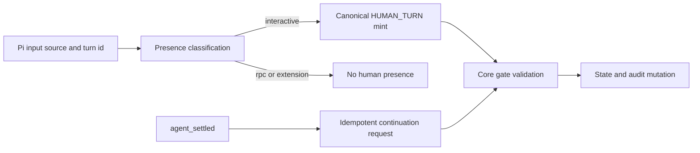
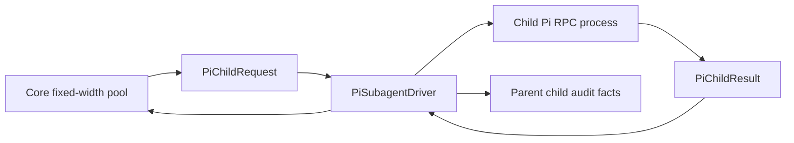
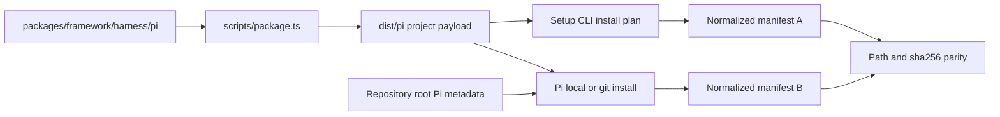

# Pi Coding Agent対応 — コンポーネント依存設計

## 依存原則と上流トレーサビリティ

`requirements`のNFR-MNT-001とCON-003を満たすため、依存方向はPi overlayからharness-neutral coreへの一方向とし、coreはPi event、`.pi` path、Pi Package metadataを知らない。`architecture`の層境界と`component-inventory`の既存registration seamを保つ。`stories`および`team-practices`成果物はscope上存在しないため、利用者flowはSCN-001〜009、実装規律は解決済みmemory rulesへ追跡する。

依存グラフにcycleを作らず、Pi固有コンポーネント同士も型とportで接続する。生成物`dist/pi/`は正本へ逆依存しない。

## 依存マトリクス

`D`は行が列へcompile/runtime依存することを示す。`P`は生成時projection、`R`はruntime call、`T`はtest-only依存である。

| From / To | Core Contracts | Pi Manifest | Pi Extension | Presence Bridge | Pi Driver | Doctor | Package Projection | Live Harness |
|---|---:|---:|---:|---:|---:|---:|---:|---:|
| Core Contracts | - | - | - | - | - | - | - | - |
| Pi Manifest | D | - | - | - | - | - | - | - |
| Pi Extension | R | - | - | D | - | - | - | - |
| Presence Bridge | R | - | - | - | - | - | - | - |
| Pi Driver | R | - | - | - | - | - | - | - |
| Doctor | R | D | - | - | D | - | D | - |
| Package Projection | D | D | - | - | - | - | - | - |
| Live Harness | T | D | R | R | R | R | T | - |

`Core Contracts`からPi列への依存はすべて禁止する。registryへPi valueを追加する変更はgeneric union/mapのdata entryであり、Pi native detailのcore流入とは扱わない。

## データフロー

### Interactive gate

<!-- Text fallback: Pi input sourceを分類し、interactiveだけHUMAN_TURNをmintする。RPC/extensionはpresenceにしない。agent_settledがcontinuationを要求し、coreが両者を検証してstate/auditを変更する。 -->

共有resourceはintent recordとaudit lockである。extensionはfileを直接書かずcore portを呼び、presence idempotency keyはsession/turn/native delivery identityから安定生成する。

### Child execution

<!-- Text fallback: core poolがtyped requestをdriverへ渡し、driverがchild Pi RPC processを制御する。typed resultとaudit factがcoreへ戻り、coreがdependencyとslotを更新する。 -->

driverが共有するのはPi binary path、sanitized environment、workspace、deadlineだけである。pool queue/attempt ledgerはcoreの単一所有とし、support/reviewer用に別driverを作らない。

### Distribution

<!-- Text fallback: authored Pi harnessからdist/piを生成し、setupとrepository root Pi Packageの双方が同じresourceを使う。各導入面のnormalized path/hashを比較して一致を保証する。 -->

## Registration pointと変更伝播

Pi追加は少なくとも次のclosed registryへ同一変更で伝播させる。

| Registry / seam | Pi追加内容 | 検証 |
|---|---|---|
| Harness manifest discovery | `packages/framework/harness/pi/manifest.ts` | manifest schema、package check |
| Mirror/self projection | Pi surface entry | projection parity mutation test |
| Setup domain/layout/reporter | `HarnessName = pi`、`.pi` layout | fresh/update/idempotent setup tests |
| Core harness identity | `pi`、`.pi` mapping | identity/doctor fixture |
| Swarm driver resolution | Pi harness valueとnative driver mapping | resolve + pool contract tests |
| Doctor dispatch | Pi-only check set | positive/negative matrix |
| Documentation/generated inventory | Pi rowとguide link | machine registryとの集合一致 |

registry completenessの正本は`packages/framework/harness/*/manifest.ts`を`package.ts`がschema検証付きでdiscoverしたHarness ID集合とする。`packages/framework/harness/projections.ts`、setup `HarnessName`、core harness identity、swarm、doctor、docs inventoryはこの集合のconsumerであり、parity testが各consumerを正本集合と双方向比較する。固定件数のassertionは使わず、Piを任意consumerから除くmutation fixtureが確実にfailすることを受入条件とする。

## 共有resourceと競合制御

- state/audit: 既存`withAuditLock`とcanonical event schemaを再利用し、Pi独自lock/eventを追加しない。
- filesystem: setup transactionだけが対象projectへ書き、extension/doctorはcore commandまたはread-only probe経由とする。
- process: driverがchild processの唯一ownerで、deadline後のkill/reapまで担当する。
- generated tree: packagerだけが`dist/pi/`を生成し、setup/Pi Packageはconsumerとして扱う。
- setup transaction: `packages/setup`の`SetupTransactionCoordinator`だけがjournal、backup、apply、commit、rollback、recoveryを所有する。Pi overlayはpayloadを供給するだけでtransaction fileへ直接触れない。
- credentials: Pi/provider環境が所有し、manifest、fixture、recordへコピーしない。
