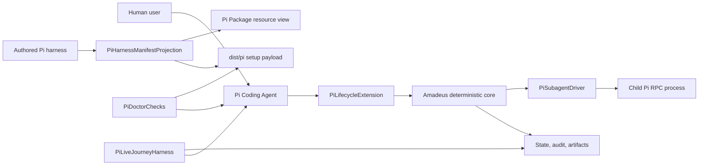

# Pi Coding Agent対応 — コンポーネント設計

## 設計方針と上流トレーサビリティ

本設計は、`requirements`のM1〜M10、`architecture`の「harness-neutral core + harness overlay」境界、`component-inventory`の既存manifest・packager・setup・doctor・swarm seamを具体化する。Pi固有のevent、path、package metadata、child process制御は`packages/framework/harness/pi/`に閉じ、`packages/framework/core/`には既存のharness identity、doctor dispatch、swarm resolution、projection registryを拡張するためのPi識別子だけを追加する。

`stories`と`team-practices`はこの`self-feature` scopeでは生成されていない。したがって、利用者シナリオは`requirements`のSCN-001〜009を正本とし、実装規律は既に解決済みの`org.md`、`team.md`、`project.md`、`phases/inception.md`を適用する。新しいUI applicationやAWS/cloud resourceは設けず、Pi TUI/RPCが既存CLI workflowの利用者境界となる。

<!-- Text fallback: 人間はPiを操作し、Pi extensionがnative eventを共通coreへ渡す。Coreはstate/audit/artifactを所有し、子処理はRPC driverへ委譲する。authored harnessからsetup payloadとPi Package resource viewを生成し、doctorとlive journeyが実環境を検証する。 -->

## コンポーネント一覧

| コンポーネント | 正本 / 配置 | 所有する責務 | 公開境界 | 所有しない責務 |
|---|---|---|---|---|
| `PiHarnessManifestProjection` | `packages/framework/harness/pi/manifest.ts`とPi用authored files | `.pi` layout、`stageEntry`、skills、extension、driver、question annex、生成対象の宣言 | `HarnessManifest`、projection registry entry | event処理、runtime state、手編集の`dist/pi` |
| `PiLifecycleExtension` | `packages/framework/harness/pi/extensions/amadeus-pi-extension.ts` | session/input/agent/tool/compaction eventの正規化、core hook呼び出し、必須能力のfail-closed判定 | Pi公開Extension API、`PiExtensionPorts` | core state transition、独自audit schema、private Pi API |
| `PiPresenceContinuationBridge` | extension内の小さなtyped module | Piが`interactive`と証明したTUI inputだけからHUMAN_TURNを高々1回mintし、`agent_settled`後だけcontinuationを要求 | canonical hook invocation、idempotency key | RPC/extension入力のhuman扱い、gate承認判断、`agent_end`からの早期継続 |
| `PiSubagentDriver` | `packages/framework/harness/pi/tools/amadeus-pi-subagent.ts`等 | support/reviewer/swarm共通のadmission、child spawn、pending-terminal reconcile、RPC、cancel/timeout、typed result、parent-child correlation | `executePiChild(unknown)` / `PiChildExecutionResponse`。内部境界はvalidated `PiChildRequest` / `PiChildResult` | pool順序、retry budget、dependent cancellationの決定 |
| `PiDoctorChecks` | Pi overlay + core doctor dispatch seam | Pi version、Bun、platform、trust、skills、extensions、package resources、driverを個別checkとして診断 | `PiDoctorReport` | trustの承認、Codex/Claude固有configの要求 |
| `PiPackageParityProjection` | authored manifest、`scripts/package.ts`、root package metadata、parity registry | setup payloadとPi Package resource viewの同一resource集合・sha256、生成決定性 | normalized manifest、parity check | npm公開、利用者projectの`package.json`上書き |
| `SetupTransactionCoordinator` | `packages/setup/` | 全file conflictの事前判定、staging、write-ahead journal、backup、apply、commit、rollback、次回起動時recovery | `SetupTransactionPlan` / `SetupTransactionResult` | Pi resourceの内容、harness固有pathの推測 |
| `PiLiveJourneyHarness` | `tests/`のPi fixture/live driver、dogfood checklist | captured fixture replay、RPC live journey、TUI手動検証、実機green evidence | opt-in env contract、evidence record | provider credential配布、日常CIでの無条件live実行 |

## 境界と所有権

### PiLifecycleExtension境界

- `session_start` / resume相当はcanonical session identityへ変換し、重複native deliveryは同じidempotency keyで高々1回にする。
- `input.source`が`interactive`のときだけhuman presence対象とする。`rpc`は通信経路であって人間由来の証明ではないため、`extension`と同様にpresence対象外とする。将来Piが改ざん不能なhuman provenanceを公開した場合だけ、別要件・ADRで拡張する。
- `agent_end`は観測・audit用途に留める。retry、compaction、queued continuationが終わった`agent_settled`だけがengine continuationの候補になる。
- tool lifecycleはPi payloadを既存PostToolUse相当のcanonical入力へ変換し、sensor applicabilityとstate validationをcoreに委ねる。
- 必須portが欠落した場合、workflow-changing operationはtyped blocked outcomeで停止する。status/doctorのread-only pathは別portとして残す。

### PiSubagentDriver境界

- 公開entrypointはraw inputをtyped admission unionへ変換し、valid identityだけを内部requestへ渡す。子Piは`pi --mode rpc --no-session`の独立processとして起動し、workspace、persona/role、bounded task、parent identityをrequestに含める。
- support agent、reviewer、Construction swarmは同じspawn/result contractを使用し、違いはroleとtaskだけにする。
- process lifetimeは`AbortSignal`、deadline、graceful RPC shutdown、期限付きkill/reapで管理し、failure/timeout/cancelをsuccessへ変換しない。
- fixed-width poolのqueue、dependency、attempt、retry admissionは既存coreが所有し、driverはnative acceptanceとterminal factだけを返す。

### 配布境界

- setup CLI向けの`dist/pi/`はproject rootへコピーできる`.pi/` payloadだけを持つ。対象projectのroot `package.json`を上書きしうるPi Package metadataは含めない。
- local/git Pi Packageはrepository rootのpackage metadataから、同じ生成済み`dist/pi/.pi/...` resourceを参照する。
- 両経路はnormalized relative pathとsha256の集合一致を機械検証する。`dist/`、self-install、plugin projectionはauthored sourceから再生成し、直接編集しない。
- setupは全競合をapply前に検出する。適用時はtarget-local transaction dirへ新内容、元file backup、write-ahead journalを用意し、各entryの状態をjournalへ同期してからrename/write/deleteする。成功時だけinstall manifestをcommitしてjournalを消し、失敗時は逆順rollbackする。process interruption後は次回setupの最初に未完了journalを検出し、元状態へrecoverしてから新planを受理する。

## 利用者体験と非対象

Pi利用者の操作面は、project trustを明示承認した後のskill discovery、TUI上の質問・ゲート、RPC上のread-only/非承認操作、`doctor`の診断、Pi native package commandによるlocal/git導入である。extensionが提供するstatusやerrorはPiの既存表示能力へ載せ、独自GUI・Web UI・アクセシビリティ対象を追加しない。RPC live journeyは自動入力がhuman presenceにならないことを含む機械判定用、TUI dogfoodは実human gateと可視体験確認用と役割を分ける。

常駐service、database、AWS resource、native Windows正式保証、Pi 0.83.0未満、公開npm registryへのpublish、`@earendil-works/pi-agent-core`単体の埋め込みAPIは対象外である。

## Review — Iteration 1

- **Verdict:** NOT-READY
- **Reviewer:** amadeus-architecture-reviewer-agent
- **Date:** 2026-08-03T10:46:41Z
- **Iteration:** 1
- **Scope decision:** none

必要な5成果物は揃い、CodeKB境界との対応および依存マトリクス上の循環依存は認められない。一方、human gateの真正性、extension登録のfailure契約、setup更新の原子性に実装不能または安全性を損なう未解決点がある。

### Findings

- BLOCKER | components.md、component-methods.md、ADR-002はinput.source = rpcを一律にHUMAN_TURNとして扱い、ADR-006は自動RPC journey自身が質問・承認を送信してHUMAN_TURNを検証するとしている。RPCは通信経路であって人間由来の証明ではなく、この設計では自動化された入力が承認ゲートを通過できる。これはFR-LIF-003のユーザー回答とFR-GAT-001のhuman gateを破る。人間由来を検証できる追加provenanceを契約化するか、検証不能なRPC入力をpresence対象外にする必要がある。
- BLOCKER | component-methods.mdはすべての結果はdiscriminated unionと定め、registerAmadeusPiExtensionの必須port欠落をtyped failureにすると記載する一方、署名は戻り値voidである。呼出側が登録失敗を判別してworkflow-changing operationをfail-closedにできない契約になっており、FR-GAT-002を一意に実装できない。登録結果のunion型、または明示的なtyped exception契約が必要である。
- BLOCKER | FR-DST-001が要求する複数ファイル更新のatomic rollbackについて、設計にはinstall planの事前計算と失敗時rollbackという結果だけがあり、transactionを所有するcomponent、stage/commit境界、backupまたはjournal、process interruption後のrecovery契約がない。公開メソッドにもplan/apply/commit/rollback/recover境界が存在しないため、対象projectに部分適用を残さないというdata-safety要件をこの設計から実装・検証できない。
- FOLLOW-UP | PiChildResultは成功時だけsessionIdを持ち、failure・timeout・cancelではchildIdも任意である。FR-SUB-002が全terminal fixtureに要求するparent-child/session相関を実装者が推測しないよう、spawn前に確定するattempt/child identity、handshake前だけnullableとなるsession identity、audit start/terminalの順序をPiChildProcessPortsを含めて明示すべきである。
- FOLLOW-UP | component-dependency.mdはregistry completeness用のmachine-readable canonical setを一つ定めるとするだけで、そのowner pathとprojection consumerを決定していない。FR-DST-005の双方向parity/mutation testを実装できるよう、正本となるregistryと各投影方向をADRで固定すべきである。
- NIT | decisions.mdは42 FRと記載するが、requirements.mdに列挙されたFRは30件である。誤った完全性表示を修正すべきである。

## Review — Iteration 2

- **Verdict:** READY
- **Reviewer:** amadeus-architecture-reviewer-agent
- **Date:** 2026-08-03T10:50:39Z
- **Iteration:** 2
- **Scope decision:** none

Iteration 1のBLOCKER 3件はすべて解消された。human presenceはinteractive TUI入力だけに限定され、extension登録はtyped resultを返し、setup更新にはtransaction owner、journal、backup、commit、rollback、interruption recoveryの契約が追加された。

### Findings

- None
