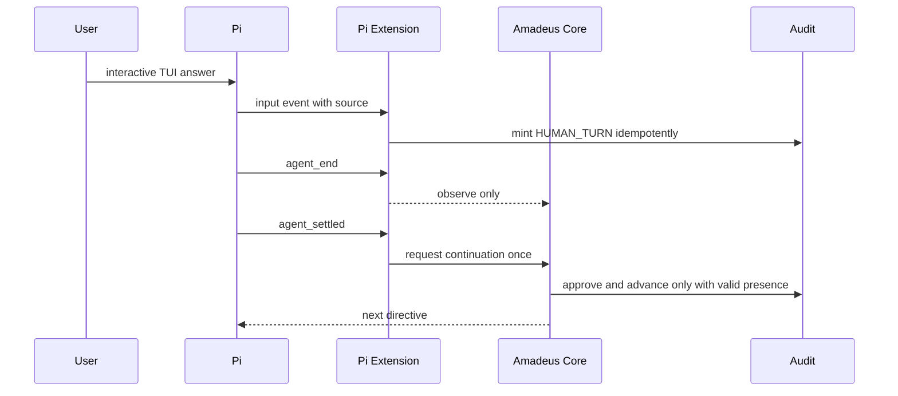
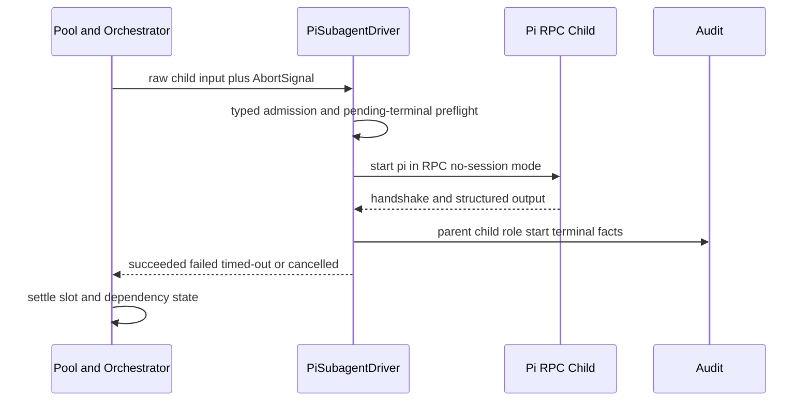

# Pi Coding Agent対応 — サービスと実行ライフサイクル

## サービスモデルと上流トレーサビリティ

`requirements`のCON-001に従い、追加するものはすべて短命なCLI/extension/processであり、常駐service、server、database、AWS/cloud infrastructureはない。`architecture`の4層構成と`component-inventory`のCore、Harness、Distribution、Verificationを保ち、Pi固有runtimeをoverlayに閉じる。`stories`と`team-practices`は本scopeでは成果物がないため、SCN-001〜009と解決済みmemory rulesを実行契約に用いる。

ここで「service」はデプロイ単位ではなく、1回のPi/Amadeus操作中に生存する短命な実行責務を示す。独立スケールするnetwork serviceは存在しない。

## 短命サービス定義

| 実行責務 | 起動契機 | 生存期間 | 通信契約 | スケール / 終了 |
|---|---|---|---|---|
| Pi Extension Runtime | trust済みprojectでPi session開始 | Pi session中 | Pi Extension event → canonical hook invocation | 1 Pi sessionにつき1 instance。session終了時に破棄 |
| Amadeus Core CLI Invocation | skill、hook、doctor、continuation | 単一command | argv/stdin/stdout、record filesystem、typed exit | 逐次・短命。state/audit lockで整合 |
| Child Pi RPC Process | support/reviewer/swarm request | 1 child task | newline-delimited RPC request/response + process exit | fixed-width pool 1〜4。terminal後にreap |
| Setup/Packaging Invocation | package、promote、setup install/update | 1生成または1導入transaction | authored manifest → generated tree / install plan | 逐次。失敗時atomic rollback |
| Doctor Invocation | `doctor` | 1診断 | read-only probes → structured checks | mutationなし。欠落時も完走可能 |
| Fixture/Live Validation | test、opt-in live、manual dogfood | 1 test journey | captured fixtureまたはPi RPC/TUI | CIはfixture中心。liveは明示opt-in |

## Orchestrationパターン

中心パターンはengine-owned orchestrationである。Pi extensionやdriverは事実を正規化して返すだけで、stage routing、gate承認、pool queue、retry admissionを決めない。native eventのchoreographyへstate machineを分散させない。

### 質問・ゲート・継続

<!-- Text fallback: Piがinteractiveと証明したTUI回答でのみHUMAN_TURNを一度記録する。RPC/extension入力はpresenceにしない。agent_endでは継続せず、agent_settled後に一度だけcoreへ継続を要求し、coreがpresenceを検証して承認・遷移する。 -->

failure時はextensionが成功表示を生成せず、blocked check idとremediationをPiへ返す。status/doctorは同じ状態をread-onlyで説明する。

### Subagentとfixed-width pool

<!-- Text fallback: coreがpoolと依存関係を管理し、driverはRPC childを起動してterminal factを返す。auditに親子・role・開始・終了を残し、coreがslot解放と後続可否を決める。 -->

### 配布と導入

authored Pi harnessからpackagerが`dist/pi/.pi/`を生成する。setup CLIはこのproject-root payloadをfresh/update/idempotent transactionで導入する。apply前に全競合を判定し、target-local staging、write-ahead journal、元file backupを作る。全entry適用とinstall manifestのatomic置換後だけcommitし、失敗時は逆順rollbackする。中断journalは次回起動時にrecoverしてから新しいplanを開始する。Pi Package local/git経路はrepository rootのmetadataから同じ生成済みresourceを参照する。両方を生成後manifestで比較し、path/hash mismatchがあれば配布を失敗させる。

## ライフサイクルと運用特性

- Pi Extension Runtimeはsession start/resumeで相関identityを確立し、shutdownが観測できる場合は明示終了、観測不能な異常終了は次回start時の既存reconciliation契約へ渡す。
- Child RPC ProcessはREADY/handshake前をunconfirmed、handshake後をacceptedとして扱う。cancel/timeoutではshutdown要求後に期限付きkill/reapし、孤児processを残さない。
- Setup updateはcandidate N→N+1のplanを先に計算し、利用者変更との競合を検出してから適用する。途中失敗は全体rollbackし、部分導入を成功扱いしない。
- Doctorはcheck単位で結果を集約するため、1件のfailureで残りのread-only probeを止めず、利用者が複数の修正を一度に把握できる。
- Live ValidationはRPCを自動判定の正本にし、skill/lifecycle/read-only診断に加えて自動RPC回答がHUMAN_TURNをmintせずgateを承認しないnegative contractを検証する。actual human approvalはmanual TUI dogfoodで確認する。日常CIの理由付きskipと、正式完了に必要な実機green evidenceを別状態として扱う。

## 可用性・性能・セキュリティ

可用性SLOを持つ常駐serviceはない。信頼性は各短命operationの決定性、idempotency、failure transparencyで測る。Pi adapterの純粋hook overheadはKimi adapter固定baselineとの交互100回medianで検証し、model/network/filesystem I/Oを測定対象から除外する。

Pi project trustはPi本体が所有し、installer/extensionは承認を自動化・迂回しない。provider token、API key、prompt本文、home絶対pathはaudit、doctor、fixture、live evidenceからredactする。Pi Packageが任意codeを実行しうるsupply-chain特性はsource、pin、update、uninstallとともに文書化する。
