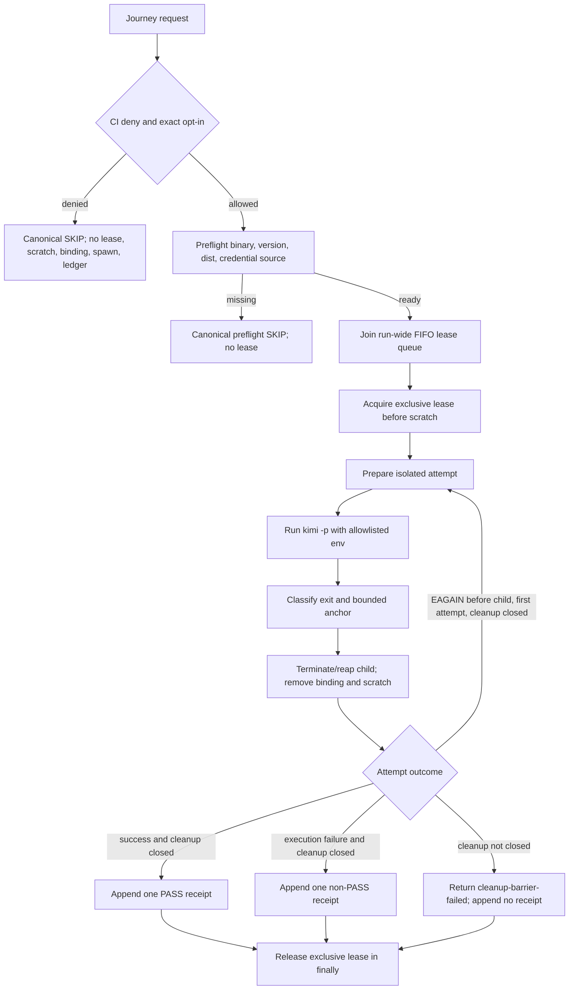

# Business Logic Model — kimi-print-live-e2e

## 入力と責務

本設計は [unit-of-work.md](../../../inception/units-generation/unit-of-work.md)、[unit-of-work-story-map.md](../../../inception/units-generation/unit-of-work-story-map.md)、[requirements.md](../../../inception/requirements-analysis/requirements.md)、[components.md](../../../inception/application-design/components.md)、[component-methods.md](../../../inception/application-design/component-methods.md)、[services.md](../../../inception/application-design/services.md) を入力とする。

`kimi-print-live-e2e`は既存Kimi print mechanicsを共通`LiveAdapter` lifecycleへ移し、旧live pathを残さずlocal green receiptまで閉じるvertical sliceである。共通kernelはgate、run-wide直列化、resource barrier、canonical outcome、ledgerを所有し、Kimi adapterはpreflight、一時home/project、credential binding、`kimi -p`、bounded evidence、process cleanupだけを所有する。

## End-to-end workflow

## Phase algorithm

1. **Gate:** `GITHUB_ACTIONS=true`を最優先denyし、次に`AMADEUS_KIMI_PRINT_LIVE=1`を厳密比較する。deny時はlease、scratch、credential source access、binding、spawn、ledger writeを0回にする。
2. **Preflight:** Kimi binary、version、配布物、認証前提を副作用なしで検査する。不足は閉じたcanonical SKIPに分類し、leaseもprocessも開始しない。
3. **Create request identity and acquire serial lease:** preflight ready後、副作用を持たない`LiveRunRequestIdentity`を一意に発行し、そのrequest IDをowner tokenとして共通`LiveRunScheduler`のprocess-wide FIFO queueへ入る。先行runがある場合はscratch/resourceを作らず待機し、schedulerはqueue先頭の同じowner tokenへexclusive leaseを払い出す。同時にactive leaseは常に1つである。
4. **Bind run and prepare attempt:** lease取得後、request IDを不変fieldとして引き継ぐ`KimiRunIdentity`を生成する。その後に一時projectと一時`KIMI_CODE_HOME`を作る。credentialはコピーせずsourceからscratch内への短命bindingとして作成する。resourceは作成前に`planned`、成功後に`created`へ遷移する。
5. **Build environment:** capability declarationのallowlistからchild environmentを新規構築する。ambient sensitive key、raw credential、source auth/config pathは渡さない。
6. **Execute:** scratch projectをcwdとして短い単一promptを`kimi -p`へ渡す。journey timeoutは既存Kimi driverの既定値を継承して`600_000 ms`とし、包含Bun test timeoutはcleanup余裕を含む`660_000 ms`以上にする。
7. **Bound evidence:** stdout/stderrはtransport port内で各`4_096 UTF-8 bytes`まで取得し、code-point境界で切り詰めてから共通`sanitizeText(..., 512)`へ渡す。永続receiptはredacted diagnosticのSHA-256 digest、exit、anchorだけを持ち、raw prompt/outputを持たない。
8. **Assert and classify:** exit成功とdeterministic anchor成立の両方をPASS候補にする。唯一のretry reasonは、spawn portが`childCreated=false`かつOS error codeが厳密に`EAGAIN`と証明した場合の内部値`kimi-startup-capacity`である。
9. **Cleanup barrier:** 結果にかかわらずprocess boundaryを終了し、全owned descendantをreapし、credential binding、一時home、一時projectを逆順・冪等に除去する。source credentialは変更・削除しない。
10. **Retry:** retryable、attempt 1、anchor未確立、全attempt resource closedの全条件が成立した場合だけ、同じrun-wide leaseを保持したままattempt 2を新しいidentityで開始する。中間attemptはledgerへ書かない。
11. **Finalize:** cleanup成功時だけ最終outcomeを1行appendする。cleanupに失敗した場合、外側の唯一のcanonical errorは常に`cleanup-barrier-failed`であり、元execution outcomeはそのerror payloadの`originalOutcome`として保持する。PASS/non-PASS ledgerはappendしない。
12. **Release serial lease:** ledger成功、ledger失敗、cleanup失敗、例外を含む全終了経路を囲む`finally`でleaseを1回解放し、FIFOの次runを開始可能にする。retry間では解放しない。
13. **Legacy retirement:** adapter journey移行と同時に、旧Kimi live入口、旧skip、ambient env展開、独自cleanupを正規経路から除き、二重live pathを残さない。

## Error and ledger projection

| Execution | Cleanup | External result | Preserved cause | Ledger / matrix |
|---|---|---|---|---|
| success | success | PASS outcome | none | 1行append、`kimi-print` green候補 |
| failure | success | execution outcome | execution diagnostic | 1行append、green更新なし |
| success | failure | `LiveRunError.cleanup-barrier-failed` | success outcome + cleanup receipt | appendなし、PASS禁止 |
| failure | failure | `LiveRunError.cleanup-barrier-failed` | execution outcome + cleanup receipt | appendなし、元failureよりcleanup barrierを優先 |

`cleanup-barrier-failed`はledger taxonomyのcodeではなく`runLiveJourney`の外側error kindである。したがってcleanup未完了runをdurable PASS/non-PASS receiptへ変換せず、contract testはResult error、`originalOutcome`、cleanup receiptの組を検証する。

## Serial lease contract

- keyはlive harness全体で単一の`live-e2e-global`とし、Kimiだけでなく同process内の他adapterとも並行spawnしない。
- queueは到着順FIFOで、待機中runはscratch、binding、spawn、journey timeout timerを開始しない。
- journey timeoutはlease取得後のexecuteにだけ適用する。queue待機はtest全体の外側timeoutで監視し、lease漏洩を隠す自動stealを行わない。
- preflight ready後・queue参加前に副作用なしのrequest IDを発行し、queue entryとlease owner tokenへ同じ値を使う。lease取得後のrun identityはそのrequest IDを必須fieldとして引き継ぐ。
- releaseはrun identityが保持するrequest IDとlease owner tokenの一致を要求し、非owner releaseと二重releaseを拒否する。
- attempt 1からretry、cleanup、ledger処理まで同じleaseを保持する。
- fake schedulerで2 runを同時開始し、2つ目のallocator/spawnが1つ目のcleanupとlease releaseより前に0回であることを決定的に検証する。
- 並行contract testはrequest ID A/BのFIFO順、lease owner A→B、run identityへの同一ID継承、BによるAのrelease拒否を検証する。

## Verification scenarios

- opt-in欠落・誤値・CI denyでlease、scratch、binding、spawn、ledgerが0回。
- binary、version、dist、auth不足でcanonical SKIPとなり、leaseとprocessが0回。
- 2 run同時開始時にactive leaseが最大1で、2つ目のside effectが1つ目のrelease後にだけ始まる。
- execution、cleanup、ledger error、例外の各終了でleaseが解放され、次runが進む。
- retry中はleaseを保持し、他runがattempt間へ割り込まない。
- source credentialがコピーされず、短命bindingだけがresource registryへ登録される。
- success、spawn failure、timeout、anchor mismatch、partial prepareでchild、binding、一時home/projectが残らない。
- `EAGAIN`＋child未生成だけが完全cleanup後に最大1回retryされ、final receiptが1行だけ。
- execution＋cleanup二重失敗は外側`cleanup-barrier-failed`となり、元execution outcomeはpayloadに残るがledger行とgreen projectionは0。
- journey timeout `600_000 ms`とBun test timeout `660_000 ms`以上が同値衝突しない。

## Upstream traceability

| Concern | Source |
|---|---|
| Kimi preflight、isolation、`kimi -p`、cleanup、tests、live green | FR-02〜FR-08 |
| gate、taxonomy、timeout/retry、直列化、cleanup-before-PASS | FR-16〜FR-20 |
| secret非保存、冪等cleanup、fake test、adapter境界 | NFR-01〜NFR-04 |
| 既存回帰、課金制御、bounded evidence、provenance | NFR-05〜NFR-08 |

## Review — Iteration 1

- **Verdict:** NOT-READY
- **Reviewer:** amadeus-architecture-reviewer-agent
- **Date:** 2026-08-04T13:49:06Z
- **Iteration:** 1
- **Scope decision:** none

cleanup failureの外側canonical結果、originalOutcome保持、ledger非投影、およびleaseのFIFO・run-wide保持・finally解放・並行検証はFR-20と概ね整合しています。ただし、lease取得とrun identity生成の順序に循環したライフサイクル契約があり、owner検証を一意に実装できません。

### Findings

- BLOCKER | business-logic-model.mdは「exclusive lease取得後だけrun identityを作る」と定義する一方、同文書のSerial lease contractはlease owner tokenをrun identityへ結び付け、domain-entities.mdのLiveRunLeaseもowner tokenとrun IDを必須属性とし、KimiLiveRun aggregateもrun identityをrootとしてleaseを所有します。したがって、identityなしで取得するleaseをどのrunへ安全に帰属させるか、またはlease取得前にどのidentityを発行するかが循環しており、非owner release拒否とFIFO取得を開発者が推測なしに実装できません。FR-20のrun-wide直列化を満たすには、例えば副作用を伴わないqueue/run request identityをlease申請前に生成する、またはschedulerがacquire時にowner tokenを払い出して取得後のrun identityへ原子的にbindする、のいずれかへライフサイクルと型契約を統一し、その経路を並行contract testで固定する必要があります。

## Review — Iteration 2

- **Verdict:** READY
- **Reviewer:** amadeus-architecture-reviewer-agent
- **Date:** 2026-08-04T13:51:00Z
- **Iteration:** 2
- **Scope decision:** none

第1回BLOCKERは解消されています。preflight ready後・queue参加前に副作用なしのLiveRunRequestIdentityを発行し、同一request IDをFIFO queue entry、lease owner token、lease取得後のKimiRunIdentityへ一貫して継承するライフサイクルが、business-logic-model.md、business-rules.md、domain-entities.mdで整合して定義されています。releaseはrun identityのrequest IDとowner tokenの一致を必須とし、非owner releaseと二重releaseを拒否します。並行contract testもrequest ID A/BのFIFO順、owner A→B、run identityへの同一ID継承、BによるAのrelease拒否を明示的に固定しています。これによりlease取得とowner identity生成の循環はなくなり、FR-20の直列化およびcleanup barrier後のみのreceipt追記とも整合します。未解決BLOCKERはありません。

### Findings

- None
