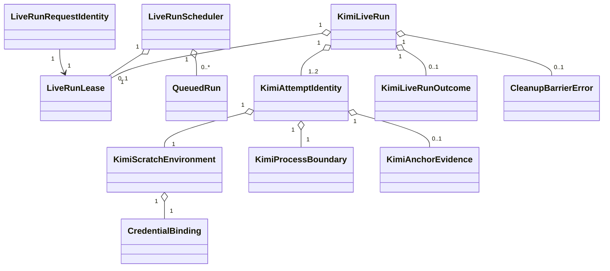

# Domain Entities — kimi-print-live-e2e

## 入力とモデル境界

本モデルは [unit-of-work.md](../../../inception/units-generation/unit-of-work.md)、[unit-of-work-story-map.md](../../../inception/units-generation/unit-of-work-story-map.md)、[requirements.md](../../../inception/requirements-analysis/requirements.md)、[components.md](../../../inception/application-design/components.md)、[component-methods.md](../../../inception/application-design/component-methods.md)、[services.md](../../../inception/application-design/services.md) を具体化する。

新しい永続DBやserviceは導入しない。entityはBun test process内の短命valueと、既存JSONL ledger／capability matrixへ投影するvalidated recordである。

## Core entities

| Entity | Key attributes | Invariants | Lifecycle |
|---|---|---|---|
| `KimiPrintCapability` | adapter ID、opt-in key、CLI version、status | IDは`kimi-print`、opt-in keyは`AMADEUS_KIMI_PRINT_LIVE` | unverified → integrating → supported |
| `LiveRunRequestIdentity` | request ID、adapter ID、journey ID | preflight ready後に副作用なしで発行、queueからreleaseまで不変 | created → queued → bound → released |
| `LiveRunScheduler` | queue、active owner | keyは`live-e2e-global`、FIFO、active ownerは0または1 | idle ↔ leased |
| `LiveRunLease` | owner token=request ID、acquired/released timestamps | queue先頭とowner一致、non-owner release禁止、releaseは1回 | queued → acquired → released |
| `KimiRunIdentity` | run ID、request ID、revision SHA、adapter ID、journey ID | request/lease owner IDを継承しreceipt provenanceと一致 | lease取得後に生成 |
| `KimiAttemptIdentity` | run ID、attempt 1/2、scratch namespace | attemptごとに一意、最大2 | prepared → finalized |
| `KimiScratchEnvironment` | project dir、`KIMI_CODE_HOME`、allowlisted env | source path・secretを出力fieldに持たない | planned → created → closed |
| `CredentialBinding` | opaque source handle、scratch link handle、ownership | credential copy禁止、source非所有 | planned → bound → unbound |
| `KimiProcessBoundary` | stable identity、owned descendants、exit | PID単体で所有判定しない | planned → running → terminated → reaped |
| `KimiAnchorEvidence` | anchor kind、digest、captured byte count、truncated | raw output/raw promptなし | absent → observed / rejected |
| `KimiAttemptOutcome` | phase、code、anchor state、cleanup receipt | closed taxonomy | executing → classified → cleaned |
| `KimiLiveRunOutcome` | final outcome、attempt summaries、provenance | cleanup closedの場合のみrecordable | pending → recordable |
| `CleanupBarrierError` | `originalOutcome`、cleanup receipt | kindは常に`cleanup-barrier-failed`、recordableでない | detected → returned |

## Value objects

### Credential source and binding

`CredentialSourceHandle`はsource credentialの存在と利用可否だけを表すopaque valueで、secret値やdurable diagnostic向けpathを公開しない。`CredentialBinding`はscratch側handleとownershipを持ち、unlink対象をscratch側に限定する。

### Process closure receipt

`KimiProcessClosureReceipt`はprocess boundary終了証明とowned direct/adopted waitable childのreap証明を別fieldで保持し、両方が成立したときだけ`closed`になる。boundaryが空でも未reap zombieがあればcleanup failureであり、PID再利用に影響されないstable identityで照合する。

### Bounded evidence

`KimiBoundedEvidence`はphase、exit status、anchor kind、SHA-256 digest、source byte count、truncated flagを持つ。transportは4,096 UTF-8 bytesでcode-point-safe truncateし、共通sanitizerはその文字列を512 code unitsに制限する。永続valueはsanitized textのdigestであり、secret、source path、raw prompt、raw stdout/stderrを持たない。

### Cleanup barrier error

`CleanupBarrierError`は外側Resultのerrorで、`kind="cleanup-barrier-failed"`、`originalOutcome`、`cleanup`を持つ。execution failureは`originalOutcome`内で因果を保持するが、外側のcanonical判定を上書きしない。このentityからledger projectionは生成できない。

## Aggregate boundaries

### `KimiLiveRun` aggregate

rootは`KimiRunIdentity`で、run-wide lease、attempt collection、resource registry、final resultを所有する。

- gate拒否またはpreflight SKIP時は`SkippedLiveRunReceipt`だけを返し、aggregateもleaseも生成しない。
- preflight ready後に`LiveRunRequestIdentity`を発行し、同じrequest IDでqueue参加とlease取得を行う。このidentity生成はscratch、credential、process、ledgerへ作用しない。
- aggregateはexclusive lease取得後、request IDを継承する`KimiRunIdentity`をrootとしてattempt 1準備の直前に生成する。
- active attemptは常に0または1で、attempt 2はattempt 1の全resource closed後だけ追加できる。
- aggregateが存続する間は同じlease owner tokenを保持し、final result後の`finally`で解放する。
- cleanup closedなら`KimiLiveRunOutcome`をrecorded receiptへ投影できる。
- cleanupがclosedでなければ`CleanupBarrierError`だけを返し、PASS/failure receiptを投影できない。

### `LiveRunScheduler` aggregate

- gate/preflightを通過したrunだけをFIFO queueへ受け入れる。
- queue entry keyとlease owner tokenは申請前に発行済みの同じrequest IDである。
- active ownerが存在する間、次runはside effectを開始できない。
- owner releaseでqueue先頭だけを次ownerへ昇格する。
- retryは同じownerの内部遷移であり、queueへ再参加しない。
- exception、cleanup error、ledger errorでもconductorの`finally`がowner releaseを実行する。

## Relationships

## State transitions

| Current | Event | Guard | Next |
|---|---|---|---|
| gate | deny | CIまたはexact opt-in不成立 | skipped、side effectなし |
| gate | allow | `AMADEUS_KIMI_PRINT_LIVE=1`、CI denyなし | preflight |
| preflight | missing prerequisite | closed skip reason | skipped、leaseなし |
| preflight | ready | binary/version/dist/auth成立 | request ID生成 → queued |
| queued | lease granted | FIFO先頭request ID＝owner token、active ownerなし | 同じrequest IDでaggregate生成 → attempt 1 |
| attempt 1 | retry | EAGAIN＋childなし＋cleanup closed | same lease → attempt 2 |
| attempt 1/2 | execution settled | cleanup closed | recordable outcome |
| attempt 1/2 | cleanup fail | closure proof不足 | cleanup barrier error |
| recordable outcome | ledger settled | append成功またはledger error | lease release |
| cleanup barrier error | return | ledger appendなし | lease release |

## Persistence projection

- cleanup closedの`KimiLiveRunOutcome`だけを1 run 1行でJSONL ledgerへappendする。
- PASS projectionだけがadapter ID、CLI version、revision SHA、journey ID、timestampを伴ってlatest green候補になる。
- cleanup closedのexecution failureはbounded evidenceを記録するがlatest greenを上書きしない。
- `CleanupBarrierError`はledgerへ投影せず、Result errorとしてcallerとcontract testへ返す。
- missing provenance、unknown code、未released leaseを持つ状態からgreen projectionを生成できない。
- contract testはrequest ID A/Bのqueue順、owner A→B、各run identityへの同一ID継承、non-owner release拒否を検証する。
