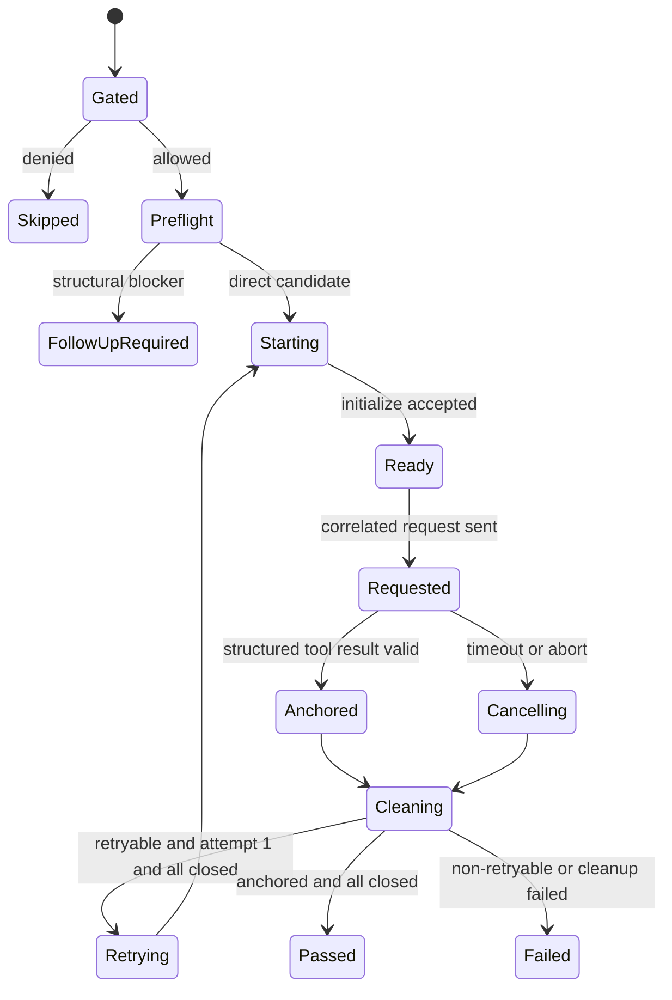

# Business Logic Model — kiro-acp-live-e2e

## 入力と責務

本設計は [unit-of-work.md](../../../inception/units-generation/unit-of-work.md)、[unit-of-work-story-map.md](../../../inception/units-generation/unit-of-work-story-map.md)、[requirements.md](../../../inception/requirements-analysis/requirements.md)、[components.md](../../../inception/application-design/components.md)、[component-methods.md](../../../inception/application-design/component-methods.md)、[services.md](../../../inception/application-design/services.md) を入力とする。

`kiro-acp-live-e2e`はKiro ACPを独立probeし、safeなJSON-RPC接続を共通lifecycleへ適合させるか、ACP固有のqualified follow-up Issueへ閉じる。共通kernelはpolicy、attempt barrier、outcome、ledgerを所有し、adapterはACP process、message相関、structured anchor、cancel、process-tree reapを所有する。

## Processing sequence

1. **Gate:** GitHub Actions denyをexact opt-inより先に評価し、deny時はprocess、scratch、auth binding、ledgerを0回にする。
2. **Preflight:** binary/version、ACP entrypoint、認証・設定の安全なbinding、JSON-RPC readiness、子孫processをreap可能なprocess ownershipを認証前提の秘密を出力せず確認する。
3. **Disposition:** safe binding、request correlation、structured anchor、cancel/reapを証明可能ならdirect、構造的に不可能ならsanitized follow-upへ進む。
4. **Prepare:** run/attempt identity、scratch home/project、allowlisted env、process-tree lease、request namespaceをplanned登録し、成功したものだけcreatedへ遷移する。
5. **Execute:** ACP processを起動し、initialize/readinessを確認して一意request IDで短いjourneyを送る。response ID、tool name、tool result schema、exit/statusを検証し、モデル自然文をassertionにしない。
6. **Abort path:** timeoutまたは外部AbortSignalでACP cancelを送る。cancel acknowledgementだけで完了せず、graceful wait後にbounded kill、全descendant reapまでcleanup barrierで確認する。
7. **Classify:** anchor前の`acp-startup-capacity`、`acp-process-start-collision`、`provider-throttled-before-anchor`だけをretryableとする。protocol violation、ID mismatch、schema mismatch、timeout、auth/config failure、anchor後failureはretryしない。
8. **Cleanup:** request/session close、ACP cancel、root/descendant reap、binding/scratch除去を逆順・冪等に行う。全resource closed後だけ新attemptを許可する。
9. **Finalize:** cleanup closedの場合だけ最大2 attemptの最終outcomeを1行ledgerへappendする。cleanup failure時は外側Resultを`cleanup-barrier-failed`へ固定し、元execution outcomeを`originalOutcome`としてerror payload内に保持する。ledgerへはappendしない。

## ACP state flow

## Request and evidence transformation

ACP raw framesはprocess内でincremental decodeし、validated messageへparseする。ledgerに残すのはrequest IDのdigest、method/tool ID、schema verdict、exit、bounded diagnosticだけで、raw prompt、raw response、credential、source config pathを保存しない。unknown method、duplicate terminal response、response ID mismatch、malformed JSONはprotocol failureとしてfail-closedにする。

## Error and retry projection

| Condition | Retry | Primary | Secondary | Final projection |
|---|---:|---|---|---|
| transient before anchor、cleanup closed、attempt 1 | 1 | attempt error | none | new identityでattempt 2 |
| protocol/schema/ID violation | 0 | execute/assert error | cleanup error if any | non-PASS、cleanup override時green禁止 |
| timeout/abort | 0 | timeout/abort | cancel/reap failure if any | non-PASS、全descendant closure必須 |
| execution success、cleanup failure | 0 | cleanup barrier error | success outcome in payload | `cleanup-barrier-failed`、ledgerなし |
| execution failure、cleanup failure | 0 | cleanup barrier error | execution outcome in payload | `cleanup-barrier-failed`、ledgerなし |

## Completion branches

- **Direct:** adapter contract、ACP integration、failure injection、opt-in local liveのすべてがgreenで、ACP自身のreceiptを持つ。
- **Follow-up:** safe binding、structured anchor、process ownershipの構造的blockerをsanitized evidence化し、推奨seam、再開条件、検証可能ACを持つIssueを公開してregistry/matrixへlinkする。
- **Forbidden:** measured-only、TUI receiptの流用、cancel acknowledgementだけでcleanup完了、raw JSON-RPC transcript保存。

## Strong process containment contract

ACP direct pathはroot PIDや通常のprocess groupを「全子孫」の証明として扱わない。adapterはspawn前に`ProcessContainmentPort.establish(runId, attemptId)`で強い境界を確立し、その境界を通してだけACP rootを起動する。

`ProcessContainmentPort`の実装契約は次のとおりである。

1. **Pre-exec attachment:** ACP codeが1命令でも実行される前にrootを境界へ所属させる。spawn後のbest-effort attachは不可。
2. **Non-escapable membership:** descendantのfork、再親化、`setsid`、process-group変更で境界外へ離脱できないOS primitiveを使う。
3. **Stable identity:** memberをPIDだけで識別せず、OS boundary membershipとprocess start identityでPID再利用を区別する。
4. **Boundary-wide termination:** graceful期限後は個別PIDでなく境界全体へTERM/KILL相当を適用する。
5. **Verified empty:** OS primitive自身のmember列挙またはempty通知が0になるまでcleanup成功を返さない。確認不能、列挙失敗、deadline超過は`cleanup-barrier-failed`である。
6. **Owned-child reap:** boundary emptyとは別に、runnerがspawnした直接子と、subreaper等によりrunnerのwait対象へ移った子をstable identity付き`OwnedWaitableChild`として追跡し、`wait`/`waitpid`相当で終了statusを回収する。zombieはboundary member 0でも未reapとして残るため、全owned waitableの`DirectChildReapReceipt`が揃うまでclosureを発行しない。
7. **Close after both proofs:** boundary handleを閉じるのは`BoundaryEmptyProof`と`DirectChildReapReceipt`の両方を取得した後だけ。閉鎖自体がkill primitiveのプラットフォームでは、close後に両proofを取得する。

| Platform capability | Strong primitive | Direct eligibility |
|---|---|---|
| Linux | delegated cgroup v2 subtree等、pre-exec加入・`cgroup.procs`列挙・`cgroup.kill`・empty確認を満たすもの | probeとfailure injectionがgreenの場合だけeligible |
| Windows | Job Object等、create suspended→assign→resume、kill-on-close、active process count 0を満たすもの | probeとfailure injectionがgreenの場合だけeligible |
| Darwin/macOS | 通常のdetached process group、親PID走査、`kill(-pgid)`だけは**best-effortで非適格** | 強い監督境界portが実装・実測されない限りfollow-up branch |
| Unknown/unsupported | primitive不明またはmembership/emptyを証明不能 | follow-up branch、direct禁止 |

既存process-group runnerはbounded terminationの再利用候補だが、strong containment capabilityを自己申告してはならない。離脱descendantを注入して残存を検出できるnegative testが赤→Greenになった場合だけdirect eligibilityを与える。

## Cancellation and containment state machine

| State | Action | Success transition | Failure/deadline transition |
|---|---|---|---|
| `active` | best-effort ACP cancelを送信 | `cancel-sent` | `termination-required`（cleanupは継続） |
| `cancel-sent` | cancel grace内だけack/root exitを待つ | `termination-check` | `termination-required` |
| `termination-check` | containment境界のmemberを列挙 | emptyなら`resources-close` | non-emptyなら`termination-required`、確認不能なら`cleanup-barrier-failed` |
| `termination-required` | 境界全体へTERM、短いgrace後KILL | `reap-verification` | signal/primitive failureは`cleanup-barrier-failed` |
| `reap-verification` | stable identity付きmember集合がemptyになるまで期限付き確認 | `owned-child-wait` | non-empty/unknown/deadlineは`cleanup-barrier-failed` |
| `owned-child-wait` | runner所有の直接子・adopted waitableを全件`wait`/`waitpid`相当で回収 | `resources-close` | zombie残存、wait失敗、identity不一致、deadlineは`cleanup-barrier-failed` |
| `resources-close` | session handle、binding、scratchを冪等close | `closed` | cleanup errorを記録し`cleanup-barrier-failed` |

cancel送信が線形化点ではない。強制終了への線形化点はcancel grace期限またはcancel送信失敗で、そこから先はACP sessionの応答を待たずcontainment境界を終了する。session handleを先に破棄してcancel不能にせず、cancel試行後はtransport状態に依存せず境界terminationへ進める。

`ProcessClosureReceipt`は`BoundaryEmptyProof`と`DirectChildReapReceipt`の積である。どちらか片方だけでは生成できない。failure injectionでは、rootが終了してboundary memberが0になった後もwaitを意図的に保留してzombieを残し、closure/PASSが拒否されることを実証する。subreaperを採用する実装では、再親化されたwaitable childも同じowned setへ追加し、全件回収する。

## Review — Iteration 1

- **Verdict:** READY
- **Reviewer:** amadeus-architecture-reviewer-agent
- **Date:** 2026-08-04T13:58:23Z
- **Iteration:** 1
- **Scope decision:** none

Kiro ACP Functional Design は実装可能な粒度で整合しています。実行前の強い封じ込め、非離脱メンバーシップ、PID単独に依存しない安定識別、境界全体の停止が一貫して定義されています。プロセス終了証明は BoundaryEmptyProof と DirectChildReapReceipt の両方を必須とし、境界が空でも zombie が残る失敗注入を扱っています。Darwin の通常プロセスグループは best-effort として direct 実行不適格にされ、強い supervisor がない場合の安全性も明確です。また、cleanup の二重失敗では外側の cleanup-barrier-failed が最終結果として優先され、失敗結果を成功 ledger へ投影しない契約と整合しています。確認範囲では再現可能な契約違反、未解決の参照、循環依存、実装判断を要する欠落はありません。

### Findings

- None
