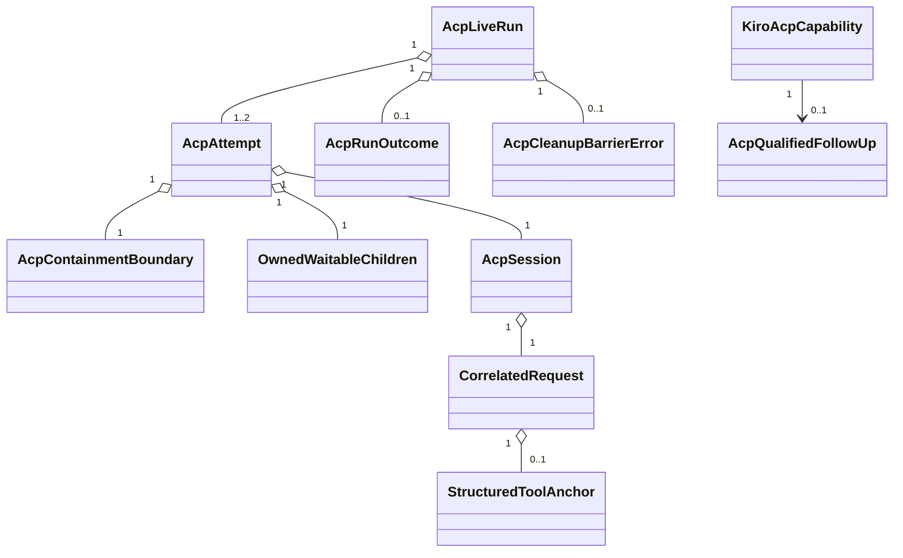

# Domain Entities — kiro-acp-live-e2e

## 入力とモデル境界

本モデルは [unit-of-work.md](../../../inception/units-generation/unit-of-work.md)、[unit-of-work-story-map.md](../../../inception/units-generation/unit-of-work-story-map.md)、[requirements.md](../../../inception/requirements-analysis/requirements.md)、[components.md](../../../inception/application-design/components.md)、[component-methods.md](../../../inception/application-design/component-methods.md)、[services.md](../../../inception/application-design/services.md) を具体化する。

entityは短命process内valueと既存ledger/matrixへのvalidated projectionであり、新しいDBや常駐serviceを持たない。

## Entity catalog

| Entity | Key attributes | Invariants | Lifecycle |
|---|---|---|---|
| `KiroAcpCapability` | adapter ID、CLI version、status、follow-up URL | ID=`kiro-acp`、connected/follow-up-linked同時不可 | unverified → probing → connected / follow-up-linked |
| `AcpRunIdentity` | run ID、revision、journey、adapter | final receipt provenanceと一致 | gate後生成 → finalized |
| `AcpAttempt` | attempt 1/2、request namespace、process lease | 最大2、同時active 1、attempt間namespace非共有 | planned → active → closed |
| `AcpContainmentBoundary` | platform primitive、boundary ID、capability strength、stable member identities | spawn前確立、strong以外はdirect不可、member emptyがcleanup条件 | absent → established → terminating → empty → closed |
| `OwnedWaitableChildren` | stable child identities、ownership origin、wait status | runnerがwait可能な全childを一意追跡、未reap/zombie 0がclosure条件 | registered → exited → reaped |
| `AcpSession` | initialize request ID、capabilities、state | ready前request禁止、terminal後frame禁止 | starting → ready → requested → terminal → closed |
| `CorrelatedRequest` | request ID、method、deadline、terminal response | ID一意、terminal response最大1 | created → sent → completed / cancelled / failed |
| `StructuredToolAnchor` | allowlisted tool ID、validated result digest、schema version | raw resultなし、schema green必須 | absent → observed / rejected |
| `AcpRunOutcome` | final code、attempt summaries、provenance | cleanup closedの場合だけrecordable | pending → passed / failed / skipped |
| `AcpCleanupBarrierError` | original outcome、cleanup receipt | kind=`cleanup-barrier-failed`、ledger投影不可 | detected → returned |
| `AcpQualifiedFollowUp` | blocker、evidence digest、seam、re-entry、AC、Issue URL | sanitized＋URL必須 | drafted → published → linked |

## Value objects and parsers

- `AcpRequestId`: run/attempt namespace付きのvalidated ID。空、再利用、別attempt responseを拒否する。
- `AcpMessage`: JSON-RPC envelopeを`Response | Notification | ProtocolError`のclosed unionへparseし、unknown/duplicate/malformedを自由文へ落とさない。
- `AcpRetryableCode`: `acp-startup-capacity | acp-process-start-collision | provider-throttled-before-anchor`。
- `StableProcessIdentity`: PIDとOSが提供するstart identity／boundary membershipを組にし、PID再利用を同一memberと誤認しない。
- `ContainmentCapability`: `strong | best-effort | unsupported`。direct candidateは`strong`だけを受理する。
- `BoundaryEmptyProof`: boundary ID、OS primitive observation、observed-atを持ち、member 0を証明するがchild reapは証明しない。
- `DirectChildReapReceipt`: runner所有の直接子とadopted waitable childのstable identity、exit status、reaped-atを全件持ち、未wait/zombieがあれば生成できない。
- `ProcessClosureReceipt`: `BoundaryEmptyProof`と`DirectChildReapReceipt`の両方、termination escalation、deadlineを持つ。いずれか欠落、member unknown、wait失敗なら生成できない。
- `BoundedAcpDiagnostic`: phase、code、exit、digest、truncated、byte countだけを持ち、raw frame/prompt/secret/source pathを表現しない。
- `AcpCleanupBarrierError`: 外側Result errorとして元execution outcomeとcleanup receiptを保持し、execution codeを外側canonical結果にしない。

## Aggregate behavior

### `AcpLiveRun`

run identity、最大2 attempts、resource registry、final outcomeを所有する。

- active attemptがある間は次attemptを追加できない。
- retryは前attemptがanchorなし、retryable、process treeを含む全resource closedの場合だけ許可する。
- final outcome後はframe受理、attempt追加、ledger再appendを拒否する。
- PASS生成はstructured anchorとProcessClosureReceiptの両方を必要とする。
- cleanup closedのoutcomeだけをledgerへ投影でき、closure proof不足は`AcpCleanupBarrierError`だけを返す。

### `AcpDisposition`

probe結果を`DirectCandidate`または`FollowUpRequired`へparseし、measured-onlyを表現しない。DirectCandidateはsafe binding、protocol correlation、structured anchor plan、process ownershipを必須とする。FollowUpRequiredはstructural blockerのsanitized evidenceを持ち、Issue URL取得後だけlinkedになる。

## Relationships

## Projection rules

- final PASSだけがadapter ID、CLI version、revision SHA、journey ID、timestamp付きでlatest green候補になる。
- cleanup closedのfailureはbounded diagnosticをledgerへ残すがlatest greenを更新しない。
- cleanup failureは外側`cleanup-barrier-failed` errorとして返し、元execution outcomeをpayloadに保持するがledgerへ投影しない。
- follow-up-linkedはIssue URLをmatrixへ投影するがgreen SHAを作らない。

## Containment port semantics

`AcpContainmentBoundary`はOS差をportへ閉じる。`establish`は子process実行前の強い所属を保証できる場合だけ`strong` handleを返す。`listMembers`はstable identity集合、`terminateAll`はboundary-wide escalation、`verifyEmpty`はOS primitive由来のempty proofを返す。

Darwinの通常process groupやPPID走査は`best-effort`であり、直接接続のclosure receiptを生成できない。Linux cgroup v2、Windows Job Objectなどを採用する場合も名前だけでstrongとせず、pre-exec membership、離脱不能、stable enumeration、boundary kill、empty proofをport contract testで実証する。unsupportedまたは検証不能はdefectではなく`FollowUpRequired`へparseするが、実行開始後にempty proofを失った場合は`cleanup-barrier-failed`である。

`OwnedWaitableChildren`はcontainment membershipとは別のrunner所有台帳である。root spawn時に直接子を登録し、subreaper等で再親化されたwaitable childもstable identityで追加する。boundary empty後、全entryを`wait`/`waitpid`相当でreapして`DirectChildReapReceipt`へ畳み込む。empty boundary＋未reap zombieを注入するcontract testがclosureを拒否しなければならない。
