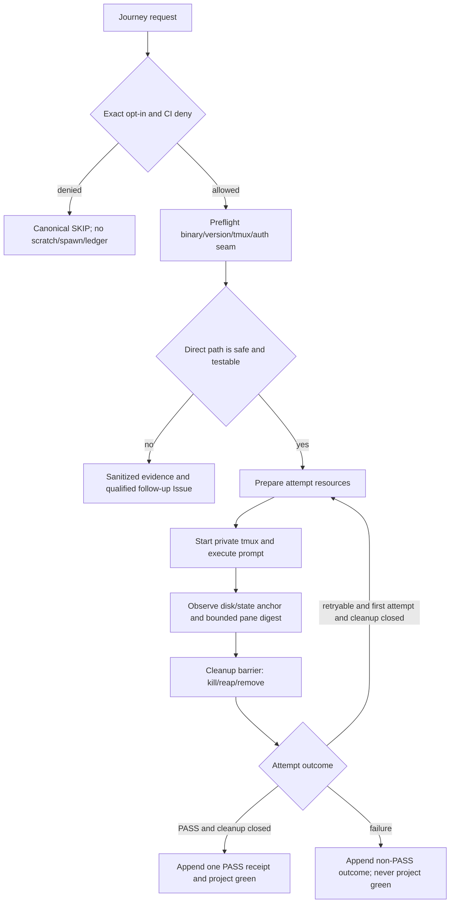

# Business Logic Model — kiro-tui-live-e2e

## 入力と責務

本設計は [unit-of-work.md](../../../inception/units-generation/unit-of-work.md)、[unit-of-work-story-map.md](../../../inception/units-generation/unit-of-work-story-map.md)、[requirements.md](../../../inception/requirements-analysis/requirements.md)、[components.md](../../../inception/application-design/components.md)、[component-methods.md](../../../inception/application-design/component-methods.md)、[services.md](../../../inception/application-design/services.md) を入力とする。

`kiro-tui-live-e2e`はKiro TUIを独立にprobeし、直接接続またはqualified follow-up Issueへ閉じるvertical sliceである。共通kernelはgate、lifecycle、resource barrier、canonical outcome、ledgerを所有し、TUI adapterはbinary/config probe、private tmux、scratch環境、deterministic anchor、bounded captureだけを所有する。

## End-to-end decision flow

## Phase algorithm

1. **Gate:** `GITHUB_ACTIONS=true`を最優先denyし、その後にtransport固有のexact opt-in `1`を確認する。deny時はlease、scratch、tmux、auth binding、ledgerを一切開始しない。
2. **Preflight:** Kiro CLI binary/version、tmux、配布面、認証・設定の安全な短命binding可能性を、secret値を読まずに判定する。
3. **Disposition:** safe binding、private tmux、deterministic anchor、bounded evidence、kill/reapをcontractどおり成立させられる場合だけdirectへ進む。構造的に成立しない場合はfollow-up evidenceへ進み、共通contractを弱めない。
4. **Prepare attempt:** 一意なrun/attempt identity、scratch project/home、private socket/session、planned resource entriesを作る。作成に成功したresourceだけを`created`へ遷移する。
5. **Execute:** allowlistから構築したchild environmentでprivate tmux serverを起動し、短いpromptを送る。pane全文ではなく上限付きcaptureを観測し、成功判定はdisk/state anchorとprocess statusの組で行う。
6. **Classify:** anchor確立前の`tmux-start-collision`、`kiro-startup-capacity`、`provider-throttled-before-anchor`だけをretryableとする。timeout、anchor mismatch、auth/config error、policy violation、秘密露出、anchor確立後のfailureはretryしない。
7. **Cleanup barrier:** 結果にかかわらずprivate tmux kill、descendant reap、binding除去、scratch除去を逆順・冪等に実行する。全resourceがclosedになるまで次attemptを準備しない。
8. **Retry:** retryable、attempt 1、anchor未確立、cleanup closedの全条件が成立した場合だけattempt 2を新しいidentityで実行する。中間attemptはPASS receiptを作らず、final outcomeへbounded summaryを含める。
9. **Finalize:** cleanup成功後の最終実行成功だけがPASS receiptを1行appendできる。cleanup failureは常に`safetyOverride=cleanup-failed`を付け、green matrix投影を禁止する。

## Direct versus follow-up branch

| Decision | Direct branch | Follow-up branch |
|---|---|---|
| Safe auth/config binding | source pathをchild/diagnosticへ露出せず成立 | 成立しない実測をsanitizedに記録 |
| Deterministic assertion | disk/state anchor＋bounded pane digest | モデル文面やraw paneにしか依存できない |
| Resource closure | kill/reap/removeをfailure injectionで証明 | descendantまたはtmux server残存を排除できない |
| Completion | contract/integration/local live green | blocker、推奨seam、再開条件、検証可能ACを持つIssue URL |

follow-upはprobe-onlyの中間状態ではない。Issue作成とregistry/matrix linkまで成功した時点でUnitの許可された完了branchとなる。

## Error and ledger projection

| Execution | Cleanup | Primary error | Secondary error | Canonical result | Matrix effect |
|---|---|---|---|---|---|
| success | success | none | none | `passed` | 対象transport自身のgreen SHAを更新 |
| failure | success | execution error | none | execution code | green更新なし |
| success | failure | cleanup error | none | `cleanup-failed` | green更新なし、PASS禁止 |
| failure | failure | execution error | cleanup error | execution code＋`safetyOverride=cleanup-failed` | green更新なし、PASS禁止 |

ledgerは最終outcomeだけをcanonical receiptとしてappendする。attempt summaryはattempt番号、phase、code、bounded digest、cleanup statusに限定し、raw prompt、raw pane、secret、source pathを含めない。

## Verification scenarios

- opt-inなし、誤値、CI denyでspawn/lease/scratchが0回。
- partial prepare、start failure、timeout、anchor mismatch、assert failureの各点でresource残存0。
- retryable codeだけがcleanup後に1回再試行され、attempt identityが異なり、final receiptが1行だけ。
- execution＋cleanup二重失敗で両errorが保持され、PASSとgreen projectionが0。
- direct成立時はTUI自身のcontract/integration/local live receipt、非成立時はTUI自身のqualified Issue linkが存在する。

## Review — Iteration 1

- **Verdict:** READY
- **Reviewer:** amadeus-architecture-reviewer-agent
- **Date:** 2026-08-04T13:01:10Z
- **Iteration:** 1
- **Scope decision:** none

3成果物は、事前ゲート、隔離実行、アンカー確立、限定リトライ、順序付きクリーンアップ、二重障害時の優先順位、最終結果の一意確定、direct/follow-up 分岐について整合している。最大2回の逐次試行、アンカー前かつ閉集合理由に限定した再試行、全リソース閉鎖後の新規 identity 採番により、不正な並行試行や中間 PASS は表現不能である。cleanup override が PASS および green projection を禁止し、実行成功後の cleanup failure と実行・cleanup 二重失敗の双方で一次障害が決定的に定義されている。機密情報を保持しない bounded evidence/ledger と、構造的阻害時の sanitized qualified follow-up も要件を満たし、library Unit のため frontend 成果物がない点も妥当である。提示範囲では循環依存、未解決参照、実装を妨げる未定義状態遷移は認められない。

### Findings

- None
