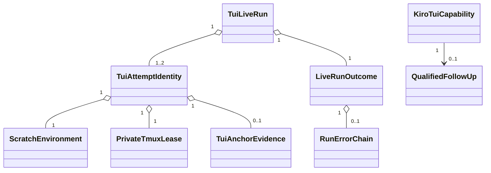

# Domain Entities — kiro-tui-live-e2e

## 入力とモデル境界

ドメインモデルは [unit-of-work.md](../../../inception/units-generation/unit-of-work.md)、[unit-of-work-story-map.md](../../../inception/units-generation/unit-of-work-story-map.md)、[requirements.md](../../../inception/requirements-analysis/requirements.md)、[components.md](../../../inception/application-design/components.md)、[component-methods.md](../../../inception/application-design/component-methods.md)、[services.md](../../../inception/application-design/services.md) を具体化する。

新しい永続DBやserviceは導入しない。entityはBun test process内の短命valueと、既存JSONL ledger／capability matrixへ投影するvalidated recordである。

## Core entities

| Entity | Key attributes | Invariants | Lifecycle |
|---|---|---|---|
| `KiroTuiCapability` | adapter ID、opt-in key、CLI version、status、follow-up URL | IDは`kiro-tui`、connectedとfollow-up-linkedは同時不可 | unverified → probing → connected / follow-up-linked |
| `TuiRunIdentity` | run ID、revision SHA、adapter ID、journey ID | run内で不変、receipt provenanceと一致 | gate通過後に生成、finalizeまで存続 |
| `TuiAttemptIdentity` | run ID、attempt 1/2、socket、session | attemptごとに一意、最大2、resource namespaceを共有しない | prepared → finalized |
| `ScratchEnvironment` | project dir、home dir、allowlisted env、binding handles | source auth/config pathとsecret値を出力可能fieldに持たない | planned → created → closed |
| `PrivateTmuxLease` | socket、session、server PID/descendants | 共有server禁止、run/attempt identityへ所有される | planned → active → killed → reaped |
| `TuiAnchorEvidence` | disk/state anchor、bounded digest、byte count | raw pane/raw promptなし、byte limit以下 | absent → observed / rejected |
| `AttemptOutcome` | phase、code、anchor state、cleanup receipt、bounded diagnostic | closed canonical taxonomy、PASSはcleanup closedのみ | executing → classified → cleaned |
| `LiveRunOutcome` | final code、primary/secondary error、safety override、attempt summaries | final receiptはrunに1つ、cleanup override時PASS不可 | pending → passed / failed / skipped |
| `QualifiedFollowUp` | blocker、evidence digest、recommended seam、re-entry conditions、AC、Issue URL | sanitized、Issue URL必須 | drafted → published → linked |

## Value objects

### Canonical phase and code

- `LifecyclePhase`: `gate | preflight | prepare | execute | assert | cleanup | project`。
- `TuiRetryableCode`: `tmux-start-collision | kiro-startup-capacity | provider-throttled-before-anchor`。
- `CanonicalOutcomeCode`: 共通taxonomyのskip、timeout、failure、cleanup-failed、passedだけを受理し、unknown文字列を拒否する。
- `SafetyOverride`: 現時点では`cleanup-failed`だけ。存在時はgreen投影を型レベルで不可能にする。

### Bounded diagnostic

`BoundedDiagnostic`はphase、code、exit status、digest、truncated flag、byte countを持つ。secret、source path、raw prompt、raw transcriptをfieldとして表現しない。redaction後の文字列をvalidated constructorへ渡し、上限超過は切り詰めとdigestで表現する。

### Error chain

`RunErrorChain`は必須`primaryError`と任意`secondaryError`を持つ。secondaryはcleanup phaseだけを許可し、primaryより早いtimestampを拒否する。execution＋cleanup二重失敗では`safetyOverride=cleanup-failed`を同時に要求する。

## Aggregate boundaries

### `TuiLiveRun` aggregate

rootは`TuiRunIdentity`で、attempt collection、resource registry、final outcomeを所有する。

- gate拒否時はaggregateを生成しない。
- active attemptは常に0または1で、並行attemptを禁止する。
- attempt 2はattempt 1がfinalizedかつ全resource closedの場合だけ追加できる。
- final outcome確定後はattempt追加、resource登録、outcome変更を禁止する。
- PASS receipt生成はaggregateの`finalizePassed`相当の振る舞いだけが行い、外側がfieldを見て直接appendしない。

### `TuiDisposition` aggregate

probe結果を`DirectCandidate`または`FollowUpRequired`へparseする。曖昧な`measured-only`状態を表現しない。

- `DirectCandidate`はsafe binding、deterministic anchor、cleanup proof planをすべて持つ。
- `FollowUpRequired`はblockerとsanitized evidenceを持ち、Issue URL結合後だけ`FollowUpLinked`へ遷移する。
- direct実装が一時的にredなだけでfollow-upへ自動変換しない。構造的blockerの実測が必要である。

## Relationships

## State transitions

| Current | Event | Guard | Next |
|---|---|---|---|
| gate | allow | exact opt-in、CI denyなし | preflight |
| preflight | direct-qualified | safe binding＋anchor＋cleanup plan | prepare attempt 1 |
| preflight | structurally-blocked | sanitized evidence complete | follow-up drafting |
| attempt 1 | retry | retryable＋anchor absent＋cleanup closed | prepare attempt 2 |
| attempt 1/2 | pass | execution/assert success＋cleanup closed | passed |
| attempt 1/2 | fail | non-retryableまたはbudget exhausted | failed |
| any attempt | cleanup fail | resource not closed | failed＋cleanup safety override |
| follow-up drafting | issue linked | qualified fields＋Issue URL | follow-up-linked |

## Persistence projection

- JSONL ledgerには`LiveRunOutcome`のvalidated projectionを1 run 1行でappendする。
- PASS projectionだけがadapter ID、CLI version、revision SHA、journey ID、timestampを伴ってlatest green候補になる。
- failureはbounded diagnosticとerror chainを残すがlatest greenを上書きしない。
- follow-up projectionはIssue URLとstatusをmatrixへ出すが、green SHAを生成しない。
