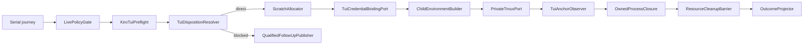

# Logical Components — kiro-tui-live-e2e

## 入力と適用範囲

本設計は [business-logic-model.md:13](../functional-design/business-logic-model.md#L13) のgate flow、[business-logic-model.md:30](../functional-design/business-logic-model.md#L30) から [business-logic-model.md:38](../functional-design/business-logic-model.md#L38) のphase algorithm、[business-logic-model.md:42](../functional-design/business-logic-model.md#L42) のdirect/follow-up decisionをlogical boundaryへ写像する。

Unit kindは`library`であり、engine-resolved outputはsecurity designとlogical componentsだけである。常駐serviceやAWS infrastructureはないため、performance/scalability/reliabilityのN/A placeholderを作成しない。

## Component inventory

| Component | Responsibility | Owned state/resource | Must not own |
|---|---|---|---|
| `LivePolicyGate` | CI deny、exact opt-in、capability validation | gate decision | scratch、credential、tmux |
| `KiroTuiPreflight` | binary/version/tmux/auth seam probe | measured version、sanitized findings | secret値、live session |
| `TuiDispositionResolver` | direct candidateまたはqualified follow-upを決定 | blocker digest、eligibility evidence | ACP/IDE推定 |
| `ScratchAllocator` | run/attempt固有home/projectのplanned→created | scratch handles | source home ownership |
| `TuiCredentialBindingPort` | sourceからscratchへのopaque短命binding | scratch-side binding handle | credential copy、source削除 |
| `ChildEnvironmentBuilder` | default-deny allowlistからenv構築 | environment declaration | ambient `process.env`展開 |
| `PrivateTmuxPort` | private socket/sessionのstart/send/capture/kill | tmux server/session handle | shared server、ledger policy |
| `TuiAnchorObserver` | disk/state anchorとbounded pane digestを観測 | anchor evidence | raw transcript persistence |
| `OwnedProcessClosure` | tmux/child tree terminate、reap proof | stable process identities、closure receipt | PID-only success判定 |
| `ResourceCleanupBarrier` | 全resourceを逆順・冪等close | cleanup receipt | PASS projection前倒し |
| `OutcomeProjector` | cleanup terminal union、canonical outcome、provenanceをreceipt化 | normal receiptまたはcleanup failure receipt | cleanup失敗のPASS/green化 |
| `QualifiedFollowUpPublisher` | sanitized blockerをIssue＋registryへ結合 | Issue URL、re-entry conditions | probe-only完了 |

## Dependency direction

共通kernelはTUI固有binary、tmux command、auth pathを知らない。adapter-side componentはgate、canonical code、ledger append順序を変更しない。依存はorchestrator→ports→external CLIの一方向で、matrix projectorからruntime adapterへの逆依存を作らない。

## Failure domains and blast radius

| Failure domain | Boundary | Containment | Observable result |
|---|---|---|---|
| Policy/preflight | side-effect前 | allocator・binding・tmuxを呼ばない | canonical SKIP/finding |
| Scratch/binding | attempt namespace | planned resourceもcleanup対象 | prepare failure＋cleanup receipt |
| tmux start/session | private socket/session | 共有tmuxへ作用せずattempt内kill | execution failureまたはretryable start code |
| Kiro child tree | owned process set | terminate→reap proof | timeout/execution failure、未reapならPASS禁止 |
| Anchor observation | scratch＋bounded memory | raw pane非永続 | assertion failure |
| Cleanup | run resource registry | idempotent reverse close | cleanup failure receipt 1、PASS/green 0 |
| Ledger/projector | durable receipt boundary | validated schema/provenance | write failureまたはprojection拒否 |
| Follow-up publication | Issue＋registry transaction | URLなし完了禁止 | Unit remains unresolved |

## Isolation contracts

- run identityはscratch root、socket、session、anchor path、resource IDのnamespace rootである。
- retry attemptは新しいattempt identityとresource namespaceを使い、前attempt closure前に生成しない。
- private tmux portはliteral socket/session handleだけを受け、default server discoveryを行わない。
- source auth/configはbinding portの内側へ閉じ、environment builderやdiagnostic componentへpathを渡さない。
- `CleanupTerminalResult`は`ClosedCleanup`と`FailedCleanup`のclosed unionである。`ClosedCleanup`は通常のPASS/non-PASS receiptを、`FailedCleanup`は元execution outcome、cleanup findings、`safetyOverride=cleanup-failed`を持つ非PASS `CleanupFailureReceipt`だけを生成する。
- `OutcomeProjector`はcleanup barrierがterminal unionを確定した後だけreceiptを生成できる。resource closure成功は通常receiptのguardであり、failed branchの監査receiptを消さない。
- `CleanupFailureReceipt`はlatest green、PASS、supported evidenceへ型レベルで投影できない。
- follow-up publisherはdirect pathのruntime componentと同時activeにならず、measured-only中間状態を残さない。

## Sequence and terminal states

1. Gate denyはside effectなしでterminal SKIP。
2. Preflight不足はspawnなしでterminal SKIP、構造的security blockerはfollow-up resolverへ渡す。
3. Direct candidateだけがscratch→binding→env→private tmux→anchorへ進む。
4. outcomeにかかわらずprocess closureとcleanup barrierを実行する。
5. retryableかつanchor前かつcleanup closedのattempt 1だけが新namespaceでattempt 2へ進む。
6. cleanup barrierが`ClosedCleanup|FailedCleanup`を確定した後にprojectorへ渡す。closedは通常receipt、failedは非PASS cleanup receiptを1行生成する。
7. structural blockerはqualified Issue URLがregistryへ結合された時点でfollow-up-linked terminalになる。

## Verification responsibilities

| Component seam | Deterministic test |
|---|---|
| Gate | CI＋opt-in組合せproperty cases、side effect count 0 |
| Preflight | fake binary/version/tmux/auth capability |
| Binding/env | fixture secret/path非到達、source非変更 |
| tmux port | private argv、別socket非干渉、bounded capture |
| Anchor observer | disk/state＋exitの組、pane-only拒否 |
| Process closure | descendant残存、kill/reap failure、二重cleanup |
| Cleanup barrier | retained resourceでcleanup failure receipt 1、PASS/green 0 |
| Projector | provenance欠落、unknown code、cleanup不成立拒否 |
| Follow-up publisher | blocker fields／Issue URL欠落拒否 |
