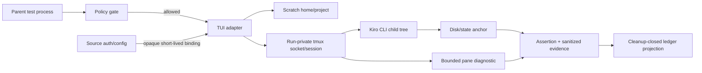

# Security Design — kiro-tui-live-e2e

## 入力と設計境界

本設計は [business-logic-model.md:7](../functional-design/business-logic-model.md#L7) の責務分離、[business-logic-model.md:30](../functional-design/business-logic-model.md#L30) のside-effect前gate、[business-logic-model.md:31](../functional-design/business-logic-model.md#L31) の秘密を読まないpreflight、[business-logic-model.md:33](../functional-design/business-logic-model.md#L33) のrun-private resource、[business-logic-model.md:34](../functional-design/business-logic-model.md#L34) のallowlisted environmentとbounded capture、[business-logic-model.md:36](../functional-design/business-logic-model.md#L36) のcleanup barrierを具体化する。

NFR Requirements成果物はscope上の意図的SKIPであり、再分類・再作成しない。新しいAWS resource、network service、database、daemonはなく、AWS IAM、VPC、KMS、Secrets Managerは非適用である。

## Trust boundaries

境界はparent environment、source auth/config、scratch、private tmux、Kiro child tree、durable evidenceの間に置く。sourceは非所有で、scratch側bindingだけをresource registryが所有する。

## Control design

| Control | Design | Failure behavior |
|---|---|---|
| Execution admission | `GITHUB_ACTIONS=true`を最優先denyし、exact opt-in値`1`だけを許可 | lease/scratch/binding/tmux/ledgerを0回にしてcanonical SKIP |
| Binary/config preflight | binary/version/tmux、安全なauth/config binding可能性を秘密値なしで検査 | 不足はspawn前SKIP、構造的blockerはqualified follow-up |
| Environment isolation | capability allowlistからchild envを新規構築し、ambient HOME、secret key、source pathを除外 | unknown keyまたはsource path混入をpolicy violationとして拒否 |
| Auth/config binding | sourceをコピーせず、scratch内の短命opaque bindingとして登録 | source変更・削除禁止、binding cleanup不能ならPASS禁止 |
| tmux isolation | run/attempt固有socketとsessionを使い、共有serverへ接続しない | identity衝突または共有socket検出を実行前拒否 |
| Assertion integrity | disk/state anchor＋process statusを正本にし、paneや自然文だけでPASSにしない | anchor mismatchはnon-retryable failure |
| Diagnostic minimization | paneは設定済みbyte limitでcaptureし、redact→truncate→digest後だけ保持 | raw pane、prompt、secret、source pathの永続化を拒否 |
| Process cleanup | private tmux kill、owned descendant reap、binding/scratch除去を逆順・冪等実行 | retained resourceが1つでもあればcleanup failure、PASS禁止 |
| Evidence provenance | adapter ID、CLI version、revision SHA、journey ID、timestampをvalidated receiptへ結合 | 欠落・未知code・SHA不正はledger/projectorでfail closed |
| Cleanup audit | barrier終端を`closed|failed`のclosed unionにし、failedは非PASS cleanup receiptだけを生成 | cleanup failed receiptはgreen/supported evidenceへ投影不能 |

## Credential and data handling

- secret値、raw credential、source auth/config pathをchild argv、pane diagnostic、ledger、Issueへ含めない。
- source binding handleはopaque valueとし、durable artifactへlocatorを投影しない。
- promptとraw paneはprocess memory内の実行入力・bounded observationに限定し、永続化前に破棄する。
- disk/state anchorはscratch配下の非秘密markerだけを許可し、source homeや既存projectのfileをassertion対象にしない。
- follow-up evidenceはblocker kind、redacted digest、推奨seam、再開条件、検証可能ACだけを持つ。

## Threats and mitigations

| Threat | Mitigation | Verification |
|---|---|---|
| ambient credential leakage | default-deny env allowlistとfixture secret注入 | child observation、diagnostic、receiptを走査して0件 |
| source config path disclosure | source path key除外とabsolute-path sanitizer | fixture pathを全durable outputで0件確認 |
| shared tmux interference | run-private socket/session、owner identity照合 | 別run sessionをkill/captureできないnegative test |
| prompt/output exfiltration | raw transcript非保存、bounded digest | oversized/non-ASCII paneで上限とdigestのみ確認 |
| resource persistence | planned-before-create registryとcleanup barrier | partial prepare、timeout、abort、kill failure注入で残存0またはPASS 0 |
| forged green evidence | cleanup closure＋provenance＋canonical codeのvalidated constructor | missing/unknown/mismatched fieldをprojection拒否 |

## Direct and follow-up security disposition

direct eligibilityはsafe binding、private tmux、deterministic disk/state anchor、bounded evidence、owned descendant closureを決定的testとlocal probeで証明できる場合だけ与える（[business-logic-model.md:42](../functional-design/business-logic-model.md#L42)）。いずれかが構造的に成立しない場合はcontractを緩和せず、sanitized qualified follow-up Issueへ閉じる。ACPまたはKiro IDEの証跡はTUI dispositionへ代用しない。

## Verification matrix

- gate deny／誤opt-inで全side effect 0。
- allowlist外key、fixture secret、source pathがchildとdurable evidenceへ到達しない。
- shared socket/sessionの利用を拒否し、別run resourceへ作用しない。
- raw paneを保存せず、bounded digestとanchor verdictだけを保持する。
- success/failure/timeout/partial prepareでtmux、descendant、binding、scratchがclosed。
- cleanup failure時に非PASS cleanup receiptが1行、PASS receiptとgreen matrix更新が0。

## Review — Iteration 1

- **Verdict:** NOT-READY
- **Reviewer:** amadeus-architecture-reviewer-agent
- **Date:** 2026-08-04T14:13:50Z
- **Iteration:** 1
- **Scope decision:** none

隔離、private tmux、資格情報binding、bounded evidence、限定retry、direct/follow-upの責務分離は概ね実装可能だが、入力成果物への参照が解決せず、cleanup失敗のcanonical receiptを記録できない契約矛盾があるためNOT-READY。

### Findings

- BLOCKER | security-design.md と logical-components.md の全 business-logic-model 参照は `../../functional-design/business-logic-model.md` だが、nfr-design ディレクトリから解決すると `construction/functional-design/business-logic-model.md` になり、authoritative input の実在位置 `../functional-design/business-logic-model.md` に到達しない。明示された上流参照が再現可能に壊れているため、両成果物のリンクを `../functional-design/business-logic-model.md` に修正すること。
- BLOCKER | logical-components.md の Isolation contracts は `OutcomeProjector` が cleanup receipt が `closed` の場合だけ recorded receipt を生成できると定義する一方、business-logic-model.md は cleanup failure を `cleanup-failed` または execution code＋`safetyOverride=cleanup-failed` として最終canonical receiptへappendすると定義している。retained resource等でcleanupがclosedにならない経路では、要求された非PASS監査結果をprojectorが表現不能になる。projectorの生成条件を「cleanup barrierが終端結果を確定済み」にし、resource closure成功とは別の型で表現するなど、cleanup失敗receiptも記録できる契約へ統一すること。

## Review — Iteration 2

- **Verdict:** READY
- **Reviewer:** amadeus-architecture-reviewer-agent
- **Date:** 2026-08-04T14:15:20Z
- **Iteration:** 2
- **Scope decision:** none

第1回の2件のBLOCKERは解消されています。Functional Designへの参照は../functional-design/business-logic-model.mdへ統一され、CleanupTerminalResultはClosedCleanupとFailedCleanupの判別可能な終端結果として定義されました。FailedCleanupは元のexecution outcome、cleanup findings、safetyOverrideを保持する非PASSのCleanupFailureReceiptであり、PASS・green・supportedへの投影が契約上禁止されています。これによりcleanup失敗時の証跡保持とfail-closed判定がFunctional Designの非PASS・green禁止契約と整合し、実装者が追加判断なしで実装できる状態です。

### Findings

- None
